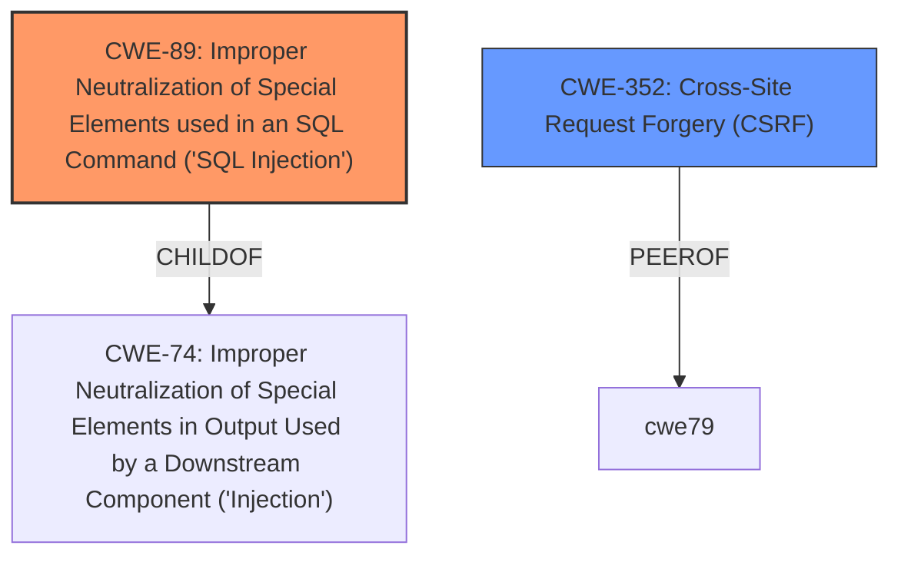

# Analysis for CVE-2021-21921

# Summary
| CWE ID | CWE Name | Confidence | CWE Abstraction Level | CWE Vulnerability Mapping Label | CWE-Vulnerability Mapping Notes |
|---|---|---|---|---|---|
| CWE-89 | Improper Neutralization of Special Elements used in an SQL Command ('SQL Injection') | 1.0 | Base | Allowed | Primary CWE. The vulnerability description clearly states "**SQL injection**" which directly matches the CWE-89 definition. The CVE Reference Links Content Summary details how user-controlled input (`name_filter` parameter) is used to construct an SQL command without proper neutralization, leading to the injection vulnerability. |
| CWE-352 | Cross-Site Request Forgery (CSRF) | 0.7 | Compound | Allowed | Secondary CWE. The vulnerability description mentions that the SQL injection can be triggered through cross-site request forgery. CWE-352 is a compound weakness, representing a combination of factors that allows an attacker to trick a user into making unintended requests. |

## Evidence and Confidence

*   **Confidence Score:** 0.9
*   **Evidence Strength:** HIGH

## Relationship Analysis
The primary relationship that impacted my decision was the parent-child relationship between CWE-74 (Improper Neutralization of Special Elements in Output Used by a Downstream Component ('Injection')) and CWE-89 (Improper Neutralization of Special Elements used in an SQL Command ('SQL Injection')), where CWE-89 is a specific type of injection. The vulnerability description directly states "SQL injection," making CWE-89 the more specific and appropriate choice. CWE-352 (Cross-Site Request Forgery) is included as a secondary weakness, as the attack vector involves potentially exploiting the SQL injection via CSRF.



## Vulnerability Chain
The chain of root cause and weaknesses for the Vulnerability Description is as follows:
1.  Improper Neutralization of Input: The root cause is the **lack of proper neutralization** of special elements in the `name_filter` parameter.
2.  SQL Injection: This leads to **SQL injection** (CWE-89), where an attacker can inject arbitrary SQL commands.
3.  Cross-Site Request Forgery (CSRF): The vulnerability can be exploited via **cross-site request forgery** (CWE-352), allowing an attacker to trigger the SQL injection on behalf of another user.
4.  Impact: The impact includes the ability to extract sensitive data, modify/delete data, and potentially gain unauthorized access.

## Summary of Analysis
My assessment is heavily based on the provided evidence, specifically the vulnerability description and the CVE Reference Links Content Summary. The vulnerability description explicitly mentions "**SQL injection**" and the CVE Reference Links Content Summary details the **improper use** of prepared statements, which is the root cause. The evidence from the CVE Reference Links Content Summary section states: "SQL queries are built by concatenating sanitized variables and SQL code in stored procedures... this protection is lost because the concatenated string is used to create a prepared statement from a variable (@sql) without specific parameter bindings." The relationship graph influenced my decision by highlighting the connection between CWE-74 and CWE-89, confirming that SQL injection is a specific type of injection.

The selection of CWE-89 is at the optimal level of specificity because it directly addresses the **SQL injection** vulnerability described. While CWE-74 is a broader class of injection vulnerabilities, CWE-89 is a more precise representation of the actual weakness. The inclusion of CWE-352 acknowledges the possibility of exploiting the SQL injection via CSRF.

Other CWEs Considered but Not Used:

*   CWE-79 (Improper Neutralization of Input During Web Page Generation ('Cross-site Scripting')): While the attack vector is through an HTTP request, the vulnerability is specifically SQL injection, not XSS.
*   CWE-918 (Server-Side Request Forgery (SSRF)): There's no evidence of the application making requests to arbitrary URLs, so SSRF doesn't apply.
*   CWE-134 (Use of Externally-Controlled Format String): There's no mention of format string vulnerabilities in the description.
*   CWE-184 (Incomplete List of Disallowed Inputs): Although sanitization is mentioned, the core issue is the improper use of prepared statements, not an incomplete list of disallowed inputs.
*   CWE-116 (Improper Encoding or Escaping of Output): While related to neutralization, the specific issue is SQL injection, making CWE-89 more appropriate.

# Enhanced Query for CVE-2021-21921

## Vulnerability Description
A specially-crafted HTTP request can lead to **SQL injection**. An attacker can make authenticated HTTP requests to trigger this vulnerability at name_filter parameter with the administrative account or through cross-site request forgery.

### Vulnerability Description Key Phrases
- **weakness:** **SQL injection**
- **vector:** specially-crafted HTTP request
- **attacker:** attacker
- **component:** name_filter parameter

### CWE for similar CVE Descriptions
### Primary CWE Match
CWE-89

#### Top CWEs
- CWE-89 (Count: 62)

## CVE Reference Links Content Summary
Based on the provided content, here's a breakdown of the vulnerability information related to CVE-2021-21921:

**Root Cause of Vulnerability:**
- The vulnerability stems from the improper use of prepared statements in conjunction with stored procedures in the Advantech R-SeeNet application.
- SQL queries are built by concatenating sanitized variables and SQL code in stored procedures. Although the variables are sanitized initially using `mysqli_real_escape_string`, this protection is lost because the concatenated string is used to create a prepared statement from a variable (@sql) without specific parameter bindings.

**Weaknesses/Vulnerabilities Present:**
- **SQL Injection:** The application is vulnerable to SQL injection due to the way user-controlled input is incorporated into SQL queries within the stored procedures.
- The `name_filter` parameter is vulnerable.

**Impact of Exploitation:**
- Attackers can inject arbitrary SQL commands that could allow them to:
    - Extract sensitive data from the database.
    - Modify or delete data.
    - Potentially gain unauthorized access to the system or other resources.

**Attack Vectors:**
- **HTTP Request Parameters:** The attack vector is through specially crafted HTTP GET requests to the `user_list` page, specifically manipulating the `name_filter` parameter.
- The vulnerability can be exploited via cross-site request forgery (CSRF).

**Required Attacker Capabilities/Position:**
- **Authentication:** An attacker needs to be an authenticated user of the application, with either an administrative account or through CSRF.
- **Network Access:** The attacker needs network access to the application.

**Technical Details:**
- The vulnerable code is in the `user_list.php` file, where the `name_filter` GET parameter is processed:
  - The `name_filter` parameter is retrieved, URL decoded and stored in the `$_SESSION['name_filter']` variable
  - Later on, the value stored in `$_SESSION['name_filter']` is used to construct part of an SQL `LIKE` clause using `mysqli_real_escape_string`.
  - The constructed SQL query is concatenated into a string and executed using a stored procedure called `sp_GetUsersAll` or `sp_GetUsers`.
  - The stored procedure uses a prepared statement, where the constructed query is assigned to the `@sql` variable. Then, a prepared statement is created from this variable and executed. This approach is what makes it vulnerable to SQL injection.

**Example Exploit (for `name_filter`):**
```
GET /r-seenet/index.php?page=user_list&username_filter=a&name_filter=aa%22%20AND%20(SELECT%209766%20FROM%20(SELECT(SLEEP(5)))a)--%20a&surname_filter= HTTP/1.1
Accept: text/html,application/xhtml+xml,application/xml;q=0.9,*/*;q=0.8
Accept-Language: en-GB
Upgrade-Insecure-Requests: 1
User-Agent: Mozilla/5.0 (Windows NT 10.0; Win64; x64) AppleWebKit/537.36 (KHTML, like Gecko) Chrome/70.0.3538.102 Safari/537.36 Edge/18.18362
Connection: Keep-Alive
Cookie: PHPSESSID=[SESSION ID]
Content-Length: 0
Host: [IP]
```
This example uses a `SLEEP` function for demonstration.

The content provides more detail than a typical CVE description. It pinpoints the vulnerable code, explains the root cause, and includes an example of an exploit.

## Retriever Results

### Top Combined Results

| Rank | CWE ID | Name | Abstraction | Usage  | Retrievers | Individual Scores |
|------|--------|------|-------------|-------|------------|-------------------|
| 1 | 89 | Improper Neutralization of Special Elements used in an SQL Command ('SQL Injection') | Base | Allowed | alternate_terms | 1.000 |
| 2 | 918 | Server-Side Request Forgery (SSRF) | Base | Allowed | sparse | 0.236 |
| 3 | 79 | Improper Neutralization of Input During Web Page Generation ('Cross-site Scripting') | Base | Allowed | sparse | 0.220 |
| 4 | 352 | Cross-Site Request Forgery (CSRF) | Compound | Allowed | sparse | 0.219 |
| 5 | 138 | Improper Neutralization of Special Elements | Class | Discouraged | sparse | 0.217 |
| 6 | 564 | SQL Injection: Hibernate | Variant | Allowed | dense | 0.557 |
| 7 | 184 | Incomplete List of Disallowed Inputs | Base | Allowed | graph | 0.002 |
| 8 | 502 | Deserialization of Untrusted Data | Base | Allowed | sparse | 0.217 |
| 9 | 116 | Improper Encoding or Escaping of Output | Class | Allowed-with-Review | sparse | 0.217 |
| 10 | 134 | Use of Externally-Controlled Format String | Base | Allowed | sparse | 0.214 |


# Complete CWE Specifications


## CWE-89: Improper Neutralization of Special Elements used in an SQL Command ('SQL Injection')
**Abstraction:** Base
**Status:** Stable

### Description
The product constructs all or part of an SQL command using externally-influenced input from an upstream component, but it does not neutralize or incorrectly neutralizes special elements that could modify the intended SQL command when it is sent to a downstream component. Without sufficient removal or quoting of SQL syntax in user-controllable inputs, the generated SQL query can cause those inputs to be interpreted as SQL instead of ordinary user data.

### Extended Description
Not provided

### Alternative Terms
SQL injection: a common attack-oriented phrase
SQLi: a common abbreviation for "SQL injection"

### Relationships
ChildOf -> CWE-943
ChildOf -> CWE-74

### Mapping Guidance
**Usage:** Allowed
**Rationale:** This CWE entry is at the Base level of abstraction, which is a preferred level of abstraction for mapping to the root causes of vulnerabilities.
**Comments:** Carefully read both the name and description to ensure that this mapping is an appropriate fit. Do not try to 'force' a mapping to a lower-level Base/Variant simply to comply with this preferred level of abstraction.
**Reasons:**
- Acceptable-Use


### Additional Notes
**[Relationship]** SQL injection can be resultant from special character mismanagement, MAID, or denylist/allowlist problems. It can be primary to authentication errors.


### Observed Examples
- **CVE-2023-32530:** SQL injection in security product dashboard using crafted certificate fields
- **CVE-2021-42258:** SQL injection in time and billing software, as exploited in the wild per CISA KEV.
- **CVE-2021-27101:** SQL injection in file-transfer system via a crafted Host header, as exploited in the wild per CISA KEV.


## CWE-918: Server-Side Request Forgery (SSRF)
**Abstraction:** Base
**Status:** Incomplete

### Description
The web server receives a URL or similar request from an upstream component and retrieves the contents of this URL, but it does not sufficiently ensure that the request is being sent to the expected destination.

### Extended Description
Not provided

### Alternative Terms
XSPA: Cross Site Port Attack
SSRF: Server-Side Request Forgery

### Relationships
ChildOf -> CWE-441
ChildOf -> CWE-610

### Mapping Guidance
**Usage:** Allowed
**Rationale:** This CWE entry is at the Base level of abstraction, which is a preferred level of abstraction for mapping to the root causes of vulnerabilities.
**Comments:** Carefully read both the name and description to ensure that this mapping is an appropriate fit. Do not try to 'force' a mapping to a lower-level Base/Variant simply to comply with this preferred level of abstraction.
**Reasons:**
- Acceptable-Use


### Additional Notes
**[Relationship]** CWE-918 (SSRF) and CWE-611 (XXE) are closely related, because they both involve web-related technologies and can launch outbound requests to unexpected destinations. However, XXE can be performed client-side, or in other contexts in which the software is not acting directly as a server, so the "Server" portion of the SSRF acronym does not necessarily apply.


### Observed Examples
- **CVE-2023-32786:** Chain: LLM integration framework has prompt injection (CWE-1427) that allows an attacker to force the service to retrieve data from an arbitrary URL, essentially providing SSRF (CWE-918) and potentially injecting content into downstream tasks.
- **CVE-2021-26855:** Server Side Request Forgery (SSRF) in mail server, as exploited in the wild per CISA KEV.
- **CVE-2021-21973:** Server Side Request Forgery in cloud platform, as exploited in the wild per CISA KEV.


## CWE-79: Improper Neutralization of Input During Web Page Generation ('Cross-site Scripting')
**Abstraction:** Base
**Status:** Stable

### Description
The product does not neutralize or incorrectly neutralizes user-controllable input before it is placed in output that is used as a web page that is served to other users.

### Extended Description


Cross-site scripting (XSS) vulnerabilities occur when:


  1. Untrusted data enters a web application, typically from a web request.

  1. The web application dynamically generates a web page that contains this untrusted data.

  1. During page generation, the application does not prevent the data from containing content that is executable by a web browser, such as JavaScript, HTML tags, HTML attributes, mouse events, Flash, ActiveX, etc.

  1. A victim visits the generated web page through a web browser, which contains malicious script that was injected using the untrusted data.

  1. Since the script comes from a web page that was sent by the web server, the victim's web browser executes the malicious script in the context of the web server's domain.

  1. This effectively violates the intention of the web browser's same-origin policy, which states that scripts in one domain should not be able to access resources or run code in a different domain.

There are three main kinds of XSS:

  -  **Type 1: Reflected XSS (or Non-Persistent)**  - The server reads data directly from the HTTP request and reflects it back in the HTTP response. Reflected XSS exploits occur when an attacker causes a victim to supply dangerous content to a vulnerable web application, which is then reflected back to the victim and executed by the web browser. The most common mechanism for delivering malicious content is to include it as a parameter in a URL that is posted publicly or e-mailed directly to the victim. URLs constructed in this manner constitute the core of many phishing schemes, whereby an attacker convinces a victim to visit a URL that refers to a vulnerable site. After the site reflects the attacker's content back to the victim, the content is executed by the victim's browser.

  -  **Type 2: Stored XSS (or Persistent)**  - The application stores dangerous data in a database, message forum, visitor log, or other trusted data store. At a later time, the dangerous data is subsequently read back into the application and included in dynamic content. From an attacker's perspective, the optimal place to inject malicious content is in an area that is displayed to either many users or particularly interesting users. Interesting users typically have elevated privileges in the application or interact with sensitive data that is valuable to the attacker. If one of these users executes malicious content, the attacker may be able to perform privileged operations on behalf of the user or gain access to sensitive data belonging to the user. For example, the attacker might inject XSS into a log message, which might not be handled properly when an administrator views the logs. 

  -  **Type 0: DOM-Based XSS**  - In DOM-based XSS, the client performs the injection of XSS into the page; in the other types, the server performs the injection. DOM-based XSS generally involves server-controlled, trusted script that is sent to the client, such as Javascript that performs sanity checks on a form before the user submits it. If the server-supplied script processes user-supplied data and then injects it back into the web page (such as with dynamic HTML), then DOM-based XSS is possible. 

Once the malicious script is injected, the attacker can perform a variety of malicious activities. The attacker could transfer private information, such as cookies that may include session information, from the victim's machine to the attacker. The attacker could send malicious requests to a web site on behalf of the victim, which could be especially dangerous to the site if the victim has administrator privileges to manage that site. Phishing attacks could be used to emulate trusted web sites and trick the victim into entering a password, allowing the attacker to compromise the victim's account on that web site. Finally, the script could exploit a vulnerability in the web browser itself possibly taking over the victim's machine, sometimes referred to as "drive-by hacking."

In many cases, the attack can be launched without the victim even being aware of it. Even with careful users, attackers frequently use a variety of methods to encode the malicious portion of the attack, such as URL encoding or Unicode, so the request looks less suspicious.


### Alternative Terms
XSS: A common abbreviation for Cross-Site Scripting.
HTML Injection: Used as a synonym of stored (Type 2) XSS.
CSS: In the early years after initial discovery of XSS, "CSS" was a commonly-used acronym. However, this would cause confusion with "Cascading Style Sheets," so usage of this acronym has declined significantly.

### Relationships
ChildOf -> CWE-74
ChildOf -> CWE-74
CanPrecede -> CWE-494
PeerOf -> CWE-352

### Mapping Guidance
**Usage:** Allowed
**Rationale:** This CWE entry is at the Base level of abstraction, which is a preferred level of abstraction for mapping to the root causes of vulnerabilities.
**Comments:** Carefully read both the name and description to ensure that this mapping is an appropriate fit. Do not try to 'force' a mapping to a lower-level Base/Variant simply to comply with this preferred level of abstraction.
**Reasons:**
- Acceptable-Use


### Additional Notes
**[Relationship]** 

There can be a close relationship between XSS and CSRF (CWE-352). An attacker might use CSRF in order to trick the victim into submitting requests to the server in which the requests contain an XSS payload. A well-known example of this was the Samy worm on MySpace [REF-956]. The worm used XSS to insert malicious HTML sequences into a user's profile and add the attacker as a MySpace friend. MySpace friends of that victim would then execute the payload to modify their own profiles, causing the worm to propagate exponentially. Since the victims did not intentionally insert the malicious script themselves, CSRF was a root cause.


**[Applicable Platform]** 

XSS flaws are very common in web applications, since they require a great deal of developer discipline to avoid them.


### Observed Examples
- **CVE-2021-25926:** Python Library Manager did not sufficiently neutralize a user-supplied search term, allowing reflected XSS.
- **CVE-2021-25963:** Python-based e-commerce platform did not escape returned content on error pages, allowing for reflected Cross-Site Scripting attacks.
- **CVE-2021-1879:** Universal XSS in mobile operating system, as exploited in the wild per CISA KEV.


## CWE-352: Cross-Site Request Forgery (CSRF)
**Abstraction:** Compound
**Status:** Stable

### Description
The web application does not, or can not, sufficiently verify whether a well-formed, valid, consistent request was intentionally provided by the user who submitted the request.

### Extended Description
When a web server is designed to receive a request from a client without any mechanism for verifying that it was intentionally sent, then it might be possible for an attacker to trick a client into making an unintentional request to the web server which will be treated as an authentic request. This can be done via a URL, image load, XMLHttpRequest, etc. and can result in exposure of data or unintended code execution.

### Alternative Terms
Session Riding
Cross Site Reference Forgery
XSRF

### Relationships
ChildOf -> CWE-345
ChildOf -> CWE-345
Requires -> CWE-346
Requires -> CWE-441
Requires -> CWE-642
Requires -> CWE-613

### Mapping Guidance
**Usage:** Allowed
**Rationale:** This is a well-known Composite of multiple weaknesses that must all occur simultaneously, although it is attack-oriented in nature.
**Comments:** While attack-oriented composites are supported in CWE, they have not been a focus of research. There is a chance that future research or CWE scope clarifications will change or deprecate them. Perform root-cause analysis to determine if other weaknesses allow CSRF attacks to occur, and map to those weaknesses. For example, predictable CSRF tokens might allow bypass of CSRF protection mechanisms; if this occurs, they might be better characterized as randomness/predictability weaknesses.
**Reasons:**
- Other


### Additional Notes
**[Relationship]** 

There can be a close relationship between XSS and CSRF (CWE-352). An attacker might use CSRF in order to trick the victim into submitting requests to the server in which the requests contain an XSS payload. A well-known example of this was the Samy worm on MySpace [REF-956]. The worm used XSS to insert malicious HTML sequences into a user's profile and add the attacker as a MySpace friend. MySpace friends of that victim would then execute the payload to modify their own profiles, causing the worm to propagate exponentially. Since the victims did not intentionally insert the malicious script themselves, CSRF was a root cause.


**[Theoretical]** 

The CSRF topology is multi-channel:


  - Attacker (as outsider) to intermediary (as user). The interaction point is either an external or internal channel.

  - Intermediary (as user) to server (as victim). The activation point is an internal channel.


### Observed Examples
- **CVE-2004-1703:** Add user accounts via a URL in an img tag
- **CVE-2004-1995:** Add user accounts via a URL in an img tag
- **CVE-2004-1967:** Arbitrary code execution by specifying the code in a crafted img tag or URL


## CWE-138: Improper Neutralization of Special Elements
**Abstraction:** Class
**Status:** Draft

### Description
The product receives input from an upstream component, but it does not neutralize or incorrectly neutralizes special elements that could be interpreted as control elements or syntactic markers when they are sent to a downstream component.

### Extended Description
Most languages and protocols have their own special elements such as characters and reserved words. These special elements can carry control implications. If product does not prevent external control or influence over the inclusion of such special elements, the control flow of the program may be altered from what was intended. For example, both Unix and Windows interpret the symbol < ("less than") as meaning "read input from a file".

### Alternative Terms
None

### Relationships
ChildOf -> CWE-707

### Mapping Guidance
**Usage:** Discouraged
**Rationale:** This CWE entry is a level-1 Class (i.e., a child of a Pillar). It might have lower-level children that would be more appropriate
**Comments:** Examine children of this entry to see if there is a better fit
**Reasons:**
- Abstraction


### Additional Notes
**[Relationship]** This weakness can be related to interpretation conflicts or interaction errors in intermediaries (such as proxies or application firewalls) when the intermediary's model of an endpoint does not account for protocol-specific special elements.

**[Relationship]** See this entry's children for different types of special elements that have been observed at one point or another. However, it can be difficult to find suitable CVE examples. In an attempt to be complete, CWE includes some types that do not have any associated observed example.

**[Research Gap]** This weakness is probably under-studied for proprietary or custom formats. It is likely that these issues are fairly common in applications that use their own custom format for configuration files, logs, meta-data, messaging, etc. They would only be found by accident or with a focused effort based on an understanding of the format.


### Observed Examples
- **CVE-2001-0677:** Read arbitrary files from mail client by providing a special MIME header that is internally used to store pathnames for attachments.
- **CVE-2000-0703:** Setuid program does not cleanse special escape sequence before sending data to a mail program, causing the mail program to process those sequences.
- **CVE-2003-0020:** Multi-channel issue. Terminal escape sequences not filtered from log files.


## CWE-564: SQL Injection: Hibernate
**Abstraction:** Variant
**Status:** Incomplete

### Description
Using Hibernate to execute a dynamic SQL statement built with user-controlled input can allow an attacker to modify the statement's meaning or to execute arbitrary SQL commands.

### Extended Description
Not provided

### Alternative Terms
None

### Relationships
ChildOf -> CWE-89
ChildOf -> CWE-89
ChildOf -> CWE-89

### Mapping Guidance
**Usage:** Allowed
**Rationale:** This CWE entry is at the Variant level of abstraction, which is a preferred level of abstraction for mapping to the root causes of vulnerabilities.
**Comments:** Carefully read both the name and description to ensure that this mapping is an appropriate fit. Do not try to 'force' a mapping to a lower-level Base/Variant simply to comply with this preferred level of abstraction.
**Reasons:**
- Acceptable-Use


## CWE-184: Incomplete List of Disallowed Inputs
**Abstraction:** Base
**Status:** Draft

### Description
The product implements a protection mechanism that relies on a list of inputs (or properties of inputs) that are not allowed by policy or otherwise require other action to neutralize before additional processing takes place, but the list is incomplete.

### Extended Description
Not provided

### Alternative Terms
Denylist / Deny List: This is used by CWE and CAPEC instead of other commonly-used terms. Its counterpart is allowlist.
Blocklist / Block List: This is often used by security tools such as firewalls, email or web gateways, proxies, etc.
Blacklist / Black List: This term is frequently used, but usage has been declining as organizations have started to adopt other terms.

### Relationships
ChildOf -> CWE-693
ChildOf -> CWE-1023
CanPrecede -> CWE-79
CanPrecede -> CWE-78
CanPrecede -> CWE-434
CanPrecede -> CWE-98

### Mapping Guidance
**Usage:** Allowed
**Rationale:** This CWE entry is at the Base level of abstraction, which is a preferred level of abstraction for mapping to the root causes of vulnerabilities.
**Comments:** Carefully read both the name and description to ensure that this mapping is an appropriate fit. Do not try to 'force' a mapping to a lower-level Base/Variant simply to comply with this preferred level of abstraction.
**Reasons:**
- Acceptable-Use


### Additional Notes
**[Relationship]** 

Multiple interpretation errors can indirectly introduce inputs that should be disallowed. For example, a list of dangerous shell metacharacters might not include a metacharacter that only has meaning in one particular shell, not all of them; or a check for XSS manipulations might ignore an unusual construct that is supported by one web browser, but not others.


### Observed Examples
- **CVE-2024-4315:** Chain: API for text generation using Large Language Models (LLMs) does not include the "\" Windows folder separator in its denylist (CWE-184) when attempting to prevent Local File Inclusion via path traversal (CWE-22), allowing deletion of arbitrary files on Windows systems.
- **CVE-2008-2309:** product uses a denylist to identify potentially dangerous content, allowing attacker to bypass a warning
- **CVE-2005-2782:** PHP remote file inclusion in web application that filters "http" and "https" URLs, but not "ftp".


## CWE-502: Deserialization of Untrusted Data
**Abstraction:** Base
**Status:** Draft

### Description
The product deserializes untrusted data without sufficiently ensuring that the resulting data will be valid.

### Extended Description
Not provided

### Alternative Terms
Marshaling, Unmarshaling: Marshaling and unmarshaling are effectively synonyms for serialization and deserialization, respectively.
Pickling, Unpickling: In Python, the "pickle" functionality is used to perform serialization and deserialization.
PHP Object Injection: Some PHP application researchers use this term when attacking unsafe use of the unserialize() function; but it is also used for CWE-915.

### Relationships
ChildOf -> CWE-913
ChildOf -> CWE-913
PeerOf -> CWE-915

### Mapping Guidance
**Usage:** Allowed
**Rationale:** This CWE entry is at the Base level of abstraction, which is a preferred level of abstraction for mapping to the root causes of vulnerabilities.
**Comments:** Carefully read both the name and description to ensure that this mapping is an appropriate fit. Do not try to 'force' a mapping to a lower-level Base/Variant simply to comply with this preferred level of abstraction.
**Reasons:**
- Acceptable-Use


### Additional Notes
**[Maintenance]** The relationships between CWE-502 and CWE-915 need further exploration. CWE-915 is more narrowly scoped to object modification, and is not necessarily used for deserialization.


### Observed Examples
- **CVE-2019-12799:** chain: bypass of untrusted deserialization issue (CWE-502) by using an assumed-trusted class (CWE-183)
- **CVE-2015-8103:** Deserialization issue in commonly-used Java library allows remote execution.
- **CVE-2015-4852:** Deserialization issue in commonly-used Java library allows remote execution.


## CWE-116: Improper Encoding or Escaping of Output
**Abstraction:** Class
**Status:** Draft

### Description
The product prepares a structured message for communication with another component, but encoding or escaping of the data is either missing or done incorrectly. As a result, the intended structure of the message is not preserved.

### Extended Description


Improper encoding or escaping can allow attackers to change the commands that are sent to another component, inserting malicious commands instead.


Most products follow a certain protocol that uses structured messages for communication between components, such as queries or commands. These structured messages can contain raw data interspersed with metadata or control information. For example, "GET /index.html HTTP/1.1" is a structured message containing a command ("GET") with a single argument ("/index.html") and metadata about which protocol version is being used ("HTTP/1.1").


If an application uses attacker-supplied inputs to construct a structured message without properly encoding or escaping, then the attacker could insert special characters that will cause the data to be interpreted as control information or metadata. Consequently, the component that receives the output will perform the wrong operations, or otherwise interpret the data incorrectly.


### Alternative Terms
Output Sanitization
Output Validation
Output Encoding

### Relationships
ChildOf -> CWE-707
CanPrecede -> CWE-74

### Mapping Guidance
**Usage:** Allowed-with-Review
**Rationale:** This CWE entry is a Class and might have Base-level children that would be more appropriate
**Comments:** Examine children of this entry to see if there is a better fit
**Reasons:**
- Abstraction


### Additional Notes
**[Relationship]** This weakness is primary to all weaknesses related to injection (CWE-74) since the inherent nature of injection involves the violation of structured messages.

**[Relationship]** 

CWE-116 and CWE-20 have a close association because, depending on the nature of the structured message, proper input validation can indirectly prevent special characters from changing the meaning of a structured message. For example, by validating that a numeric ID field should only contain the 0-9 characters, the programmer effectively prevents injection attacks.


However, input validation is not always sufficient, especially when less stringent data types must be supported, such as free-form text. Consider a SQL injection scenario in which a last name is inserted into a query. The name "O'Reilly" would likely pass the validation step since it is a common last name in the English language. However, it cannot be directly inserted into the database because it contains the "'" apostrophe character, which would need to be escaped or otherwise neutralized. In this case, stripping the apostrophe might reduce the risk of SQL injection, but it would produce incorrect behavior because the wrong name would be recorded.


**[Terminology]** The usage of the "encoding" and "escaping" terms varies widely. For example, in some programming languages, the terms are used interchangeably, while other languages provide APIs that use both terms for different tasks. This overlapping usage extends to the Web, such as the "escape" JavaScript function whose purpose is stated to be encoding. The concepts of encoding and escaping predate the Web by decades. Given such a context, it is difficult for CWE to adopt a consistent vocabulary that will not be misinterpreted by some constituency.

**[Theoretical]** This is a data/directive boundary error in which data boundaries are not sufficiently enforced before it is sent to a different control sphere.

**[Research Gap]** While many published vulnerabilities are related to insufficient output encoding, there is such an emphasis on input validation as a protection mechanism that the underlying causes are rarely described. Within CVE, the focus is primarily on well-understood issues like cross-site scripting and SQL injection. It is likely that this weakness frequently occurs in custom protocols that support multiple encodings, which are not necessarily detectable with automated techniques.


### Observed Examples
- **CVE-2021-41232:** Chain: authentication routine in Go-based agile development product does not escape user name (CWE-116), allowing LDAP injection (CWE-90)
- **CVE-2008-4636:** OS command injection in backup software using shell metacharacters in a filename; correct behavior would require that this filename could not be changed.
- **CVE-2008-0769:** Web application does not set the charset when sending a page to a browser, allowing for XSS exploitation when a browser chooses an unexpected encoding.


## CWE-134: Use of Externally-Controlled Format String
**Abstraction:** Base
**Status:** Draft

### Description
The product uses a function that accepts a format string as an argument, but the format string originates from an external source.

### Extended Description


When an attacker can modify an externally-controlled format string, this can lead to buffer overflows, denial of service, or data representation problems.


It should be noted that in some circumstances, such as internationalization, the set of format strings is externally controlled by design. If the source of these format strings is trusted (e.g. only contained in library files that are only modifiable by the system administrator), then the external control might not itself pose a vulnerability.


### Alternative Terms
None

### Relationships
ChildOf -> CWE-668
ChildOf -> CWE-668
CanPrecede -> CWE-123
ChildOf -> CWE-20

### Mapping Guidance
**Usage:** Allowed
**Rationale:** This CWE entry is at the Base level of abstraction, which is a preferred level of abstraction for mapping to the root causes of vulnerabilities.
**Comments:** Carefully read both the name and description to ensure that this mapping is an appropriate fit. Do not try to 'force' a mapping to a lower-level Base/Variant simply to comply with this preferred level of abstraction.
**Reasons:**
- Acceptable-Use


### Additional Notes
**[Applicable Platform]** 

This weakness is possible in any programming language that support format strings.


**[Other]** 

While Format String vulnerabilities typically fall under the Buffer Overflow category, technically they are not overflowed buffers. The Format String vulnerability is fairly new (circa 1999) and stems from the fact that there is no realistic way for a function that takes a variable number of arguments to determine just how many arguments were passed in. The most common functions that take a variable number of arguments, including C-runtime functions, are the printf() family of calls. The Format String problem appears in a number of ways. A *printf() call without a format specifier is dangerous and can be exploited. For example, printf(input); is exploitable, while printf(y, input); is not exploitable in that context. The result of the first call, used incorrectly, allows for an attacker to be able to peek at stack memory since the input string will be used as the format specifier. The attacker can stuff the input string with format specifiers and begin reading stack values, since the remaining parameters will be pulled from the stack. Worst case, this improper use may give away enough control to allow an arbitrary value (or values in the case of an exploit program) to be written into the memory of the running program.


Frequently targeted entities are file names, process names, identifiers.


Format string problems are a classic C/C++ issue that are now rare due to the ease of discovery. One main reason format string vulnerabilities can be exploited is due to the %n operator. The %n operator will write the number of characters, which have been printed by the format string therefore far, to the memory pointed to by its argument. Through skilled creation of a format string, a malicious user may use values on the stack to create a write-what-where condition. Once this is achieved, they can execute arbitrary code. Other operators can be used as well; for example, a %9999s operator could also trigger a buffer overflow, or when used in file-formatting functions like fprintf, it can generate a much larger output than intended.


**[Research Gap]** Format string issues are under-studied for languages other than C. Memory or disk consumption, control flow or variable alteration, and data corruption may result from format string exploitation in applications written in other languages such as Perl, PHP, Python, etc.


### Observed Examples
- **CVE-2002-1825:** format string in Perl program
- **CVE-2001-0717:** format string in bad call to syslog function
- **CVE-2002-0573:** format string in bad call to syslog function

