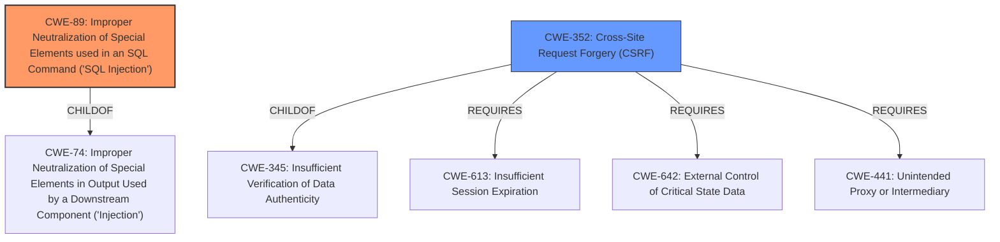

# Enhanced Analysis for CVE-2021-21922

# Summary
| CWE ID | CWE Name | Confidence | CWE Abstraction Level | CWE Vulnerability Mapping Label | CWE-Vulnerability Mapping Notes |
|---|---|---|---|---|---|
| CWE-89 | Improper Neutralization of Special Elements used in an SQL Command ('SQL Injection') | 1.0 | Base | Allowed | Primary CWE |
| CWE-352 | Cross-Site Request Forgery (CSRF) | 0.5 | Compound | Allowed | Secondary Candidate |

## Evidence and Confidence

*   **Confidence Score:** 0.75
*   **Evidence Strength:** MEDIUM

## Relationship Analysis
The primary relationship that impacted the decision was the direct match of the vulnerability to **CWE-89** CWE Description, as well as the primary match in the vulnerability report. The description clearly indicates **SQL injection** due to improper neutralization of special elements in an SQL command. **CWE-352** Cross-Site Request Forgery is included because the attacker can trigger the vulnerability through cross-site request forgery. **CWE-89** is a Base level CWE, which is preferred. **CWE-352** is a compound weakness, which is allowed but less desirable.



## Vulnerability Chain
The chain of events is as follows:
1.  **Root Cause:** **Improper neutralization** of special elements in the `username_filter` parameter leading to **CWE-89** **SQL Injection**.
2.  **Attack Vector:** A specially-crafted HTTP request is sent.
3.  **Trigger:** The application uses the unsanitized input in an SQL query.
4.  **Impact:** An attacker can inject arbitrary SQL code, potentially leading to data exfiltration, modification, or denial of service. The attacker can also trigger this vulnerability through cross-site request forgery leading to **CWE-352** Cross-Site Request Forgery.

## Summary of Analysis
The initial analysis identified **CWE-89** as the primary weakness, based on the vulnerability description and key phrases indicating **SQL injection**. The CVE Reference Links Content Summary confirms that the **root cause of the vulnerability** is the **improper sanitization** of the `username_filter` parameter, which is then concatenated into an SQL query. The attacker can also trigger this vulnerability through cross-site request forgery leading to **CWE-352** Cross-Site Request Forgery.

The relationship analysis shows that **CWE-89** is a child of **CWE-74**, which is a more general class of injection vulnerabilities. However, **CWE-89** is more specific to **SQL injection**, making it a better fit for this vulnerability.

The Retriever Results also strongly support **CWE-89** as the primary CWE, with a score of 1.000. Other CWEs such as **CWE-918** (Server-Side Request Forgery) and **CWE-79** (Cross-Site Scripting) were considered but deemed less relevant as the primary issue is the **SQL injection** due to **improper neutralization**.

The final decision is based on the following evidence:
*   Vulnerability Description: "A specially-crafted HTTP request can lead to **SQL injection**."
*   Vulnerability Description Key Phrases: "**weakness:** **SQL injection**"
*   CVE Reference Links Content Summary: "The application fails to properly sanitize user-supplied input (`username_filter`) before using it in an SQL query."

The selected CWEs are at the optimal level of specificity, with **CWE-89** being a Base level CWE that accurately describes the root cause of the vulnerability.

Relevant CWE Information:
*   **CWE-89**: Improper Neutralization of Special Elements used in an SQL Command ('SQL Injection')
    *   Abstraction: Base
    *   Description: The product constructs all or part of an SQL command using externally-influenced input from an upstream component, but it does not neutralize or incorrectly neutralizes special elements that could modify the intended SQL command when it is sent to a downstream component.
    *   Mapping Guidance: Usage: Allowed
*   **CWE-352**: Cross-Site Request Forgery (CSRF)
    *   Abstraction: Compound
    *   Description: The web application does not, or can not, sufficiently verify whether a well-formed, valid, consistent request was intentionally provided by the user who submitted the request.
    *   Mapping Guidance: Usage: Allowed


## CWE Relationship Analysis

Current CWEs represent these abstraction levels: .


### Vulnerability Chain Analysis

**Chain starting from CWE-79:**
- 79 (Improper Neutralization of Input During Web Page Generation ('Cross-site Scripting')) - ROOT


**Chain starting from CWE-74:**
- 74 (Improper Neutralization of Special Elements in Output Used by a Downstream Component ('Injection')) - ROOT


### CWE Relationship Diagram

```mermaid
graph TD
    classDef primary fill:#f96,stroke:#333,stroke-width:2px
    classDef secondary fill:#69f,stroke:#333
    classDef tertiary fill:#9e9,stroke:#333
```