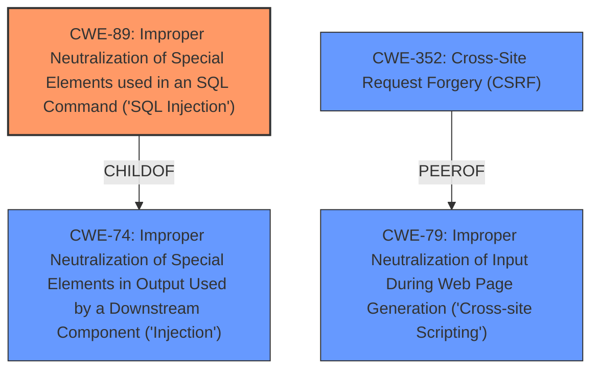

# Raw Analyzer Response for CVE-2021-21923

# Summary
| CWE ID | CWE Name | Confidence | CWE Abstraction Level | CWE Vulnerability Mapping Label | CWE-Vulnerability Mapping Notes |
|---|---|---|---|---|---|
| CWE-89 | Improper Neutralization of Special Elements used in an SQL Command ('SQL Injection') | 1.0 | Base | Allowed | Primary CWE |
| CWE-352 | Cross-Site Request Forgery (CSRF) | 0.7 | Compound | Allowed | Secondary Candidate |

## Evidence and Confidence

*   **Confidence Score:** 0.9
*   **Evidence Strength:** HIGH

## Relationship Analysis
The primary relationship influencing the CWE selection is that **CWE-89 (SQL Injection)** is a child of **CWE-74 (Improper Neutralization of Special Elements in Output Used by a Downstream Component ('Injection'))**. **CWE-89** is a base level CWE and is preferred. **CWE-352 (Cross-Site Request Forgery (CSRF))** is a peer of **CWE-79 (Improper Neutralization of Input During Web Page Generation ('Cross-site Scripting'))** and can be related to each other where an attacker might use **CSRF** in order to trick the victim into submitting requests to the server in which the requests contain an **XSS** payload.

## Vulnerability Chain
The vulnerability chain starts with **improper neutralization of special elements** in the `company_filter` parameter which leads to **SQL injection**. The attacker exploits this by crafting malicious HTTP requests. The vulnerability can be triggered either with an administrative account or via **Cross-Site Request Forgery (CSRF)**.

## Summary of Analysis
The initial analysis identified **CWE-89 (SQL Injection)** as the primary weakness, supported by the vulnerability description explicitly mentioning **SQL injection** and the CVE reference links detailing the root cause being insufficient sanitization of the `company_filter` parameter leading to direct incorporation into an SQL query. The retriever results also strongly support **CWE-89** as the best match.

The reference to cross-site request forgery in the description suggests a potential secondary weakness, **CWE-352 (Cross-Site Request Forgery (CSRF))**. This is because an attacker can use **CSRF** to trigger the **SQL injection** vulnerability if they don't have administrative access.

The selection of **CWE-89** is based on the evidence: "**SQL injection** vulnerability in the `user_list` page due to insufficient sanitization of the `company_filter` parameter. The `company_filter` parameter is directly incorporated into the SQL query passed to the stored procedure `sp_GetUsersAll`." This quote directly shows the root cause is **SQL injection** due to **improper neutralization**. **CWE-89** is at the optimal level of specificity as a Base CWE.

**CWE-352** is included as a secondary CWE because the vulnerability description states "An attacker can make authenticated HTTP requests to trigger this vulnerability at company_filter parameter with the administrative account or through cross-site request forgery." While **CSRF** is not the root cause, it is a method by which the vulnerability can be exploited.

Relevant CWE Information:

## Enhanced Context (25 CWEs)
The following CWEs were identified as potentially relevant to this vulnerability:

## CWE-89: Improper Neutralization of Special Elements used in an SQL Command ('SQL Injection')
**Abstraction:** Base
**Status:** Stable

### Description
The product constructs all or part of an SQL command using externally-influenced input from an upstream component, but it does not neutralize or incorrectly neutralizes special elements that could modify the intended SQL command when it is sent to a downstream component. Without sufficient removal or quoting of SQL syntax in user-controllable inputs, the generated SQL query can cause those inputs to be interpreted as SQL instead of ordinary user data.

### Extended Description
Not provided

### Alternative Terms
SQL injection: a common attack-oriented phrase
SQLi: a common abbreviation for "SQL injection"

### Relationships
ChildOf -> CWE-943
ChildOf -> CWE-74

### Mapping Guidance
**Usage:** Allowed
**Rationale:** This CWE entry is at the Base level of abstraction, which is a preferred level of abstraction for mapping to the root causes of vulnerabilities.
**Comments:** Carefully read both the name and description to ensure that this mapping is an appropriate fit. Do not try to 'force' a mapping to a lower-level Base/Variant simply to comply with this preferred level of abstraction.
**Reasons:**
- Acceptable-Use

### Additional Notes
**[Relationship]** SQL injection can be resultant from special character mismanagement, MAID, or denylist/allowlist problems. It can be primary to authentication errors.

### Observed Examples
- **CVE-2023-32530:** SQL injection in security product dashboard using crafted certificate fields
- **CVE-2021-42258:** SQL injection in time and billing software, as exploited in the wild per CISA KEV.
- **CVE-2021-27101:** SQL injection in file-transfer system via a crafted Host header, as exploited in the wild per CISA KEV.

**Explanation:**

The vulnerability description clearly states that a specially-crafted HTTP request can lead to **SQL injection**. The CVE reference links confirm that the vulnerability stems from insufficient sanitization of the `company_filter` parameter, allowing direct incorporation into an SQL query. This aligns perfectly with the description of **CWE-89**, which involves improper neutralization of special elements used in an SQL command. The security implication is that an attacker can inject arbitrary SQL queries, potentially leading to data exfiltration, manipulation, or privilege escalation. **CWE-89** is a base-level CWE, which is the preferred level of abstraction. The mapping guidance allows for its usage.

## CWE-352: Cross-Site Request Forgery (CSRF)
**Abstraction:** Compound
**Status:** Stable

### Description
The web application does not, or can not, sufficiently verify whether a well-formed, valid, consistent request was intentionally provided by the user who submitted the request.

### Extended Description
When a web server is designed to receive a request from a client without any mechanism for verifying that it was intentionally sent, then it might be possible for an attacker to trick a client into making an unintentional request to the web server which will be treated as an authentic request. This can be done via a URL, image load, XMLHttpRequest, etc. and can result in exposure of data or unintended code execution.

### Alternative Terms
Session Riding
Cross Site Reference Forgery
XSRF

### Relationships
ChildOf -> CWE-345
ChildOf -> CWE-345
Requires -> CWE-346
Requires -> CWE-441
Requires -> CWE-642
Requires -> CWE-613

### Mapping Guidance
**Usage:** Allowed
**Rationale:** This is a well-known Composite of multiple weaknesses that must all occur simultaneously, although it is attack-oriented in nature.
**Comments:** While attack-oriented composites are supported in CWE, they have not been a focus of research. There is a chance that future research or CWE scope clarifications will change or deprecate them. Perform root-cause analysis to determine if other weaknesses allow CSRF attacks to occur, and map to those weaknesses. For example, predictable CSRF tokens might allow bypass of CSRF protection mechanisms; if this occurs, they might be better characterized as randomness/predictability weaknesses.
**Reasons:**
- Other

### Additional Notes
**[Relationship]** 

There can be a close relationship between XSS and CSRF (CWE-352). An attacker might use CSRF in order to trick the victim into submitting requests to the server in which the requests contain an XSS payload. A well-known example of this was the Samy worm on MySpace [REF-956]. The worm used XSS to insert malicious HTML sequences into a user's profile and add the attacker as a MySpace friend. MySpace friends of that victim would then execute the payload to modify their own profiles, causing the worm to propagate exponentially. Since the victims did not intentionally insert the malicious script themselves, CSRF was a root cause.

**[Theoretical]** 

The CSRF topology is multi-channel:

- Attacker (as outsider) to intermediary (as user). The interaction point is either an external or internal channel.

- Intermediary (as