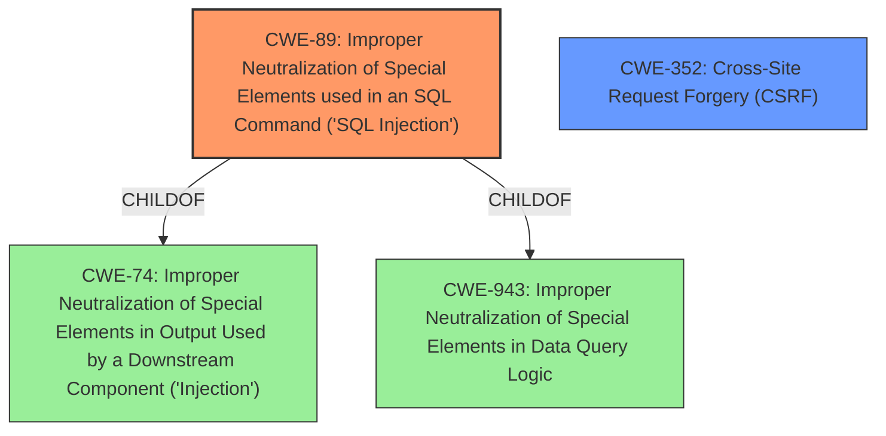

# Analysis Report for CVE-2021-21926

# Vulnerability Analysis Report: CVE-2021-21926

## Description


## Analysis (with Relationship Data)

# Summary
| CWE ID | CWE Name | Confidence | CWE Abstraction Level | CWE Vulnerability Mapping Label | CWE-Vulnerability Mapping Notes |
|---|---|---|---|---|---|
| CWE-89 | Improper Neutralization of Special Elements used in an SQL Command ('SQL Injection') | 1.0 | Base | Allowed | Primary CWE. The vulnerability is an SQL injection.|
| CWE-352 | Cross-Site Request Forgery (CSRF) | 0.7 | Compound | Allowed | Secondary CWE. The vulnerability can be exploited via CSRF.|

## Evidence and Confidence

*   **Confidence Score:** 0.9
*   **Evidence Strength:** HIGH

## Relationship Analysis
The primary weakness is CWE-89 [Improper Neutralization of Special Elements used in an SQL Command ('SQL Injection')], which is a base CWE. CWE-89 is a child of CWE-74 [Improper Neutralization of Special Elements in Output Used by a Downstream Component ('Injection')] and CWE-943 [Improper Neutralization of Special Elements in Data Query Logic]. The vulnerability can be exploited through CSRF, which is CWE-352 [Cross-Site Request Forgery (CSRF)], a compound CWE.



## Vulnerability Chain
The chain of root cause and weaknesses that followed for the Vulnerability Description:
1.  The application **fails to properly neutralize special elements** in the `health_filter` parameter. (CWE-89)
2.  An attacker crafts a malicious HTTP request with a **SQL injection** payload. (CWE-89)
3.  The application executes the **un-neutralized** payload, leading to arbitrary SQL execution. (CWE-89)
4.  An attacker can also exploit the lack of CSRF protection to trick a user into executing the malicious request. (CWE-352)

## Summary of Analysis
The primary **weakness** is **SQL injection** (CWE-89). The vulnerability description states, "A specially-crafted HTTP request can lead to **SQL injection**." The CVE reference link content summary also confirms this: "Weaknesses/vulnerabilities: [ "SQL Injection (CWE-89)" ]". The root cause is the application's **failure to properly neutralize special elements** in the 'health_filter' parameter before constructing the SQL query. The retriever results also lists CWE-89 as the top candidate with a score of 1.0.

CWE-352 [Cross-Site Request Forgery (CSRF)] is a secondary weakness because the vulnerability can be exploited via CSRF. The vulnerability description states, "This can be done as any authenticated user or through cross-site request forgery at health_filter parameter."

I considered other CWEs, such as CWE-134 [Use of Externally-Controlled Format String], CWE-918 [Server-Side Request Forgery (SSRF)], CWE-611 [Improper Restriction of XML External Entity Reference], and CWE-79 [Improper Neutralization of Input During Web Page Generation ('Cross-site Scripting')], but these are not the primary issues. The vulnerability is fundamentally a SQL injection, not a format string vulnerability, SSRF, XXE, or XSS.

The selected CWEs are at the optimal level of specificity. CWE-89 is a base CWE that directly describes the SQL injection vulnerability. CWE-352 is a compound CWE that describes the CSRF vulnerability.

Relevant CWE Information:
INSERT


## CWE Relationship Analysis

Current CWEs represent these abstraction levels: .


### Vulnerability Chain Analysis

**Chain starting from CWE-79:**
- 79 (Improper Neutralization of Input During Web Page Generation ('Cross-site Scripting')) - ROOT


**Chain starting from CWE-943:**
- 943 (Improper Neutralization of Special Elements in Data Query Logic) - ROOT


### CWE Relationship Diagram

```mermaid
graph TD
    classDef primary fill:#f96,stroke:#333,stroke-width:2px
    classDef secondary fill:#69f,stroke:#333
    classDef tertiary fill:#9e9,stroke:#333
```


*Report generated on 2025-04-01 21:21:09*
