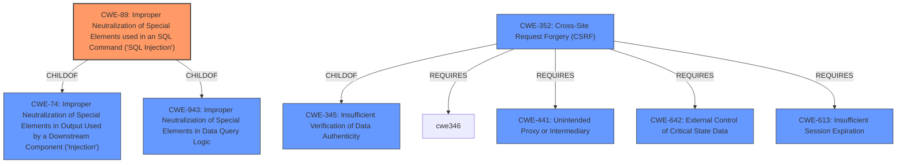

# Raw Analyzer Response for CVE-2021-21928

# Summary
| CWE ID | CWE Name | Confidence | CWE Abstraction Level | CWE Vulnerability Mapping Label | CWE-Vulnerability Mapping Notes |
|---|---|---|---|---|---|
| CWE-89 | Improper Neutralization of Special Elements used in an SQL Command ('SQL Injection') | 1.0 | Base | Allowed | Primary CWE |
| CWE-352 | Cross-Site Request Forgery (CSRF) | 0.7 | Compound | Allowed | Secondary CWE |

## Evidence and Confidence

*   **Confidence Score:** 0.9
*   **Evidence Strength:** HIGH

## Relationship Analysis
The primary relationship influencing the decision is that **CWE-89** [CWE-89: Improper Neutralization of Special Elements used in an SQL Command ('SQL Injection')] is a base CWE, which is the preferred level of abstraction. **CWE-89** [CWE-89: Improper Neutralization of Special Elements used in an SQL Command ('SQL Injection')] is a child of **CWE-74** [CWE-74: Improper Neutralization of Special Elements in Output Used by a Downstream Component ('Injection')] and **CWE-943** which are not as specific. Also, **CWE-352** [CWE-352: Cross-Site Request Forgery (CSRF)] is listed as a secondary issue, which is a compound CWE that requires other CWEs.

## Vulnerability Chain
The vulnerability chain begins with **improper neutralization** of user-supplied input (`mac_filter` parameter) which is used in constructing SQL queries. This leads to the **SQL injection** vulnerability. The vulnerability can be exploited by an authenticated user or via **Cross-Site Request Forgery (CSRF)**.

## Summary of Analysis
The analysis indicates a clear **SQL injection** (**CWE-89** [CWE-89: Improper Neutralization of Special Elements used in an SQL Command ('SQL Injection')]) vulnerability due to **improper neutralization** of special elements in an SQL command. The description states, "A specially-crafted HTTP request can lead to **SQL injection**." This aligns directly with the description of **CWE-89** [CWE-89: Improper Neutralization of Special Elements used in an SQL Command ('SQL Injection')].

The **CVE Reference Links Content Summary** further supports this by stating, "The vulnerability is due to **improper neutralization** of special elements used in an SQL command, specifically within the `device_list` page... The application uses prepared statements in combination with stored procedures and SQL concatenation in a way that user-supplied input, despite initial sanitization, loses its protection and introduces SQL injection vulnerabilities."

The retriever results also list **CWE-89** [CWE-89: Improper Neutralization of Special Elements used in an SQL Command ('SQL Injection')] as the top hit with a score of 1.0. The mapping guidance for **CWE-89** [CWE-89: Improper Neutralization of Special Elements used in an SQL Command ('SQL Injection')] states that it is at the Base level of abstraction, which is preferred.

The vulnerability description also mentions that the vulnerability can be exploited through cross-site request forgery. This indicates a **CWE-352** [CWE-352: Cross-Site Request Forgery (CSRF)] vulnerability in addition to **CWE-89** [CWE-89: Improper Neutralization of Special Elements used in an SQL Command ('SQL Injection')].

Other CWEs considered but not used:

*   **CWE-79** [CWE-79: Improper Neutralization of Input During Web Page Generation ('Cross-site Scripting')]: While XSS is a common web vulnerability, the description focuses on SQL injection, not script injection in a web page. Therefore, it is less relevant.
*   **CWE-918** [CWE-918: Server-Side Request Forgery (SSRF)]: There's no indication that the application is making requests to other servers based on user input.
*   **CWE-134** [CWE-134: Use of Externally-Controlled Format String]: There is no mention of format string usage in the description.
*   **CWE-444** [CWE-444: Inconsistent Interpretation of HTTP Requests ('HTTP Request/Response Smuggling')]: There is no mention of HTTP request smuggling.
*   **CWE-184** [CWE-184: Incomplete List of Disallowed Inputs]: While input validation is mentioned, the core issue is improper neutralization for SQL, not an incomplete list of disallowed inputs.
*   **CWE-113** [CWE-113: Improper Neutralization of CRLF Sequences in HTTP Headers ('HTTP Request/Response Splitting')]: There's no evidence of CRLF injection in HTTP headers.
*   **CWE-611** [CWE-611: Improper Restriction of XML External Entity Reference]: There's no evidence of XML processing or external entity injection.
*   **CWE-80** [CWE-80: Improper Neutralization of Script-Related HTML Tags in a Web Page (Basic XSS)]: Similar to **CWE-79** [CWE-79: Improper Neutralization of Input During Web Page Generation ('Cross-site Scripting')], this is less relevant than the SQL injection.

The selected CWEs are at the optimal level of specificity because **CWE-89** [CWE-89: Improper Neutralization of Special Elements used in an SQL Command ('SQL Injection')] directly addresses the root cause of the SQL injection and **CWE-352** [CWE-352: Cross-Site Request Forgery (CSRF)] addresses the CSRF aspect of the vulnerability.