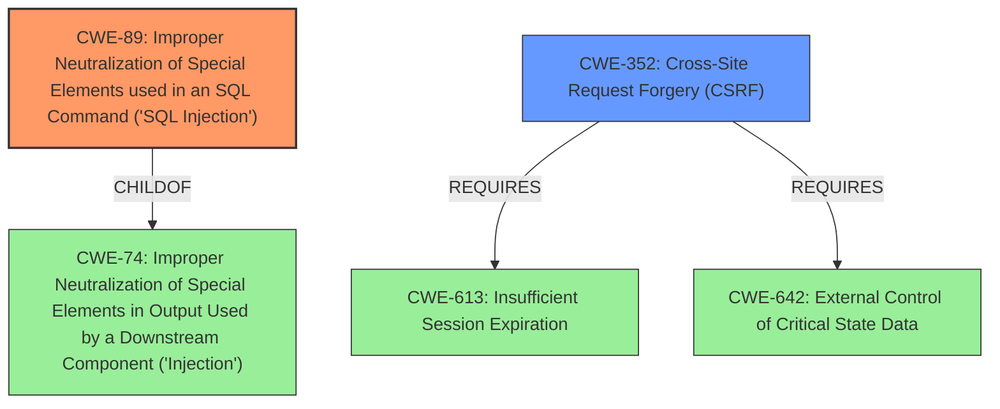

# Raw Analyzer Response for CVE-2021-21931

# Summary
| CWE ID  | CWE Name                                                                       | Confidence | CWE Abstraction Level | CWE Vulnerability Mapping Label | CWE-Vulnerability Mapping Notes |
| ------- | ------------------------------------------------------------------------------ | ---------- | --------------------- | ------------------------------- | ------------------------------- |
| CWE-89  | Improper Neutralization of Special Elements used in an SQL Command ('SQL Injection') | 1          | Base                  | Primary                         | Allowed                       |
| CWE-352 | Cross-Site Request Forgery (CSRF)                                            | 0.7        | Compound              | Secondary                       | Allowed                       |

## Evidence and Confidence

*   **Confidence Score:** 0.85
*   **Evidence Strength:** HIGH

## Relationship Analysis
The primary CWE identified is CWE-89 (SQL Injection), which is a base-level CWE. CWE-89 is a child of CWE-74 (Improper Neutralization of Special Elements ('Injection')), indicating a more general category of injection vulnerabilities. The secondary CWE considered is CWE-352 (Cross-Site Request Forgery), which requires other weaknesses to be present. This relationship indicates a potential chain where CSRF could be used to trigger the SQL Injection.

## Vulnerability Chain
The vulnerability chain begins with the **improper neutralization** of special elements in an SQL command (CWE-89). The chain could be initiated by a Cross-Site Request Forgery (CSRF) attack (CWE-352), where an attacker tricks a user into making a request that exploits the **SQL injection** vulnerability. The root cause is the **improper** handling of input within the `stat_filter` parameter, which is then concatenated into an SQL query within a stored procedure.

## Summary of Analysis
The initial analysis correctly identifies CWE-89 as the primary weakness based on the vulnerability description, which explicitly mentions **SQL injection** in the `stat_filter` parameter. The "CVE Reference Links Content Summary" confirms this, stating that the root cause is the misuse of prepared statements in conjunction with stored procedures and SQL concatenation.

The analysis also considers CWE-352 (CSRF) as a contributing factor, as the attack can be launched via CSRF. The "CVE Reference Links Content Summary" supports this, stating that the attack can be performed by any authenticated user or through CSRF.

The selection of CWE-89 is based on strong evidence from the vulnerability description and the reference links. The CWE's description accurately reflects the vulnerability's nature: "The product constructs all or part of an SQL command using externally-influenced input...but it does not neutralize or incorrectly neutralizes special elements that could modify the intended SQL command."

The selection of CWE-352 is based on the fact that the attack can be launched via CSRF.

The selected CWEs are at the optimal level of specificity because they directly represent the root cause (SQL Injection) and a significant attack vector (CSRF).

Relevant CWE Information:

# Enhanced Context (25 CWEs)
The following CWEs were identified as potentially relevant to this vulnerability:

## CWE-80: Improper Neutralization of Script-Related HTML Tags in a Web Page (Basic XSS)
**Abstraction Level**: Variant
**Similarity Score**: 0.80
**Source**: dense

**Description**:
The product receives input from an upstream component, but it does not neutralize or incorrectly neutralizes special characters such as "<", ">", and "&" that could be interpreted as web-scripting elements when they are sent to a downstream component that processes web pages.

**Mapping Guidance**:
- Usage: Allowed
- Rationale: This CWE entry is at the Variant level of abstraction, which is a preferred level of abstraction for mapping to the root causes of vulnerabilities.

## CWE-113: Improper Neutralization of CRLF Sequences in HTTP Headers ('HTTP Request/Response Splitting')
**Abstraction Level**: Variant
**Similarity Score**: 0.78
**Source**: dense

**Description**:
The product receives data from an HTTP agent/component (e.g., web server, proxy, browser, etc.), but it does not neutralize or incorrectly neutralizes CR and LF characters before the data is included in outgoing HTTP headers.

**Mapping Guidance**:
- Usage: Allowed
- Rationale: This CWE entry is at the Variant level of abstraction, which is a preferred level of abstraction for mapping to the root causes of vulnerabilities.

## CWE-611: Improper Restriction of XML External Entity Reference
**Abstraction Level**: Base
**Similarity Score**: 0.77
**Source**: dense

**Description**:
The product processes an XML document that can contain XML entities with URIs that resolve to documents outside of the intended sphere of control, causing the product to embed incorrect documents into its output.

**Mapping Guidance**:
- Usage: Allowed
- Rationale: This CWE entry is at the Base level of abstraction, which is a preferred level of abstraction for mapping to the root causes of vulnerabilities.

## CWE-184: Incomplete List of Disallowed Inputs
**Abstraction Level**: Base
**Similarity Score**: 0.76
**Source**: dense

**Description**:
The product implements a protection mechanism that relies on a list of inputs (or properties of inputs) that are not allowed by policy or otherwise require other action to neutralize before additional processing takes place, but the list is incomplete.

**Mapping Guidance**:
- Usage: Allowed
- Rationale: This CWE entry is at the Base level of abstraction, which is a preferred level of abstraction for mapping to the root causes of vulnerabilities.

## CWE-74: Improper Neutralization of Special Elements in Output Used by a Downstream Component ('Injection')
**Abstraction Level**: Class
**Similarity Score**: 0.76
**Source**: dense

**Description**:
The product constructs all or part of a command, data structure, or record using externally-influenced input from an upstream component, but it does not neutralize or incorrectly neutralizes special elements that could modify how it is parsed or interpreted when it is sent to a downstream component.

**Mapping Guidance**:
- Usage: Discouraged
- Rationale: CWE-74 is high-level and often misused when lower-level weaknesses are more appropriate.

## CWE-444: Inconsistent Interpretation of HTTP Requests ('HTTP Request/Response Smuggling')
**Abstraction Level**: Base
**Similarity Score**: 0.75
**Source**: dense

**Description**:
The product acts as an intermediary HTTP agent
         (such as a proxy or firewall) in the data flow between two
         entities such as a client and server, but it does not
         interpret malformed HTTP requests or responses in ways that
         are consistent with how the messages will be processed by
         those entities that are at the ultimate destination.

**Mapping Guidance**:
- Usage: Allowed
- Rationale: This CWE entry is at the Base level of abstraction, which is a preferred level of abstraction for mapping to the root causes of vulnerabilities.

## CWE-1289: Improper Validation of Unsafe Equivalence in Input
**Abstraction Level**: Base
**Similarity Score**: 0.74
**Source**: dense

**Description**:
The product receives an input value that is used as a resource identifier or other type of reference, but it does not validate or incorrectly validates that the input is equivalent to a potentially-unsafe value.

**Mapping Guidance**:
- Usage: Allowed
- Rationale: This CWE entry is at the Base level of abstraction, which is a preferred level of abstraction for mapping to the root causes of vulnerabilities.

## CWE-138: Improper Neutralization of Special Elements
**Abstraction Level**: Class
**Similarity Score**: 0.74
**Source**: dense

**Description**:
The product receives input from an upstream component, but it does not neutralize or incorrectly neutralizes special elements that could be interpreted as control elements or syntactic markers when they are sent to a downstream component.

**Mapping Guidance**:
- Usage: Discouraged
- Rationale: This CWE entry is a level-1 Class (i.e., a child of a Pillar). It might have lower-level children that would be more appropriate

## CWE-116: Improper Encoding or Escaping of Output
**Abstraction Level**: Class
**Similarity Score**: 0.74
**Source**: dense