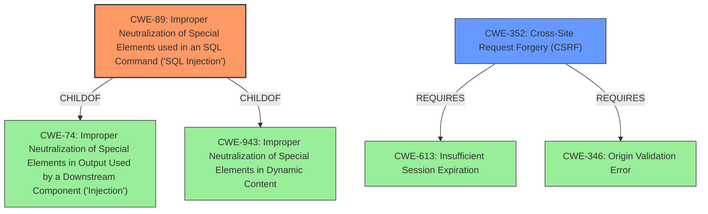

# Analysis Report for CVE-2021-21932

# Vulnerability Analysis Report: CVE-2021-21932

## Description


## Analysis (with Relationship Data)

# Summary
| CWE ID | CWE Name | Confidence | CWE Abstraction Level | CWE Vulnerability Mapping Label | CWE-Vulnerability Mapping Notes |
|---|---|---|---|---|---|
| CWE-89 | Improper Neutralization of Special Elements used in an SQL Command ('SQL Injection') | 1.0 | Base | Allowed | Primary CWE. The vulnerability stems from the **improper neutralization** of special elements in an SQL command, specifically through the `name_filter` parameter. |
| CWE-352 | Cross-Site Request Forgery (CSRF) | 0.7 | Compound | Allowed | Secondary CWE. The vulnerability description mentions that the **SQL injection** can be triggered through cross-site request forgery, which could be a secondary issue. |

## Evidence and Confidence

*   **Confidence Score:** 0.9
*   **Evidence Strength:** HIGH

## Relationship Analysis
The primary weakness is CWE-89 [Improper Neutralization of Special Elements used in an SQL Command ('SQL Injection')], which is a base-level CWE. It has parent CWEs like CWE-74 (Improper Neutralization of Special Elements in Output Used by a Downstream Component ('Injection')) and CWE-943. The description clearly states that the **vulnerability** is due to **improper neutralization** leading to **SQL injection**. CWE-352 [Cross-Site Request Forgery (CSRF)] is included because the vulnerability description mentions that an attacker can trigger the **SQL injection** through CSRF. This means that while the primary issue is **SQL injection**, it can be exploited via CSRF.



## Vulnerability Chain
The chain of events can be described as follows:
1.  **Root Cause:** **Improper neutralization** of special elements in the `name_filter` parameter leading to CWE-89 [Improper Neutralization of Special Elements used in an SQL Command ('SQL Injection')].
2.  **Exploitation Vector:** An attacker can exploit this **SQL injection** either as an authenticated user or through CWE-352 [Cross-Site Request Forgery (CSRF)].
3.  **Impact:** Execution of arbitrary SQL queries, potentially leading to data exfiltration, data modification, denial of service, or complete database compromise.

## Summary of Analysis
The analysis is primarily based on the provided vulnerability description and CVE reference links content summary. The key phrase "SQL injection" and the description of the **root cause** as **improper neutralization** of input confirm the selection of CWE-89 [Improper Neutralization of Special Elements used in an SQL Command ('SQL Injection')]. The mention of CSRF as a possible attack vector suggests a secondary weakness related to CWE-352 [Cross-Site Request Forgery (CSRF)]. The relationship graph highlights how CWE-89 is related to higher-level injection weaknesses and how CWE-352 depends on other weaknesses like CWE-613 [Insufficient Session Expiration] and CWE-346 [Origin Validation Error].

The retriever results strongly support CWE-89 [Improper Neutralization of Special Elements used in an SQL Command ('SQL Injection')] as the primary weakness. The other CWEs listed, such as CWE-918 [Server-Side Request Forgery (SSRF)], CWE-79 [Improper Neutralization of Input During Web Page Generation ('Cross-site Scripting')], and CWE-134 [Use of Externally-Controlled Format String], are not directly relevant to the described **SQL injection** vulnerability.

CWE-89 [Improper Neutralization of Special Elements used in an SQL Command ('SQL Injection')] is selected because the vulnerability involves the **improper handling** of special elements in an SQL command, as evident in the CVE reference links content summary. This aligns directly with the CWE's description. It is at the optimal level of specificity (Base) as it clearly identifies the type of **injection** occurring.

CWE-352 [Cross-Site Request Forgery (CSRF)] is considered a secondary weakness since the vulnerability description mentions that the **SQL injection** can be exploited via CSRF.

Other CWEs Considered but Not Used:

*   CWE-918 [Server-Side Request Forgery (SSRF)], CWE-79 [Improper Neutralization of Input During Web Page Generation ('Cross-site Scripting')], CWE-134 [Use of Externally-Controlled Format String]: These were considered but not selected because the vulnerability description and CVE reference links content summary clearly point to an **SQL injection** issue rather than request forgery, XSS, or format string issues. They don't align with the **root cause** of the vulnerability.


## CWE Relationship Analysis

Current CWEs represent these abstraction levels: .


### Vulnerability Chain Analysis

**Chain starting from CWE-79:**
- 79 (Improper Neutralization of Input During Web Page Generation ('Cross-site Scripting')) - ROOT


**Chain starting from CWE-943:**
- 943 (Improper Neutralization of Special Elements in Data Query Logic) - ROOT


### CWE Relationship Diagram

```mermaid
graph TD
    classDef primary fill:#f96,stroke:#333,stroke-width:2px
    classDef secondary fill:#69f,stroke:#333
    classDef tertiary fill:#9e9,stroke:#333
```


*Report generated on 2025-04-02 07:20:37*
