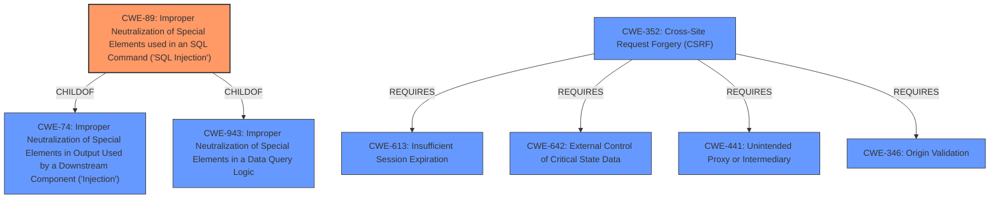

# Analysis Report for CVE-2021-21934

# Vulnerability Analysis Report: CVE-2021-21934

## Description


## Analysis (with Relationship Data)

# Summary
| CWE ID | CWE Name | Confidence | CWE Abstraction Level | CWE Vulnerability Mapping Label | CWE-Vulnerability Mapping Notes |
|---|---|---|---|---|---|
| CWE-89 | Improper Neutralization of Special Elements used in an SQL Command ('SQL Injection') | 1.0 | Base | Allowed | Primary CWE |
| CWE-352 | Cross-Site Request Forgery (CSRF) | 0.5 | Compound | Allowed | Secondary Candidate |

## Evidence and Confidence

*   **Confidence Score:** 0.75
*   **Evidence Strength:** HIGH

## Relationship Analysis
The primary CWE is CWE-89, which is a base-level CWE. The secondary CWE considered is CWE-352, which is a compound CWE. CWE-89 is a child of CWE-74 (Improper Neutralization of Special Elements in Output Used by a Downstream Component ('Injection')) and CWE-943 (Improper Neutralization of Special Elements in a Data Query Logic). CWE-352 requires CWE-613 (Insufficient Session Expiration), CWE-642 (External Control of Critical State Data), CWE-441 (Unintended Proxy or Intermediary), and CWE-346 (Origin Validation).



## Vulnerability Chain
The chain of events starts with a **specially-crafted HTTP request** that targets the `imei_filter` parameter. This leads to **SQL injection** due to **improper neutralization of special elements** within the SQL command. The vulnerability can be exploited either by an authenticated user or through **cross-site request forgery**.

## Summary of Analysis
The initial assessment correctly identified CWE-89 as the primary weakness based on the vulnerability description, key phrases, and CVE reference links content summary. The vulnerability involves a **SQL injection** **weakness** triggered by a **specially-crafted HTTP request** to the `imei_filter` parameter. The root cause is the **misuse of prepared statements** combined with SQL concatenation and the **circumvention of input sanitization**.

The reference links content summary explicitly mentions "SQL Injection (CWE-89)" as one of the weaknesses/vulnerabilities present and describes the root cause as the misuse of prepared statements in the context of the application, along with stored procedures combined with SQL concatenation. The attacker can execute arbitrary SQL queries, leading to data exfiltration, modification, or other malicious activities.

CWE-352 (Cross-Site Request Forgery) was also considered because the vulnerability description states the attack can be done through cross-site request forgery. However, since SQL Injection is the primary cause, CWE-89 is the more appropriate primary classification. CWE-352 is a secondary contributing factor.

The final selection of CWE-89 is at the optimal level of specificity because it directly addresses the **improper neutralization of special elements** used in an SQL command, which is the core issue identified in the vulnerability description and supported by the evidence.

Relevant CWE Information:
# Enhanced Context (25 CWEs)
The following CWEs were identified as potentially relevant to this vulnerability:

## CWE-80: Improper Neutralization of Script-Related HTML Tags in a Web Page (Basic XSS)
**Abstraction Level**: Variant
**Similarity Score**: 0.81

## CWE-113: Improper Neutralization of CRLF Sequences in HTTP Headers ('HTTP Request/Response Splitting')
**Abstraction Level**: Variant
**Similarity Score**: 0.78

## CWE-611: Improper Restriction of XML External Entity Reference
**Abstraction Level**: Base
**Similarity Score**: 0.77

## CWE-184: Incomplete List of Disallowed Inputs
**Abstraction Level**: Base
**Similarity Score**: 0.75

## CWE-74: Improper Neutralization of Special Elements in Output Used by a Downstream Component ('Injection')
**Abstraction Level**: Class
**Similarity Score**: 0.75

## CWE-444: Inconsistent Interpretation of HTTP Requests ('HTTP Request/Response Smuggling')
**Abstraction Level**: Base
**Similarity Score**: 0.75

## CWE-1289: Improper Validation of Unsafe Equivalence in Input
**Abstraction Level**: Base
**Similarity Score**: 0.74

## CWE-84: Improper Neutralization of Encoded URI Schemes in a Web Page
**Abstraction Level**: Variant
**Similarity Score**: 0.74

## CWE-138: Improper Neutralization of Special Elements
**Abstraction Level**: Class
**Similarity Score**: 0.74

## CWE-116: Improper Encoding or Escaping of Output
**Abstraction Level**: Class
**Similarity Score**: 0.74

## CWE-113: Improper Neutralization of CRLF Sequences in HTTP Headers ('HTTP Request/Response Splitting')
**Abstraction Level**: Variant
**Similarity Score**: 8650.00

## CWE-79: Improper Neutralization of Input During Web Page Generation ('Cross-site Scripting')
**Abstraction Level**: Base
**Similarity Score**: 8515.57

## CWE-444: Inconsistent Interpretation of HTTP Requests ('HTTP Request/Response Smuggling')
**Abstraction Level**: Base
**Similarity Score**: 8426.51

## CWE-611: Improper Restriction of XML External Entity Reference
**Abstraction Level**: Base
**Similarity Score**: 8112.55

## CWE-116: Improper Encoding or Escaping of Output
**Abstraction Level**: Class
**Similarity Score**: 8076.97

## CWE-79: Improper Neutralization of Input During Web Page Generation ('Cross-site Scripting')
**Abstraction Level**: base
**Similarity Score**: 5.03

## CWE-434: Unrestricted Upload of File with Dangerous Type
**Abstraction Level**: base
**Similarity Score**: 5.03

## CWE-78: Improper Neutralization of Special Elements used in an OS Command ('OS Command Injection')
**Abstraction Level**: base
**Similarity Score**: 4.33

## CWE-123: Write-what-where Condition
**Abstraction Level**: base
**Similarity Score**: 4.33

## CWE-494: Download of Code Without Integrity Check
**Abstraction Level**: base
**Similarity Score**: 4.33

## CWE-22: Improper Limitation of a Pathname to a Restricted Directory ('Path Traversal')
**Abstraction Level**: base
**Similarity Score**: 4.33

## CWE-613: Insufficient Session Expiration
**Abstraction Level**: base
**Similarity Score**: 4.21

## CWE-352: Cross-Site Request Forgery (CSRF)
**Abstraction Level**: compound
**Similarity Score**: 3.54

## CWE-183: Permissive List of Allowed Inputs
**Abstraction Level**: base
**Similarity Score**: 3.36

## CWE-89: Improper Neutralization of Special Elements used in an SQL Command ('SQL Injection')
**Abstraction Level**: base
**Similarity Score**: 3.30


## CWE Relationship Analysis

Current CWEs represent these abstraction levels: .


### Vulnerability Chain Analysis

**Chain starting from CWE-123:**
- 123 (Write-what-where Condition) - ROOT


**Chain starting from CWE-444:**
- 444 (Inconsistent Interpretation of HTTP Requests ('HTTP Request/Response Smuggling')) - ROOT


### CWE Relationship Diagram

```mermaid
graph TD
    classDef primary fill:#f96,stroke:#333,stroke-width:2px
    classDef secondary fill:#69f,stroke:#333
    classDef tertiary fill:#9e9,stroke:#333
```


*Report generated on 2025-04-02 04:02:15*
