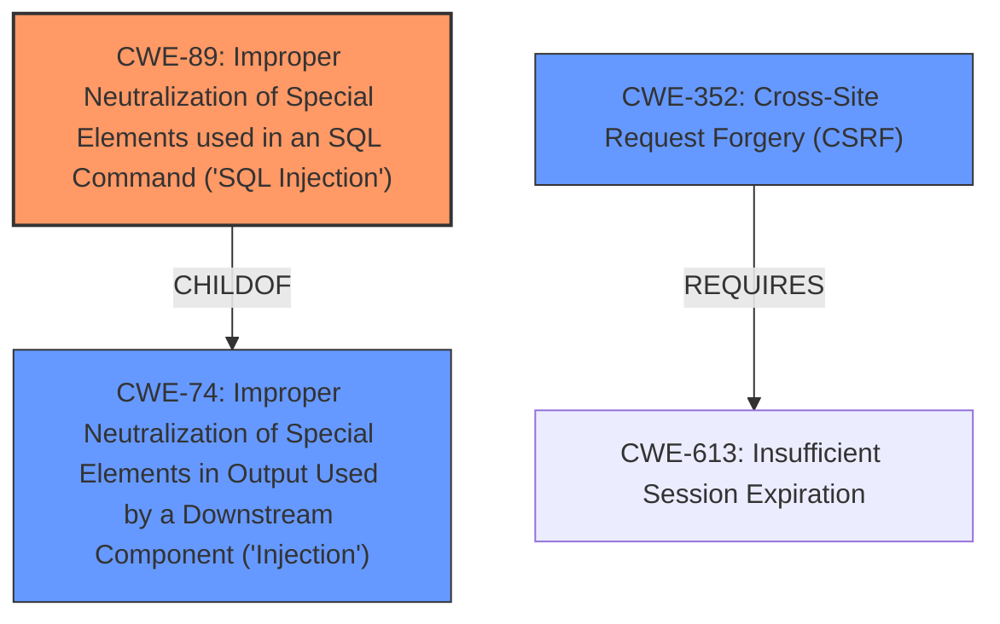

# Enhanced Analysis for CVE-2021-21935

# Summary
| CWE ID | CWE Name | Confidence | CWE Abstraction Level | CWE Vulnerability Mapping Label | CWE-Vulnerability Mapping Notes |
|---|---|---|---|---|---|
| CWE-89 | Improper Neutralization of Special Elements used in an SQL Command ('SQL Injection') | 1.0 | Base | Allowed | Primary CWE |
| CWE-352 | Cross-Site Request Forgery (CSRF) | 0.5 | Compound | Allowed | Secondary Candidate |

## Evidence and Confidence

*   **Confidence Score:** 0.8
*   **Evidence Strength:** HIGH

## Relationship Analysis
The primary CWE is CWE-89, which represents the root cause of the vulnerability: improper neutralization leading to SQL injection. CWE-89 is a base-level CWE, which is appropriate for direct mapping. CWE-352 is considered as a secondary factor since the attack can be performed through it.



## Vulnerability Chain
The vulnerability chain starts with the **improper neutralization** of special elements used in an SQL command (CWE-89). This allows an attacker to inject malicious SQL code. The attack can be launched by an authenticated user directly, or it can be performed via Cross-Site Request Forgery (CWE-352), where an attacker tricks a user into making the malicious request.

## Summary of Analysis
The initial analysis correctly identified CWE-89 as the primary weakness. The vulnerability description clearly states that a specially-crafted HTTP request can lead to **SQL injection** due to **improper neutralization** of special elements in the `host_alt_filter2` parameter. The CVE Reference Links Content Summary confirms this, stating that the root cause is the **misuse of prepared statements** and SQL concatenation, resulting in **SQL Injection (CWE-89)**.

CWE-352 is a possible secondary weakness because the vulnerability can be exploited through Cross-Site Request Forgery. The attacker can trick a user into triggering the SQL injection. However, CWE-352 is not the root cause, but rather an attack vector. Therefore, it's a secondary consideration.

The selection of CWE-89 is at the optimal level of specificity because it directly describes the root cause of the vulnerability: the improper neutralization of special elements leading to SQL injection. The evidence strongly supports this classification, and the CWE description aligns perfectly with the vulnerability details.

Relevant CWE Information:
# Enhanced Context (25 CWEs)
The following CWEs were identified as potentially relevant to this vulnerability:

## CWE-80: Improper Neutralization of Script-Related HTML Tags in a Web Page (Basic XSS)
**Abstraction Level**: Variant
**Similarity Score**: 0.82
**Source**: dense
Not Selected: This CWE relates to XSS, which is not the vulnerability described.

## CWE-113: Improper Neutralization of CRLF Sequences in HTTP Headers ('HTTP Request/Response Splitting')
**Abstraction Level**: Variant
**Similarity Score**: 0.78
**Source**: dense
Not Selected: This CWE relates to HTTP Request/Response Splitting, which is not the vulnerability described.

## CWE-611: Improper Restriction of XML External Entity Reference
**Abstraction Level**: Base
**Similarity Score**: 0.78
**Source**: dense
Not Selected: This CWE relates to XXE, which is not the vulnerability described.

## CWE-74: Improper Neutralization of Special Elements in Output Used by a Downstream Component ('Injection')
**Abstraction Level**: Class
**Similarity Score**: 0.76
**Source**: dense
Not Selected: CWE-74 is a high-level class. CWE-89 is a more specific child of CWE-74.

## CWE-184: Incomplete List of Disallowed Inputs
**Abstraction Level**: Base
**Similarity Score**: 0.76
**Source**: dense
Not Selected: This CWE is not directly relevant as the issue is improper neutralization rather than an incomplete list of disallowed inputs.

## CWE-116: Improper Encoding or Escaping of Output
**Abstraction Level**: Class
**Similarity Score**: 0.75
**Source**: dense
Not Selected: This CWE is too general. The specific issue is related to SQL injection and improper neutralization of special elements in SQL commands.

## CWE-138: Improper Neutralization of Special Elements
**Abstraction Level**: Class
**Similarity Score**: 0.74
**Source**: dense
Not Selected: This CWE is too general. The specific issue is related to SQL injection and improper neutralization of special elements in SQL commands.

## CWE-1289: Improper Validation of Unsafe Equivalence in Input
**Abstraction Level**: Base
**Similarity Score**: 0.74
**Source**: dense
Not Selected: This CWE is not relevant as the issue is not about validating equivalence of inputs.

## CWE-41: Improper Resolution of Path Equivalence
**Abstraction Level**: Base
**Similarity Score**: 0.74
**Source**: dense
Not Selected: This CWE is not relevant as the issue is not about path equivalence.

## CWE-917: Improper Neutralization of Special Elements used in an Expression Language Statement ('Expression Language Injection')
**Abstraction Level**: Base
**Similarity Score**: 0.74
**Source**: dense
Not Selected: This CWE relates to Expression Language Injection, which is not the vulnerability described.

## CWE-79: Improper Neutralization of Input During Web Page Generation ('Cross-site Scripting')
**Abstraction Level**: Base
**Similarity Score**: 8019.00
**Source**: sparse
Not Selected: This CWE relates to XSS, which is not the vulnerability described.

## CWE-113: Improper Neutralization of CRLF Sequences in HTTP Headers ('HTTP Request/Response Splitting')
**Abstraction Level**: Variant
**Similarity Score**: 7992.70
**Source**: sparse
Not Selected: This CWE relates to HTTP Request/Response Splitting, which is not the vulnerability described.

## CWE-611: Improper Restriction of XML External Entity Reference
**Abstraction Level**: Base
**Similarity Score**: 7643.75
**Source**: sparse
Not Selected: This CWE relates to XXE, which is not the vulnerability described.

## CWE-116: Improper Encoding or Escaping of Output
**Abstraction Level**: Class
**Similarity Score**: 7627.27
**Source**: sparse
Not Selected: This CWE is too general. The specific issue is related to SQL injection and improper neutralization of special elements in SQL commands.

## CWE-918: Server-Side Request Forgery (SSRF)
**Abstraction Level**: Base
**Similarity Score**: 7538.37
**Source**: sparse
Not Selected: This CWE relates to SSRF, which is not the vulnerability described.

## CWE-434: Unrestricted Upload of File with Dangerous Type
**Abstraction Level**: base
**Similarity Score**: 5.03
**Source**: graph
Not Selected: This CWE is not relevant as the issue is not related to file uploads.

## CWE-78: Improper Neutralization of Special Elements used in an OS Command ('OS Command Injection')
**Abstraction Level**: base
**Similarity Score**: 4.33
**Source**: graph
Not Selected: This CWE relates to OS Command Injection, which is not the vulnerability described.

## CWE-123: Write-what-where Condition
**Abstraction Level**: base
**Similarity Score**: 4.33
**Source**: graph
Not Selected: This CWE is not relevant as the issue is not about a write-what-where condition.

## CWE-494: Download of Code Without Integrity Check
**Abstraction Level**: base
**Similarity Score**: 4.33
**Source**: graph
Not Selected: This CWE is not relevant as the issue is not related to downloading code.

## CWE-22: Improper Limitation of a Pathname to a Restricted Directory ('Path Traversal')
**Abstraction Level**: base
**Similarity Score**: 4.33
**Source**: graph
Not Selected: This CWE is not relevant as the issue is not about path traversal.

## CWE-613: Insufficient Session Expiration
**Abstraction Level**: base
**Similarity Score**: 4.21
**Source**: graph
Not Selected: This CWE is only relevant as it is a REQUIREMENT of the secondary attack vector CWE


## CWE Relationship Analysis

Current CWEs represent these abstraction levels: .


### Vulnerability Chain Analysis

**Chain starting from CWE-123:**
- 123 (Write-what-where Condition) - ROOT


**Chain starting from CWE-116:**
- 116 (Improper Encoding or Escaping of Output) - ROOT


### CWE Relationship Diagram

```mermaid
graph TD
    classDef primary fill:#f96,stroke:#333,stroke-width:2px
    classDef secondary fill:#69f,stroke:#333
    classDef tertiary fill:#9e9,stroke:#333
```