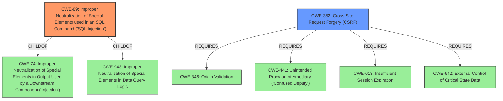

# Analysis for CVE-2021-21936

# Summary
| CWE ID | CWE Name | Confidence | CWE Abstraction Level | CWE Vulnerability Mapping Label | CWE-Vulnerability Mapping Notes |
|---|---|---|---|---|---|
| CWE-89 | Improper Neutralization of Special Elements used in an SQL Command ('SQL Injection') | 1.0 | Base | Allowed | Primary CWE |
| CWE-352 | Cross-Site Request Forgery (CSRF) | 0.7 | Compound | Allowed | Secondary CWE |

## Evidence and Confidence

*   **Confidence Score:** 0.9
*   **Evidence Strength:** HIGH

## Relationship Analysis
The primary CWE is CWE-89, which is a base-level CWE representing the root cause of the **SQL injection** vulnerability. CWE-89 is a child of CWE-74 (Improper Neutralization of Special Elements in Output Used by a Downstream Component ('Injection')) and CWE-943 (Improper Neutralization of Special Elements in Data Query Logic).

CWE-352 (Cross-Site Request Forgery (CSRF)) is a compound CWE that describes a scenario where an attacker can trick a user into making unintentional requests. The vulnerability description indicates that the **SQL injection** can be exploited through CSRF, making CWE-352 a relevant secondary CWE. CWE-352 requires other CWEs to be present, such as CWE-346, CWE-441, CWE-613, and CWE-642.

## Vulnerability Chain
The vulnerability chain starts with the **improper neutralization** of special elements used in an SQL command (CWE-89), which allows an attacker to inject malicious SQL queries. The vulnerability can be triggered by an authenticated user through a specially-crafted HTTP request or by an unauthenticated attacker through cross-site request forgery (CWE-352), if CSRF protection is **missing** or **insufficient**. The impact is unauthorized data access, modification, or deletion.

## Summary of Analysis
The analysis indicates that the primary **weakness** is CWE-89 (**SQL Injection**), as supported by the vulnerability description stating, "A specially-crafted HTTP request can lead to **SQL injection**" and the CVE Reference Links Content Summary stating, "The vulnerability exists due to misuse of prepared statements and stored procedures combined with SQL concatenation...leading to **SQL injection**" and "Weaknesses/vulnerabilities present: [ "SQL Injection (CWE-89)" ]". The description also indicates that "This can be done as any authenticated user or through cross-site request forgery", suggesting a secondary vulnerability related to CSRF (CWE-352).

CWE-89 is selected because the root cause is the **improper neutralization** of special elements used in an SQL command. The CVE Reference Links Content Summary further confirms this by explaining how variables used to build up an SQL query, despite being initially sanitized, lose that protection when invoked against the database, leading to SQL injection.

CWE-352 is included as a secondary CWE because the vulnerability can be exploited through cross-site request forgery. The attacker can make authenticated HTTP requests to trigger the vulnerability, and this can be done through CSRF.

The selected CWEs are at the optimal level of specificity. CWE-89 is a Base-level CWE that accurately represents the root cause of the **SQL injection** vulnerability. CWE-352 is a compound CWE that accurately represents the possibility of exploiting the vulnerability through CSRF.

Relevant CWE Information:

# Enhanced Context (25 CWEs)
The following CWEs were identified as potentially relevant to this vulnerability:

## CWE-80: Improper Neutralization of Script-Related HTML Tags in a Web Page (Basic XSS)
**Abstraction Level**: Variant
**Similarity Score**: 0.81
**Source**: dense

**Description**:
The product receives input from an upstream component, but it does not neutralize or incorrectly neutralizes special characters such as "<", ">", and "&" that could be interpreted as web-scripting elements when they are sent to a downstream component that processes web pages.

**Mapping Guidance**:
- Usage: Allowed
- Rationale: This CWE entry is at the Variant level of abstraction, which is a preferred level of abstraction for mapping to the root causes of vulnerabilities.

## CWE-113: Improper Neutralization of CRLF Sequences in HTTP Headers ('HTTP Request/Response Splitting')
**Abstraction Level**: Variant
**Similarity Score**: 0.78
**Source**: dense

**Description**:
The product receives data from an HTTP agent/component (e.g., web server, proxy, browser, etc.), but it does not neutralize or incorrectly neutralizes CR and LF characters before the data is included in outgoing HTTP headers.

**Mapping Guidance**:
- Usage: Allowed
- Rationale: This CWE entry is at the Variant level of abstraction, which is a preferred level of abstraction for mapping to the root causes of vulnerabilities.

## CWE-611: Improper Restriction of XML External Entity Reference
**Abstraction Level**: Base
**Similarity Score**: 0.77
**Source**: dense

**Description**:
The product processes an XML document that can contain XML entities with URIs that resolve to documents outside of the intended sphere of control, causing the product to embed incorrect documents into its output.

**Mapping Guidance**:
- Usage: Allowed
- Rationale: This CWE entry is at the Base level of abstraction, which is a preferred level of abstraction for mapping to the root causes of vulnerabilities.

## CWE-74: Improper Neutralization of Special Elements in Output Used by a Downstream Component ('Injection')
**Abstraction Level**: Class
**Similarity Score**: 0.76
**Source**: dense

**Description**:
The product constructs all or part of a command, data structure, or record using externally-influenced input from an upstream component, but it does not neutralize or incorrectly neutralizes special elements that could modify how it is parsed or interpreted when it is sent to a downstream component.

**Mapping Guidance**:
- Usage: Discouraged
- Rationale: CWE-74 is high-level and often misused when lower-level weaknesses are more appropriate.

## CWE-184: Incomplete List of Disallowed Inputs
**Abstraction Level**: Base
**Similarity Score**: 0.75
**Source**: dense

**Description**:
The product implements a protection mechanism that relies on a list of inputs (or properties of inputs) that are not allowed by policy or otherwise require other action to neutralize before additional processing takes place, but the list is incomplete.

**Mapping Guidance**:
- Usage: Allowed
- Rationale: This CWE entry is at the Base level of abstraction, which is a preferred level of abstraction for mapping to the root causes of vulnerabilities.

## CWE-116: Improper Encoding or Escaping of Output
**Abstraction Level**: Class
**Similarity Score**: 0.74
**Source**: dense

**Description**:
The product prepares a structured message for communication with another component, but encoding or escaping of the data is either missing or done incorrectly. As a result, the intended structure of the message is not preserved.

**Mapping Guidance**:
- Usage: Allowed-with-Review
- Rationale: This CWE entry is a Class and might have Base-level children that would be more appropriate

## CWE-1289: Improper Validation of Unsafe Equivalence in Input
**Abstraction Level**: Base
**Similarity Score**: 0.74
**Source**: dense

**Description**:
The product receives an input value that is used as a resource identifier or other type of reference, but it