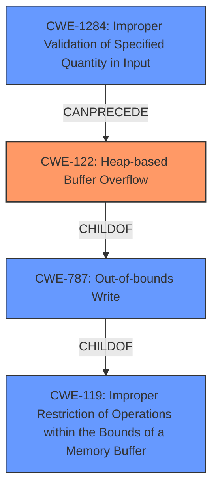

# Analysis Report for CVE-2021-21940

# Vulnerability Analysis Report: CVE-2021-21940

## Description


## Analysis (with Relationship Data)

# Summary
| CWE ID | CWE Name | Confidence | CWE Abstraction Level | CWE Vulnerability Mapping Label | CWE-Vulnerability Mapping Notes |
|---|---|---|---|---|---|
| CWE-122 | Heap-based Buffer Overflow | 1.0 | Variant | Primary | Allowed |
| CWE-119 | Improper Restriction of Operations within the Bounds of a Memory Buffer | 0.7 | Class | Secondary | Discouraged |
| CWE-787 | Out-of-bounds Write | 0.6 | Base | Secondary | Allowed |
| CWE-1284 | Improper Validation of Specified Quantity in Input | 0.5 | Base | Secondary | Allowed |

## Evidence and Confidence

*   **Confidence Score:** 0.9
*   **Evidence Strength:** HIGH

## Relationship Analysis
The primary CWE is CWE-122, a variant of CWE-787 (Out-of-bounds Write) which in turn is a child of CWE-119 (Improper Restriction of Operations within the Bounds of a Memory Buffer). The vulnerability involves a heap-based buffer overflow due to insufficient bounds checking, making CWE-122 the most specific and appropriate choice. CWE-1284 is a potential contributing factor since improper validation of quantity in input can lead to buffer overflows.



## Vulnerability Chain
The vulnerability chain starts with **improper validation of input** (CWE-1284), leading to a **heap-based buffer overflow** (CWE-122) due to **out-of-bounds write** (CWE-787). The lack of proper bounds checking in `RecvData` and `ProcessRecvData` allows an attacker to manipulate `read_ptr` and `recvpkt` resulting in the overflow.

## Summary of Analysis
The initial analysis identified the **heap-based buffer overflow** as the primary issue. The evidence from the CVE Reference Links Content Summary clearly states the **root cause** as "insufficient bounds checking when handling RTSP packets" which leads to a **heap-based buffer overflow** (CWE-122). The retriever results also list CWE-122 and CWE-119 as potential matches.

The graph relationships confirm that CWE-122 is a variant of CWE-787, which is a child of CWE-119. This hierarchical relationship reinforces the selection of CWE-122 as the most specific and accurate representation of the vulnerability.

The final decision is based on the clear evidence of a **heap-based buffer overflow** due to **insufficient bounds checking**. The CWE-122 is at the Variant level of abstraction, providing the optimal level of specificity for this vulnerability. The **attacker's ability to manipulate the `read_ptr`** also suggests **improper validation of quantity in input** (CWE-1284).

Relevant CWE Information:

# Enhanced Context (25 CWEs)

## CWE-122: Heap-based Buffer Overflow
**Technical Explanation:** The vulnerability occurs because the `ProcessRtspInfo` function iterates through active RTSP sessions, and if a session's `pkt_read_status` is 3, data is read from an offset within the receive buffer (`recv_buf`). However, the read size is fixed at 0x800 bytes, regardless of the offset. The attacker can control `read_ptr` within `recvpkt`, leading to a controlled out-of-bounds write on the heap.
**Security Implications:** This can lead to arbitrary code execution and full control of the device by overwriting adjacent memory on the heap, including `RTSPSession` structures and manipulating pointers and function calls.
**Relationship Analysis:** CWE-122 is a variant of CWE-787, which is a child of CWE-119. It represents the specific type of buffer overflow occurring on the heap.
**Mapping Guidance Influence:** The MITRE mapping guidance allows for the use of CWE-122 as it is a Variant level of abstraction.
**Primary/Secondary:** Primary

## CWE-119: Improper Restriction of Operations within the Bounds of a Memory Buffer
**Technical Explanation:** This CWE is a more general classification that encompasses the **buffer overflow** but doesn't specify where the buffer is located (heap or stack). The specific issue is that operations are performed on a memory buffer without proper bounds checking, leading to read or write operations outside the intended boundary.
**Security Implications:** Results in read or write operations on unexpected memory locations that could be linked to other variables, data structures, or internal program data.
**Relationship Analysis:** CWE-119 is a parent of CWE-787 and a grandparent of CWE-122.
**Mapping Guidance Influence:** The MITRE mapping guidance discourages the use of CWE-119 when more specific CWEs are available.
**Primary/Secondary:** Secondary

## CWE-787: Out-of-bounds Write
**Technical Explanation:** This CWE describes the act of writing data past the end of a buffer, which is the direct consequence of the **missing bounds checking**. The `ProcessRtspInfo` function's uncontrolled read size (0x800 bytes) leads to this out-of-bounds write.
**Security Implications:** This can lead to memory corruption, potentially allowing an attacker to overwrite critical data or execute arbitrary code.
**Relationship Analysis:** CWE-787 is a child of CWE-119 and a parent of CWE-122.
**Mapping Guidance Influence:** The MITRE mapping guidance allows for the use of CWE-787 as it is at the Base level of abstraction.
**Primary/Secondary:** Secondary

## CWE-1284: Improper Validation of Specified Quantity in Input
**Technical Explanation:** The vulnerability can be triggered because the code does not properly validate the `read_ptr` value controlled by the attacker. This allows the attacker to specify a quantity (offset) that leads to the overflow.
**Security Implications:** Allows the attacker to control the memory location that is overwritten, increasing the likelihood of successful exploitation.
**Relationship Analysis:** CWE-1284 can precede CWE-789 (Memory Allocation Errors) and other memory corruption issues.
**Mapping Guidance Influence:** The MITRE mapping guidance allows for the use of CWE-1284 as it is at the Base level of abstraction.
**Primary/Secondary:** Secondary

**CWEs Considered but Not Used:**

- CWE-190 (Integer Overflow or Wraparound), CWE-197 (Numeric Truncation Error), CWE-195 (Signed to Unsigned Conversion Error), CWE-120 (Buffer Copy without Checking Size of Input), CWE-193 (Off-by-one Error): These CWEs were considered but not selected because they don't directly describe the core issue of a **heap-based buffer overflow** due to **missing bounds checking**. Although integer overflows or truncation errors could potentially contribute to the vulnerability, the provided information does not explicitly state this.
- CWE-121 (Stack-based Buffer Overflow): This CWE was not selected because the buffer overflow occurs on the heap, not the stack.
- CWE-128 (Wrap-around Error): This CWE was not selected as it does not directly apply to the overflow condition.


## CWE Relationship Analysis

Current CWEs represent these abstraction levels: .


### Vulnerability Chain Analysis

**Chain starting from CWE-787:**
- 787 (Out-of-bounds Write) - ROOT


**Chain starting from CWE-121:**
- 121 (Stack-based Buffer Overflow) - ROOT


### CWE Relationship Diagram

```mermaid
graph TD
    classDef primary fill:#f96,stroke:#333,stroke-width:2px
    classDef secondary fill:#69f,stroke:#333
    classDef tertiary fill:#9e9,stroke:#333
```


*Report generated on 2025-04-02 05:23:50*
