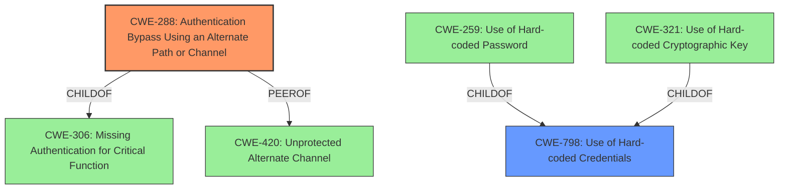

# Analysis for CVE-2021-21952

# Summary
| CWE ID | CWE Name | Confidence | CWE Abstraction Level | CWE Vulnerability Mapping Label | CWE-Vulnerability Mapping Notes |
|---|---|---|---|---|---|
| CWE-288 | Authentication Bypass Using an Alternate Path or Channel | 0.9 | Base | Allowed | Primary CWE |
| CWE-798 | Use of Hard-coded Credentials | 0.7 | Base | Allowed | Secondary Candidate |

## Evidence and Confidence

*   **Confidence Score:** 0.8
*   **Evidence Strength:** HIGH

## Relationship Analysis
The primary CWE selected is CWE-288, Authentication Bypass Using an Alternate Path or Channel. This CWE is a base-level weakness, providing a good balance between specificity and generality. It is related to CWE-306, Missing Authentication for Critical Function, as a child. CWE-420, Unprotected Alternate Channel, is a peer, representing a closely related concept.

The secondary CWE selected is CWE-798, Use of Hard-coded Credentials, which contributes to the authentication bypass. CWE-798 has variants such as CWE-259, Use of Hard-coded Password, and CWE-321, Use of Hard-coded Cryptographic Key, showing a hierarchy.



## Vulnerability Chain
The vulnerability chain starts with the **use of a hardcoded key** (CWE-798). This **hardcoded key** enables an **authentication bypass** (CWE-288), leading to increased privileges.

## Summary of Analysis
Initially, the analysis focused on the **authentication bypass** as the primary weakness, supported by the description and key phrases. The Talos report summary confirmed the **lack of authentication** for the `CMD_DEVICE_GET_RSA_KEY_REQUEST` command, enabling the bypass. Further analysis of the report summary highlighted that the **use of a hardcoded key** is a critical contributing factor to the bypass. The **hardcoded key** allows attackers to decrypt the RSA public key and gain unauthorized access. Therefore, CWE-288 is selected as the primary weakness due to the **authentication bypass**, and CWE-798 is selected as a secondary weakness because the **hardcoded key** is the root cause that allows the bypass.

The selection of CWE-288 and CWE-798 is based on the evidence provided in the vulnerability description, the key phrases, and the CVE reference links content summary. The relationships between these CWEs help to clarify the nature of the vulnerability, with the **hardcoded key** facilitating the **authentication bypass**. The abstraction levels of the selected CWEs are appropriate, with CWE-288 and CWE-798 being base-level weaknesses, providing a good balance between specificity and generality.

CWE-300 (Channel Accessible by Non-Endpoint) was considered but not selected because the vulnerability doesn't primarily involve an adversary-in-the-middle attack, although the **authentication bypass** could potentially facilitate such attacks. CWE-306 (Missing Authentication for Critical Function) was also considered but deemed less appropriate than CWE-288, as the vulnerability involves an alternate path (the `CMD_DEVICE_GET_RSA_KEY_REQUEST` command) that bypasses authentication, rather than a complete absence of authentication. CWE-331 (Insufficient Entropy) was considered but not selected as the root cause is the **use of a hardcoded key** rather than insufficient randomness in key generation.

Relevant CWE Information:

# Enhanced Context (25 CWEs)
The following CWEs were identified as potentially relevant to this vulnerability:

## CWE-288: Authentication Bypass Using an Alternate Path or Channel
**Abstraction Level**: Base
**Similarity Score**: 3.64
**Source**: graph

**Description**:
CWE-288: Authentication Bypass Using an Alternate Path or Channel

**Mapping Guidance**:
- Usage: Allowed
- Rationale: This CWE entry is at the Base level of abstraction, which is a preferred level of abstraction for mapping to the root causes of vulnerabilities.

**Relationships**:
- PARENTOF -> CWE-425
- PARENTOF -> CWE-1299
- PEEROF -> CWE-420
- CHILDOF -> CWE-284
- CHILDOF -> CWE-306

## CWE-798: Use of Hard-coded Credentials
**Abstraction Level**: Base
**Similarity Score**: 5431.29
**Source**: sparse

**Description**:
The product contains hard-coded credentials, such as a password or cryptographic key.

**Mapping Guidance**:
- Usage: Allowed
- Rationale: This CWE entry is at the Base level of abstraction, which is a preferred level of abstraction for mapping to the root causes of vulnerabilities.

# Enhanced Query for CVE-2021-21952

## Vulnerability Description
An **authentication bypass** vulnerability exists in the CMD_DEVICE_GET_RSA_KEY_REQUEST functionality of the home_security binary of Anker Eufy Homebase 2 2.1.6.9h. A specially-crafted set of network packets can lead to increased privileges.

### Vulnerability Description Key Phrases
- **weakness:** **authentication bypass**
- **impact:** increased privileges
- **vector:** specially-crafted set of network packets
- **product:** Anker Eufy Homebase 2
- **version:** 2.1.6.9h
- **component:** CMD_DEVICE_GET_RSA_KEY_REQUEST functionality of the home_security binary

## CVE Reference Links Content Summary
Based on the provided content, here's a breakdown of the vulnerability:

**Root Cause:**

The vulnerability stems from the insecure handling of the `CMD_DEVICE_GET_RSA_KEY_REQUEST` command in the `home_security` binary of the Anker Eufy Homebase 2. The device uses a hardcoded, static string (`&#%@!_eufy_anker`) as a basis for generating an AES key. This key is used to decrypt the RSA public key sent by the server. The device then uses this decrypted RSA public key to encrypt a secret set of bytes (`s_aes_key`) generated on boot and sends it back to the server. Because the initial AES key is derived from a known static value, any attacker can use this to obtain the `s_aes_key`.

**Weaknesses/Vulnerabilities Present:**

*   **Authentication Bypass:** The `CMD_DEVICE_GET_RSA_KEY_REQUEST` command does not require authentication, allowing anyone to trigger the vulnerable code path.
*   **Hardcoded Key:** The use of a hardcoded string (`&#%@!_eufy_anker`) as part of the AES key generation process.
*   **Insecure Key Exchange:** Although an RSA key exchange is performed, it's rendered insecure because of the initial use of a predictable key.

**Impact of Exploitation:**

*   **Privilege Escalation:** Successful exploitation allows an attacker to obtain the `s_aes_key`, effectively granting them the same level of access as the device owner's phone application.
*   **Full Device Control:** With access equivalent to the owner's phone app, the attacker can control all device functions and data, potentially including access to stored video footage, device settings, and the ability to trigger other actions.

**Attack Vectors:**

*   **Network Attack:** The vulnerability is exploitable through network packets sent to the Eufy Homebase 2.
*   **Unauthenticated Requests:** The attacker can send the `CMD_DEVICE_GET_RSA_KEY_REQUEST` without prior authentication.

**Required Attacker Capabilities/Position:**

*   **Network Access:** The attacker needs to be on the same network as the Eufy Homebase 2 or have a path to send network packets to it.
*   **Packet Manipulation:** The attacker needs the ability to craft and send specific UDP packets to the device.

**Additional Notes:**

*   The vulnerability is in the `home_security` binary and the specific handling of the `CMD_DEVICE_GET_RSA_KEY_REQUEST` command.
*   The `s_aes_key` is used to authenticate subsequent communication, allowing control of the device.
*   The Talos report provides detailed packet examples and a code analysis of the vulnerable functions.
*   The vulnerability was patched by the vendor and publicly disclosed.

## Retriever Results

### Top Combined Results

| Rank | CWE ID | Name | Abstraction | Usage  | Retrievers | Individual Scores |
|------|--------|------|-------------|-------|------------|-------------------|
| 1 | 300 | Channel Accessible by Non-Endpoint | Class | Discouraged | sparse | 0.261 |
| 2 | 331 | Insufficient Entropy | Base | Allowed | sparse | 0.247 |
| 3 | 290 | Authentication Bypass by Spoofing | Base | Allowed | sparse | 0.205 |
| 4 | 306 | Missing Authentication for Critical Function | Base | Allowed | sparse | 0.200 |
| 5 | 1284 | Improper Validation of Specified Quantity in Input | Base | Allowed | sparse | 0.199 |
| 6 | 288 | Authentication Bypass Using an Alternate Path or Channel | Base | Allowed | dense | 0.574 |
| 7 | 613 | Insufficient Session Expiration | Base | Allowed | graph | 0.002 |
| 8 | 259 | Use of Hard-coded Password | Variant | Allowed | sparse | 0.176 |
| 9 | 321 | Use of Hard-coded Cryptographic Key | Variant | Allowed | sparse | 0.175 |
| 10 | 122 | Heap-based Buffer Overflow | Variant | Allowed | sparse | 0.168 |


# Complete CWE Specifications


## CWE-300: Channel Accessible by Non-Endpoint
**Abstraction:** Class
**Status:** Draft

### Description
The product does not adequately verify the identity of actors at both ends of a communication channel, or does not adequately ensure the integrity of the channel, in a way that allows the channel to be accessed or influenced by an actor that is not an endpoint.

### Extended Description
In order to establish secure communication between two parties, it is often important to adequately verify the identity of entities at each end of the communication channel. Inadequate or inconsistent verification may result in insufficient or incorrect identification of either communicating entity. This can have negative consequences such as misplaced trust in the entity at the other end of the channel. An attacker can leverage this by interposing between the communicating entities and masquerading as the original entity. In the absence of sufficient verification of identity, such an attacker can eavesdrop and potentially modify the communication between the original entities.

### Alternative Terms
Adversary-in-the-Middle / AITM
Man-in-the-Middle / MITM
Person-in-the-Middle / PITM
Monkey-in-the-Middle
Monster-in-the-Middle
Manipulator-in-the-Middle
On-path attack
Interception attack

### Relationships
ChildOf -> CWE-923

### Mapping Guidance
**Usage:** Discouraged
**Rationale:** CWE-300 is commonly misused for vulnerabilities in which the prerequisites for exploitation require the adversary to be in a privileged "in-the-middle" position.
**Comments:** Consider root-cause weaknesses that allow adversary-in-the-middle attacks to happen, such as CWEs involving poor integrity protection.
**Reasons:**
- Frequent Misuse


### Additional Notes
**[Maintenance]** The summary identifies multiple distinct possibilities, suggesting that this is a category that must be broken into more specific weaknesses.


### Observed Examples
- **CVE-2014-1266:** chain: incorrect "goto" in Apple SSL product bypasses certificate validation, allowing Adversry-in-the-Middle (AITM) attack (Apple "goto fail" bug). CWE-705 (Incorrect Control Flow Scoping) -> CWE-561 (Dead Code) -> CWE-295 (Improper Certificate Validation) -> CWE-393 (Return of Wrong Status Code) -> CWE-300 (Channel Accessible by Non-Endpoint).


## CWE-331: Insufficient Entropy
**Abstraction:** Base
**Status:** Draft

### Description
The product uses an algorithm or scheme that produces insufficient entropy, leaving patterns or clusters of values that are more likely to occur than others.

### Extended Description
Not provided

### Alternative Terms
None

### Relationships
ChildOf -> CWE-330
ChildOf -> CWE-330

### Mapping Guidance
**Usage:** Allowed
**Rationale:** This CWE entry is at the Base level of abstraction, which is a preferred level of abstraction for mapping to the root causes of vulnerabilities.
**Comments:** Carefully read both the name and description to ensure that this mapping is an appropriate fit. Do not try to 'force' a mapping to a lower-level Base/Variant simply to comply with this preferred level of abstraction.
**Reasons:**
- Acceptable-Use


### Additional Notes
**[Maintenance]** As of CWE 4.5, terminology related to randomness, entropy, and predictability can vary widely. Within the developer and other communities, "randomness" is used heavily. However, within cryptography, "entropy" is distinct, typically implied as a measurement. There are no commonly-used definitions, even within standards documents and cryptography papers. Future versions of CWE will attempt to define these terms and, if necessary, distinguish between them in ways that are appropriate for different communities but do not reduce the usability of CWE for mapping, understanding, or other scenarios.


### Observed Examples
- **CVE-2001-0950:** Insufficiently random data used to generate session tokens using C rand(). Also, for certificate/key generation, uses a source that does not block when entropy is low.
- **CVE-2008-2108:** Chain: insufficient precision (CWE-1339) in random-number generator causes some zero bits to be reliably generated, reducing the amount of entropy (CWE-331)


## CWE-290: Authentication Bypass by Spoofing
**Abstraction:** Base
**Status:** Incomplete

### Description
This attack-focused weakness is caused by incorrectly implemented authentication schemes that are subject to spoofing attacks.

### Extended Description
Not provided

### Alternative Terms
None

### Relationships
ChildOf -> CWE-1390
ChildOf -> CWE-287

### Mapping Guidance
**Usage:** Allowed
**Rationale:** This CWE entry is at the Base level of abstraction, which is a preferred level of abstraction for mapping to the root causes of vulnerabilities.
**Comments:** Carefully read both the name and description to ensure that this mapping is an appropriate fit. Do not try to 'force' a mapping to a lower-level Base/Variant simply to comply with this preferred level of abstraction.
**Reasons:**
- Acceptable-Use


### Additional Notes
**[Relationship]** This can be resultant from insufficient verification.


### Observed Examples
- **CVE-2022-30319:** S-bus functionality in a home automation product performs access control using an IP allowlist, which can be bypassed by a forged IP address.
- **CVE-2009-1048:** VOIP product allows authentication bypass using 127.0.0.1 in the Host header.


## CWE-306: Missing Authentication for Critical Function
**Abstraction:** Base
**Status:** Draft

### Description
The product does not perform any authentication for functionality that requires a provable user identity or consumes a significant amount of resources.

### Extended Description
Not provided

### Alternative Terms
None

### Relationships
ChildOf -> CWE-287
ChildOf -> CWE-287

### Mapping Guidance
**Usage:** Allowed
**Rationale:** This CWE entry is at the Base level of abstraction, which is a preferred level of abstraction for mapping to the root causes of vulnerabilities.
**Comments:** Carefully read both the name and description to ensure that this mapping is an appropriate fit. Do not try to 'force' a mapping to a lower-level Base/Variant simply to comply with this preferred level of abstraction.
**Reasons:**
- Acceptable-Use


### Observed Examples
- **CVE-2022-31260:** Chain: a digital asset management program has an undisclosed backdoor in the legacy version of a PHP script (CWE-912) that could allow an unauthenticated user to export metadata (CWE-306)
- **CVE-2022-29951:** TCP-based protocol in Programmable Logic Controller (PLC) has no authentication.
- **CVE-2022-29952:** Condition Monitor firmware uses a protocol that does not require authentication.


## CWE-1284: Improper Validation of Specified Quantity in Input
**Abstraction:** Base
**Status:** Incomplete

### Description
The product receives input that is expected to specify a quantity (such as size or length), but it does not validate or incorrectly validates that the quantity has the required properties.

### Extended Description


Specified quantities include size, length, frequency, price, rate, number of operations, time, and others. Code may rely on specified quantities to allocate resources, perform calculations, control iteration, etc. When the quantity is not properly validated, then attackers can specify malicious quantities to cause excessive resource allocation, trigger unexpected failures, enable buffer overflows, etc.


### Alternative Terms
None

### Relationships
ChildOf -> CWE-20
ChildOf -> CWE-20
CanPrecede -> CWE-789

### Mapping Guidance
**Usage:** Allowed
**Rationale:** This CWE entry is at the Base level of abstraction, which is a preferred level of abstraction for mapping to the root causes of vulnerabilities.
**Comments:** Carefully read both the name and description to ensure that this mapping is an appropriate fit. Do not try to 'force' a mapping to a lower-level Base/Variant simply to comply with this preferred level of abstraction.
**Reasons:**
- Acceptable-Use


### Additional Notes
**[Maintenance]** This entry is still under development and will continue to see updates and content improvements.


### Observed Examples
- **CVE-2022-21668:** Chain: Python library does not limit the resources used to process images that specify a very large number of bands (CWE-1284), leading to excessive memory consumption (CWE-789) or an integer overflow (CWE-190).
- **CVE-2008-1440:** lack of validation of length field leads to infinite loop
- **CVE-2008-2374:** lack of validation of string length fields allows memory consumption or buffer over-read


## CWE-288: Authentication Bypass Using an Alternate Path or Channel
**Abstraction:** Base
**Status:** Incomplete

### Description
The product requires authentication, but the product has an alternate path or channel that does not require authentication.

### Extended Description
Not provided

### Alternative Terms
None

### Relationships
ChildOf -> CWE-306
ChildOf -> CWE-284
PeerOf -> CWE-420

### Mapping Guidance
**Usage:** Allowed
**Rationale:** This CWE entry is at the Base level of abstraction, which is a preferred level of abstraction for mapping to the root causes of vulnerabilities.
**Comments:** Carefully read both the name and description to ensure that this mapping is an appropriate fit. Do not try to 'force' a mapping to a lower-level Base/Variant simply to comply with this preferred level of abstraction.
**Reasons:**
- Acceptable-Use


### Additional Notes
**[Relationship]** overlaps Unprotected Alternate Channel


### Observed Examples
- **CVE-2000-1179:** Router allows remote attackers to read system logs without authentication by directly connecting to the login screen and typing certain control characters.
- **CVE-1999-1454:** Attackers with physical access to the machine may bypass the password prompt by pressing the ESC (Escape) key.
- **CVE-1999-1077:** OS allows local attackers to bypass the password protection of idled sessions via the programmer's switch or CMD-PWR keyboard sequence, which brings up a debugger that the attacker can use to disable the lock.


## CWE-613: Insufficient Session Expiration
**Abstraction:** Base
**Status:** Incomplete

### Description
According to WASC, "Insufficient Session Expiration is when a web site permits an attacker to reuse old session credentials or session IDs for authorization."

### Extended Description
Not provided

### Alternative Terms
None

### Relationships
ChildOf -> CWE-672
ChildOf -> CWE-672
CanPrecede -> CWE-287

### Mapping Guidance
**Usage:** Allowed
**Rationale:** This CWE entry is at the Base level of abstraction, which is a preferred level of abstraction for mapping to the root causes of vulnerabilities.
**Comments:** Carefully read both the name and description to ensure that this mapping is an appropriate fit. Do not try to 'force' a mapping to a lower-level Base/Variant simply to comply with this preferred level of abstraction.
**Reasons:**
- Acceptable-Use


### Additional Notes
**[Other]** The lack of proper session expiration may improve the likely success of certain attacks. For example, an attacker may intercept a session ID, possibly via a network sniffer or Cross-site Scripting attack. Although short session expiration times do not help if a stolen token is immediately used, they will protect against ongoing replaying of the session ID. In another scenario, a user might access a web site from a shared computer (such as at a library, Internet cafe, or open work environment). Insufficient Session Expiration could allow an attacker to use the browser's back button to access web pages previously accessed by the victim.


## CWE-259: Use of Hard-coded Password
**Abstraction:** Variant
**Status:** Draft

### Description
The product contains a hard-coded password, which it uses for its own inbound authentication or for outbound communication to external components.

### Extended Description


A hard-coded password typically leads to a significant authentication failure that can be difficult for the system administrator to detect. Once detected, it can be difficult to fix, so the administrator may be forced into disabling the product entirely. There are two main variations:

```
		Inbound: the product contains an authentication mechanism that checks for a hard-coded password.
		Outbound: the product connects to another system or component, and it contains hard-coded password for connecting to that component.
```
In the Inbound variant, a default administration account is created, and a simple password is hard-coded into the product and associated with that account. This hard-coded password is the same for each installation of the product, and it usually cannot be changed or disabled by system administrators without manually modifying the program, or otherwise patching the product. If the password is ever discovered or published (a common occurrence on the Internet), then anybody with knowledge of this password can access the product. Finally, since all installations of the product will have the same password, even across different organizations, this enables massive attacks such as worms to take place.

The Outbound variant applies to front-end systems that authenticate with a back-end service. The back-end service may require a fixed password which can be easily discovered. The programmer may simply hard-code those back-end credentials into the front-end product. Any user of that program may be able to extract the password. Client-side systems with hard-coded passwords pose even more of a threat, since the extraction of a password from a binary is usually very simple.


### Alternative Terms
None

### Relationships
ChildOf -> CWE-798
ChildOf -> CWE-798
ChildOf -> CWE-798
PeerOf -> CWE-321
PeerOf -> CWE-257

### Mapping Guidance
**Usage:** Allowed
**Rationale:** This CWE entry is at the Variant level of abstraction, which is a preferred level of abstraction for mapping to the root causes of vulnerabilities.
**Comments:** Carefully read both the name and description to ensure that this mapping is an appropriate fit. Do not try to 'force' a mapping to a lower-level Base/Variant simply to comply with this preferred level of abstraction.
**Reasons:**
- Acceptable-Use


### Additional Notes
**[Maintenance]** This entry could be split into multiple variants: an inbound variant (as seen in the second demonstrative example) and an outbound variant (as seen in the first demonstrative example). These variants are likely to have different consequences, detectability, etc. More importantly, from a vulnerability theory perspective, they could be characterized as different behaviors.


### Observed Examples
- **CVE-2022-29964:** Distributed Control System (DCS) has hard-coded passwords for local shell access
- **CVE-2021-37555:** Telnet service for IoT feeder for dogs and cats has hard-coded password [REF-1288]
- **CVE-2021-35033:** Firmware for a WiFi router uses a hard-coded password for a BusyBox shell, allowing bypass of authentication through the UART port


## CWE-321: Use of Hard-coded Cryptographic Key
**Abstraction:** Variant
**Status:** Draft

### Description
The use of a hard-coded cryptographic key significantly increases the possibility that encrypted data may be recovered.

### Extended Description
Not provided

### Alternative Terms
None

### Relationships
ChildOf -> CWE-798
ChildOf -> CWE-798
ChildOf -> CWE-798

### Mapping Guidance
**Usage:** Allowed
**Rationale:** This CWE entry is at the Variant level of abstraction, which is a preferred level of abstraction for mapping to the root causes of vulnerabilities.
**Comments:** Carefully read both the name and description to ensure that this mapping is an appropriate fit. Do not try to 'force' a mapping to a lower-level Base/Variant simply to comply with this preferred level of abstraction.
**Reasons:**
- Acceptable-Use


### Additional Notes
**[Other]** The main difference between the use of hard-coded passwords and the use of hard-coded cryptographic keys is the false sense of security that the former conveys. Many people believe that simply hashing a hard-coded password before storage will protect the information from malicious users. However, many hashes are reversible (or at least vulnerable to brute force attacks) -- and further, many authentication protocols simply request the hash itself, making it no better than a password.

**[Maintenance]** The Taxonomy_Mappings to ISA/IEC 62443 were added in CWE 4.10, but they are still under review and might change in future CWE versions. These draft mappings were performed by members of the "Mapping CWE to 62443" subgroup of the CWE-CAPEC ICS/OT Special Interest Group (SIG), and their work is incomplete as of CWE 4.10. The mappings are included to facilitate discussion and review by the broader ICS/OT community, and they are likely to change in future CWE versions.


### Observed Examples
- **CVE-2022-29960:** Engineering Workstation uses hard-coded cryptographic keys that could allow for unathorized filesystem access and privilege escalation
- **CVE-2022-30271:** Remote Terminal Unit (RTU) uses a hard-coded SSH private key that is likely to be used by default.
- **CVE-2020-10884:** WiFi router service has a hard-coded encryption key, allowing root access


## CWE-122: Heap-based Buffer Overflow
**Abstraction:** Variant
**Status:** Draft

### Description
A heap overflow condition is a buffer overflow, where the buffer that can be overwritten is allocated in the heap portion of memory, generally meaning that the buffer was allocated using a routine such as malloc().

### Extended Description
Not provided

### Alternative Terms
None

### Relationships
ChildOf -> CWE-788
ChildOf -> CWE-787

### Mapping Guidance
**Usage:** Allowed
**Rationale:** This CWE entry is at the Variant level of abstraction, which is a preferred level of abstraction for mapping to the root causes of vulnerabilities.
**Comments:** Carefully read both the name and description to ensure that this mapping is an appropriate fit. Do not try to 'force' a mapping to a lower-level Base/Variant simply to comply with this preferred level of abstraction.
**Reasons:**
- Acceptable-Use


### Additional Notes
**[Relationship]** Heap-based buffer overflows are usually just as dangerous as stack-based buffer overflows.


### Observed Examples
- **CVE-2021-43537:** Chain: in a web browser, an unsigned 64-bit integer is forcibly cast to a 32-bit integer (CWE-681) and potentially leading to an integer overflow (CWE-190). If an integer overflow occurs, this can cause heap memory corruption (CWE-122)
- **CVE-2007-4268:** Chain: integer signedness error (CWE-195) passes signed comparison, leading to heap overflow (CWE-122)
- **CVE-2009-2523:** Chain: product does not handle when an input string is not NULL terminated (CWE-170), leading to buffer over-read (CWE-125) or heap-based buffer overflow (CWE-122).

