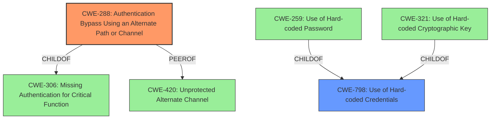

# Analysis Report for CVE-2021-21952

# Vulnerability Analysis Report: CVE-2021-21952

## Description


## Analysis (with Relationship Data)

# Summary
| CWE ID | CWE Name | Confidence | CWE Abstraction Level | CWE Vulnerability Mapping Label | CWE-Vulnerability Mapping Notes |
|---|---|---|---|---|---|
| CWE-288 | Authentication Bypass Using an Alternate Path or Channel | 0.9 | Base | Allowed | Primary CWE |
| CWE-798 | Use of Hard-coded Credentials | 0.7 | Base | Allowed | Secondary Candidate |

## Evidence and Confidence

*   **Confidence Score:** 0.8
*   **Evidence Strength:** HIGH

## Relationship Analysis
The primary CWE selected is CWE-288, Authentication Bypass Using an Alternate Path or Channel. This CWE is a base-level weakness, providing a good balance between specificity and generality. It is related to CWE-306, Missing Authentication for Critical Function, as a child. CWE-420, Unprotected Alternate Channel, is a peer, representing a closely related concept.

The secondary CWE selected is CWE-798, Use of Hard-coded Credentials, which contributes to the authentication bypass. CWE-798 has variants such as CWE-259, Use of Hard-coded Password, and CWE-321, Use of Hard-coded Cryptographic Key, showing a hierarchy.



## Vulnerability Chain
The vulnerability chain starts with the **use of a hardcoded key** (CWE-798). This **hardcoded key** enables an **authentication bypass** (CWE-288), leading to increased privileges.

## Summary of Analysis
Initially, the analysis focused on the **authentication bypass** as the primary weakness, supported by the description and key phrases. The Talos report summary confirmed the **lack of authentication** for the `CMD_DEVICE_GET_RSA_KEY_REQUEST` command, enabling the bypass. Further analysis of the report summary highlighted that the **use of a hardcoded key** is a critical contributing factor to the bypass. The **hardcoded key** allows attackers to decrypt the RSA public key and gain unauthorized access. Therefore, CWE-288 is selected as the primary weakness due to the **authentication bypass**, and CWE-798 is selected as a secondary weakness because the **hardcoded key** is the root cause that allows the bypass.

The selection of CWE-288 and CWE-798 is based on the evidence provided in the vulnerability description, the key phrases, and the CVE reference links content summary. The relationships between these CWEs help to clarify the nature of the vulnerability, with the **hardcoded key** facilitating the **authentication bypass**. The abstraction levels of the selected CWEs are appropriate, with CWE-288 and CWE-798 being base-level weaknesses, providing a good balance between specificity and generality.

CWE-300 (Channel Accessible by Non-Endpoint) was considered but not selected because the vulnerability doesn't primarily involve an adversary-in-the-middle attack, although the **authentication bypass** could potentially facilitate such attacks. CWE-306 (Missing Authentication for Critical Function) was also considered but deemed less appropriate than CWE-288, as the vulnerability involves an alternate path (the `CMD_DEVICE_GET_RSA_KEY_REQUEST` command) that bypasses authentication, rather than a complete absence of authentication. CWE-331 (Insufficient Entropy) was considered but not selected as the root cause is the **use of a hardcoded key** rather than insufficient randomness in key generation.

Relevant CWE Information:

# Enhanced Context (25 CWEs)
The following CWEs were identified as potentially relevant to this vulnerability:

## CWE-288: Authentication Bypass Using an Alternate Path or Channel
**Abstraction Level**: Base
**Similarity Score**: 3.64
**Source**: graph

**Description**:
CWE-288: Authentication Bypass Using an Alternate Path or Channel

**Mapping Guidance**:
- Usage: Allowed
- Rationale: This CWE entry is at the Base level of abstraction, which is a preferred level of abstraction for mapping to the root causes of vulnerabilities.

**Relationships**:
- PARENTOF -> CWE-425
- PARENTOF -> CWE-1299
- PEEROF -> CWE-420
- CHILDOF -> CWE-284
- CHILDOF -> CWE-306

## CWE-798: Use of Hard-coded Credentials
**Abstraction Level**: Base
**Similarity Score**: 5431.29
**Source**: sparse

**Description**:
The product contains hard-coded credentials, such as a password or cryptographic key.

**Mapping Guidance**:
- Usage: Allowed
- Rationale: This CWE entry is at the Base level of abstraction, which is a preferred level of abstraction for mapping to the root causes of vulnerabilities.


## CWE Relationship Analysis

Current CWEs represent these abstraction levels: .


### Vulnerability Chain Analysis

**Chain starting from CWE-288:**
- 288 (Authentication Bypass Using an Alternate Path or Channel) - ROOT


**Chain starting from CWE-420:**
- 420 (Unprotected Alternate Channel) - ROOT


### CWE Relationship Diagram

```mermaid
graph TD
    classDef primary fill:#f96,stroke:#333,stroke-width:2px
    classDef secondary fill:#69f,stroke:#333
    classDef tertiary fill:#9e9,stroke:#333
```


*Report generated on 2025-04-02 07:36:07*
