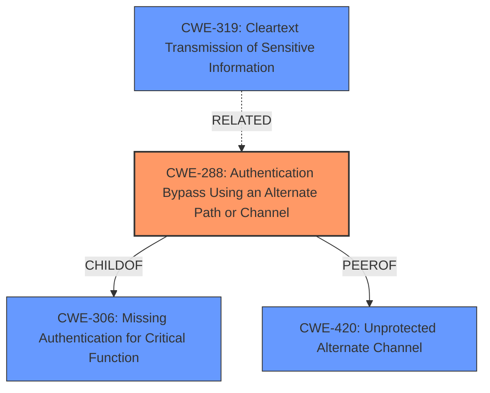

# Analysis for CVE-2021-21953

# Summary
| CWE ID | CWE Name | Confidence | CWE Abstraction Level | CWE Vulnerability Mapping Label | CWE-Vulnerability Mapping Notes |
|---|---|---|---|---|---|
| CWE-288 | Authentication Bypass Using an Alternate Path or Channel | 0.9 | Base | Allowed | Primary CWE |
| CWE-319 | Cleartext Transmission of Sensitive Information | 0.7 | Base | Allowed | Secondary CWE |

## Evidence and Confidence

*   **Confidence Score:** 0.8
*   **Evidence Strength:** HIGH

## Relationship Analysis
The primary CWE is CWE-288, which is a base-level CWE. It is related to CWE-306 (Missing Authentication for Critical Function) as a parent, indicating a more general form of the authentication bypass. It is also related to CWE-420 (Unprotected Alternate Channel) as a peer, suggesting a possible alternate route that is unprotected. CWE-319 represents the cleartext transmission of sensitive data, exacerbating the bypass by making manipulation easier.

## Vulnerability Chain
The vulnerability chain starts with the **cleartext transmission** of some data (CWE-319). This leads to an **authentication bypass** (CWE-288) due to the ability to modify the cleartext fields, which then results in increased privileges.

## Summary of Analysis
The initial assessment identified an **authentication bypass** vulnerability in the `process_msg()` function of the `home_security` binary of Anker Eufy Homebase 2. The root cause is the **weak authentication** mechanism used over UDP, where only the `Hub_SN` is encrypted, while other fields are transmitted in cleartext.

The selected CWEs are at the optimal level of specificity. CWE-288 accurately represents the **authentication bypass** using an alternate path, while CWE-319 describes the **cleartext transmission** that facilitates the bypass. The evidence from the CVE Reference Links Content Summary strongly supports this classification.

> "The vulnerability stems from the fact that the Eufy Homebase 2's `home_security` binary uses a **weak authentication** mechanism over UDP. Specifically, the only encrypted part of the packets exchanged is the `Hub_SN` (Hub Serial Number), while the `Msgbody`, `opcode`, `Bodylen`, and CRC are transmitted in **cleartext**. This allows an attacker to intercept and modify these fields, thereby bypassing authentication."

The retriever results also pointed towards authentication bypass CWEs, which supports the final decision.

Relevant CWE Information:

# Enhanced Context (25 CWEs)

## CWE-74: Improper Neutralization of Special Elements in Output Used by a Downstream Component ('Injection')
**Abstraction Level**: Class
**Similarity Score**: 0.78
**Source**: dense

**Description**:
The product constructs all or part of a command, data structure, or record using externally-influenced input from an upstream component, but it does not neutralize or incorrectly neutralizes special elements that could modify how it is parsed or interpreted when it is sent to a downstream component.

**Mapping Guidance**:
- Usage: Discouraged
- Rationale: CWE-74 is high-level and often misused when lower-level weaknesses are more appropriate.

*This CWE was considered but not selected because the vulnerability is specifically an authentication bypass, not a general injection vulnerability.*

## CWE-1391: Use of Weak Credentials
**Abstraction Level**: Class
**Similarity Score**: 0.77
**Source**: dense

**Description**:
The product uses weak credentials (such as a default key or hard-coded password) that can be calculated, derived, reused, or guessed by an attacker.

**Mapping Guidance**:
- Usage: Allowed-with-Review
- Rationale: This CWE entry is a Class and might have Base-level children that would be more appropriate

*This CWE was considered but not selected because the vulnerability is due to manipulation of data in transit, not inherently weak credentials.*

## CWE-319: Cleartext Transmission of Sensitive Information
**Abstraction Level**: Base
**Similarity Score**: 0.77
**Source**: dense

**Description**:
The product transmits sensitive or security-critical data in cleartext in a communication channel that can be sniffed by unauthorized actors.

**Mapping Guidance**:
- Usage: Allowed
- Rationale: This CWE entry is at the Base level of abstraction, which is a preferred level of abstraction for mapping to the root causes of vulnerabilities.

*This CWE was selected as a secondary CWE because the cleartext transmission enables the authentication bypass.*

## CWE-345: Insufficient Verification of Data Authenticity
**Abstraction Level**: Class
**Similarity Score**: 0.77
**Source**: dense

**Description**:
The product does not sufficiently verify the origin or authenticity of data, in a way that causes it to accept invalid data.

**Mapping Guidance**:
- Usage: Discouraged
- Rationale: This CWE entry is a level-1 Class (i.e., a child of a Pillar). It might have lower-level children that would be more appropriate

*This CWE was considered but not selected because the primary issue is the bypass itself, not just the lack of data authenticity verification.*

## CWE-294: Authentication Bypass by Capture-replay
**Abstraction Level**: Base
**Similarity Score**: 0.76
**Source**: dense

**Description**:
A capture-replay flaw exists when the design of the product makes it possible for a malicious user to sniff network traffic and bypass authentication by replaying it to the server in question to the same effect as the original message (or with minor changes).

**Mapping Guidance**:
- Usage: Allowed
- Rationale: This CWE entry is at the Base level of abstraction, which is a preferred level of abstraction for mapping to the root causes of vulnerabilities.

*This CWE was considered but not selected because the vulnerability is not strictly a replay attack. The attacker can modify the packets, not just replay them.*

## CWE-807: Reliance on Untrusted Inputs in a Security Decision
**Abstraction Level**: Base
**Similarity Score**: 0.76
**Source**: dense

**Description**:
The product uses a protection mechanism that relies on the existence or values of an input, but the input can be modified by an untrusted actor in a way that bypasses the protection mechanism.

**Mapping Guidance**:
- Usage: Allowed
- Rationale: This CWE entry is at the Base level of abstraction, which is a preferred level of abstraction for mapping to the root causes of vulnerabilities.

*This CWE was considered but not selected because it's more general than the specific authentication bypass.*

## CWE-303: Incorrect Implementation of Authentication Algorithm
**Abstraction Level**: Base
**Similarity Score**: 0.76
**Source**: dense

**Description**:
The requirements for the product dictate the use of an established authentication algorithm, but the implementation of the algorithm is incorrect.

**Mapping Guidance**:
- Usage: Allowed
- Rationale: This CWE entry is at the Base level of abstraction, which is a preferred level of abstraction for mapping to the root causes of vulnerabilities.

*This CWE was considered but not selected because it appears a custom protocol is used, not a standard algorithm implemented incorrectly.*

## CWE-1289: Improper Validation of Unsafe Equivalence in Input
**Abstraction Level**: Base
**Similarity Score**: 0.76
**Source**: dense

**Description**:
The product receives an input value that is used as a resource identifier or other type of reference, but it does not validate or incorrectly validates that the input is equivalent to a potentially-unsafe value.

**Mapping Guidance**:
- Usage: Allowed
- Rationale: This CWE entry is at the Base level of abstraction, which is a preferred level of abstraction for mapping to the root causes of vulnerabilities.

*This CWE was considered but not selected because the issue is not specifically about validating equivalence of input, but bypassing authentication by manipulating cleartext fields.*

## CWE-330: Use of Insufficiently Random Values
**Abstraction Level**: Class
**Similarity Score**: 0.76
**Source**: dense

**Description**:
The product uses insufficiently random numbers or values in a security context that depends on unpredictable numbers.

**Mapping Guidance**:
- Usage: Discouraged
- Rationale: This CWE entry is a level-1 Class (i.e., a child of a Pillar). It might have lower-level children that would be more appropriate

*This CWE was considered but not selected because randomness is not explicitly