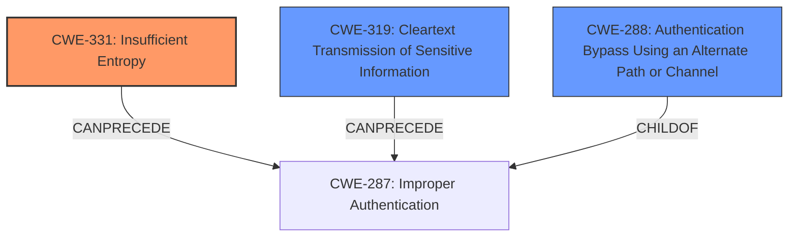

# Raw Analyzer Response for CVE-2021-21955

# Summary
| CWE ID | CWE Name | Confidence | CWE Abstraction Level | CWE Vulnerability Mapping Label | CWE-Vulnerability Mapping Notes |
|---|---|---|---|---|---|
| CWE-331 | Insufficient Entropy | 0.9 | Base | Primary | Allowed |
| CWE-319 | Cleartext Transmission of Sensitive Information | 0.8 | Base | Secondary | Allowed |
| CWE-288 | Authentication Bypass Using an Alternate Path or Channel | 0.6 | Base | Secondary | Allowed |

## Evidence and Confidence

*   **Confidence Score:** 0.8
*   **Evidence Strength:** HIGH

## Relationship Analysis
The primary relationship that influenced the decision was the chain involving **insufficient entropy** leading to a weaker key. This enabled the **authentication bypass** due to the predictability of the key and ultimately allowed for the **recovery of the password**. Additionally, the cleartext transmission of the serial number facilitated the exploit.
The selection of CWE-331 as the primary weakness stems from its direct relation to the root cause, which is the reduction of entropy in the AES key generation process. CWE-319 is included as a secondary weakness because the transmission of the device's serial number in cleartext enabled the exploitation of the primary weakness. CWE-288 is included as a secondary weakness because the attacker was able to bypass the authentication mechanism by sniffing network traffic.

## Vulnerability Chain
The vulnerability chain starts with **CWE-331 (Insufficient Entropy)**, which leads to a weakened encryption key. The cleartext transmission of the serial number, represented by **CWE-319 (Cleartext Transmission of Sensitive Information)**, provides necessary information to exploit the **weak** key. This, in turn, leads to **CWE-288 (Authentication Bypass Using an Alternate Path or Channel)**, allowing an attacker to recover the password.
- Root Cause: **CWE-331 (Insufficient Entropy)**
- Contributing Factor: **CWE-319 (Cleartext Transmission of Sensitive Information)**
- Exploitation: **CWE-288 (Authentication Bypass Using an Alternate Path or Channel)**
- Impact: Password Recovery

## Summary of Analysis
The analysis is based on the detailed vulnerability description and CVE reference links content summary.
The evidence strongly suggests that the root cause is the **insufficient entropy** in the key generation process, which is compounded by the cleartext transmission of the serial number. This leads to an **authentication bypass** and the ability to recover the password.

The graph relationships influenced the selection by highlighting the chain of events, starting from the root cause (**insufficient entropy**) and leading to the final impact (**authentication bypass** and password recovery). The selection of CWE-331 is further supported by the CVE reference links content summary, which explicitly mentions the reduction of entropy in the AES key.

The selected CWEs are at the optimal level of specificity because they accurately represent the technical details of the vulnerability. CWE-331 directly addresses the **root cause** of the **weakened key**, while CWE-319 captures the contributing factor of the cleartext transmission of the serial number. CWE-288 is relevant because it describes the end result of the attack sequence.

Relevant CWE Information:

# Enhanced Context (25 CWEs)
The following CWEs were identified as potentially relevant to this vulnerability:

## CWE-291: Reliance on IP Address for Authentication
**Abstraction Level**: Variant
**Similarity Score**: 0.78
**Source**: dense

**Description**:
The product uses an IP address for authentication.

**Mapping Guidance**:
- Usage: Allowed
- Rationale: This CWE entry is at the Variant level of abstraction, which is a preferred level of abstraction for mapping to the root causes of vulnerabilities.

## CWE-807: Reliance on Untrusted Inputs in a Security Decision
**Abstraction Level**: Base
**Similarity Score**: 0.77
**Source**: dense

**Description**:
The product uses a protection mechanism that relies on the existence or values of an input, but the input can be modified by an untrusted actor in a way that bypasses the protection mechanism.

**Mapping Guidance**:
- Usage: Allowed
- Rationale: This CWE entry is at the Base level of abstraction, which is a preferred level of abstraction for mapping to the root causes of vulnerabilities.

## CWE-1391: Use of Weak Credentials
**Abstraction Level**: Class
**Similarity Score**: 0.76
**Source**: dense

**Description**:
The product uses weak credentials (such as a default key or hard-coded password) that can be calculated, derived, reused, or guessed by an attacker.

**Mapping Guidance**:
- Usage: Allowed-with-Review
- Rationale: This CWE entry is a Class and might have Base-level children that would be more appropriate

## CWE-1299: Missing Protection Mechanism for Alternate Hardware Interface
**Abstraction Level**: Base
**Similarity Score**: 0.76
**Source**: dense

**Description**:
The lack of protections on alternate paths to access control-protected assets (such as unprotected shadow registers and other external facing unguarded interfaces) allows an attacker to bypass existing protections to the asset that are only performed against the primary path.

**Mapping Guidance**:
- Usage: Allowed
- Rationale: This CWE entry is at the Base level of abstraction, which is a preferred level of abstraction for mapping to the root causes of vulnerabilities.

## CWE-302: Authentication Bypass by Assumed-Immutable Data
**Abstraction Level**: Base
**Similarity Score**: 0.76
**Source**: dense

**Description**:
The authentication scheme or implementation uses key data elements that are assumed to be immutable, but can be controlled or modified by the attacker.

**Mapping Guidance**:
- Usage: Allowed
- Rationale: This CWE entry is at the Base level of abstraction, which is a preferred level of abstraction for mapping to the root causes of vulnerabilities.

## CWE-798: Use of Hard-coded Credentials
**Abstraction Level**: Base
**Similarity Score**: 0.76
**Source**: dense

**Description**:
The product contains hard-coded credentials, such as a password or cryptographic key.

**Mapping Guidance**:
- Usage: Allowed
- Rationale: This CWE entry is at the Base level of abstraction, which is a preferred level of abstraction for mapping to the root causes of vulnerabilities.

## CWE-303: Incorrect Implementation of Authentication Algorithm
**Abstraction Level**: Base
**Similarity Score**: 0.76
**Source**: dense

**Description**:
The requirements for the product dictate the use of an established authentication algorithm, but the implementation of the algorithm is incorrect.

**Mapping Guidance**:
- Usage: Allowed
- Rationale: This CWE entry is at the Base level of abstraction, which is a preferred level of abstraction for mapping to the root causes of vulnerabilities.

## CWE-288: Authentication Bypass Using an Alternate Path or Channel
**Abstraction Level**: Base
**Similarity Score**: 0.76
**Source**: dense

**Description**:
The product requires authentication, but the product has an alternate path or channel that does not require authentication.

**Mapping Guidance**:
- Usage: Allowed
- Rationale: This CWE entry is at the Base level of abstraction, which is a preferred level of abstraction for mapping to the root causes of vulnerabilities.

## CWE-345: Insufficient Verification of Data Authenticity
**Abstraction Level**: Class
**Similarity Score**: 0.76
**Source**: dense

**Description**:
The product does not sufficiently verify the origin or authenticity of data, in a way that causes it to accept invalid data.

**Mapping Guidance**:
- Usage: Discouraged
- Rationale: This CWE entry is a level-1 Class (i.e., a child of a Pillar). It might have lower-level children that would be more appropriate

## CWE-300: Channel Accessible by Non-Endpoint
**Abstraction Level**: Class
**Similarity Score**: 0.75
**Source**: dense

**Description**:
The product does not adequately verify the identity of actors at both ends of a communication channel, or does not adequately ensure the integrity of the channel, in a way that allows the channel to be accessed or influenced by an actor that is not an endpoint.

**Mapping Guidance**:
- Usage: Discouraged
- Rationale: CWE-300 is commonly misused for vulnerabilities in which the prerequisites for exploitation require the adversary to be in a privileged "in-the-middle" position.