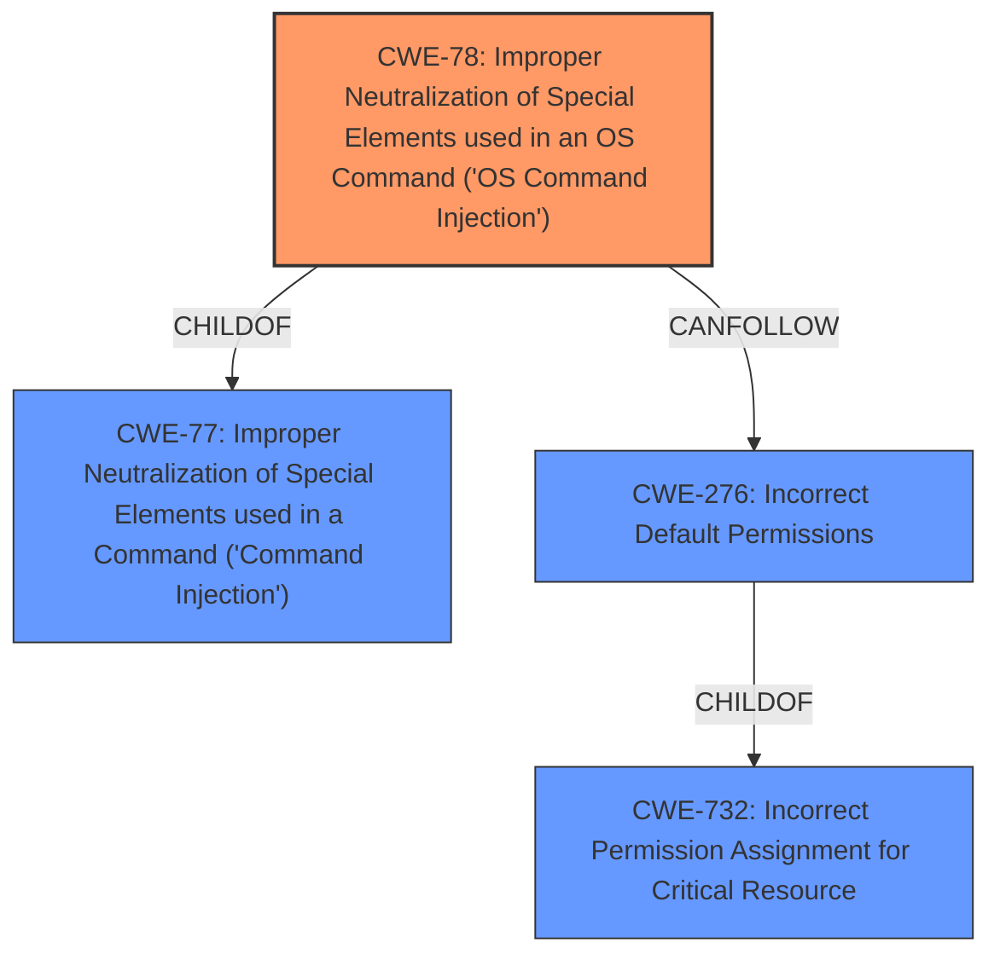

# Analysis Report for CVE-2021-21957

# Vulnerability Analysis Report: CVE-2021-21957

## Description


## Analysis (with Relationship Data)

# Summary
| CWE ID | CWE Name | Confidence | CWE Abstraction Level | CWE Vulnerability Mapping Label | CWE-Vulnerability Mapping Notes |
|---|---|---|---|---|---|
| CWE-78 | Improper Neutralization of Special Elements used in an OS Command ('OS Command Injection') | 1.0 | Base | Allowed | Primary CWE |
| CWE-276 | Incorrect Default Permissions | 0.8 | Base | Allowed | Secondary CWE |

## Evidence and Confidence

*   **Confidence Score:** 0.9
*   **Evidence Strength:** HIGH

## Relationship Analysis
The primary CWE is CWE-78, which is a base level CWE and a child of the class CWE-77. CWE-78 describes the specific case of OS command injection. CWE-276 is also a base level CWE and a child of CWE-732. These two CWEs are related in that the **incorrect permissions** on the executables allow an attacker to replace the executable with a **malicious one**, which achieves **command injection** and leads to **privilege escalation**.



## Vulnerability Chain
The vulnerability chain starts with **incorrect default permissions** (CWE-276) on the executables, allowing an attacker to replace them. This leads to **OS command injection** (CWE-78) when the application executes the attacker's **malicious executable**. The service account has `SeImpersonatePrivilege`, leading to **privilege escalation** to NT SYSTEM.

## Summary of Analysis
The vulnerability is a **command injection** vulnerability in Dream Report ODS Remote Connector. The root cause is **incorrect default permissions** on the `Rtm.exe` and `Rdxa.exe` executables and DLL libraries. This allows any user on the system to replace these files with **malicious** ones, leading to **command injection** and ultimately **privilege escalation**.

The primary weakness is CWE-78, Improper Neutralization of Special Elements used in an OS Command ('OS Command Injection'). This is because the attacker is able to execute arbitrary OS commands by replacing the original executables with their own. The vulnerability description explicitly mentions "**command injection**," and the CVE Reference Links Content Summary confirms that an attacker can replace executables with **malicious files**.

The secondary weakness is CWE-276, Incorrect Default Permissions. This is because the **incorrect permissions** on the executables allow the attacker to replace them in the first place. The CVE Reference Links Content Summary explicitly states "**incorrect default file permissions on executables** (`Rtm.exe`, `Rdxa.exe`) and DLL libraries in the installation folder allows any user to modify them."

The retriever results also support this analysis. CWE-78 is the second highest ranked CWE, and CWE-276 is the third highest ranked CWE.

Based on the evidence and the retriever results, I am confident that CWE-78 and CWE-276 are the most appropriate CWEs for this vulnerability.

Relevant CWE Information:

# Enhanced Context (25 CWEs)
The following CWEs were identified as potentially relevant to this vulnerability:

## CWE-1289: Improper Validation of Unsafe Equivalence in Input
**Abstraction Level**: Base
**Similarity Score**: 0.79
**Source**: dense
**Description**:
The product receives an input value that is used as a resource identifier or other type of reference, but it does not validate or incorrectly validates that the input is equivalent to a potentially-unsafe value.
**Mapping Guidance**:
- Usage: Allowed
- Rationale: This CWE entry is at the Base level of abstraction, which is a preferred level of abstraction for mapping to the root causes of vulnerabilities.

*Not Selected*: There is no evidence to support this CWE.

## CWE-1288: Improper Validation of Consistency within Input
**Abstraction Level**: Base
**Similarity Score**: 0.75
**Source**: dense
**Description**:
The product receives a complex input with multiple elements or fields that must be consistent with each other, but it does not validate or incorrectly validates that the input is actually consistent.
**Mapping Guidance**:
- Usage: Allowed
- Rationale: This CWE entry is at the Base level of abstraction, which is a preferred level of abstraction for mapping to the root causes of vulnerabilities.

*Not Selected*: There is no evidence to support this CWE.

## CWE-807: Reliance on Untrusted Inputs in a Security Decision
**Abstraction Level**: Base
**Similarity Score**: 0.75
**Source**: dense
**Description**:
The product uses a protection mechanism that relies on the existence or values of an input, but the input can be modified by an untrusted actor in a way that bypasses the protection mechanism.
**Mapping Guidance**:
- Usage: Allowed
- Rationale: This CWE entry is at the Base level of abstraction, which is a preferred level of abstraction for mapping to the root causes of vulnerabilities.

*Not Selected*: There is no clear evidence to support this CWE. The vulnerability stems from **incorrect permissions** and not from reliance on untrusted inputs in a security decision.

## CWE-138: Improper Neutralization of Special Elements
**Abstraction Level**: Class
**Similarity Score**: 0.75
**Source**: dense
**Description**:
The product receives input from an upstream component, but it does not neutralize or incorrectly neutralizes special elements that could be interpreted as control elements or syntactic markers when they are sent to a downstream component.
**Mapping Guidance**:
- Usage: Discouraged
- Rationale: This CWE entry is a level-1 Class (i.e., a child of a Pillar). It might have lower-level children that would be more appropriate

*Not Selected*: The primary weakness involves OS command injection, which is more specifically covered by CWE-78.

## CWE-184: Incomplete List of Disallowed Inputs
**Abstraction Level**: Base
**Similarity Score**: 0.75
**Source**: dense
**Description**:
The product implements a protection mechanism that relies on a list of inputs (or properties of inputs) that are not allowed by policy or otherwise require other action to neutralize before additional processing takes place, but the list is incomplete.
**Mapping Guidance**:
- Usage: Allowed
- Rationale: This CWE entry is at the Base level of abstraction, which is a preferred level of abstraction for mapping to the root causes of vulnerabilities.

*Not Selected*: The vulnerability does not involve an incomplete list of disallowed inputs. The root cause is **incorrect permissions** and **command injection**.

## CWE-74: Improper Neutralization of Special Elements in Output Used by a Downstream Component ('Injection')
**Abstraction Level**: Class
**Similarity Score**: 0.74
**Source**: dense
**Description**:
The product constructs all or part of a command, data structure, or record using externally-influenced input from an upstream component, but it does not neutralize or incorrectly neutralizes special elements that could modify how it is parsed or interpreted when it is sent to a downstream component.
**Mapping Guidance**:
- Usage: Discouraged
- Rationale: CWE-74 is high-level and often misused when lower-level weaknesses are more appropriate.

*Not Selected*: The primary weakness involves OS command injection, which is more specifically covered by CWE-78.

## CWE-183: Permissive List of Allowed Inputs
**Abstraction Level**: Base
**Similarity Score**: 0.74
**Source**: dense
**Description**:
The product implements a protection mechanism that relies on a list of inputs (or properties of inputs) that are explicitly allowed by policy because the inputs are assumed to be safe, but the list is too permissive - that is, it allows an input that is unsafe, leading to resultant weaknesses.
**Mapping Guidance**:
- Usage: Allowed
- Rationale: This CWE entry is at the Base level of abstraction, which is a preferred level of abstraction for mapping to the root causes of vulnerabilities.

*Not Selected*: The vulnerability does not involve a permissive list of allowed inputs. The root cause is **incorrect permissions** and **command injection**.

## CWE-179: Incorrect Behavior Order: Early Validation
**Abstraction Level**: Base
**Similarity Score**: 0.74
**Source**: dense
**Description**:
The product validates input before applying protection mechanisms that modify the input, which could allow an attacker to bypass the validation via dangerous inputs that only arise after the modification.
**Mapping Guidance**:
- Usage: Allowed
- Rationale: This CWE entry is


## CWE Relationship Analysis

Current CWEs represent these abstraction levels: .


### Vulnerability Chain Analysis

**Chain starting from CWE-732:**
- 732 (Incorrect Permission Assignment for Critical Resource) - ROOT


**Chain starting from CWE-78:**
- 78 (Improper Neutralization of Special Elements used in an OS Command ('OS Command Injection')) - ROOT


### CWE Relationship Diagram

```mermaid
graph TD
    classDef primary fill:#f96,stroke:#333,stroke-width:2px
    classDef secondary fill:#69f,stroke:#333
    classDef tertiary fill:#9e9,stroke:#333
```


*Report generated on 2025-04-01 20:28:06*
