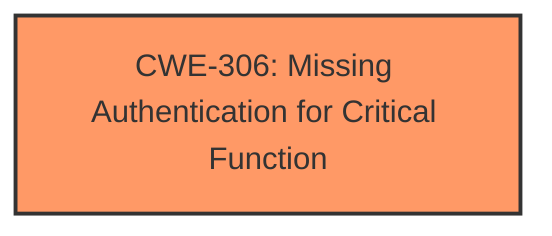

# Raw Analyzer Response for CVE-2021-21965

# Summary
| CWE ID | CWE Name | Confidence | CWE Abstraction Level | CWE Vulnerability Mapping Label | CWE-Vulnerability Mapping Notes |
|---|---|---|---|---|---|
| CWE-306 | Missing Authentication for Critical Function | 1.0 | Base | Primary | Allowed |

## Evidence and Confidence

*   **Confidence Score:** 1.0
*   **Evidence Strength:** HIGH

## Relationship Analysis
The primary CWE is CWE-306, which stands alone in this instance as the **root cause**. There are no parent, child, or peer relationships that significantly impact the classification in this case. The abstraction level is Base, which is appropriate as it directly represents the **missing authentication** issue.

## Vulnerability Chain
The vulnerability chain consists of a single point: the **missing authentication** for a critical function.
  - The root cause is the **lack of authentication**.
  - The impact is denial of service via unauthorized reboot.
There are no missing links, as the description clearly outlines the direct consequence of the missing authentication.

## Summary of Analysis
The initial analysis identified CWE-306 as the most appropriate classification due to the **root cause** being the **missing authentication** for a critical function. This assessment is based on strong evidence from the "CVE Reference Links Content Summary," which states: "The SeaMAX Ethernet API does not require authentication, allowing any attacker with network access to send commands." The API's `HandleWriteSetupRecord3` function can be triggered to reboot the device if the first byte of the request is set to zero.

The graph relationships do not significantly influence the selection as CWE-306 stands as a clear, direct cause. The selected CWE is at the optimal level of specificity, as it directly addresses the **root cause** without being overly generic or needing further refinement. The vulnerability description and the behavior matches the CWE description.

Relevant CWE Information:

# Enhanced Context (25 CWEs)

## CWE-696: Incorrect Behavior Order
**Abstraction Level**: Class
**Similarity Score**: 0.105
This CWE was not selected because the vulnerability is not related to the order in which actions are performed, but rather the complete **lack of authentication**.

## CWE-134: Use of Externally-Controlled Format String
**Abstraction Level**: Base
**Similarity Score**: 0.100
This CWE was not selected because the vulnerability does not involve format strings.

## CWE-170: Improper Null Termination
**Abstraction Level**: Base
**Similarity Score**: 0.097
This CWE was not selected because the vulnerability does not relate to null termination issues.

## CWE-1284: Improper Validation of Specified Quantity in Input
**Abstraction Level**: Base
**Similarity Score**: 0.090
This CWE was not selected because the vulnerability does not involve validating input quantities; it's about the **lack of authentication**.

## CWE-306: Missing Authentication for Critical Function
**Abstraction Level**: Base
**Similarity Score**: 0.090
This CWE was selected as the primary match. The vulnerability lies in the **lack of authentication** for the SeaMAX Ethernet API, allowing unauthenticated reboot requests.

## CWE-294: Authentication Bypass by Capture-replay
**Abstraction Level**: Base
**Similarity Score**: 0.504
This CWE was not selected because it is about bypassing authentication via capture-replay attacks, which is not the case here. The authentication is simply missing.

## CWE-120: Buffer Copy without Checking Size of Input ('Classic Buffer Overflow')
**Abstraction Level**: Base
**Similarity Score**: 0.002
This CWE was not selected because it is about buffer overflows, which is not the nature of this vulnerability.

## CWE-1287: Improper Validation of Specified Type of Input
**Abstraction Level**: Base
**Similarity Score**: 0.088
This CWE was not selected because the vulnerability is not related to validating the type of input.

## CWE-319: Cleartext Transmission of Sensitive Information
**Abstraction Level**: Base
**Similarity Score**: 0.085
This CWE was not selected because the vulnerability doesn't involve the transmission of sensitive information in cleartext.

## CWE-125: Out-of-bounds Read
**Abstraction Level**: Base
**Similarity Score**: 0.085
This CWE was not selected because it is about out-of-bounds reads, which is not relevant to this vulnerability.