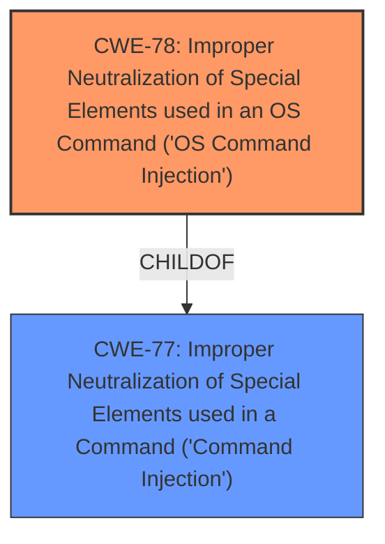

# Analysis Report for CVE-2021-21976

# Vulnerability Analysis Report: CVE-2021-21976

## Description


## Analysis (with Relationship Data)

# Summary
| CWE ID | CWE Name | Confidence | CWE Abstraction Level | CWE Vulnerability Mapping Label | CWE-Vulnerability Mapping Notes |
|---|---|---|---|---|---|
| CWE-78 | Improper Neutralization of Special Elements used in an OS Command ('OS Command Injection') | 1.0 | Base | Allowed | Primary CWE |
| CWE-77 | Improper Neutralization of Special Elements used in a Command ('Command Injection') | 0.7 | Class | Allowed-with-Review | Secondary Candidate |

## Evidence and Confidence

*   **Confidence Score:** 1.0
*   **Evidence Strength:** HIGH

## Relationship Analysis
The primary CWE is CWE-78, which is a Base level CWE and a child of the Class level CWE-77. The vulnerability description explicitly mentions "command injection", and the CVE reference links content summary confirms a "command injection vulnerability". CWE-78 is more specific, referring to OS commands, while CWE-77 is a more general class.



## Vulnerability Chain
The vulnerability chain involves a **command injection** vulnerability due to **improper neutralization** of special elements in the "Startup Configuration" page, leading to remote code execution. The chain can be summarized as: Improper Input Handling -> **Command Injection** -> Remote Code Execution.

## Summary of Analysis
The initial analysis strongly suggests a **command injection** vulnerability. The "Vulnerability Description Key Phrases" section explicitly mentions "**command injection**" as a **weakness**. The "CVE Reference Links Content Summary" section further confirms the presence of a "**command injection** vulnerability". The root cause is the **improper neutralization** of special elements, allowing an attacker to inject commands.

The "Retriever Results" list CWE-77 as the top candidate, but the description explicitly talks about "OS command", so CWE-78 is more appropriate.

Based on the provided evidence, the most appropriate CWE is CWE-78, which represents the **improper neutralization** of special elements used in an OS command. This is supported by the evidence and the relationship analysis.

Relevant CWE Information:

# Enhanced Context (25 CWEs)
The following CWEs were identified as potentially relevant to this vulnerability:

## CWE-74: Improper Neutralization of Special Elements in Output Used by a Downstream Component ('Injection')
**Abstraction Level**: Class
**Similarity Score**: 0.79
**Source**: dense

**Description**:
The product constructs all or part of a command, data structure, or record using externally-influenced input from an upstream component, but it does not neutralize or incorrectly neutralizes special elements that could modify how it is parsed or interpreted when it is sent to a downstream component.

**Mapping Guidance**:
- Usage: Discouraged
- Rationale: CWE-74 is high-level and often misused when lower-level weaknesses are more appropriate.

## CWE-77: Improper Neutralization of Special Elements used in a Command ('Command Injection')
**Abstraction:** Class
**Status:** Draft

### Description
The product constructs all or part of a command using externally-influenced input from an upstream component, but it does not neutralize or incorrectly neutralizes special elements that could modify the intended command when it is sent to a downstream component.

### Extended Description

Many protocols and products have their own custom command language. While OS or shell command strings are frequently discovered and targeted, developers may not realize that these other command languages might also be vulnerable to attacks.

### Alternative Terms
Command injection: an attack-oriented phrase for this weakness. Note: often used when "OS command injection" (CWE-78) was intended.

### Relationships
ChildOf -> CWE-74
ChildOf -> CWE-74

### Mapping Guidance
**Usage:** Allowed-with-Review
**Rationale:** CWE-77 is often misused when OS command injection (CWE-78) was intended instead [REF-1287].
**Comments:** Ensure that the analysis focuses on the root-cause error that allows the execution of commands, as there are many weaknesses that can lead to this consequence. See Terminology Notes. If the weakness involves a command language besides OS shell invocation, then CWE-77 could be used.
**Reasons:**
- Frequent Misuse
**Suggested Alternatives:**
- CWE-78: OS Command Injection

## CWE-78: Improper Neutralization of Special Elements used in an OS Command ('OS Command Injection')
**Abstraction:** Base
**Status:** Stable

### Description
The product constructs all or part of an OS command using externally-influenced input from an upstream component, but it does not neutralize or incorrectly neutralizes special elements that could modify the intended OS command when it is sent to a downstream component.

### Extended Description

This weakness can lead to a vulnerability in environments in which the attacker does not have direct access to the operating system, such as in web applications. Alternately, if the weakness occurs in a privileged program, it could allow the attacker to specify commands that normally would not be accessible, or to call alternate commands with privileges that the attacker does not have. The problem is exacerbated if the compromised process does not follow the principle of least privilege, because the attacker-controlled commands may run with special system privileges that increases the amount of damage.

### Alternative Terms
Shell injection
Shell metacharacters
OS Command Injection

### Relationships
ChildOf -> CWE-77
ChildOf -> CWE-74
ChildOf -> CWE-77
ChildOf -> CWE-77
CanAlsoBe -> CWE-88

### Mapping Guidance
**Usage:** Allowed
**Rationale:** This CWE entry is at the Base level of abstraction, which is a preferred level of abstraction for mapping to the root causes of vulnerabilities.
**Comments:** Carefully read both the name and description to ensure that this mapping is an appropriate fit. Do not try to 'force' a mapping to a lower-level Base/Variant simply to comply with this preferred level of abstraction.

### Additional Notes
**CWE-78: Improper Neutralization of Special Elements used in an OS Command ('OS Command Injection')**
*   **Technical Explanation:** The vulnerability allows an attacker to inject OS commands due to **improper neutralization** of special elements. This means that the application is not properly sanitizing or validating user-supplied input before using it in a system command.
*   **Security Implications:** This can lead to arbitrary code execution on the system, potentially allowing the attacker to gain full control.
*   **Relationship and Chain Patterns:** CWE-78 is a child of CWE-77 (Improper Neutralization of Special Elements used in a Command) and CWE-74 (Improper Neutralization of Special Elements in Output Used by a Downstream Component ('Injection')). The chain pattern involves **improper input handling** leading to **command injection** and then **remote code execution.**
*   **Primary/Secondary Weakness:** CWE-78 is the primary weakness.
*   **MITRE Mapping Guidance:** The usage is "Allowed", and the rationale states that it is a preferred level of abstraction for mapping to the root causes of vulnerabilities.

**CWE-77: Improper Neutralization of Special Elements used in a Command ('Command Injection')**
*   **Technical Explanation:** This is a more general form of command injection where the injected command is not necessarily an OS command. However, in this specific case, the context indicates that OS commands are being injected, making CWE-78 more appropriate.
*   **Security Implications:** Similar to CWE-78, but potentially broader if non-OS commands are involved.
*   **Relationship and Chain Patterns:** CWE-77 is a parent of CWE-78.
*   **Primary/Secondary Weakness:** Considered as a secondary candidate since the context is OS command.
*   **MITRE Mapping Guidance:** The usage is "Allowed-with-Review", with the rationale that it is often misused when OS command injection (CWE-78) was intended. The suggested alternative is CWE-78.

**CWEs Considered But Not Used:**
*   CWE-918 (Server-Side Request Forgery (SSRF)): Not applicable as the vulnerability is about command injection, not forging requests.
*   CWE-22 (Improper Limitation of a Pathname to a Restricted Directory ('Path Traversal')): Not applicable, as the vulnerability is not related to path traversal.
*   CWE-94 (Improper Control of Generation of Code ('Code Injection')): While remote code execution is the impact, the root cause is command injection, not direct code injection.
*   CWE-88 (Improper Neutralization of Argument Delimiters in a Command ('Argument Injection')): Not applicable because the provided information does not suggest the specific weakness involves the improper handling of command argument delimiters.
*   CWE-425 (Direct Request ('Forced Browsing')): Not applicable as it's about missing authorization checks on URLs.
*   CWE-1336


## CWE Relationship Analysis

Current CWEs represent these abstraction levels: .


### Vulnerability Chain Analysis

**Chain starting from CWE-1336:**
- 1336 (Improper Neutralization of Special Elements Used in a Template Engine) - ROOT


**Chain starting from CWE-88:**
- 88 (Improper Neutralization of Argument Delimiters in a Command ('Argument Injection')) - ROOT


### CWE Relationship Diagram

```mermaid
graph TD
    classDef primary fill:#f96,stroke:#333,stroke-width:2px
    classDef secondary fill:#69f,stroke:#333
    classDef tertiary fill:#9e9,stroke:#333
```


*Report generated on 2025-04-01 16:08:01*
