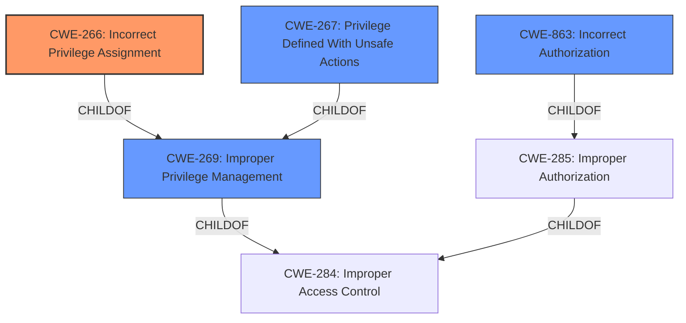

# Enhanced Analysis for CVE-2021-21981

# Summary
| CWE ID | CWE Name | Confidence | CWE Abstraction Level | CWE Vulnerability Mapping Label | CWE-Vulnerability Mapping Notes |
|---|---|---|---|---|---|
| CWE-266 | Incorrect Privilege Assignment | 0.9 | Base | Primary | Allowed |
| CWE-267 | Privilege Defined With Unsafe Actions | 0.7 | Base | Secondary | Allowed |
| CWE-269 | Improper Privilege Management | 0.5 | Class | Secondary | Discouraged |
| CWE-863 | Incorrect Authorization | 0.4 | Class | Secondary | Allowed-with-Review |

## Evidence and Confidence

*   **Confidence Score:** 0.9
*   **Evidence Strength:** HIGH

## Relationship Analysis
The primary CWE selected is CWE-266 (**Incorrect Privilege Assignment**), a Base-level CWE that accurately captures the root cause of the vulnerability which is an issue with RBAC role assignment. CWE-266 is a child of CWE-269 (**Improper Privilege Management**), a Class-level CWE, indicating that it's a more specific type of privilege management issue. The relationship confirms that the selection of CWE-266 is more precise.



## Vulnerability Chain
The vulnerability chain starts with an **issue with RBAC role assignment** (CWE-266), leading to **privilege escalation**, where attackers with local guest user accounts can **assign privileges higher than their own permission level**.
  - **Root Cause:** **Issue with RBAC role assignment** (CWE-266)
  - **Weakness:** Incorrect Privilege Assignment.
  - **Impact:** Privilege Escalation (attackers can assign privileges higher than their own).

## Summary of Analysis
The analysis is based on the provided evidence, specifically the "Vulnerability Description Key Phrases" and "CVE Reference Links Content Summary." The root cause is clearly stated as an **issue with RBAC role assignment**, making CWE-266 a strong candidate. The vulnerability allows attackers to **assign privileges higher than their own permission level**, further supporting the selection of CWE-266.

The graph relationships also influenced the final selection. CWE-266 is a child of CWE-269, indicating a more specific classification. The abstraction level of CWE-266 is Base, which is the preferred level.

The selected CWE, CWE-266, is at the optimal level of specificity because it directly addresses the root cause of the vulnerability.

**CWE Considerations:**

*   **CWE-266 (Incorrect Privilege Assignment):** This is the primary CWE because the vulnerability description explicitly states that there is an **issue with RBAC role assignment**, leading to privilege escalation. The CVE Reference Links Content Summary confirms that the root cause is related to how role assignment permissions are handled.
    *   Evidence: "Successful exploitation of this issue may allow attackers with local guest user account to assign privileges higher than their own permission level."
*   **CWE-267 (Privilege Defined With Unsafe Actions):** Considered as a secondary CWE because the vulnerability involves a local guest user assigning roles with privileges greater than their own, implying that the privileges themselves may be defined with unsafe actions.
*   **CWE-269 (Improper Privilege Management):** This is a broader, Class-level CWE. While relevant, CWE-266 provides a more specific classification of the **improper role assignment**. CWE-269 is discouraged for use.
*   **CWE-863 (Incorrect Authorization):** Considered since the **RBAC role assignment** is a form of authorization. However, the vulnerability isn't about a check being incorrectly performed, but about the roles being assigned incorrectly which makes this less applicable than CWE-266.
*   **CWE-285 (Improper Authorization):** While related to access control, it's a more general class. It was deemed less suitable than the more specific CWE-266. Usage is Discouraged.
*   **CWE-284 (Improper Access Control):** This is a Pillar-level CWE and too abstract. Usage is Discouraged.
*   **CWE-732 (Incorrect Permission Assignment for Critical Resource):** Not selected because the vulnerability doesn't focus on incorrect permission assignment to resources but rather on the assignment of privileges to users.
*   **CWE-862 (Missing Authorization):** Ruled out as the authorization process exists but has flaws.
*   **CWE-250 (Execution with Unnecessary Privileges):** Not applicable since the issue is not about executing with unnecessary privileges but about assigning privileges.
*   **CWE-386 (Symbolic Name not Mapping to Correct Object):** Not relevant to the vulnerability.
*   **CWE-274: Improper Handling of Insufficient Privileges, CWE-280: Improper Handling of Insufficient Permissions or Privileges, CWE-1220: Insufficient Granularity of Access Control, CWE-653: Improper Isolation or Compartmentalization, CWE-664: Improper Control of a Resource Through its Lifetime, CWE-668: Exposure of Resource to Wrong Sphere, CWE-639: Authorization Bypass Through User-Controlled Key, CWE-178: Improper Handling of Case Sensitivity, CWE-367: Time-of-check Time-of-use (TOCTOU) Race Condition, CWE-1289: Improper Validation of Unsafe Equivalence in Input, CWE-322: Key Exchange without Entity Authentication, CWE-289: Authentication Bypass by Alternate Name, CWE-73: External Control of File Name or Path, CWE-942: Permissive Cross-domain Policy with Untrusted Domains, CWE-252: Unchecked Return Value, CWE-486: Comparison of Classes by Name** These CWEs were not selected as they did not align closely with the root cause and weakness description of the vulnerability, which is primarily about incorrect privilege assignment.


## CWE Relationship Analysis

Current CWEs represent these abstraction levels: .


### Vulnerability Chain Analysis

**Chain starting from CWE-862:**
- 862 (Missing Authorization) - ROOT


**Chain starting from CWE-266:**
- 266 (Incorrect Privilege Assignment) - ROOT


### CWE Relationship Diagram

```mermaid
graph TD
    classDef primary fill:#f96,stroke:#333,stroke-width:2px
    classDef secondary fill:#69f,stroke:#333
    classDef tertiary fill:#9e9,stroke:#333
```