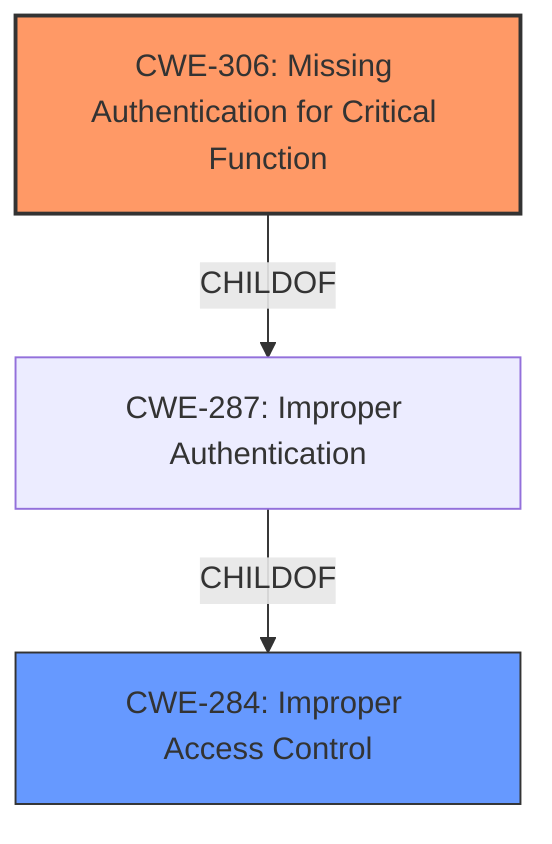

# Enhanced Analysis for CVE-2021-21984

# Summary
| CWE ID | CWE Name | Confidence | CWE Abstraction Level | CWE Vulnerability Mapping Label | CWE-Vulnerability Mapping Notes |
|---|---|---|---|---|---|
| CWE-306 | Missing Authentication for Critical Function | 0.9 | Base | Allowed | Primary CWE |
| CWE-284 | Improper Access Control | 0.5 | Pillar | Discouraged | Secondary Candidate |

## Evidence and Confidence

*   **Confidence Score:** 0.9
*   **Evidence Strength:** HIGH

## Relationship Analysis
The primary relationship that impacted my decision was the ChildOf relationship between CWE-306 and CWE-287, with CWE-306 being more specific. CWE-284 is a Pillar, which is too high-level. There are no chain relationships apparent from the description.



## Vulnerability Chain
The chain of root cause and weaknesses for the Vulnerability Description is:
1.  Root Cause: **Missing Authentication** (**CWE-306**)
2.  Impact: Remote Code Execution

## Summary of Analysis
My analysis is primarily based on the provided evidence, particularly the "CVE Reference Links Content Summary" and "Vulnerability Description Key Phrases". The vulnerability is due to an **unauthorized endpoint**, which directly points to the **lack of authentication** for a critical function. The **impact** is remote code execution.

The graph relationships influenced my selection by highlighting the hierarchical structure. CWE-306 is a child of CWE-287 (Improper Authentication), which in turn is related to CWE-284 (Improper Access Control). However, CWE-306 is the most specific and appropriate choice given the available information.

CWE-306 is selected because it directly addresses the **missing authentication** for a critical function (the **unauthorized endpoint**). This is the root cause of the vulnerability, leading to the impact of remote code execution. This selection is at the optimal level of specificity (Base) as it accurately reflects the weakness described in the vulnerability report.

Relevant CWE Information:

# Enhanced Context (25 CWEs)

## CWE-1236: Improper Neutralization of Formula Elements in a CSV File
**Abstraction Level**: Base
**Similarity Score**: 0.80
**Source**: dense

**Description**:
The product saves user-provided information into a Comma-Separated Value (CSV) file, but it does not neutralize or incorrectly neutralizes special elements that could be interpreted as a command when the file is opened by a spreadsheet product.

**Why it was not selected**: This CWE is not relevant to the vulnerability description, as it involves CSV files and formula injection, which are not mentioned in the description.

## CWE-74: Improper Neutralization of Special Elements in Output Used by a Downstream Component ('Injection')
**Abstraction Level**: Class
**Similarity Score**: 0.77
**Source**: dense

**Description**:
The product constructs all or part of a command, data structure, or record using externally-influenced input from an upstream component, but it does not neutralize or incorrectly neutralizes special elements that could modify how it is parsed or interpreted when it is sent to a downstream component.

**Why it was not selected**: While remote code execution could be a consequence of injection, the root cause isn't injection but **missing authentication**, making this CWE less appropriate.

## CWE-1289: Improper Validation of Unsafe Equivalence in Input
**Abstraction Level**: Base
**Similarity Score**: 0.76
**Source**: dense

**Description**:
The product receives an input value that is used as a resource identifier or other type of reference, but it does not validate or incorrectly validates that the input is equivalent to a potentially-unsafe value.

**Why it was not selected**: This CWE focuses on validating equivalence of inputs, which isn't the primary issue. The core of the vulnerability is the **lack of authentication**, not the validation of input values.

## CWE-807: Reliance on Untrusted Inputs in a Security Decision
**Abstraction Level**: Base
**Similarity Score**: 0.76
**Source**: dense

**Description**:
The product uses a protection mechanism that relies on the existence or values of an input, but the input can be modified by an untrusted actor in a way that bypasses the protection mechanism.

**Why it was not selected**: While related to security decisions, the fundamental problem is that there isn't a protection mechanism (authentication) in the first place.

## CWE-138: Improper Neutralization of Special Elements
**Abstraction Level**: Class
**Similarity Score**: 0.75
**Source**: dense

**Description**:
The product receives input from an upstream component, but it does not neutralize or incorrectly neutralizes special elements that could be interpreted as control elements or syntactic markers when they are sent to a downstream component.

**Why it was not selected**: Similar to CWE-74, this relates to neutralization, which is not the primary issue here.

## CWE-184: Incomplete List of Disallowed Inputs
**Abstraction Level**: Base
**Similarity Score**: 0.75
**Source**: dense

**Description**:
The product implements a protection mechanism that relies on a list of inputs (or properties of inputs) that are not allowed by policy or otherwise require other action to neutralize before additional processing takes place, but the list is incomplete.

**Why it was not selected**: The vulnerability is not about an incomplete list of disallowed inputs but about the complete **absence of authentication**.

## CWE-116: Improper Encoding or Escaping of Output
**Abstraction Level**: Class
**Similarity Score**: 0.74
**Source**: dense

**Description**:
The product prepares a structured message for communication with another component, but encoding or escaping of the data is either missing or done incorrectly. As a result, the intended structure of the message is not preserved.

**Why it was not selected**: Encoding/escaping is not the core issue; the **missing authentication** is.

## CWE-183: Permissive List of Allowed Inputs
**Abstraction Level**: Base
**Similarity Score**: 0.74
**Source**: dense

**Description**:
The product implements a protection mechanism that relies on a list of inputs (or properties of inputs) that are explicitly allowed by policy because the inputs are assumed to be safe, but the list is too permissive - that is, it allows an input that is unsafe, leading to resultant weaknesses.

**Why it was not selected**: This CWE is about an overly permissive list, whereas the vulnerability involves the **absence of authentication**.

## CWE-668: Exposure of Resource to Wrong Sphere
**Abstraction Level**: Class
**Similarity Score**: 0.74
**Source**: dense

**Description**:
The product exposes a resource to the wrong control sphere, providing unintended actors with inappropriate access to the resource.

**Why it was not selected**: Although technically the endpoint is exposed to the wrong sphere, this is a high-level consequence of the **missing authentication**.

## CWE-23: Relative Path Traversal
**Abstraction Level**: Base
**Similarity Score**: 0.74
**Source**: dense

**Description**:
The product uses external input to construct a pathname that should be within a restricted directory, but it does not properly neutralize sequences such as ".." that can resolve to a location that is outside of that directory.

**Why it was not selected**: Path traversal is not relevant to the vulnerability.

## CWE-22: Improper Limitation of a Pathname to a Restricted Directory ('Path Traversal')
**Abstraction Level**: Base
**Similarity Score**: 6577.97
**Source**: sparse

**Description**:
The product uses external input to construct a pathname that is intended to identify a file or directory that is located underneath a restricted parent directory, but the product does not properly neutralize special elements within the pathname that can cause the pathname to resolve to a location that is outside of the restricted directory.

**Why it was not selected**: Path traversal is not relevant to the vulnerability.

## CWE-863: Incorrect Authorization
**Abstraction Level**: Class
**Similarity Score**: 6550.83
**Source**: sparse

**Description**:
The product performs an authorization check when an actor attempts to access a resource or perform an action, but it does not correctly perform the check.

**Why it was not selected**: While authorization is related, the problem is the **lack of any authentication**, which precedes authorization.

## CWE-918: Server-Side Request Forgery (SSRF)
**Abstraction Level**: Base
**Similarity Score**: 6532.00
**Source**: sparse

**Description**:
The web server receives


## CWE Relationship Analysis

Current CWEs represent these abstraction levels: .


### Vulnerability Chain Analysis

**Chain starting from CWE-306:**
- 306 (Missing Authentication for Critical Function) - ROOT


**Chain starting from CWE-284:**
- 284 (Improper Access Control) - ROOT


### CWE Relationship Diagram

```mermaid
graph TD
    classDef primary fill:#f96,stroke:#333,stroke-width:2px
    classDef secondary fill:#69f,stroke:#333
    classDef tertiary fill:#9e9,stroke:#333
```