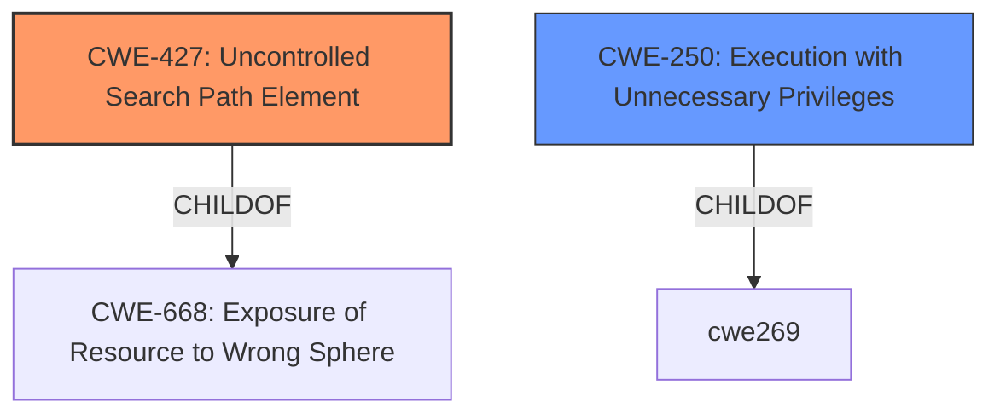

# Enhanced Analysis for CVE-2021-22000

# Summary
| CWE ID | CWE Name | Confidence | CWE Abstraction Level | CWE Vulnerability Mapping Label | CWE-Vulnerability Mapping Notes |
|---|---|---|---|---|---|
| CWE-427 | Uncontrolled Search Path Element | 0.9 | Base | Allowed | Primary CWE |
| CWE-250 | Execution with Unnecessary Privileges | 0.6 | Base | Allowed | Secondary CWE |

## Evidence and Confidence

*   **Confidence Score:** 0.8
*   **Evidence Strength:** HIGH

## Relationship Analysis
The primary CWE is CWE-427, which is a base-level CWE, and there are child-of relationships to CWE-668. CWE-427 is often related to DLL hijacking and **insecure loading of DLLs**, which directly aligns with the vulnerability description. CWE-250, Execution with Unnecessary Privileges, is a secondary consideration.



## Vulnerability Chain
The vulnerability chain starts with the **insecure loading of DLLs** due to the use of a relative path in the `LoadLibraryExW` function call (CWE-427). This leads to the attacker being able to place a malicious DLL in a predictable location. When the vulnerable application executes, it loads the attacker's DLL, leading to arbitrary code execution within the context of the vulnerable application and privilege escalation.

## Summary of Analysis
The analysis is based on the provided vulnerability description and CVE reference summary, which indicates that the root cause of the vulnerability is the **insecure loading of DLLs** due to the use of a relative path in the `LoadLibraryExW` function call (CWE-427). The attacker can place a malicious DLL in a predictable location, which leads to arbitrary code execution and privilege escalation.

The primary CWE selected is CWE-427, Uncontrolled Search Path Element, as it directly addresses the root cause of the vulnerability related to the **insecure DLL loading**. The evidence supporting this includes:

*   **Vulnerability Description Key Phrases:** "**insecure loading of DLLs**", "**DLL hijacking**"
*   **CVE Reference Links Content Summary:** "The vulnerability is due to the use of a relative path in the LoadLibraryExW function call within the VMware ThinApp software. This allows an attacker to place a malicious DLL in a predictable location, which will then be loaded by the application."

The relationship graph influenced the decision by visualizing the connection between CWE-427 and its potential parent CWEs, reinforcing the choice of CWE-427 as the most specific and relevant.

CWE-427 is selected because it is a base-level CWE that specifically describes the **insecure use of search paths** that an attacker can control. This aligns with the vulnerability where the attacker can place a malicious DLL in a location where it will be loaded by the vulnerable application.

Relevant CWE Information:

# Enhanced Context (25 CWEs)
The following CWEs were identified as potentially relevant to this vulnerability:

## CWE-1289: Improper Validation of Unsafe Equivalence in Input
**Abstraction Level**: Base
**Similarity Score**: 0.80
**Source**: dense

**Description**:
The product receives an input value that is used as a resource identifier or other type of reference, but it does not validate or incorrectly validates that the input is equivalent to a potentially-unsafe value.

**Mapping Guidance**:
- Usage: Allowed
- Rationale: This CWE entry is at the Base level of abstraction, which is a preferred level of abstraction for mapping to the root causes of vulnerabilities.

**Why Not Used**: This CWE is focused on input validation, and the primary issue is not related to input validation, but rather an **uncontrolled search path**.

## CWE-807: Reliance on Untrusted Inputs in a Security Decision
**Abstraction Level**: Base
**Similarity Score**: 0.78
**Source**: dense

**Description**:
The product uses a protection mechanism that relies on the existence or values of an input, but the input can be modified by an untrusted actor in a way that bypasses the protection mechanism.

**Mapping Guidance**:
- Usage: Allowed
- Rationale: This CWE entry is at the Base level of abstraction, which is a preferred level of abstraction for mapping to the root causes of vulnerabilities.

**Why Not Used**: This CWE describes a reliance on untrusted inputs in a security decision, but the primary issue isn't a security decision based on untrusted input; rather, it's the **uncontrolled search path** used to load DLLs.

## CWE-184: Incomplete List of Disallowed Inputs
**Abstraction Level**: Base
**Similarity Score**: 0.77
**Source**: dense

**Description**:
The product implements a protection mechanism that relies on a list of inputs (or properties of inputs) that are not allowed by policy or otherwise require other action to neutralize before additional processing takes place, but the list is incomplete.

**Mapping Guidance**:
- Usage: Allowed
- Rationale: This CWE entry is at the Base level of abstraction, which is a preferred level of abstraction for mapping to the root causes of vulnerabilities.

**Why Not Used**: This CWE relates to an incomplete list of disallowed inputs, which isn't the primary weakness. The **insecure DLL loading** is due to the uncontrolled search path, not an incomplete list of disallowed inputs.

## CWE-183: Permissive List of Allowed Inputs
**Abstraction Level**: Base
**Similarity Score**: 0.77
**Source**: dense

**Description**:
The product implements a protection mechanism that relies on a list of inputs (or properties of inputs) that are explicitly allowed by policy because the inputs are assumed to be safe, but the list is too permissive - that is, it allows an input that is unsafe, leading to resultant weaknesses.

**Mapping Guidance**:
- Usage: Allowed
- Rationale: This CWE entry is at the Base level of abstraction, which is a preferred level of abstraction for mapping to the root causes of vulnerabilities.

**Why Not Used**: This CWE describes a permissive list of allowed inputs, which is not the core issue. The vulnerability is caused by the **uncontrolled search path** for DLLs, not a permissive list of inputs.

## CWE-274: Improper Handling of Insufficient Privileges
**Abstraction Level**: Base
**Similarity Score**: 0.77
**Source**: dense

**Description**:
The product does not handle or incorrectly handles when it has insufficient privileges to perform an operation, leading to resultant weaknesses.

**Mapping Guidance**:
- Usage: Discouraged
- Rationale: This CWE entry could be deprecated in a future version of CWE.

**Why Not Used**: This CWE focuses on insufficient privileges, but the vulnerability is caused by the **uncontrolled search path** leading to **DLL hijacking**, and the subsequent privilege escalation is a consequence of that.

## CWE-472: External Control of Assumed-Immutable Web Parameter
**Abstraction Level**: Base
**Similarity Score**: 0.77
**Source**: dense

**Description**:
The web application does not sufficiently verify inputs that are assumed to be immutable but are actually externally controllable, such as hidden form fields.

**Mapping Guidance**:
- Usage: Allowed
- Rationale: This CWE entry is at the Base level of abstraction, which is a preferred level of abstraction for mapping to the root causes of vulnerabilities.

**Why Not Used**: This CWE describes external control of assumed-immutable web parameters, which is not related to the reported vulnerability. The root cause is the **insecure DLL loading** and **uncontrolled search path**.

## CWE-41: Improper Resolution of Path Equivalence
**Abstraction Level**: Base
**Similarity Score**: 0.76
**Source**: dense

**Description**:
The product is vulnerable to file system contents disclosure through path equivalence. Path equivalence involves the use of special characters in file and directory names. The associated manipulations are intended to generate multiple names for the same object.

**Mapping Guidance**:
- Usage: Allowed
- Rationale: This CWE entry is at the Base level of abstraction, which is a preferred level of abstraction for mapping to the root causes of vulnerabilities.

**Why Not Used**: This CWE is about path equivalence issues, which is not related to the vulnerability. The issue is the **uncontrolled search path** for DLLs.

## CWE-73: External Control of File Name or Path
**Abstraction Level**: Base
**Similarity Score**: 0.76
**Source**: dense

**Description**:
The product allows user input to control or influence paths or file names that are used in filesystem operations.

**Mapping Guidance**:
- Usage: Allowed
- Rationale: This CWE entry is at the Base


## CWE Relationship Analysis

Current CWEs represent these abstraction levels: .


### Vulnerability Chain Analysis

**Chain starting from CWE-41:**
- 41 (Improper Resolution of Path Equivalence) - ROOT


**Chain starting from CWE-73:**
- 73 (External Control of File Name or Path) - ROOT


### CWE Relationship Diagram

```mermaid
graph TD
    classDef primary fill:#f96,stroke:#333,stroke-width:2px
    classDef secondary fill:#69f,stroke:#333
    classDef tertiary fill:#9e9,stroke:#333
```