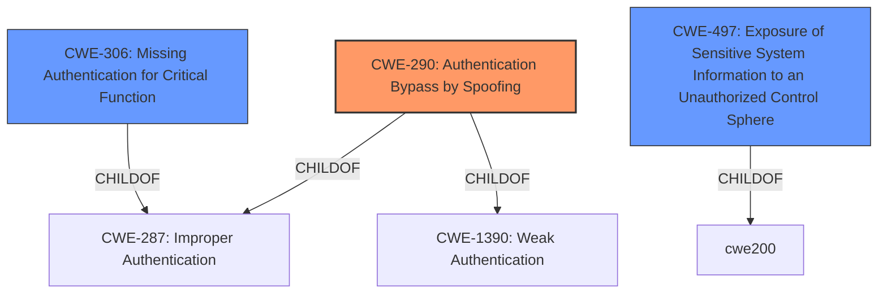

# Enhanced Analysis for CVE-2021-22002

# Summary
| CWE ID | CWE Name | Confidence | CWE Abstraction Level | CWE Vulnerability Mapping Label | CWE-Vulnerability Mapping Notes |
|---|---|---|---|---|---|
| **CWE-290** | Authentication Bypass by Spoofing | 0.8 | Base | Primary | Allowed |
| CWE-306 | Missing Authentication for Critical Function | 0.7 | Base | Secondary | Allowed |
| CWE-497 | Exposure of Sensitive System Information to an Unauthorized Control Sphere | 0.6 | Base | Secondary | Allowed |

## Evidence and Confidence

*   **Confidence Score:** 0.8
*   **Evidence Strength:** HIGH

## Relationship Analysis
The primary relationship influencing the CWE selection is the hierarchical relationship between CWE-290, CWE-287, and CWE-1390. CWE-290 (Authentication Bypass by Spoofing) is a child of CWE-287 (Improper Authentication) and CWE-1390 (Weak Authentication). The vulnerability allows bypassing authentication by manipulating host headers, which directly aligns with the spoofing aspect of CWE-290. CWE-306 is a peer and a suitable option since the cfg diagnostic endpoints do not require authentication, however, the host header manipulation is the more prominent attack vector. CWE-497 is included because accessing the /cfg web app and diagnostic endpoints can expose sensitive system information to unauthorized control spheres.



## Vulnerability Chain
The vulnerability chain starts with the **improper handling of host headers**, leading to authentication bypass and access to restricted resources. The chain can be summarized as follows:

1.  **Improper Handling of Host Headers:** (**ROOT CAUSE**) The application **fails to properly validate** the host header.
2.  **Authentication Bypass by Spoofing:** (CWE-290) An attacker **spoofs** the host, **bypassing authentication** checks.
3.  **Missing Authentication for Critical Function:** (CWE-306) Diagnostic endpoints lack authentication, exacerbating the issue.
4.  **Exposure of Sensitive System Information:** (CWE-497) Access to the `/cfg` web app and diagnostic endpoints can expose sensitive system information.

## Summary of Analysis
The initial analysis focused on the **host header injection** vulnerability and the **unauthenticated access to diagnostic endpoints**. The final decision emphasizes CWE-290 (Authentication Bypass by Spoofing) as the primary CWE because the vulnerability allows bypassing authentication by manipulating host headers.

The evidence from the "CVE Reference Links Content Summary" section supports this: "The vulnerability stems from **improper handling of host headers** in VMware Workspace ONE Access and Identity Manager (vIDM). Specifically, the `/cfg` web application and diagnostic endpoints, typically accessed on port 8443, could be reached via port 443 by **manipulating host headers**."

The selection of CWE-290 is at the base level, providing a more specific and accurate representation of the vulnerability compared to the class-level CWE-287 (Improper Authentication). The chain of weaknesses highlights the progression from the initial flaw in host header handling to the final impact of unauthorized access and potential information exposure.

The other CWEs considered but not used include:

*   **CWE-287 (Improper Authentication):** While related, it's a broader category, and CWE-290 (Authentication Bypass by Spoofing) is more specific to the vulnerability.
*   **CWE-306 (Missing Authentication for Critical Function):** This is a valid contributing factor, however, secondary to the host header manipulation.
*   **CWE-497 (Exposure of Sensitive System Information to an Unauthorized Control Sphere):** This is an impact of the vulnerability, not the root cause.

The selected CWEs are at the optimal level of specificity, addressing both the root cause (CWE-290) and secondary aspects (CWE-306, CWE-497) of the vulnerability.


## CWE Relationship Analysis

Current CWEs represent these abstraction levels: .


### Vulnerability Chain Analysis

**Chain starting from CWE-306:**
- 306 (Missing Authentication for Critical Function) - ROOT


**Chain starting from CWE-497:**
- 497 (Exposure of Sensitive System Information to an Unauthorized Control Sphere) - ROOT


### CWE Relationship Diagram

```mermaid
graph TD
    classDef primary fill:#f96,stroke:#333,stroke-width:2px
    classDef secondary fill:#69f,stroke:#333
    classDef tertiary fill:#9e9,stroke:#333
```