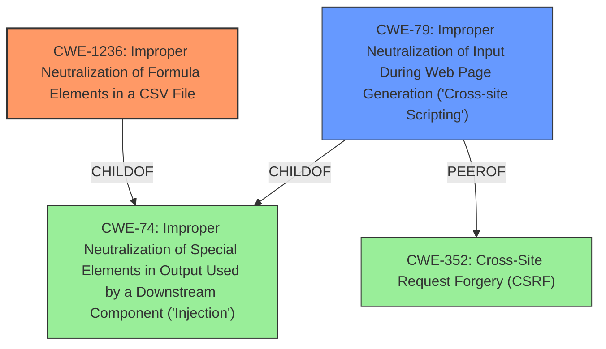

# Raw Analyzer Response for CVE-2021-22035

# Summary
| CWE ID    | CWE Name                                                                                                                                   | Confidence | CWE Abstraction Level | CWE Vulnerability Mapping Label | CWE-Vulnerability Mapping Notes |
| :-------- | :------------------------------------------------------------------------------------------------------------------------------------------ | :--------- | :---------------------- | :-------------------------------- | :--------------------------------- |
| CWE-1236 | Improper Neutralization of Formula Elements in a CSV File                                                                                  | 1.0        | Base                    | Primary CWE                      | Allowed                          |
| CWE-79    | Improper Neutralization of Input During Web Page Generation ('Cross-site Scripting')                                                        | 0.75       | Base                    | Secondary Candidate                  | Allowed                          |

## Evidence and Confidence

*   **Confidence Score:** 0.9
*   **Evidence Strength:** HIGH

## Relationship Analysis
The primary CWE, CWE-1236, is a child of CWE-74, indicating that it's a specific type of injection related to CSV files. CWE-79, considered as a secondary candidate, is also a child of CWE-74 and a peer of CWE-352, reflecting a potential relationship with Cross-Site Request Forgery. The selection of CWE-1236 is based on its precise description of the vulnerability involving the **improper neutralization** of formula elements in a CSV file, making it a more specific and appropriate choice than its parent, CWE-74.

## Vulnerability Chain
The vulnerability chain starts with the **improper handling** of user-supplied data during CSV export, leading to the **injection** of malicious content. This **injection** can then be executed within a user's environment when the CSV is opened, potentially leading to data compromise or other malicious actions.
1.  **Root Cause:** Improper handling of user-supplied data in CSV export functionality.
2.  **Weakness:** **Improper Neutralization** of Formula Elements in a CSV File (CWE-1236).
3.  **Impact:** Execution of malicious code within the user's environment upon opening the crafted CSV file.

## Summary of Analysis
The analysis is based on the provided vulnerability description, CVE reference, and retriever results. The primary focus is on identifying the root cause and mapping it to the most appropriate CWE.

The vulnerability description states: "VMware vRealize Log Insight (8.x prior to 8.6) contains a CSV(Comma Separated Value) injection vulnerability in interactive analytics export function. An authenticated malicious actor with non-administrative privileges may be able to embed untrusted data prior to exporting a CSV sheet through Log Insight which could be executed in users environment."

The CVE Reference Links Content Summary confirms the **root cause** as a "CSV injection vulnerability in the interactive analytics export function" due to "**improper handling of user-supplied data** during the export of CSV files," allowing attackers to "**inject malicious content**."

The retriever results strongly suggest CWE-1236 (Improper Neutralization of Formula Elements in a CSV File) as the most relevant CWE, given its high score and direct applicability to the vulnerability description. The relationship analysis further supports this selection, as CWE-1236 is a specific type of injection related to CSV files.

CWE-79 (Improper Neutralization of Input During Web Page Generation ('Cross-site Scripting')) was considered due to the "**weakness: cross-site scripting**" key phrase, but ultimately deemed less accurate as the attack vector is not via a web page but through a CSV file.

The final decision is based on the evidence pointing towards the **improper neutralization** of formula elements within a CSV file, which aligns perfectly with CWE-1236. This CWE is at the optimal level of specificity, providing a clear and accurate representation of the vulnerability.