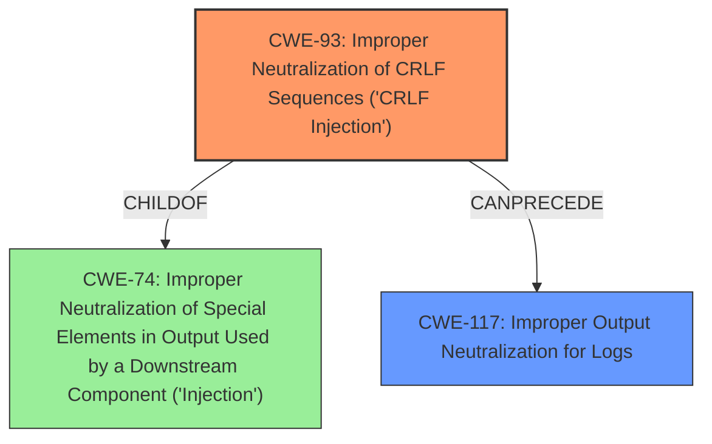

# Raw Analyzer Response for CVE-2021-22055

# Summary
| CWE ID | CWE Name | Confidence | CWE Abstraction Level | CWE Vulnerability Mapping Label | CWE-Vulnerability Mapping Notes |
|---|---|---|---|---|---|
| CWE-93 | Improper Neutralization of CRLF Sequences ('CRLF Injection') | 1.0 | Base | Allowed | Primary CWE. The vulnerability is caused by the lack of proper sanitization of the package parameter, allowing an attacker to inject carriage return characters. |
| CWE-117 | Improper Output Neutralization for Logs | 0.7 | Base | Allowed | Secondary CWE. The impact of the CRLF injection is the ability to inject malicious data into system logs. |

## Evidence and Confidence

*   **Confidence Score:** 0.9
*   **Evidence Strength:** HIGH

## Relationship Analysis
The primary CWE is CWE-93, which is a Base level weakness describing the improper neutralization of CRLF sequences. This can lead to CWE-117, Improper Output Neutralization for Logs, as the injected CRLF sequences can be used to manipulate log output. CWE-93 is a child of CWE-74 (Improper Neutralization of Special Elements in Output Used by a Downstream Component ('Injection')).

## Vulnerability Chain
The vulnerability chain starts with the **improper** input sanitization (**weakness**) of the package parameter. This leads to the injection of CRLF sequences (CWE-93), which then allows the attacker to inject malicious data into the system logs (CWE-117).

## Summary of Analysis
The initial assessment focused on the **weakness** of **command injection** and the impact of injecting logs, leading to consideration of CWE-77 and CWE-78. However, the root cause is the **improper neutralization** of CRLF sequences, making CWE-93 the most appropriate primary CWE. The evidence from the "CVE Reference Links Content Summary" section confirms this, stating that "The primary vulnerability is a CRLF injection." The ability to inject malicious data into logs is a direct consequence of the CRLF injection, making CWE-117 a secondary weakness.

The graph relationships show that CWE-93 can precede CWE-117, indicating that the CRLF injection leads to the log injection. CWE-93 is at the Base level of abstraction, which is the preferred level for root cause analysis. The selection of CWE-93 and CWE-117 is based on the provided evidence and the relationships between the CWEs.

The analysis is based on the provided evidence, specifically:
- "The `SchedulerServer` in VMware Photon OS is vulnerable to log injection due to insufficient input sanitization. Specifically, the package parameter is not properly sanitized, allowing an attacker to inject carriage return (`\r`) characters."
- "The primary vulnerability is a CRLF injection, which is a type of log injection vulnerability."
- "By injecting carriage return and line feed characters (`\r\n`), an attacker can manipulate log output, potentially inserting arbitrary data, including malicious code, or creating fake entries."

# Relevant CWE Information:

# Enhanced Context (25 CWEs)

## CWE-1236: Improper Neutralization of Formula Elements in a CSV File
**Abstraction Level**: Base
**Similarity Score**: 0.81
**Source**: dense

**Description**:
The product saves user-provided information into a Comma-Separated Value (CSV) file, but it does not neutralize or incorrectly neutralizes special elements that could be interpreted as a command when the file is opened by a spreadsheet product.

**Mapping Guidance**:
- Usage: Allowed
- Rationale: This CWE entry is at the Base level of abstraction, which is a preferred level of abstraction for mapping to the root causes of vulnerabilities.

*Reason not used:* This CWE is not relevant because the vulnerability does not involve CSV files or formula injection.

## CWE-74: Improper Neutralization of Special Elements in Output Used by a Downstream Component ('Injection')
**Abstraction Level**: Class
**Similarity Score**: 0.77
**Source**: dense

**Description**:
The product constructs all or part of a command, data structure, or record using externally-influenced input from an upstream component, but it does not neutralize or incorrectly neutralizes special elements that could modify how it is parsed or interpreted when it is sent to a downstream component.

**Mapping Guidance**:
- Usage: Discouraged
- Rationale: CWE-74 is high-level and often misused when lower-level weaknesses are more appropriate.

*Reason not used:* While CWE-74 is a parent of CWE-93, CWE-93 is a more specific and accurate representation of the vulnerability.

## CWE-184: Incomplete List of Disallowed Inputs
**Abstraction Level**: Base
**Similarity Score**: 0.75
**Source**: dense

**Description**:
The product implements a protection mechanism that relies on a list of inputs (or properties of inputs) that are not allowed by policy or otherwise require other action to neutralize before additional processing takes place, but the list is incomplete.

**Mapping Guidance**:
- Usage: Allowed
- Rationale: This CWE entry is at the Base level of abstraction, which is a preferred level of abstraction for mapping to the root causes of vulnerabilities.

*Reason not used:* The vulnerability is not due to an incomplete list of disallowed inputs, but rather the absence of proper input sanitization.

## CWE-138: Improper Neutralization of Special Elements
**Abstraction Level**: Class
**Similarity Score**: 0.75
**Source**: dense

**Description**:
The product receives input from an upstream component, but it does not neutralize or incorrectly neutralizes special elements that could be interpreted as control elements or syntactic markers when they are sent to a downstream component.

**Mapping Guidance**:
- Usage: Discouraged
- Rationale: This CWE entry is a level-1 Class (i.e., a child of a Pillar). It might have lower-level children that would be more appropriate

*Reason not used:* While this CWE is related, CWE-93 is a more specific description of the vulnerability.

## CWE-917: Improper Neutralization of Special Elements used in an Expression Language Statement ('Expression Language Injection')
**Abstraction Level**: Base
**Similarity Score**: 0.75
**Source**: dense

**Description**:
The product constructs all or part of an expression language (EL) statement in a framework such as a Java Server Page (JSP) using externally-influenced input from an upstream component, but it does not neutralize or incorrectly neutralizes special elements that could modify the intended EL statement before it is executed.

**Mapping Guidance**:
- Usage: Allowed
- Rationale: This CWE entry is at the Base level of abstraction, which is a preferred level of abstraction for mapping to the root causes of vulnerabilities.

*Reason not used:* The vulnerability does not involve expression language injection.

## CWE-93: Improper Neutralization of CRLF Sequences ('CRLF Injection')
**Abstraction Level**: Base
**Similarity Score**: 0.73
**Source**: dense

**Description**:
The product uses CRLF (carriage return line feeds) as a special element, e.g. to separate lines or records, but it does not neutralize or incorrectly neutralizes CRLF sequences from inputs.

**Mapping Guidance**:
- Usage: Allowed
- Rationale: This CWE entry is at the Base level of abstraction, which is a preferred level of abstraction for mapping to the root causes of vulnerabilities.

*Reason used:* This is the primary CWE because the root cause is the **improper neutralization** of CRLF sequences.

## CWE-116: Improper Encoding or Escaping of Output
**Abstraction Level**: Class
**Similarity Score**: 0.73
**Source**: dense

**Description**:
The product prepares a structured message for communication with another component, but encoding or escaping of the data is either missing or done incorrectly. As a result, the intended structure of the message is not preserved.

**Mapping Guidance**:
- Usage: Allowed-with-Review
- Rationale: This CWE entry is a Class and might have Base-level children that would be more appropriate

*Reason not used:* While related to output, the specific issue is CRLF injection rather than a general encoding/escaping problem.

## CWE-88: Improper Neutralization of Argument Delimiters in a Command ('Argument Injection')
**Abstraction Level**: Base
**Similarity Score**: 0.73
**Source**: dense

**Description**:
The product constructs a string for a command to be executed by a separate component
in another control sphere, but it does not properly delimit the
intended