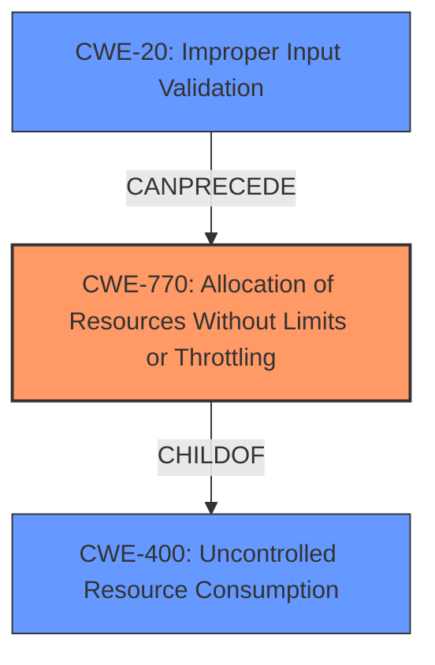

# Analysis Report for CVE-2021-22101

# Vulnerability Analysis Report: CVE-2021-22101

## Description


## Analysis (with Relationship Data)

# Summary
| CWE ID | CWE Name | Confidence | CWE Abstraction Level | CWE Vulnerability Mapping Label | CWE-Vulnerability Mapping Notes |
|---|---|---|---|---|---|
| CWE-770 | Allocation of Resources Without Limits or Throttling | 1.0 | Base | Allowed | Primary CWE |
| CWE-400 | Uncontrolled Resource Consumption | 0.7 | Class | Discouraged | Secondary Candidate |
| CWE-20 | Improper Input Validation | 0.6 | Class | Discouraged | Secondary Candidate |

## Evidence and Confidence

*   **Confidence Score:** 0.9
*   **Evidence Strength:** HIGH

## Relationship Analysis
The primary CWE, CWE-770, is a child of CWE-400, indicating a more specific type of uncontrolled resource consumption. CWE-20, Improper Input Validation, can precede CWE-770, suggesting that the lack of input validation might contribute to the resource allocation issue. The relationship between these CWEs helped to identify the root cause and the flow of the vulnerability. Choosing CWE-770 provides a more precise classification than its parent, CWE-400, aligning with best practices.



## Vulnerability Chain
The vulnerability chain starts with the lack of proper input validation, leading to the allocation of resources without limits or throttling, ultimately resulting in uncontrolled resource consumption and a denial-of-service.

## Summary of Analysis
Initially, several CWEs were considered based on the vulnerability description. The vulnerability description key phrases and CVE reference links content summary highlighted the **denial of service** caused by **REST HTTP requests with label_selectors** that generate an **enormous SQL query**. This led to considering CWE-400, CWE-20, and CWE-770.

The final decision to select CWE-770 as the primary CWE is based on the following analysis:

*   The **root cause** is the **allocation of resources without limits or throttling** when processing REST HTTP requests with `label_selectors`, leading to the generation of very large SQL queries. This directly aligns with the description of CWE-770. The CVE Reference Links Content Summary states, *"Specifically, the processing of these requests leads to the generation of extremely large SQL queries."* and *"The requests include `label_selectors` parameters which trigger the generation of the problematic SQL queries."*
*   CWE-400, Uncontrolled Resource Consumption, is a more general class and less specific than CWE-770. While the vulnerability does result in uncontrolled resource consumption, the more precise weakness is the lack of limits on resource allocation. The Mapping Guidance for CWE-400 advises: *"Closely analyze the specific mistake that is causing resource consumption, and perform a CWE mapping for that mistake. Consider children/descendants such as CWE-770: Allocation of Resources Without Limits or Throttling..."*
*   CWE-20, Improper Input Validation, is also relevant because the `label_selectors` are not properly validated, which allows the generation of the enormous SQL query. However, the immediate cause of the denial of service is the unbounded resource allocation. CWE-20 can be considered a contributing factor, as indicated by the CanPrecede relationship with CWE-770. However, the core issue remains with resource management rather than input handling itself.

Therefore, CWE-770 is the most accurate and specific representation of the **root cause** of the vulnerability. The provided evidence supports this conclusion. The selection is at the optimal level of specificity (Base) and aligns with MITRE's mapping guidance.

Relevant CWE Information:

# Enhanced Context (25 CWEs)
The following CWEs were identified as potentially relevant to this vulnerability:

## CWE-1289: Improper Validation of Unsafe Equivalence in Input
**Abstraction Level**: Base
**Similarity Score**: 0.75

## CWE-703: Improper Check or Handling of Exceptional Conditions
**Abstraction Level**: Pillar
**Similarity Score**: 0.75

## CWE-404: Improper Resource Shutdown or Release
**Abstraction Level**: Class
**Similarity Score**: 0.75

## CWE-754: Improper Check for Unusual or Exceptional Conditions
**Abstraction Level**: Class
**Similarity Score**: 0.75

## CWE-274: Improper Handling of Insufficient Privileges
**Abstraction Level**: Base
**Similarity Score**: 0.74

## CWE-799: Improper Control of Interaction Frequency
**Abstraction Level**: Class
**Similarity Score**: 0.74

## CWE-664: Improper Control of a Resource Through its Lifetime
**Abstraction Level**: Pillar
**Similarity Score**: 0.74

## CWE-653: Improper Isolation or Compartmentalization
**Abstraction Level**: Class
**Similarity Score**: 0.74

## CWE-807: Reliance on Untrusted Inputs in a Security Decision
**Abstraction Level**: Base
**Similarity Score**: 0.74

## CWE-405: Asymmetric Resource Consumption (Amplification)
**Abstraction Level**: Class
**Similarity Score**: 0.74

## CWE-770: Allocation of Resources Without Limits or Throttling
**Abstraction Level**: Base
**Similarity Score**: 7380.39

## CWE-1284: Improper Validation of Specified Quantity in Input
**Abstraction Level**: Base
**Similarity Score**: 7250.50

## CWE-789: Memory Allocation with Excessive Size Value
**Abstraction Level**: Variant
**Similarity Score**: 7244.89

## CWE-190: Integer Overflow or Wraparound
**Abstraction Level**: Base
**Similarity Score**: 7118.32

## CWE-295: Improper Certificate Validation
**Abstraction Level**: Base
**Similarity Score**: 6985.87

## CWE-41: Improper Resolution of Path Equivalence
**Abstraction Level**: base
**Similarity Score**: 5.03

## CWE-770: Allocation of Resources Without Limits or Throttling
**Abstraction Level**: base
**Similarity Score**: 4.33

## CWE-410: Insufficient Resource Pool
**Abstraction Level**: base
**Similarity Score**: 4.33

## CWE-1284: Improper Validation of Specified Quantity in Input
**Abstraction Level**: base
**Similarity Score**: 4.33

## CWE-22: Improper Limitation of a Pathname to a Restricted Directory ('Path Traversal')
**Abstraction Level**: base
**Similarity Score**: 4.33

## CWE-73: External Control of File Name or Path
**Abstraction Level**: base
**Similarity Score**: 4.33

## CWE-190: Integer Overflow or Wraparound
**Abstraction Level**: base
**Similarity Score**: 4.33

## CWE-120: Buffer Copy without Checking Size of Input ('Classic Buffer Overflow')
**Abstraction Level**: base
**Similarity Score**: 4.33

## CWE-123: Write-what-where Condition
**Abstraction Level**: base
**Similarity Score**: 4.33

## CWE-131: Incorrect Calculation of Buffer Size
**Abstraction Level**: base
**Similarity Score**: 4.33


## CWE Relationship Analysis

Current CWEs represent these abstraction levels: .


### Vulnerability Chain Analysis

**Chain starting from CWE-754:**
- 754 (Improper Check for Unusual or Exceptional Conditions) - ROOT


**Chain starting from CWE-123:**
- 123 (Write-what-where Condition) - ROOT


### CWE Relationship Diagram

```mermaid
graph TD
    classDef primary fill:#f96,stroke:#333,stroke-width:2px
    classDef secondary fill:#69f,stroke:#333
    classDef tertiary fill:#9e9,stroke:#333
```


*Report generated on 2025-04-01 20:24:57*
