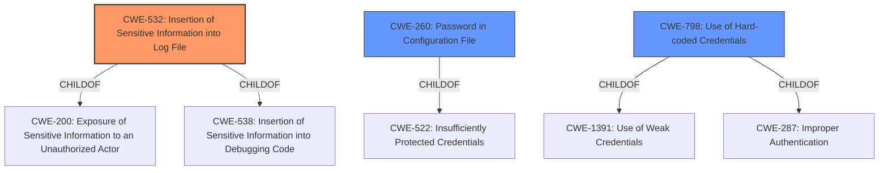

# Analysis for CVE-2021-22115

# Summary
| CWE ID | CWE Name | Confidence | CWE Abstraction Level | CWE Vulnerability Mapping Label | CWE-Vulnerability Mapping Notes |
|---|---|---|---|---|---|
| CWE-532 | Insertion of Sensitive Information into Log File | 1.0 | Base | Allowed | Primary CWE |
| CWE-260 | Password in Configuration File | 0.7 | Base | Allowed | Secondary Candidate |
| CWE-798 | Use of Hard-coded Credentials | 0.6 | Base | Allowed | Secondary Candidate |

## Evidence and Confidence

*   **Confidence Score:** 0.8
*   **Evidence Strength:** HIGH

## Relationship Analysis
The primary relationship influencing the decision is the hierarchical structure, where CWE-532 is a base CWE suitable for describing the core issue of logging sensitive information. While CWE-260 and CWE-798 were considered, the evidence points more directly to the broader issue of sensitive information logging, making CWE-532 the most fitting.

## Vulnerability Chain
The vulnerability chain starts with a configuration change (default value of db logging config field is changed) leading to the **logging of service broker credentials** in plaintext. The final impact is potential unauthorized access to service brokers due to the exposure of their passwords.

## Summary of Analysis
The analysis concludes that CWE-532 (Insertion of Sensitive Information into Log File) is the most appropriate primary CWE. This is based on the direct evidence from the vulnerability description stating that the Cloud Controller API **logs service broker credentials** when a specific configuration is changed. The "CVE Reference Links Content Summary" reinforces this, highlighting "**Plaintext Logging of Credentials**" as the primary weakness.

The retriever results also support this selection, with CWE-532 being a top candidate. While CWE-260 (Password in Configuration File) and CWE-798 (Use of Hard-coded Credentials) were considered, they do not fully capture the essence of the vulnerability. The issue isn't that the password is in a configuration file *per se*, or that the credentials are hard-coded; it's that sensitive information is being inadvertently logged due to a configuration that enables verbose logging. CWE-532 directly addresses this.

CWE-532 is at the Base level of abstraction, which is the preferred level according to MITRE's mapping guidance. The decision to use CWE-532 is strongly supported by the evidence and aligns with the CWE's definition and mapping guidelines.

Relevant CWE Information:

# Enhanced Context (25 CWEs)

## CWE-532: Insertion of Sensitive Information into Log File
**Abstraction Level**: Base
**Similarity Score**: 4824.49
**Source**: sparse

**Description**:
The product writes sensitive information to a log file.

**Mapping Guidance**:
- Usage: Allowed
- Rationale: This CWE entry is at the Base level of abstraction, which is a preferred level of abstraction for mapping to the root causes of vulnerabilities.

## CWE-260: Password in Configuration File
**Abstraction Level**: Base
**Similarity Score**: 0.451
**Source**: dense

**Description**:
The product stores a password in a configuration file that might be accessible to actors who do not know the password.

**Mapping Guidance**:
- Usage: Allowed
- Rationale: This CWE entry is at the Base level of abstraction, which is a preferred level of abstraction for mapping to the root causes of vulnerabilities.

## CWE-798: Use of Hard-coded Credentials
**Abstraction Level**: Base
**Similarity Score**: 4994.09
**Source**: sparse

**Description**:
The product contains hard-coded credentials, such as a password or cryptographic key.

**Mapping Guidance**:
- Usage: Allowed
- Rationale: This CWE entry is at the Base level of abstraction, which is a preferred level of abstraction for mapping to the root causes of vulnerabilities.

# Enhanced Query for CVE-2021-22115

## Vulnerability Description
Cloud Controller API versions prior to 1.106.0 **logs service broker credentials** if the default value of db logging config field is changed. CAPI database logs service broker password in plain text whenever a job to clean up orphaned items is run by Cloud Controller.

### Vulnerability Description Key Phrases
- **weakness:** **logs service broker credentials**
- **impact:** logs service broker password in plain text
- **vector:** default value of db logging config field is changed
- **product:** Cloud Controller API
- **version:** prior to 1.106.0

## CVE Reference Links Content Summary
Based on the provided content, here's the breakdown of CVE-2021-22115:

**Root Cause of Vulnerability:**

*   The Cloud Controller API (CAPI) logs service broker credentials in plain text when the default database logging configuration is changed. Specifically, the password is included when a job to clean up orphaned items is executed.

**Weaknesses/Vulnerabilities Present:**

*   **Plaintext Logging of Credentials:** The primary weakness is logging service broker passwords in plain text instead of redacting or encrypting them.
*   **Insecure Default Configuration:** The vulnerability is triggered by modifying a default database logging configuration, suggesting an insecure default or a lack of proper hardening considerations.

**Impact of Exploitation:**

*   **Unauthorized Access to Service Brokers:** A malicious user who gains access to the CAPI logs can obtain the service broker password.
*   **Potential Data Breach or System Compromise:**  With access to service broker credentials, attackers can potentially gain access to the resources managed by those brokers, leading to further breaches or compromise of the system.

**Attack Vectors:**

*   **Log Access:** The attack vector relies on gaining access to the CAPI logs where the plaintext passwords are stored.
*  **Configuration Change:** The logging of the credentials is triggered by a specific configuration change to the database logging.

**Required Attacker Capabilities/Position:**

*   **Access to CAPI Logs:** The attacker must have access to the CAPI logs, which might involve compromising the log storage system or gaining access through other vulnerabilities.
*   **Knowledge of the Vulnerability:** While not strictly required, understanding that changing the default logging config will expose the service broker passwords would make it easier to find this specific vulnerability.

**Summary**

CVE-2021-22115 describes a vulnerability where service broker credentials are inadvertently logged in plaintext by Cloud Foundry's CAPI. This occurs when the database logging configuration is changed from the default. An attacker with access to these logs could potentially compromise the service brokers and their associated resources. The vulnerability has been addressed in CAPI version 1.106.0 and CF Deployment version 16.2.0.

## Retriever Results

### Top Combined Results

| Rank | CWE ID | Name | Abstraction | Usage  | Retrievers | Individual Scores |
|------|--------|------|-------------|-------|------------|-------------------|
| 1 | 522 | Insufficiently Protected Credentials | Class | Allowed-with-Review | sparse | 0.328 |
| 2 | 532 | Insertion of Sensitive Information into Log File | Base | Allowed | sparse | 0.315 |
| 3 | 256 | Plaintext Storage of a Password | Base | Allowed | sparse | 0.281 |
| 4 | 668 | Exposure of Resource to Wrong Sphere | Class | Discouraged | sparse | 0.214 |
| 5 | 1188 | Initialization of a Resource with an Insecure Default | Base | Allowed | sparse | 0.213 |
| 6 | 260 | Password in Configuration File | Base | Allowed | dense | 0.451 |
| 7 | 942 | Permissive Cross-domain Policy with Untrusted Domains | Variant | Allowed | graph | 0.002 |
| 8 | 798 | Use of Hard-coded Credentials | Base | Allowed | sparse | 0.212 |
| 9 | 306 | Missing Authentication for Critical Function | Base | Allowed | sparse | 0.211 |
| 10 | 613 | Insufficient Session Expiration | Base | Allowed | sparse | 0.203 |

# Complete CWE Specifications

## CWE-522: Insufficiently Protected Credentials
**Abstraction:** Class
**Status:** Incomplete

### Description
The product transmits or stores authentication credentials, but it uses an insecure method that is susceptible to unauthorized interception and/or retrieval.

### Extended Description
Not provided

### Alternative Terms
None

### Relationships
ChildOf -> CWE-1390
ChildOf -> CWE-287
ChildOf -> CWE-668

### Mapping Guidance
**Usage:** Allowed-with-Review
**Rationale:** This CWE entry is a Class and might have Base-level children that would be more appropriate
**Comments:** Examine children of this entry to see if there is a better fit
**Reasons:**
- Abstraction

### Observed Examples
- **CVE-2022-30018:** A messaging platform serializes all elements of User/Group objects, making private information available to adversaries
- **CVE-2022-29959:** Initialization file contains credentials that can be decoded using a "simple string transformation"
- **CVE-2022-35411:** Python-based RPC framework enables pickle functionality by default, allowing clients to unpickle untrusted data.

## CWE-532: Insertion of Sensitive Information into Log File
**Abstraction:** Base
**Status:** Incomplete

### Description
The product writes sensitive information to a log file.

### Extended Description
Not provided

### Alternative Terms
None

### Relationships
ChildOf -> CWE-538
ChildOf -> CWE-200

### Mapping Guidance
**Usage:** Allowed
**Rationale:** This CWE entry is at the Base level of abstraction, which is a preferred level of abstraction for mapping to the root causes of vulnerabilities.
**Comments:** Carefully read both the name and description to ensure that this mapping is an appropriate fit. Do not try to 'force' a mapping to a lower-level Base/Variant simply to comply with this preferred level of abstraction.
**Reasons:**
- Acceptable-Use

### Observed Examples
- **CVE-2017-9615:** verbose logging stores admin credentials in a world-readable log file
- **CVE-2018-1999036:** SSH password for private key stored in build log

## CWE-256: Plaintext Storage of a Password
**Abstraction:** Base
**Status:** Incomplete

### Description
Storing a password in plaintext may result in a system compromise.

### Extended Description
Password management issues occur when a password is stored in plaintext in an application's properties, configuration file, or memory. Storing a plaintext password in a configuration file allows anyone who can read the file access to the password-protected resource. In some contexts, even storage of a plaintext password in memory is considered a security risk if the password is not cleared immediately after it is used.

### Alternative Terms
None

### Relationships
ChildOf -> CWE-522

### Mapping Guidance
**Usage:** Allowed
**Rationale:** This CWE entry is at the Base level of abstraction, which is a preferred level of abstraction for mapping to the root causes of vulnerabilities.
**Comments:** Carefully read both the name and description to ensure that this mapping is an appropriate fit. Do not try to 'force' a mapping to a lower-level Base/Variant simply to comply with this preferred level of abstraction.
**Reasons:**
- Acceptable-Use

### Observed Examples
- **CVE-2022-30275:** Remote Terminal Unit (RTU) uses a driver that relies on a password stored in plaintext.

## CWE-668: Exposure of Resource to Wrong Sphere
**Abstraction:** Class
**Status:** Draft

### Description
The product exposes a resource to the wrong control sphere, providing unintended actors with inappropriate access to the resource.

### Extended Description

Resources such as files and directories may be inadvertently exposed through mechanisms such as insecure permissions, or when a program accidentally operates on the wrong object. For example, a program may intend that private files can only be provided to a specific user. This effectively defines a control sphere that is intended to prevent attackers from accessing these private files. If the file permissions are insecure, then parties other than the user will be able to access those files.

A separate control sphere might effectively require that the user can only access the private files, but not any other files on the system. If the program does not ensure that the user is only requesting private files, then the user might be able to access other files on the system.

In either case, the end result is that a resource has been exposed to the wrong party.

### Alternative Terms
None

### Relationships
ChildOf -> CWE-664

### Mapping Guidance
**Usage:** Discouraged
**Rationale:** CWE-668 is high-level and is often misused as a catch-all when lower-level CWE IDs might be applicable. It is sometimes used for low-information vulnerability reports [REF-1287]. It is a level-1 Class (i.e., a child of a Pillar). It is not useful for trend analysis.
**Comments:** Closely analyze the specific mistake that is allowing the resource to be exposed, and perform a CWE mapping for that mistake.
**Reasons:**
- Frequent Misuse
- Abstraction

### Additional Notes
**[Theoretical]** A "control sphere" is a set of resources and behaviors that are accessible to a single actor, or a group of actors. A product's security model will typically define multiple spheres, possibly implicitly. For example, a server might define one sphere for "administrators" who can create new user accounts with subdirectories under /home/server/, and a second sphere might cover the set of users who can create or delete files within their own subdirectories. A third sphere might be "users who are authenticated to the operating system on which the product is installed." Each sphere has different sets of actors and allowable behaviors.

## CWE-1188: Initialization of a Resource with an Insecure Default
**Abstraction:** Base
**Status:** Incomplete

### Description
The product initializes or sets a resource with a default that is intended to be changed by the administrator, but the default is not secure.

### Extended Description

Developers often choose default values that leave the product as open and easy to use as possible out-of-the-box, under the assumption that the administrator can (or should) change the default value. However, this ease-of-use comes at a cost when the default is insecure and the administrator does not change it.

### Alternative Terms
None

### Relationships
ChildOf -> CWE-1419
ChildOf -> CWE-665

### Mapping Guidance
**Usage:** Allowed
**Rationale:** This CWE entry is at the Base level of abstraction, which is a preferred level of abstraction for mapping to the root causes of vulnerabilities.
**Comments:** Carefully read both the name and description to ensure that this mapping is an appropriate fit. Do not try to 'force' a mapping to a lower-level Base/Variant simply to comply with this preferred level of abstraction.
**Reasons:**
- Acceptable-Use

### Additional Notes
**[Maintenance]** This entry improves organization of concepts under initialization. The typical CWE model is to cover "Missing" and "Incorrect" behaviors. Arguably, this entry could be named as "Incorrect" instead of "Insecure." This might be changed in the near future.

### Observed Examples
- **CVE-2022-36349:** insecure default variable initialization in BIOS firmware for a hardware board allows DoS
- **CVE-2022-42467:** A generic database browser interface has a default mode that exposes a web server to the network, allowing queries to the database.

## CWE-260: Password in Configuration File
**Abstraction:** Base
**Status:** Incomplete

### Description
The product stores a password in a configuration file that might be accessible to actors who do not know the password.

### Extended Description
This can result in compromise of the system for which the password is used. An attacker could gain access to this file and learn the stored password or worse yet, change the password to one of their choosing.

### Alternative Terms
None

### Relationships
ChildOf -> CWE-522

### Mapping Guidance
**Usage:** Allowed
**Rationale:** This CWE entry is at the Base level of abstraction, which is a preferred level of abstraction for mapping to the root causes of vulnerabilities.
**Comments:** Carefully read both the name and description to ensure that this mapping is an appropriate fit. Do not try to 'force' a mapping to a lower-level Base/Variant simply to comply with this preferred level of abstraction.
**Reasons:**
- Acceptable-Use

### Observed Examples
- **CVE-2022-38665:** A continuous delivery pipeline management tool stores an unencypted password in a configuration file.

## CWE-942: Permissive Cross-domain Policy with Untrusted Domains
**Abstraction:** Variant
**Status:** Incomplete

### Description
The product uses a cross-domain policy file that includes domains that should not be trusted.

### Extended Description

A cross-domain policy file ("crossdomain.xml" in Flash and "clientaccesspolicy.xml" in Silverlight) defines a list of domains from which a server is allowed to make cross-domain requests. When making a cross-domain request, the Flash or Silverlight client will first look for the policy file on the target server. If it is found, and the domain hosting the application is explicitly allowed to make requests, the request is made.

Therefore, if a cross-domain policy file includes domains that should not be trusted, such as when using wildcards, then the application could be attacked by these untrusted domains.

An overly permissive policy file allows many of the same attacks seen in Cross-Site Scripting (CWE-79). Once the user has executed a malicious Flash or Silverlight application, they are vulnerable to a variety of attacks. The attacker could transfer private information, such as cookies that may include session information, from the victim's machine to the attacker. The attacker could send malicious requests to a web site on behalf of the victim, which could be especially dangerous to the site if the victim has administrator privileges to manage that site.

In many cases, the attack can be launched without the victim even being aware of it.

### Alternative Terms
None

### Relationships
ChildOf -> CWE-863
ChildOf -> CWE-923
ChildOf -> CWE-183
CanPrecede -> CWE-668

### Mapping Guidance
**Usage:** Allowed
**Rationale:** This CWE entry is at the Variant level of abstraction, which is a preferred level of abstraction for mapping to the root causes of vulnerabilities.
**Comments:** Carefully read both the name and description to ensure that this mapping is an appropriate fit. Do not try to 'force' a mapping to a lower-level Base/Variant simply to comply with this preferred level of abstraction.
**Reasons:**
- Acceptable-Use

### Observed Examples
- **CVE-2012-2292:** Product has a Silverlight cross-domain policy that does not restrict access to another application, which allows remote attackers to bypass the Same Origin Policy.
- **CVE-2014-2049:** The default Flash Cross Domain policies in a product allows remote attackers to access user files.
- **CVE-2007-6243:** Chain: Adobe Flash Player does not sufficiently restrict the interpretation and usage of cross-domain policy files, which makes it easier for remote attackers to conduct cross-domain and cross-site scripting (XSS) attacks.

## CWE-798: Use of Hard-coded Credentials
**Abstraction:** Base
**Status:** Draft

### Description
The product contains hard-coded credentials, such as a password or cryptographic key.

### Extended Description

There are two main variations:

  - Inbound: the product contains an authentication mechanism that checks the input credentials against a hard-coded set of credentials. In this variant, a default administration account is created, and a simple password is hard-coded into the product and associated with that account. This hard-coded password is the same for each installation of the product, and it usually cannot be changed or disabled by system administrators without manually modifying the program, or otherwise patching the product. It can also be difficult for the administrator to detect.

  - Outbound: the product connects to another system or component, and it contains hard-coded credentials for connecting to that component. This variant applies to front-end systems that authenticate with a back-end service. The back-end service may require a fixed password that can be easily discovered. The programmer may simply hard-code those back-end credentials into the front-end product.

### Alternative Terms
None

### Relationships
ChildOf -> CWE-1391
ChildOf -> CWE-287
ChildOf -> CWE-344
ChildOf -> CWE-671
PeerOf -> CWE-257

### Mapping Guidance
**Usage:** Allowed
**Rationale:** This CWE entry is at the Base level of abstraction, which is a preferred level of abstraction for mapping to the root causes of vulnerabilities.
**Comments:** Carefully read both the name and description to ensure that this mapping is an appropriate fit. Do not try to 'force' a mapping to a lower-level Base/Variant simply to comply with this preferred level of abstraction.
**Reasons:**
- Acceptable-Use

### Additional Notes
**[Maintenance]** The Taxonomy_Mappings to ISA/IEC 62443 were added in CWE 4.10, but they are still under review and might change in future CWE versions. These draft mappings were performed by members of the "Mapping CWE to 62443" subgroup of the CWE-CAPEC ICS/OT Special Interest Group (SIG), and their work is incomplete as of CWE 4.10. The mappings are included to facilitate discussion and review by the broader ICS/OT community, and they are likely to change in future CWE versions.

### Observed Examples
- **CVE-2022-29953:** Condition Monitor firmware has a maintenance interface with hard-coded credentials
- **CVE-2022-29960:** Engineering Workstation uses hard-coded cryptographic keys that could allow for unathorized filesystem access and privilege escalation
- **CVE-2022-29964:** Distributed Control System (DCS) has hard-coded passwords for local shell access

## CWE-306: Missing Authentication for Critical Function
**Abstraction:** Base
**Status:** Draft

### Description
The product does not perform any authentication for functionality that requires a provable user identity or consumes a significant amount of resources.

### Extended Description
Not provided

### Alternative Terms
None

### Relationships
ChildOf -> CWE-287
ChildOf -> CWE-287

### Mapping Guidance
**Usage:** Allowed
**Rationale:** This CWE entry is at the Base level of abstraction, which is a preferred level of abstraction for mapping to the root causes of vulnerabilities.
**Comments:** Carefully read both the name and description to ensure that this mapping is an appropriate fit. Do not try to 'force' a mapping to a lower-level Base/Variant simply to comply with this preferred level of abstraction.
**Reasons:**
- Acceptable-Use

### Observed Examples
- **CVE-2022-31260:** Chain: a digital asset management program has an undisclosed backdoor in the legacy version of a PHP script (CWE-912) that could allow an unauthenticated user to export metadata (CWE-306)
- **CVE-2022-29951:** TCP-based protocol in Programmable Logic Controller (PLC) has no authentication.
- **CVE-2022-29952:** Condition Monitor firmware uses a protocol that does not require authentication.

## CWE-613: Insufficient Session Expiration
**Abstraction:** Base
**Status:** Incomplete

### Description
According to WASC, "Insufficient Session Expiration is when a web site permits an attacker to reuse old session credentials or session IDs for authorization."

### Extended Description
Not provided

### Alternative Terms
None

### Relationships
ChildOf -> CWE-672
ChildOf -> CWE-672
CanPrecede -> CWE-287

### Mapping Guidance
**Usage:** Allowed
**Rationale:** This CWE entry is at the Base level of abstraction, which is a preferred level of abstraction for mapping to the root causes of vulnerabilities.
**Comments:** Carefully read both the name and description to ensure that this mapping is an appropriate fit. Do not try to 'force' a mapping to a lower-level Base/Variant simply to comply with this preferred level of abstraction.
**Reasons:**
- Acceptable-Use

### Additional Notes
**[Other]** The lack of proper session expiration may improve the likely success of certain attacks. For example, an attacker may intercept a session ID, possibly via a network sniffer or Cross-site Scripting attack. Although short session expiration times do not help if a stolen token is immediately used, they will protect against ongoing replaying of the session ID. In another scenario, a user might access a web site from a shared computer (such as at a library, Internet cafe, or open work environment). Insufficient Session Expiration could allow an attacker to use the browser's back button to access web pages previously accessed by the victim.

