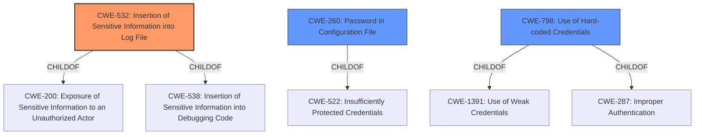

# Analysis Report for CVE-2021-22115

# Vulnerability Analysis Report: CVE-2021-22115

## Description


## Analysis (with Relationship Data)

# Summary
| CWE ID | CWE Name | Confidence | CWE Abstraction Level | CWE Vulnerability Mapping Label | CWE-Vulnerability Mapping Notes |
|---|---|---|---|---|---|
| CWE-532 | Insertion of Sensitive Information into Log File | 1.0 | Base | Allowed | Primary CWE |
| CWE-260 | Password in Configuration File | 0.7 | Base | Allowed | Secondary Candidate |
| CWE-798 | Use of Hard-coded Credentials | 0.6 | Base | Allowed | Secondary Candidate |

## Evidence and Confidence

*   **Confidence Score:** 0.8
*   **Evidence Strength:** HIGH

## Relationship Analysis
The primary relationship influencing the decision is the hierarchical structure, where CWE-532 is a base CWE suitable for describing the core issue of logging sensitive information. While CWE-260 and CWE-798 were considered, the evidence points more directly to the broader issue of sensitive information logging, making CWE-532 the most fitting.



## Vulnerability Chain
The vulnerability chain starts with a configuration change (default value of db logging config field is changed) leading to the **logging of service broker credentials** in plaintext. The final impact is potential unauthorized access to service brokers due to the exposure of their passwords.

## Summary of Analysis
The analysis concludes that CWE-532 (Insertion of Sensitive Information into Log File) is the most appropriate primary CWE. This is based on the direct evidence from the vulnerability description stating that the Cloud Controller API **logs service broker credentials** when a specific configuration is changed. The "CVE Reference Links Content Summary" reinforces this, highlighting "**Plaintext Logging of Credentials**" as the primary weakness.

The retriever results also support this selection, with CWE-532 being a top candidate. While CWE-260 (Password in Configuration File) and CWE-798 (Use of Hard-coded Credentials) were considered, they do not fully capture the essence of the vulnerability. The issue isn't that the password is in a configuration file *per se*, or that the credentials are hard-coded; it's that sensitive information is being inadvertently logged due to a configuration that enables verbose logging. CWE-532 directly addresses this.

CWE-532 is at the Base level of abstraction, which is the preferred level according to MITRE's mapping guidance. The decision to use CWE-532 is strongly supported by the evidence and aligns with the CWE's definition and mapping guidelines.

Relevant CWE Information:

# Enhanced Context (25 CWEs)

## CWE-532: Insertion of Sensitive Information into Log File
**Abstraction Level**: Base
**Similarity Score**: 4824.49
**Source**: sparse

**Description**:
The product writes sensitive information to a log file.

**Mapping Guidance**:
- Usage: Allowed
- Rationale: This CWE entry is at the Base level of abstraction, which is a preferred level of abstraction for mapping to the root causes of vulnerabilities.

## CWE-260: Password in Configuration File
**Abstraction Level**: Base
**Similarity Score**: 0.451
**Source**: dense

**Description**:
The product stores a password in a configuration file that might be accessible to actors who do not know the password.

**Mapping Guidance**:
- Usage: Allowed
- Rationale: This CWE entry is at the Base level of abstraction, which is a preferred level of abstraction for mapping to the root causes of vulnerabilities.

## CWE-798: Use of Hard-coded Credentials
**Abstraction Level**: Base
**Similarity Score**: 4994.09
**Source**: sparse

**Description**:
The product contains hard-coded credentials, such as a password or cryptographic key.

**Mapping Guidance**:
- Usage: Allowed
- Rationale: This CWE entry is at the Base level of abstraction, which is a preferred level of abstraction for mapping to the root causes of vulnerabilities.


## CWE Relationship Analysis

Current CWEs represent these abstraction levels: .


### Vulnerability Chain Analysis

**Chain starting from CWE-538:**
- 538 (Insertion of Sensitive Information into Externally-Accessible File or Directory) - ROOT


**Chain starting from CWE-287:**
- 287 (Improper Authentication) - ROOT


### CWE Relationship Diagram

```mermaid
graph TD
    classDef primary fill:#f96,stroke:#333,stroke-width:2px
    classDef secondary fill:#69f,stroke:#333
    classDef tertiary fill:#9e9,stroke:#333
```


*Report generated on 2025-04-02 06:55:15*
