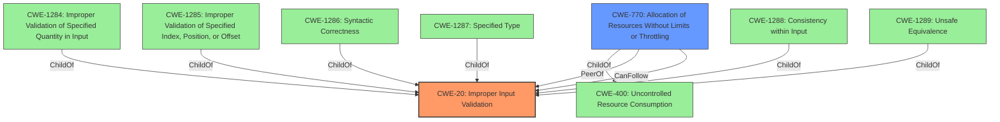

# Analysis for CVE-2021-22116

# Summary
| CWE ID | CWE Name | Confidence | CWE Abstraction Level | CWE Vulnerability Mapping Label | CWE-Vulnerability Mapping Notes |
|---|---|---|---|---|---|
| CWE-20 | Improper Input Validation | 0.8 | Class | Primary | Discouraged, but the best fit among the options after considering relationships and the provided description. |
| CWE-770 | Allocation of Resources Without Limits or Throttling | 0.6 | Base | Secondary | Allowed. Considered because DoS could be caused by exhausting resources due to **improper input validation**. |

## Evidence and Confidence

*   **Confidence Score:** 0.8
*   **Evidence Strength:** HIGH

## Relationship Analysis
The primary CWE is CWE-20, "Improper Input Validation". Although it is a Class and its usage is discouraged, it's the most appropriate given the vulnerability description and the available evidence. The child CWEs of CWE-20, such as CWE-1284, CWE-1285, CWE-1286, CWE-1287, CWE-1288, and CWE-1289, are more specific types of **improper input validation**, but the description doesn't provide enough information to pinpoint the specific type of **improper input validation**. CWE-770 is a possible secondary weakness because **improper input validation** could lead to uncontrolled resource allocation and a denial-of-service.

## Vulnerability Chain
The vulnerability chain starts with **improper input validation** (CWE-20). A malicious user sends crafted AMQP messages to a vulnerable RabbitMQ instance, which then results in a denial-of-service (DoS). It's possible that excessive resource allocation (CWE-770) is part of this chain, contributing to the DoS.

## Summary of Analysis
Based on the provided evidence, the primary weakness is **improper input validation** (CWE-20).

The vulnerability description states: "RabbitMQ all versions prior to 3.8.16 are prone to a denial of service vulnerability due to **improper input validation** in AMQP 1.0 client connection endpoint. A malicious user can exploit the vulnerability by sending malicious AMQP messages to the target RabbitMQ instance having the AMQP 1.0 plugin enabled."

The CVE Reference Links Content Summary also supports this: "Root cause of vulnerability: **Improper input validation** in the AMQP 1.0 client connection endpoint of the RabbitMQ server... Weaknesses/vulnerabilities present: Lack of proper validation of incoming AMQP messages... Impact of exploitation: Denial-of-service (DoS)... Attack vectors: Sending malicious AMQP messages to the target RabbitMQ instance."

While CWE-20 is a high-level class, the information is insufficient to pinpoint the specific type of **improper input validation** from the other suggested alternative CWEs. The **improper input validation** is the root cause. The denial of service is the impact. It is possible that excessive resource allocation contributes to the denial of service. Hence, CWE-770 is a secondary candidate.

Relevant CWE Information:

# Enhanced Context (25 CWEs)
The following CWEs were identified as potentially relevant to this vulnerability:

## CWE-405: Asymmetric Resource Consumption (Amplification)
**Abstraction Level**: Class
**Similarity Score**: 0.76
**Source**: dense

**Description**:
The product does not properly control situations in which an adversary can cause the product to consume or produce excessive resources without requiring the adversary to invest equivalent work or otherwise prove authorization, i.e., the adversary's influence is "asymmetric."

**Mapping Guidance**:
- Usage: Allowed-with-Review
- Rationale: This CWE entry is a Class and might have Base-level children that would be more appropriate

*This is not selected because this is a class and requires more information to determine if it is a better match.*

## CWE-807: Reliance on Untrusted Inputs in a Security Decision
**Abstraction Level**: Base
**Similarity Score**: 0.76
**Source**: dense

**Description**:
The product uses a protection mechanism that relies on the existence or values of an input, but the input can be modified by an untrusted actor in a way that bypasses the protection mechanism.

**Mapping Guidance**:
- Usage: Allowed
- Rationale: This CWE entry is at the Base level of abstraction, which is a preferred level of abstraction for mapping to the root causes of vulnerabilities.

*This is not selected because this is not a protection mechanism issue, but **improper input validation**. *

## CWE-1289: Improper Validation of Unsafe Equivalence in Input
**Abstraction Level**: Base
**Similarity Score**: 0.76
**Source**: dense

**Description**:
The product receives an input value that is used as a resource identifier or other type of reference, but it does not validate or incorrectly validates that the input is equivalent to a potentially-unsafe value.

**Mapping Guidance**:
- Usage: Allowed
- Rationale: This CWE entry is at the Base level of abstraction, which is a preferred level of abstraction for mapping to the root causes of vulnerabilities.

*This is not selected because this requires specific information to determine that input is equivalent to an unsafe value. *

## CWE-799: Improper Control of Interaction Frequency
**Abstraction Level**: Class
**Similarity Score**: 0.76
**Source**: dense

**Description**:
The product does not properly limit the number or frequency of interactions that it has with an actor, such as the number of incoming requests.

**Mapping Guidance**:
- Usage: Allowed-with-Review
- Rationale: This CWE entry is a Class and might have Base-level children that would be more appropriate

*This is not selected because it is not a frequency of interaction issue, but **improper input validation**. *

## CWE-668: Exposure of Resource to Wrong Sphere
**Abstraction Level**: Class
**Similarity Score**: 0.75
**Source**: dense

**Description**:
The product exposes a resource to the wrong control sphere, providing unintended actors with inappropriate access to the resource.

**Mapping Guidance**:
- Usage: Discouraged
- Rationale: CWE-668 is high-level and is often misused as a catch-all when lower-level CWE IDs might be applicable. It is sometimes used for low-information vulnerability reports [REF-1287]. It is a level-1 Class (i.e., a child of a Pillar). It is not useful for trend analysis.

*This is not selected because this is not an exposure issue, but **improper input validation**. *

## CWE-404: Improper Resource Shutdown or Release
**Abstraction Level**: Class
**Similarity Score**: 0.75
**Source**: dense

**Description**:
The product does not release or incorrectly releases a resource before it is made available for re-use.

**Mapping Guidance**:
- Usage: Allowed-with-Review
- Rationale: This CWE entry is a Class and might have Base-level children that would be more appropriate

*This is not selected because this is not a shutdown or release issue, but **improper input validation**. *

## CWE-4