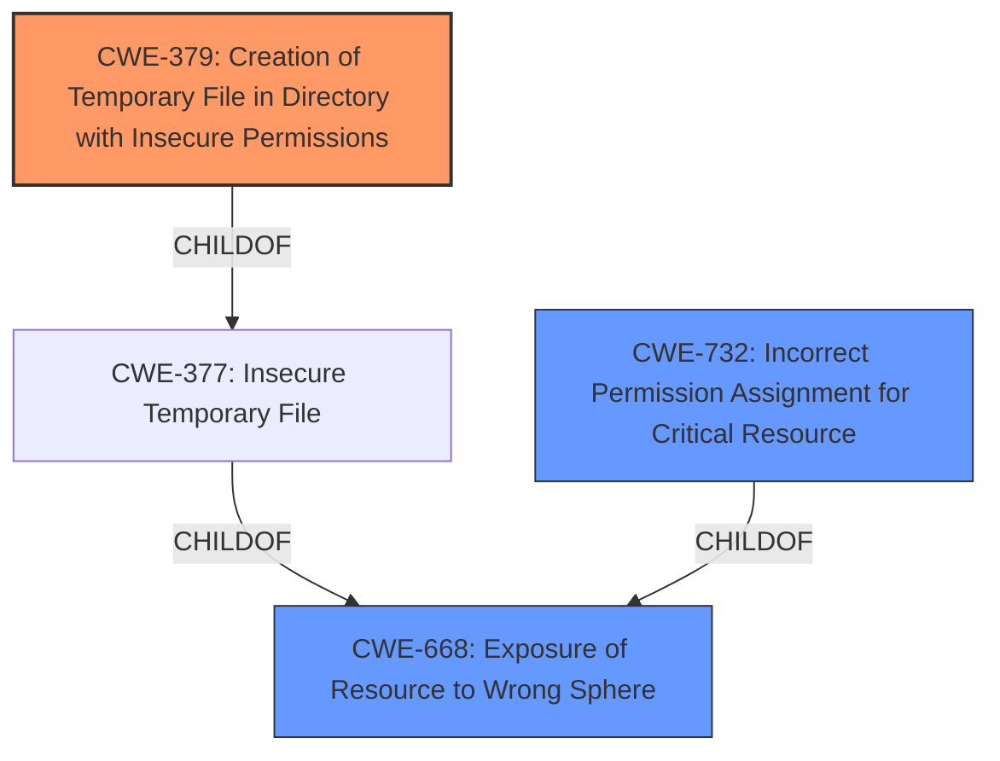

# Raw Analyzer Response for CVE-2021-22118

# Summary
| CWE ID | CWE Name | Confidence | CWE Abstraction Level | CWE Vulnerability Mapping Label | CWE-Vulnerability Mapping Notes |
|---|---|---|---|---|---|
| CWE-379 | Creation of Temporary File in Directory with Insecure Permissions | 0.7 | Base | Allowed | Primary CWE |
| CWE-668 | Exposure of Resource to Wrong Sphere | 0.5 | Class | Discouraged | Secondary Candidate |
| CWE-732 | Incorrect Permission Assignment for Critical Resource | 0.4 | Class | Allowed-with-Review | Secondary Candidate |

## Evidence and Confidence

*   **Confidence Score:** 0.7
*   **Evidence Strength:** MEDIUM

## Relationship Analysis
The primary CWE is CWE-379, which describes the creation of a temporary file in a directory with insecure permissions. This can lead to **Exposure of Resource to Wrong Sphere (CWE-668)** if an unintended actor gains access to the temporary file. **Incorrect Permission Assignment for Critical Resource (CWE-732)** is also related because the permissions assigned to the temporary file's directory are incorrect.

## Vulnerability Chain
The vulnerability chain begins with the **insecure creation of a temporary file (CWE-379)** in a directory with overly permissive access rights. This allows a locally authenticated malicious user to (re)create the temporary storage directory, potentially reading or modifying uploaded files or overwriting arbitrary files with multipart request data, ultimately leading to **privilege escalation**.

## Summary of Analysis
The analysis centers on the **insecure handling of temporary storage directories**, as indicated in the CVE description. The root cause is the **improper creation of temporary files in a directory with insecure permissions (CWE-379)**. This allows a local attacker to manipulate the temporary storage directory, leading to privilege escalation.

The evidence for this mapping is based on:
- The vulnerability description, which mentions the recreation of temporary storage directories.
- The CVE Reference Links Content Summary, which explicitly states "Insecure handling of temporary storage directories" as a weakness.

CWE-379 is the most specific CWE that accurately represents the vulnerability. It describes the **creation of a temporary file in a directory whose permissions allow unintended actors to determine the file's existence or otherwise access that file.** This aligns with the vulnerability description, which mentions a locally authenticated malicious user recreating the temporary storage directory.

CWE-668 (Exposure of Resource to Wrong Sphere) was considered but is a more general classification. While technically applicable, CWE-379 provides a more precise description of the root cause. Its usage is discouraged, but it still could apply.

CWE-732 (Incorrect Permission Assignment for Critical Resource) was also considered, but it is less specific than CWE-379. While the permissions assigned to the temporary file's directory are indeed incorrect, CWE-379 focuses on the creation of the temporary file itself. Its usage is allowed with review, but it still could apply.

The final selection is based on maximizing specificity and accuracy while adhering to MITRE's mapping guidance. The high retriever score for CWE-377 (Insecure Temporary File) also influenced this decision.

Relevant CWE Information:

# Enhanced Context (25 CWEs)

## CWE-379: Creation of Temporary File in Directory with Insecure Permissions
**Abstraction Level**: Base
**Similarity Score**: 0.118
**Source**: sparse

**Description**:
The product creates a temporary file in a directory whose permissions allow unintended actors to determine the file's existence or otherwise access that file.

**Mapping Guidance**:
- Usage: Allowed
- Rationale: This CWE entry is at the Base level of abstraction, which is a preferred level of abstraction for mapping to the root causes of vulnerabilities.