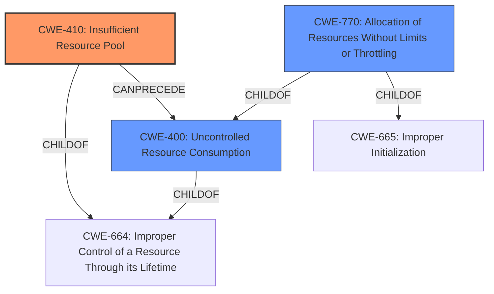

# Analysis Report for CVE-2021-22119

# Vulnerability Analysis Report: CVE-2021-22119

## Description


## Analysis (with Relationship Data)

# Summary
| CWE ID | CWE Name | Confidence | CWE Abstraction Level | CWE Vulnerability Mapping Label | CWE-Vulnerability Mapping Notes |
|---|---|---|---|---|---|
| CWE-410 | Insufficient Resource Pool | 0.8 | Base | Primary | Allowed |
| CWE-400 | Uncontrolled Resource Consumption | 0.6 | Class | Secondary | Discouraged |
| CWE-770 | Allocation of Resources Without Limits or Throttling | 0.5 | Base | Secondary | Allowed |

## Evidence and Confidence

*   **Confidence Score:** 0.8
*   **Evidence Strength:** HIGH

## Relationship Analysis
The analysis considered the following relationships:
  - CWE-410 (Insufficient Resource Pool) is a Base CWE and child of CWE-664 (Improper Control of a Resource Through its Lifetime) and can precede CWE-400 (Uncontrolled Resource Consumption).
  - CWE-400 (Uncontrolled Resource Consumption) is a Class CWE and child of CWE-664 (Improper Control of a Resource Through its Lifetime).
  - CWE-770 (Allocation of Resources Without Limits or Throttling) is a Base CWE and child of CWE-400 (Uncontrolled Resource Consumption) and CWE-665 (Improper Initialization).



## Vulnerability Chain
The vulnerability chain starts with the **improper handling of authorization requests** leading to an **insufficient resource pool** which results in **uncontrolled resource consumption** and ultimately a Denial of Service.

## Summary of Analysis
The initial analysis focused on the **uncontrolled consumption of resources** due to the improper handling of authorization requests, which leads to a denial-of-service. The evidence for this is in the "CVE Reference Links Content Summary" section, which states: "The Spring Security OAuth 2.0 Client Web and WebFlux application is susceptible to a denial-of-service attack due to an **improper handling of authorization requests**." and the **weaknesses** are that "Multiple requests can be sent to initiate authorization requests which can **exhaust system resources**."

Based on this information, CWE-410 (Insufficient Resource Pool) is the most appropriate primary CWE. The description of CWE-410, "The product's resource pool is not large enough to handle peak demand, which allows an attacker to prevent others from accessing the resource by using a (relatively) large number of requests for resources," aligns well with the vulnerability description. The "CVE Reference Links Content Summary" also supports this by stating the **attack vector** involves "an attacker sending a large number of Authorization Request initiations to the OAuth 2.0 client application"

CWE-400 (Uncontrolled Resource Consumption) was considered but it is discouraged. The rationale is "CWE-400 is intended for incorrect behaviors in which the product is expected to track and restrict how many resources it consumes, but CWE-400 is often misused because it is conflated with the "technical impact" of vulnerabilities in which resource consumption occurs." The weakness is more of a **lack of resources** due to high number of requests exhausting the pool of resources.

CWE-770 (Allocation of Resources Without Limits or Throttling) was considered, but the root cause is not necessarily the allocation of resources without limits. The core issue is that the resource pool is not sufficient to handle the request volume, making CWE-410 a better fit.

CWE-410 is the most specific and accurate representation of the vulnerability given the available evidence.


## CWE Relationship Analysis

Current CWEs represent these abstraction levels: .


### Vulnerability Chain Analysis

**Chain starting from CWE-664:**
- 664 (Improper Control of a Resource Through its Lifetime) - ROOT


**Chain starting from CWE-410:**
- 410 (Insufficient Resource Pool) - ROOT


### CWE Relationship Diagram

```mermaid
graph TD
    classDef primary fill:#f96,stroke:#333,stroke-width:2px
    classDef secondary fill:#69f,stroke:#333
    classDef tertiary fill:#9e9,stroke:#333
```


*Report generated on 2025-04-02 12:28:54*
