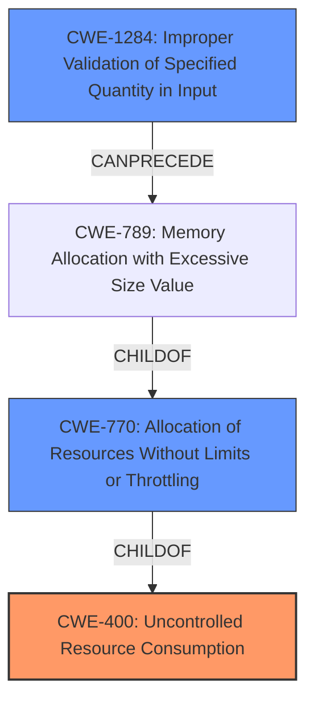

# Raw Analyzer Response for CVE-2021-22124

# Summary
| CWE ID  | CWE Name | Confidence | CWE Abstraction Level | CWE Vulnerability Mapping Label | CWE-Vulnerability Mapping Notes |
|----------------|--------------------------------------------------|-------------------|--------------------------|-----------------------------------|------------------------------------------------------------------------------------------------------|
| CWE-400 | Uncontrolled Resource Consumption | 0.9 | Class | Primary | Discouraged because it is a Class level, but accurately reflects the description |
| CWE-770 | Allocation of Resources Without Limits or Throttling | 0.7 | Base | Secondary | Allowed, more specific than CWE-400, but not a perfect fit without more info. |
| CWE-1284 | Improper Validation of Specified Quantity in Input | 0.6 | Base | Secondary | Allowed, could be a contributing factor if quantity (length) is not validated. |

## Evidence and Confidence

*   **Confidence Score:** 0.8
*   **Evidence Strength:** HIGH

## Relationship Analysis
The primary relationship impacting the decision is the parent-child relationship between CWE-400 and CWE-770. CWE-770 is a child of CWE-400 and represents a more specific type of resource consumption issue, specifically the allocation of resources without limits. Another relationship is CWE-1284 that can precede CWE-789 which is child of CWE-770.

## Vulnerability Chain
The vulnerability chain involves an attacker sending specifically-crafted long request parameters, leading to **uncontrolled resource consumption** and ultimately causing a denial of service.

## Summary of Analysis
The initial assessment, based on the vulnerability description and CVE reference links, points to **uncontrolled resource consumption** as the primary issue. The description explicitly mentions this **weakness**, and the reference links confirm that the vulnerability stems from the login modules' inability to handle specifically crafted, long request parameters, leading to a denial-of-service condition.

The retriever results further support this assessment, with CWE-400 (Uncontrolled Resource Consumption) being the top-ranked CWE. However, CWE-400 is a Class-level CWE and the mapping guidance discourages its use when more specific options are available.

Therefore, CWE-770 (Allocation of Resources Without Limits or Throttling), a Base-level CWE and a child of CWE-400, was also considered. While it's more specific, it focuses on the allocation aspect, which may not be the *only* factor. The vulnerability description and reference links do not provide enough information to definitively say that the root cause is solely due to unlimited allocation. It's possible that the processing of these long parameters, regardless of allocation, contributes to the resource consumption.

CWE-1284 (Improper Validation of Specified Quantity in Input) is also considered because the vulnerability arises from long request parameters. If the login module fails to validate the length or size of these parameters, it could lead to excessive resource consumption during processing.

Ultimately, CWE-400 is chosen as the primary CWE because it directly reflects the **uncontrolled resource consumption** vulnerability described. While it's a Class-level CWE, it accurately captures the essence of the problem. CWE-770 and CWE-1284 are secondary candidates because they may be contributing factors, but there is not enough information to confirm.

The decision is based on the explicit mention of "**uncontrolled resource consumption**" in the vulnerability description: "An **uncontrolled resource consumption** (denial of service) vulnerability... may allow an unauthenticated attacker to bring the device into an unresponsive state via specifically-crafted long request parameters."

Relevant CWE Information:

# Enhanced Context (25 CWEs)
The following CWEs were identified as potentially relevant to this vulnerability:

## CWE-73: External Control of File Name or Path
**Abstraction Level**: Base
**Similarity Score**: 0.80
**Source**: dense

**Description**:
The product allows user input to control or influence paths or file names that are used in filesystem operations.

**Mapping Guidance**:
- Usage: Allowed
- Rationale: This CWE entry is at the Base level of abstraction, which is a preferred level of abstraction for mapping to the root causes of vulnerabilities.

## CWE-664: Improper Control of a Resource Through its Lifetime
**Abstraction Level**: Pillar
**Similarity Score**: 0.79
**Source**: dense

**Description**:
The product does not maintain or incorrectly maintains control over a resource throughout its lifetime of creation, use, and release.

**Mapping Guidance**:
- Usage: Discouraged
- Rationale: This CWE entry is high-level when lower-level children are available.

## CWE-668: Exposure of Resource to Wrong Sphere
**Abstraction Level**: Class
**Similarity Score**: 0.79
**Source**: dense

**Description**:
The product exposes a resource to the wrong control sphere, providing unintended actors with inappropriate access to the resource.

**Mapping Guidance**:
- Usage: Discouraged
- Rationale: CWE-668 is high-level and is often misused as a catch-all when lower-level CWE IDs might be applicable. It is sometimes used for low-information vulnerability reports [REF-1287]. It is a level-1 Class (i.e., a child of a Pillar). It is not useful for trend analysis.

## CWE-41: Improper Resolution of Path Equivalence
**Abstraction Level**: Base
**Similarity Score**: 0.78
**Source**: dense

**Description**:
The product is vulnerable to file system contents disclosure through path equivalence. Path equivalence involves the use of special characters in file and directory names. The associated manipulations are intended to generate multiple names for the same object.

**Mapping Guidance**:
- Usage: Allowed
- Rationale: This CWE entry is at the Base level of abstraction, which is a preferred level of abstraction for mapping to the root causes of vulnerabilities.

## CWE-23: Relative Path Traversal
**Abstraction Level**: Base
**Similarity Score**: 0.77
**Source**: dense

**Description**:
The product uses external input to construct a pathname that should be within a restricted directory, but it does not properly neutralize sequences such as ".." that can resolve to a location that is outside of that directory.

**Mapping Guidance**:
- Usage: Allowed
- Rationale: This CWE entry is at the Base level of abstraction, which is a preferred level of abstraction for mapping to the root causes of vulnerabilities.

## CWE-404: Improper Resource Shutdown or Release
**Abstraction Level**: Class
**Similarity Score**: 0.77
**Source**: dense

**Description**:
The product does not release or incorrectly releases a resource before it is made available for re-use.

**Mapping Guidance**:
- Usage: Allowed-with-Review
- Rationale: This CWE entry is a Class and might have Base-level children that would be more appropriate

## CWE-610: Externally Controlled Reference to a Resource in Another Sphere
**Abstraction Level**: Class
**Similarity Score**: 0.77
**Source**: dense

**Description**:
The product uses an externally controlled name or reference that resolves to a resource that is outside of the intended control sphere.

**Mapping Guidance**:
- Usage: Discouraged
- Rationale: This CWE entry is a level-1 Class (i.e., a child of a Pillar). It might have lower-level children that would be more appropriate

## CWE-405: Asymmetric Resource Consumption (Amplification)
**Abstraction Level**: Class
**Similarity Score**: 0.77
**Source**: dense

**Description**:
The product does not properly control situations in which an adversary can cause the product to consume or produce excessive resources without requiring the adversary to invest equivalent work or otherwise prove authorization, i.e., the adversary's influence is "asymmetric."

**Mapping Guidance**:
- Usage: Allowed-with-Review
- Rationale: This CWE entry is a Class and might have Base-level children that would be more appropriate

## CWE-59: Improper Link Resolution Before File Access ('Link Following')
**Abstraction Level**: Base
**Similarity Score**: 0.77
**Source**: dense

**Description**:
The product attempts to access a file based on the filename, but it does not properly prevent that filename from identifying a link or shortcut that resolves to an unintended resource.

**Mapping Guidance**:
- Usage: Allowed
- Rationale: This CWE entry is at the