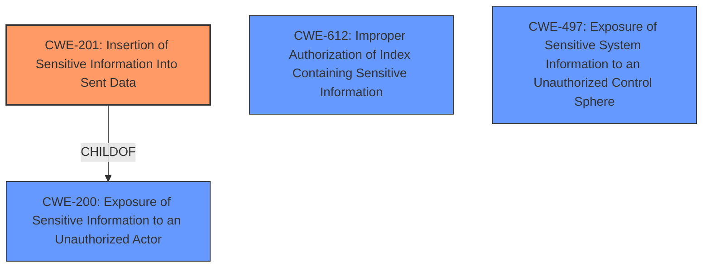

# Enhanced Analysis for CVE-2021-22132

# Summary
| CWE ID | CWE Name | Confidence | CWE Abstraction Level | CWE Vulnerability Mapping Label | CWE-Vulnerability Mapping Notes |
|---|---|---|---|---|---|
| CWE-201 | Insertion of Sensitive Information Into Sent Data | 0.9 | Base | Allowed | Primary CWE |
| CWE-612 | Improper Authorization of Index Containing Sensitive Information | 0.7 | Base | Allowed | Secondary Candidate |
| CWE-497 | Exposure of Sensitive System Information to an Unauthorized Control Sphere | 0.6 | Base | Allowed | Secondary Candidate |
| CWE-200 | Exposure of Sensitive Information to an Unauthorized Actor | 0.4 | Class | Discouraged | Secondary Candidate |

## Evidence and Confidence

*   **Confidence Score:** 0.8
*   **Evidence Strength:** HIGH

## Relationship Analysis
The primary CWE selected, CWE-201, is a child of CWE-200, indicating a more specific type of information exposure. While CWE-200 represents a broad category of exposing sensitive information, CWE-201 pinpoints the issue to the insertion of sensitive data into sent data. The other considered CWEs, such as CWE-612 and CWE-497, are related by their potential to lead to information exposure, but they represent different root causes. CWE-612 relates to improper authorization of an index, while CWE-497 concerns the exposure of system information. Therefore, CWE-201 is most appropriate as it directly addresses the **insertion** of sensitive HTTP headers.



## Vulnerability Chain
The vulnerability chain starts with the Elasticsearch application failing to properly handle HTTP headers during async search API operations. This leads to the **improper storage of sensitive information (HTTP headers)**, which an attacker with the ability to read the .tasks index can then access, resulting in information disclosure. The chain can be summarized as:

1.  **Improper Handling of HTTP Headers** (Implicit)
2.  CWE-201: Insertion of Sensitive Information Into Sent Data (HTTP headers are stored improperly)
3.  **Information Disclosure** (Impact)

## Summary of Analysis
The initial analysis focused on identifying the root cause of the information disclosure vulnerability in Elasticsearch. The key evidence comes from the vulnerability description, which states that users who execute an async search improperly store HTTP headers and that an Elasticsearch user with the ability to read the .tasks index could obtain sensitive request headers of other users in the cluster.

The retriever results suggested several potential CWEs, including CWE-522, CWE-612, CWE-201, and CWE-497. After a thorough review of each CWE's description and mapping guidance, CWE-201 emerged as the most appropriate choice.

CWE-201 (Insertion of Sensitive Information Into Sent Data) directly aligns with the vulnerability description, as it involves the improper storage of sensitive HTTP headers, which can be considered as "sent data" within the context of the async search API. The **improper storage** is the core weakness and the headers are the sensitive information.

The relationship analysis further solidified this decision. CWE-201 is a child of CWE-200, which is a more general category of information exposure. However, CWE-201 provides a more specific and accurate representation of the vulnerability.

Other CWEs were considered but ultimately rejected:

*   CWE-612 (Improper Authorization of Index Containing Sensitive Information) was considered because the vulnerability involves access to the .tasks index. However, the primary issue is not the authorization of the index itself, but rather the presence of sensitive data within it due to improper handling.
*   CWE-497 (Exposure of Sensitive System Information to an Unauthorized Control Sphere) was considered but deemed less relevant because the exposed information consists of HTTP headers, which are not necessarily system-level information.
*   CWE-200 (Exposure of Sensitive Information to an Unauthorized Actor) was considered, but as a class-level CWE, it is too broad. CWE-201, being a child of CWE-200, offers a more precise classification.

Therefore, CWE-201 is at the optimal level of specificity, providing an accurate representation of the vulnerability's root cause. The confidence in this assessment is high due to the clear alignment between the vulnerability description and the CWE definition.

Relevant CWE Information:

# Enhanced Context (25 CWEs)
The following CWEs were identified as potentially relevant to this vulnerability:

## CWE-226: Sensitive Information in Resource Not Removed Before Reuse
**Abstraction Level**: Base
**Similarity Score**: 0.80
**Source**: dense

**Description**:
The product releases a resource such as memory or a file so that it can be made available for reuse, but it does not clear or "zeroize" the information contained in the resource before the product performs a critical state transition or makes the resource available for reuse by other entities.

**Mapping Guidance**:
- Usage: Allowed
- Rationale: This CWE entry is at the Base level of abstraction, which is a preferred level of abstraction for mapping to the root causes of vulnerabilities.


## CWE-538: Insertion of Sensitive Information into Externally-Accessible File or Directory
**Abstraction Level**: Base
**Similarity Score**: 0.80
**Source**: dense

**Description**:
The product places sensitive information into files or directories that are accessible to actors who are allowed to have access to the files, but not to the sensitive information.

**Mapping Guidance**:
- Usage: Allowed
- Rationale: This CWE entry is at the Base level of abstraction, which is a preferred level of abstraction for mapping to the root causes of vulnerabilities.


## CWE-497: Exposure of Sensitive System Information to an Unauthorized Control Sphere
**Abstraction Level**: Base
**Similarity Score**: 0.79
**Source**: dense

**Description**:
The product does not properly prevent sensitive system-level information from being accessed by unauthorized actors who do not have the same level of access to the underlying system as the product does.

**Mapping Guidance**:
- Usage: Allowed
- Rationale: This CWE entry is at the Base level of abstraction, which is a preferred level of abstraction for mapping to the root causes of vulnerabilities.


## CWE-212: Improper Removal of Sensitive Information Before Storage or Transfer
**Abstraction Level**: Base
**Similarity Score**: 0.78
**Source**: dense

**Description**:
The product stores, transfers, or shares a resource that contains sensitive information, but it does not properly remove that information before the product makes the resource available to unauthorized actors.

**Mapping Guidance**:
- Usage: Allowed
- Rationale: This CWE entry is at the Base level of abstraction, which is a preferred level of abstraction for mapping to the root causes of vulnerabilities.


## CWE-213: Exposure of Sensitive Information Due to Incompatible Policies
**Abstraction Level**: Base
**Similarity Score**: 0.77
**Source**: dense

**Description**:
The product's intended functionality exposes information to certain actors in accordance with the developer's security policy, but this information is regarded as sensitive according to the intended security policies of other stakeholders such as the product's administrator, users, or others whose information is being processed.

**Mapping Guidance**:
- Usage: Allowed
- Rationale: This CWE entry is at the Base level of abstraction, which is a preferred level of abstraction for mapping to the root causes of vulnerabilities.


## CWE-668: Exposure of Resource to Wrong Sphere
**Abstraction Level**: Class
**Similarity Score**: 0.77
**Source**: dense

**Description**:
The product exposes a resource to the wrong control sphere, providing unintended actors with inappropriate access to the resource.

**Mapping Guidance**:
- Usage: Discouraged
- Rationale: CWE-668 is high-level and is often misused as a catch-all when lower-level CWE IDs might be applicable. It is sometimes used for low-information vulnerability reports [REF-1287]. It is a level-1 Class (i.e., a child of a Pillar). It is not useful for trend analysis.


## CWE-200: Exposure of Sensitive Information to an Unauthorized Actor
**Abstraction Level**: Class
**Similarity Score**: 0.77
**Source**: dense

**Description**:
The product exposes sensitive information to an actor that is not explicitly authorized to have access to that information.

**Mapping Guidance**:
- Usage: Discouraged
- Rationale: CWE-200 is commonly


## CWE Relationship Analysis

Current CWEs represent these abstraction levels: .


### Vulnerability Chain Analysis

**Chain starting from CWE-497:**
- 497 (Exposure of Sensitive System Information to an Unauthorized Control Sphere) - ROOT


**Chain starting from CWE-201:**
- 201 (Insertion of Sensitive Information Into Sent Data) - ROOT


### CWE Relationship Diagram

```mermaid
graph TD
    classDef primary fill:#f96,stroke:#333,stroke-width:2px
    classDef secondary fill:#69f,stroke:#333
    classDef tertiary fill:#9e9,stroke:#333
```