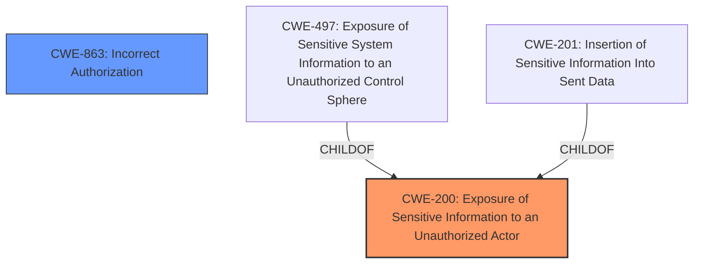

# Analysis for CVE-2021-22134

# Summary
| CWE ID  | CWE Name                                                        | Confidence | CWE Abstraction Level | CWE Vulnerability Mapping Label | CWE-Vulnerability Mapping Notes |
| :-------- | :-------------------------------------------------------------- | :--------- | :-------------------- | :------------------------------ | :------------------------------ |
| CWE-200  | Exposure of Sensitive Information to an Unauthorized Actor | 0.75      | Class                 | Primary                         | Discouraged                    |
| CWE-863 | Incorrect Authorization | 0.5      | Class | Secondary                         | Allowed-with-Review                    |

## Evidence and Confidence

*   **Confidence Score:** 0.6
*   **Evidence Strength:** MEDIUM

## Relationship Analysis
The primary relationship impacting the decision is the hierarchical relationship where CWE-200 is a Class-level CWE, which is often misused. CWE-200 is a parent of CWE-497 (Exposure of Sensitive System Information to an Unauthorized Control Sphere), CWE-201 (Insertion of Sensitive Information Into Sent Data), and others. The description points towards a **disclosure** of information, but the root cause is an **incorrect** security permissions application.

## Vulnerability Chain
The vulnerability chain starts with the **incorrect** application of security permissions, leading to the **exposure** of documents and fields that should not be visible to the attacker.

## Summary of Analysis
The initial analysis considered the high-scoring CWE-200 due to the **disclosure** aspect of the vulnerability. However, the root cause is an authorization issue. Therefore, both CWE-200 and CWE-863 were considered.

The evidence from the vulnerability description includes:
- "Get requests do not properly apply security permissions when executing a query against a recently updated document."
- "This could result in the search disclosing the existence of documents and fields the attacker should not be able to view."

The chosen CWEs reflect both the root cause (**incorrect** authorization) and the impact (**exposure** of sensitive information). Although CWE-200 is discouraged, it is still relevant to capture the impact. However, the main problem is the improper application of security permissions, which is why CWE-863 is a good candidate.

Relevant CWE Information:
- CWE-200: Exposure of Sensitive Information to an Unauthorized Actor
- CWE-863: Incorrect Authorization
- CWE-497: Exposure of Sensitive System Information to an Unauthorized Control Sphere
- CWE-201: Insertion of Sensitive Information Into Sent Data
- CWE-612: Improper Authorization of Index Containing Sensitive Information

I am overriding the general mapping guidance for CWE-200 due to the need to capture the impact of the vulnerability, even though it is a Class-level CWE and is generally discouraged. The root cause is still captured with the addition of CWE-863.