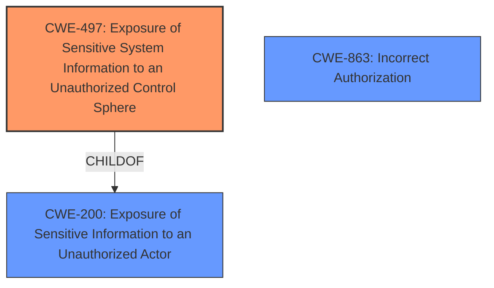

# Analysis Report for CVE-2021-22135

# Vulnerability Analysis Report: CVE-2021-22135

## Description


## Analysis (with Relationship Data)

# Summary
| CWE ID | CWE Name | Confidence | CWE Abstraction Level | CWE Vulnerability Mapping Label | CWE-Vulnerability Mapping Notes |
|---|---|---|---|---|---|
| CWE-497 | Exposure of Sensitive System Information to an Unauthorized Control Sphere | 0.8 | Base | Allowed | Primary CWE |
| CWE-200 | Exposure of Sensitive Information to an Unauthorized Actor | 0.6 | Class | Discouraged | Secondary Candidate |
| CWE-863 | Incorrect Authorization | 0.5 | Class | Allowed-with-Review | Secondary Candidate |

## Evidence and Confidence

*   **Confidence Score:** 0.8
*   **Evidence Strength:** HIGH

## Relationship Analysis
The primary CWE identified is CWE-497, which is a Base level CWE. The description of CWE-497 directly aligns with the vulnerability where sensitive system information is exposed to unauthorized actors. CWE-497 is a child of CWE-200, a more general class of information exposure. CWE-863 (Incorrect Authorization) is also related because the vulnerability involves bypassing intended security restrictions.



## Vulnerability Chain
The vulnerability chain starts with a **flaw** in the Elasticsearch suggester and profile API. Because of **certain queries**, the profiler and suggester are enabled when they shouldn't be. This leads to a bypass of document and field level security which then leads to **disclosure of the existence of documents and fields** the attacker should not be able to view. The root cause is the **improper** enabling of the suggester and profile APIs, and the impact is information disclosure.

## Summary of Analysis
The initial assessment identified several potential CWEs, but after careful consideration of the vulnerability description and the provided CWE specifications, CWE-497 (Exposure of Sensitive System Information to an Unauthorized Control Sphere) appears to be the most appropriate primary mapping.

The vulnerability description clearly states that a **document disclosure flaw** exists in Elasticsearch, leading to the **disclosing the existence of documents and fields** the attacker should not be able to view. The CVE Reference Links Content Summary section confirms that the **root cause** is a flaw in the Elasticsearch suggester and profile API, which can be **bypassed** by certain queries even when Document and Field Level Security are enabled.

The retriever results also support this selection, with CWE-497 having a high similarity score. The CWE description aligns well with the vulnerability, as it involves the product not properly preventing sensitive system-level information from being accessed by unauthorized actors.

CWE-200 (Exposure of Sensitive Information to an Unauthorized Actor) was considered but ultimately deemed less specific. While the vulnerability does involve information exposure, CWE-497 provides a more precise description of the issue. CWE-200 is discouraged as a primary mapping due to its generality.

CWE-863 (Incorrect Authorization) was also considered, but it is more of a general class. The vulnerability description highlights the fact that the queries are able to enable the profiler and suggester when they should be disabled by document-level security.

The selected CWEs are at the optimal level of specificity, with CWE-497 being a Base level CWE that accurately describes the root cause of the vulnerability.

Relevant CWE Information:

# Enhanced Context (25 CWEs)

## CWE-497: Exposure of Sensitive System Information to an Unauthorized Control Sphere
**Abstraction Level**: Base
**Similarity Score**: 0.79
**Source**: dense

**Description**:
The product does not properly prevent sensitive system-level information from being accessed by unauthorized actors who do not have the same level of access to the underlying system as the product does.

**Mapping Guidance**:
- Usage: Allowed
- Rationale: This CWE entry is at the Base level of abstraction, which is a preferred level of abstraction for mapping to the root causes of vulnerabilities.


## CWE Relationship Analysis

Current CWEs represent these abstraction levels: .


### Vulnerability Chain Analysis

**Chain starting from CWE-200:**
- 200 (Exposure of Sensitive Information to an Unauthorized Actor) - ROOT


**Chain starting from CWE-497:**
- 497 (Exposure of Sensitive System Information to an Unauthorized Control Sphere) - ROOT


### CWE Relationship Diagram

```mermaid
graph TD
    classDef primary fill:#f96,stroke:#333,stroke-width:2px
    classDef secondary fill:#69f,stroke:#333
    classDef tertiary fill:#9e9,stroke:#333
```


*Report generated on 2025-04-01 21:11:34*
