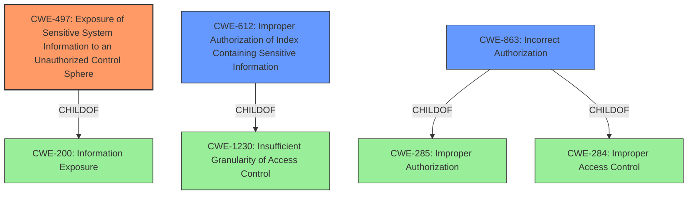

# Enhanced Analysis for CVE-2021-22147

# Summary
| CWE ID | CWE Name | Confidence | CWE Abstraction Level | CWE Vulnerability Mapping Label | CWE-Vulnerability Mapping Notes |
|---|---|---|---|---|---|
| CWE-497 | Exposure of Sensitive System Information to an Unauthorized Control Sphere | 1.0 | Base | Allowed | Primary CWE |
| CWE-612 | Improper Authorization of Index Containing Sensitive Information | 0.7 | Base | Allowed | Secondary CWE |
| CWE-863 | Incorrect Authorization | 0.6 | Class | Allowed-with-Review | Secondary CWE |

## Evidence and Confidence

*   **Confidence Score:** 0.8
*   **Evidence Strength:** HIGH

## Relationship Analysis
The primary CWE selected is CWE-497, which is a base-level CWE and a child of CWE-200 (Information Exposure). CWE-612 and CWE-863 were also considered, representing related authorization issues. CWE-612 is a child of CWE-1230 (Insufficient Granularity of Access Control), while CWE-863 is a child of CWE-285 (Improper Authorization) and CWE-284 (Improper Access Control). These relationships highlight different facets of the vulnerability, from general information exposure to specific access control failures related to indexes and authorization checks.



## Vulnerability Chain
The vulnerability chain starts with a **failure to apply document and field level security** to searchable snapshots. This **leads to an authenticated user gaining access to information that they are unauthorized to view**. Thus the chain is:
1.  **Missing/Improper access control (root cause)**
2.  **Unauthorized Information Disclosure (impact)**

## Summary of Analysis
Initially, the analysis focused on identifying the root cause of the vulnerability, which is the **failure to apply document and field level security to searchable snapshots in Elasticsearch**. The "CVE Reference Links Content Summary" clearly states this: "The root cause is a flaw in Elasticsearch where document and field level security was not being properly applied when using searchable snapshots." This directly leads to **unauthorized information disclosure**, as highlighted by the vulnerability description itself: "This could lead to an authenticated user gaining access to information that they are unauthorized to view."

The Retriever Results suggested several potential CWEs, including CWE-497, CWE-612, and CWE-863. CWE-497 (Exposure of Sensitive System Information to an Unauthorized Control Sphere) was selected as the primary CWE because it directly addresses the observed impact: **sensitive information being exposed to unauthorized users**. The description of CWE-497 aligns well with the vulnerability: "The product does not properly prevent sensitive system-level information from being accessed by unauthorized actors who do not have the same level of access to the underlying system as the product does."

CWE-612 (Improper Authorization of Index Containing Sensitive Information) was considered a secondary CWE because the vulnerability specifically involves searchable snapshots, which are essentially indexes. The description of CWE-612 states: "The product creates a search index of private or sensitive documents, but it does not properly limit index access to actors who are authorized to see the original information."

CWE-863 (Incorrect Authorization) was also considered as a secondary CWE because the root cause involves a **failure in the authorization mechanism**. The description of CWE-863 states: "The product performs an authorization check when an actor attempts to access a resource or perform an action, but it does not correctly perform the check."

The graph relationships influenced the final selection by highlighting the connections between the different types of weaknesses. While the primary impact is information exposure (CWE-497), the underlying cause involves issues with authorization and access control related to searchable snapshots (CWE-612, CWE-863).

The selected CWEs are at the optimal level of specificity. CWE-497 is a base-level CWE that directly describes the information exposure. CWE-612 and CWE-863, while being base and class level respectively, provide more context about the specific authorization and access control failures related to indexes.

Relevant CWE Information:

# Enhanced Context (25 CWEs)

## CWE-497: Exposure of Sensitive System Information to an Unauthorized Control Sphere
**Abstraction:** Base
**Status:** Incomplete

### Description
The product does not properly prevent sensitive system-level information from being accessed by unauthorized actors who do not have the same level of access to the underlying system as the product does.

### Extended Description

Network-based products, such as web applications, often run on top of an operating system or similar environment. When the product communicates with outside parties, details about the underlying system are expected to remain hidden, such as path names for data files, other OS users, installed packages, the application environment, etc. This system information may be provided by the product itself, or buried within diagnostic or debugging messages. Debugging information helps an adversary learn about the system and form an attack plan.

An information exposure occurs when system data or debugging information leaves the program through an output stream or logging function that makes it accessible to unauthorized parties. Using other weaknesses, an attacker could cause errors to occur; the response to these errors can reveal detailed system information, along with other impacts. An attacker can use messages that reveal technologies, operating systems, and product versions to tune the attack against known vulnerabilities in these technologies. A product may use diagnostic methods that provide significant implementation details such as stack traces as part of its error handling mechanism.

### Alternative Terms
None

### Relationships
ChildOf -> CWE-200

### Mapping Guidance
**Usage:** Allowed
**Rationale:** This CWE entry is at the Base level of abstraction, which is a preferred level of abstraction for mapping to the root causes of vulnerabilities.
**Comments:** Carefully read both the name and description to ensure that this mapping is an appropriate fit. Do not try to 'force' a mapping to a lower-level Base/Variant simply to comply with this preferred level of abstraction.
**Reasons:**
- Acceptable-Use

### Observed Examples
- **CVE-2021-32638:** Code analysis product passes access tokens as a command-line parameter or through an environment variable, making them visible to other processes via the ps command.

**Explanation:** The vulnerability in Elasticsearch, where document and field level security is not applied to searchable snapshots, aligns directly with CWE-497. The vulnerability allows an authenticated user to access sensitive information they are not authorized to view, which is a clear example of sensitive system information being exposed to an unauthorized control sphere. The fact that this occurs in a searchable snapshot context makes the exposure even more concerning, as users might not be aware that their queries could reveal restricted data.

## CWE-612: Improper Authorization of Index Containing Sensitive Information
**Abstraction:** Base
**Status:** Draft

### Description
The product creates a search index of private or sensitive documents, but it does not properly limit index access to actors who are authorized to see the original information.

### Extended Description
Web sites and other document repositories may apply an indexing routine against a group of private documents to facilitate search. If the index's results are available to parties who do not have access to the documents being indexed, then attackers could obtain portions of the documents by conducting targeted searches and reading the results. The risk is especially dangerous if search results include surrounding text that was not part of the search query. This issue can appear in search engines that are not configured (or implemented) to ignore critical files that should remain hidden; even without permissions to download these files directly, the remote user could read them.

### Alternative Terms
None

### Relationships
ChildOf -> CWE-1230

### Mapping Guidance
**Usage:** Allowed
**Rationale:** This CWE entry is at the Base level of abstraction, which is a preferred level of abstraction for mapping to the root causes of vulnerabilities.
**Comments:** Carefully read both the name and description to ensure that this mapping is an appropriate fit. Do not try to 'force' a mapping to a lower-level Base/Variant simply to comply with this preferred level of abstraction.
**Reasons:**


## CWE Relationship Analysis

Current CWEs represent these abstraction levels: .


### Vulnerability Chain Analysis

**Chain starting from CWE-497:**
- 497 (Exposure of Sensitive System Information to an Unauthorized Control Sphere) - ROOT


**Chain starting from CWE-284:**
- 284 (Improper Access Control) - ROOT


### CWE Relationship Diagram

```mermaid
graph TD
    classDef primary fill:#f96,stroke:#333,stroke-width:2px
    classDef secondary fill:#69f,stroke:#333
    classDef tertiary fill:#9e9,stroke:#333
```