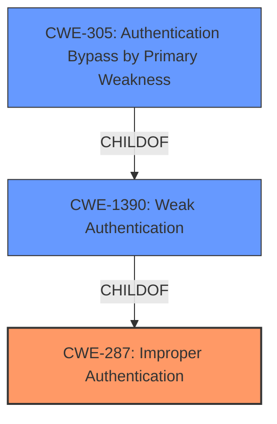

# Enhanced Analysis for CVE-2021-22155

# Summary
| CWE ID  | CWE Name                                             | Confidence | CWE Abstraction Level | CWE Vulnerability Mapping Label | CWE-Vulnerability Mapping Notes |
| :-------- | :--------------------------------------------------- | :--------- | :---------------------- | :------------------------------ | :------------------------------ |
| CWE-287   | Improper Authentication                            | 0.75       | Class                   | Primary                         | Discouraged                   |
| CWE-1390  | Weak Authentication                                | 0.7        | Class                   | Secondary                       | Allowed-with-Review           |
| CWE-305   | Authentication Bypass by Primary Weakness          | 0.6        | Base                    | Secondary                       | Allowed                       |

## Evidence and Confidence

*   **Confidence Score:** 0.7
*   **Evidence Strength:** MEDIUM

## Relationship Analysis
The primary relationship influencing the selection is the parent-child relationship where CWE-1390 (Weak Authentication) is a child of CWE-287 (Improper Authentication). CWE-287 is a high-level class, while CWE-1390 is a more specific class. Since the description indicates an **Authentication Bypass**, and CWE-1390 falls under that category, it's a relevant consideration. However, CWE-305 (Authentication Bypass by Primary Weakness) offers a more specific base-level classification, suggesting the bypass stems from another weakness. The relationships and abstraction levels guided the selection towards a combination of CWE-287 as a general classification, with consideration of CWE-1390 and CWE-305 for greater specificity.



## Vulnerability Chain
The vulnerability chain starts with an unspecified **weakness** in the SAML Authentication component, leading to an **Authentication Bypass**, and culminating in unauthorized access to the application in the context of targeted user accounts. The chain is:
1.  Unspecified **weakness** in SAML Authentication Component
2.  CWE-287 Improper Authentication / CWE-1390 Weak Authentication / CWE-305 Authentication Bypass by Primary Weakness
3.  Impact: Gain access to the application in the context of the targeted users account.

## Summary of Analysis
Initially, the primary focus was on identifying the most appropriate CWE for the **Authentication Bypass** vulnerability. The retriever results pointed to CWE-287 (Improper Authentication), CWE-1390 (Weak Authentication), and CWE-305 (Authentication Bypass by Primary Weakness).

The evidence from the vulnerability description highlights an **Authentication Bypass** in the SAML Authentication component.
*   "An **Authentication Bypass** vulnerability in the SAML Authentication component of BlackBerry Workspaces Server (deployed with Appliance-X) version(s) 10.1, 9.1 and earlier could allow an attacker to potentially gain access to the application in the context of the targeted users account."

Based on the MITRE mapping guidance, CWE-287 is discouraged due to its high-level classification, suggesting the consideration of more specific child CWEs. CWE-1390 is a more specific child, focusing on **weak authentication** mechanisms, making it a strong candidate. CWE-305 is also a strong candidate because it more directly addresses the **Authentication Bypass** issue.

The final decision involves using CWE-287 as the primary CWE due to its alignment with the general **Improper Authentication** issue, while acknowledging the relevance of CWE-1390 and CWE-305 in further specifying the nature of the **weakness** that leads to the **bypass**. The selection of CWE-287 is at the optimal level of specificity given the available evidence, even though it is discouraged.

Relevant CWE Information:

# Enhanced Context (25 CWEs)

## CWE-303: Incorrect Implementation of Authentication Algorithm
**Abstraction Level**: Base
**Similarity Score**: 0.78

**Description**:
The requirements for the product dictate the use of an established authentication algorithm, but the implementation of the algorithm is incorrect.

**Mapping Guidance**:
- Usage: Allowed

## CWE-289: Authentication Bypass by Alternate Name
**Abstraction Level**: Base
**Similarity Score**: 0.78

**Description**:
The product performs authentication based on the name of a resource being accessed, or the name of the actor performing the access, but it does not properly check all possible names for that resource or actor.

**Mapping Guidance**:
- Usage: Allowed

## CWE-288: Authentication Bypass Using an Alternate Path or Channel
**Abstraction Level**: Base
**Similarity Score**: 0.78

**Description**:
The product requires authentication, but the product has an alternate path or channel that does not require authentication.

**Mapping Guidance**:
- Usage: Allowed

## CWE-305: Authentication Bypass by Primary Weakness
**Abstraction Level**: Base
**Similarity Score**: 0.77

**Description**:
The authentication algorithm is sound, but the implemented mechanism can be bypassed as the result of a separate weakness that is primary to the authentication error.

**Mapping Guidance**:
- Usage: Allowed

## CWE-1391: Use of Weak Credentials
**Abstraction Level**: Class
**Similarity Score**: 0.77

**Description**:
The product uses weak credentials (such as a default key or hard-coded password) that can be calculated, derived, reused, or guessed by an attacker.

**Mapping Guidance**:
- Usage: Allowed-with-Review

## CWE-807: Reliance on Untrusted Inputs in a Security Decision
**Abstraction Level**: Base
**Similarity Score**: 0.77

**Description**:
The product uses a protection mechanism that relies on the existence or values of an input, but the input can be modified by an untrusted actor in a way that bypasses the protection mechanism.

**Mapping Guidance**:
- Usage: Allowed

## CWE-798: Use of Hard-coded Credentials
**Abstraction Level**: Base
**Similarity Score**: 0.77

**Description**:
The product contains hard-coded credentials, such as a password or cryptographic key.

**Mapping Guidance**:
- Usage: Allowed

## CWE-302: Authentication Bypass by Assumed-Immutable Data
**Abstraction Level**: Base
**Similarity Score**: 0.77

**Description**:
The authentication scheme or implementation uses key data elements that are assumed to be immutable, but can be controlled or modified by the attacker.

**Mapping Guidance**:
- Usage: Allowed

## CWE-1390: Weak Authentication
**Abstraction Level**: Class
**Similarity Score**: 0.77

**Description**:
The product uses an authentication mechanism to restrict access to specific users or identities, but the mechanism does not sufficiently prove that the claimed identity is correct.

**Mapping Guidance**:
- Usage: Allowed-with-Review

## CWE-290: Authentication Bypass by Spoofing
**Abstraction Level**: Base
**Similarity Score**: 0.76

**Description**:
This attack-focused weakness is caused by incorrectly implemented authentication schemes that are subject to spoofing attacks.

**Mapping Guidance**:
- Usage: Allowed

## CWE-798: Use of Hard-coded Credentials
**Abstraction Level**: Base
**Similarity Score**: 5324.49

**Description**:
The product contains hard-coded credentials, such as a password or cryptographic key.

**Mapping Guidance**:
- Usage: Allowed

## CWE-259: Use of Hard-coded Password
**Abstraction Level**: Variant
**Similarity Score**: 5192.16

**Description**:
The product contains a hard-coded password, which it uses for its own inbound authentication or for outbound communication to external components.

**Mapping Guidance**:
- Usage: Allowed

## CWE-1390: Weak Authentication
**Abstraction Level**: Class
**Similarity Score**: 5045.57

**Description**:
The product uses an authentication mechanism to restrict access to specific users or identities, but the mechanism does not sufficiently prove that the claimed identity is correct.

**Mapping Guidance**:
- Usage: Allowed-with-Review

## CWE-287: Improper Authentication
**Abstraction Level**: Class
**Similarity Score**: 4904.92

**Description**:
When an actor claims to have a given identity, the product does not prove or insufficiently proves that the claim is correct.

**Mapping Guidance**:
- Usage: Discouraged

## CWE-1391: Use of Weak Credentials
**Abstraction Level**: Class
**Similarity Score**: 4900.35

**Description**:
The product uses weak


## CWE Relationship Analysis

Current CWEs represent these abstraction levels: .


### Vulnerability Chain Analysis

**Chain starting from CWE-288:**
- 288 (Authentication Bypass Using an Alternate Path or Channel) - ROOT


**Chain starting from CWE-303:**
- 303 (Incorrect Implementation of Authentication Algorithm) - ROOT


### CWE Relationship Diagram

```mermaid
graph TD
    classDef primary fill:#f96,stroke:#333,stroke-width:2px
    classDef secondary fill:#69f,stroke:#333
    classDef tertiary fill:#9e9,stroke:#333
```