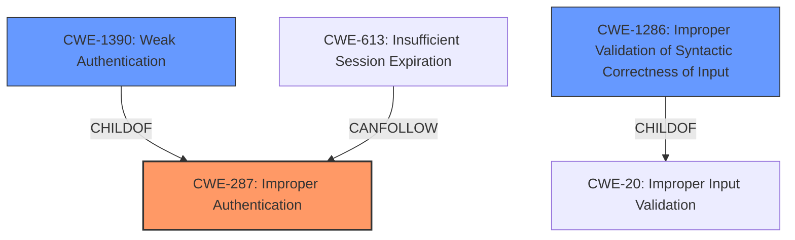

# Enhanced Analysis for CVE-2021-22171

# Summary
| CWE ID  | CWE Name                                                                           | Confidence | CWE Abstraction Level | CWE Vulnerability Mapping Label | CWE-Vulnerability Mapping Notes |
| :-------- | :--------------------------------------------------------------------------------- | :---------- | :---------------------- | :------------------------------ | :------------------------------ |
| CWE-287   | Improper Authentication                                                            | 0.85       | Class                   | Primary                         | Discouraged                    |
| CWE-1390  | Weak Authentication                                                                | 0.75       | Class                   | Secondary                       | Allowed-with-Review              |
| CWE-1286 | Improper Validation of Syntactic Correctness of Input                                | 0.65       | Base                    | Secondary                       | Allowed              |

## Evidence and Confidence

*   **Confidence Score:** 0.80
*   **Evidence Strength:** HIGH

## Relationship Analysis
The analysis considered the hierarchical relationships between CWEs. Specifically, CWE-287 is a parent of CWE-1390. The choice between them depended on the level of detail available. Additionally, CWE-287 can be related to CWE-613 (Insufficient Session Expiration), indicating a potential authentication flaw leading to session management issues. CWE-1286 (Improper Validation of Syntactic Correctness of Input) is a child of CWE-20 (Improper Input Validation), highlighting a validation problem related to the input's syntax. Abstraction levels were crucial in selecting the most specific CWE where possible.



## Vulnerability Chain
The vulnerability chain begins with **insufficient validation of authentication parameters** (root cause), leading to a bypass of authentication, potentially allowing an attacker to steal a victim's API token (impact). Specifically, **insufficient domain validation** enables an attacker to bypass the GitLab Pages authentication regex by adding an attacker-controlled domain to a GitLab Pages project. This results in the victim being redirected to the attacker's domain, where the authorization code can be captured and used to access the victim's private GitLab Pages.

## Summary of Analysis
The initial analysis focused on identifying the root cause, which is the **insufficient validation of authentication parameters**. The "Vulnerability Description Key Phrases" section directly mentions this as the root cause. The "CVE Reference Links Content Summary" confirms this by stating: "The vulnerability stems from an **insufficient validation** of the domain parameter during the GitLab Pages authentication process." This evidence supports the selection of CWE-287 (Improper Authentication) as the primary weakness, although it is discouraged.

CWE-1390 (Weak Authentication) was considered as a more specific alternative, given that it is a child of CWE-287 and explicitly addresses scenarios where the authentication mechanism is insufficient. However, since the core issue revolves around validation during the authentication process itself, CWE-287 is chosen as the primary CWE, with CWE-1390 as a secondary consideration.

CWE-1286 (Improper Validation of Syntactic Correctness of Input) is a strong candidate because the vulnerability involves **insufficient domain validation**. The summary states that "the system checks if a domain is controlled by GitLab Pages by verifying if the domain matches or has a suffix matching the GitLab Pages domain... This validation is bypassable...". This shows that the syntactic correctness of the domain input is not properly validated, allowing attackers to bypass checks.

The selected CWEs are at the optimal level of specificity because they directly address the **insufficient validation** of authentication parameters and the resulting bypass, providing a clear understanding of the vulnerability's nature and root cause.

Relevant CWE Information:

# Enhanced Context (25 CWEs)
The following CWEs were identified as potentially relevant to this vulnerability:

## CWE-1289: Improper Validation of Unsafe Equivalence in Input
**Abstraction Level**: Base
**Similarity Score**: 0.78
**Source**: dense

**Description**:
The product receives an input value that is used as a resource identifier or other type of reference, but it does not validate or incorrectly validates that the input is equivalent to a potentially-unsafe value.

**Mapping Guidance**:
- Usage: Allowed
- Rationale: This CWE entry is at the Base level of abstraction, which is a preferred level of abstraction for mapping to the root causes of vulnerabilities.

**Why Not Used:** The description doesn't precisely fit since the vulnerability is more about validating the domain itself rather than its equivalence to an unsafe value.

## CWE-807: Reliance on Untrusted Inputs in a Security Decision
**Abstraction Level**: Base
**Similarity Score**: 0.77
**Source**: dense

**Description**:
The product uses a protection mechanism that relies on the existence or values of an input, but the input can be modified by an untrusted actor in a way that bypasses the protection mechanism.

**Mapping Guidance**:
- Usage: Allowed
- Rationale: This CWE entry is at the Base level of abstraction, which is a preferred level of abstraction for mapping to the root causes of vulnerabilities.

**Why Not Used:** Although the input is untrusted, the core issue is the **insufficient validation**, not necessarily the reliance on the input itself.

## CWE-303: Incorrect Implementation of Authentication Algorithm
**Abstraction Level**: Base
**Similarity Score**: 0.77
**Source**: dense

**Description**:
The requirements for the product dictate the use of an established authentication algorithm, but the implementation of the algorithm is incorrect.

**Mapping Guidance**:
- Usage: Allowed
- Rationale: This CWE entry is at the Base level of abstraction, which is a preferred level of abstraction for mapping to the root causes of vulnerabilities.

**Why Not Used:** There's no mention that the authentication algorithm is incorrectly implemented. The issue is with the **validation of the domain parameter**, not the authentication algorithm's implementation.

## CWE-1390: Weak Authentication
**Abstraction Level**: Class
**Similarity Score**: 0.76
**Source**: dense

**Description**:
The product uses an authentication mechanism to restrict access to specific users or identities, but the mechanism does not sufficiently prove that the claimed identity is correct.

**Mapping Guidance**:
- Usage: Allowed-with-Review
- Rationale: This CWE entry is a Class and might have Base-level children that would be more appropriate

**Why Used:** This is a secondary candidate, since the **insufficient validation** results in a weak authentication mechanism, but the primary issue is the improper authentication itself.

## CWE-472: External Control of Assumed-Immutable Web Parameter
**Abstraction Level**: Base
**Similarity Score**: 0.75
**Source**: dense

**Description**:
The web application does not sufficiently verify inputs that are assumed to be immutable but are actually externally controllable, such as hidden form fields.

**Mapping Guidance**:
- Usage: Allowed
- Rationale: This CWE entry is at the Base level of abstraction, which is a preferred level of abstraction for mapping to the root causes of vulnerabilities.

**Why Not Used:** The vulnerability is related to the validation of the domain parameter during authentication, not the modification of immutable parameters.

## CWE-639: Authorization Bypass Through User-Controlled Key
**Abstraction Level**: Base
**Similarity Score**: 0.75
**Source**: dense

**Description**:
The system's authorization functionality does not prevent one user from gaining access to another user's data or record by modifying the key value identifying the data.

**Mapping Guidance**:
- Usage: Allowed
- Rationale: This CWE entry is at the Base level of abstraction, which is a preferred level of abstraction for mapping to the root causes of vulnerabilities.

**Why Not Used:** The vulnerability doesn't directly involve bypassing authorization through user-controlled keys. It's about bypassing domain validation in the authentication process.

## CWE-1391: Use of Weak Credentials
**Abstraction Level**: Class
**Similarity Score**: 0.75
**Source**: dense

**Description**:
The product uses weak credentials (such as a default key or hard-coded password) that can be calculated, derived, reused, or guessed by an attacker.

**Mapping Guidance**:
- Usage: Allowed-with-Review
- Rationale: This CWE entry is a Class and might have Base-level children that would be more appropriate

**Why Not Used:** The vulnerability is not related to the use of weak credentials. The issue is with **insufficient domain


## CWE Relationship Analysis

Current CWEs represent these abstraction levels: .


### Vulnerability Chain Analysis

**Chain starting from CWE-303:**
- 303 (Incorrect Implementation of Authentication Algorithm) - ROOT


**Chain starting from CWE-807:**
- 807 (Reliance on Untrusted Inputs in a Security Decision) - ROOT


### CWE Relationship Diagram

```mermaid
graph TD
    classDef primary fill:#f96,stroke:#333,stroke-width:2px
    classDef secondary fill:#69f,stroke:#333
    classDef tertiary fill:#9e9,stroke:#333
```