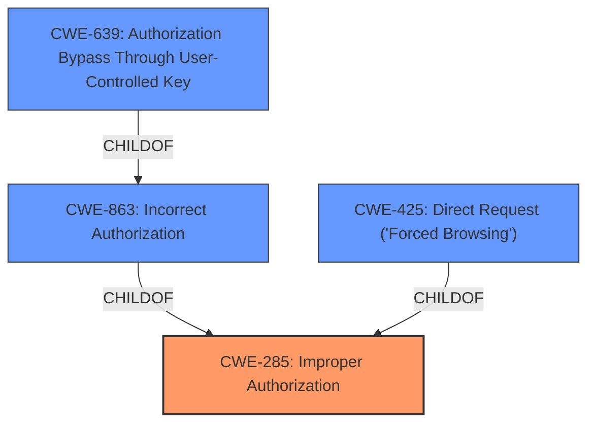

# Raw Analyzer Response for CVE-2021-22172

# Summary
| CWE ID | CWE Name | Confidence | CWE Abstraction Level | CWE Vulnerability Mapping Label | CWE-Vulnerability Mapping Notes |
|---|---|---|---|---|---|
| CWE-285 | Improper Authorization | 0.8 | Class | Primary | Discouraged |
| CWE-863 | Incorrect Authorization | 0.7 | Class | Secondary | Allowed-with-Review |
| CWE-639 | Authorization Bypass Through User-Controlled Key | 0.6 | Base | Secondary | Allowed |
| CWE-425 | Direct Request ('Forced Browsing') | 0.5 | Base | Secondary | Allowed |

## Evidence and Confidence

*   **Confidence Score:** 0.8
*   **Evidence Strength:** HIGH

## Relationship Analysis
The primary relationship is the hierarchical structure between CWE-285, CWE-863, and CWE-639. CWE-285 (Improper Authorization) is a parent **Class** of CWE-863 (Incorrect Authorization), which is a parent of CWE-639 (Authorization Bypass Through User-Controlled Key). This hierarchy helps in selecting the appropriate level of specificity. CWE-425 is also a child of CWE-862 which is another child of CWE-285. The vulnerability involves an **improper authorization** issue, where a guest user can access tag data. The initial assessment favored CWE-285 due to the presence of an authorization flaw, but the retriever results and more detailed analysis led to also considering its children CWE-863, CWE-639, and CWE-425 to get more specific.

## Vulnerability Chain
The vulnerability chain starts with an **improper authorization** check (**ROOTCAUSE**), leading to unauthorized access to tag data and ultimately information disclosure.
  - **Root Cause:** **Improper authorization** in GitLab's API.
  - **Weakness:** The `/releases` endpoint does not correctly enforce access controls for guest users.
  - **Impact:** Guest users can view tag data that should be inaccessible, leading to information disclosure.

## Summary of Analysis
The initial assessment considered CWE-285 (Improper Authorization) as the primary candidate due to the **improper authorization**. However, the retriever results suggested more specific CWEs such as CWE-863 (Incorrect Authorization), CWE-639 (Authorization Bypass Through User-Controlled Key), and CWE-425 (Direct Request ('Forced Browsing')).

The final decision includes CWE-285 as the primary (**improper authorization**). CWE-863 (Incorrect Authorization) is a more specific child of CWE-285 and applies because the authorization check, while present, is performed incorrectly. CWE-639 (Authorization Bypass Through User-Controlled Key) is a base CWE which is a child of CWE-863 and applies because the user is controlling the key value by accessing the `/releases` endpoint with their guest user token, thus bypassing the authorization. Finally, CWE-425 (Direct Request ('Forced Browsing')) is also included because the guest user is directly requesting the `/releases` endpoint, bypassing the intended access controls.

The evidence from the "CVE Reference Links Content Summary" section, such as "The API endpoint did not properly enforce the intended access controls for guest users," directly supports the selection of these CWEs. The relationships between the CWEs, as visualized in the graph, influenced the decision to include both the higher-level CWE-285 and the more specific CWEs as well. The selected CWEs are at the optimal level of specificity, balancing accuracy and practicality in describing the vulnerability.

# Relevant CWE Information:

## CWE-285: Improper Authorization
**Technical Explanation:** The GitLab API endpoint `/releases` does not properly check the authorization level of the user making the request. Specifically, it allows guest users to access tag data that should be restricted to users with higher permissions.
**Security Implications:** This vulnerability leads to information disclosure, where sensitive tag data is exposed to unauthorized users (guest users).
**Relationship:** CWE-285 is a class-level CWE and a parent of CWE-863.
**Mapping Guidance Influence:** The initial assessment favored CWE-285 due to the presence of an authorization flaw. However, more specific CWEs were considered based on the retriever results.
**Supporting Evidence:** "The API endpoint did not properly enforce the intended access controls for guest users." (CVE Reference Links Content Summary)
**Confidence:** 0.8

## CWE-863: Incorrect Authorization
**Technical Explanation:** An authorization check is performed, but the logic is flawed, allowing unauthorized access.
**Security Implications:** Information Disclosure
**Relationship:** CWE-863 is a child of CWE-285, providing a more specific classification.
**Mapping Guidance Influence:** Allowed-with-Review as this is a class CWE that might have base-level children that would be more appropriate.
**Supporting Evidence:** "Inconsistent Access Control: The API endpoint did not properly enforce the intended access controls for guest users." (CVE Reference Links Content Summary)
**Confidence:** 0.7

## CWE-639: Authorization Bypass Through User-Controlled Key
**Technical Explanation:** The guest user is able to make a request to the `/releases` endpoint with their user token and is able to bypass the authorization checks.
**Security Implications:** Information Disclosure
**Relationship:** CWE-639 is a child of CWE-863, providing a more specific classification.
**Mapping Guidance Influence:** Allowed.
**Supporting Evidence:** "The vulnerability stems from an oversight in GitLab's API where the `/releases` endpoint was returning tag names within the `_links.self` field of the JSON response, even when the request was made by a guest user." (CVE Reference Links Content Summary)
**Confidence:** 0.6

## CWE-425: Direct Request ('Forced Browsing')
**Technical Explanation:** The web application does not adequately enforce appropriate authorization on all restricted URLs, scripts, or files.
**Security Implications:** Information Disclosure
**Relationship:** CWE-425 is a child of CWE-862
**Mapping Guidance Influence:** Allowed.
**Supporting Evidence:** "An attacker with guest user privileges can exploit this vulnerability by directly querying the GitLab API `/projects/<project_id>/releases` endpoint." (CVE Reference Links Content Summary)
**Confidence:** 0.5

## Considered but Not Used

*   CWE-284: Improper Access Control - This is a very high-level CWE (Pillar) and is too general for this vulnerability.
*   CWE-201: Insertion of Sensitive Information Into Sent Data - This CWE relates to sending sensitive information but doesn't capture the authorization aspect of the vulnerability.
*   CWE-359: Exposure of Private Personal Information to an Unauthorized Actor - While there is information disclosure, the tag data is not necessarily considered "private personal information."
*   CWE-226: Sensitive Information in Resource Not Removed Before Reuse - This CWE is not relevant as the vulnerability does not involve the reuse of resources with sensitive information.