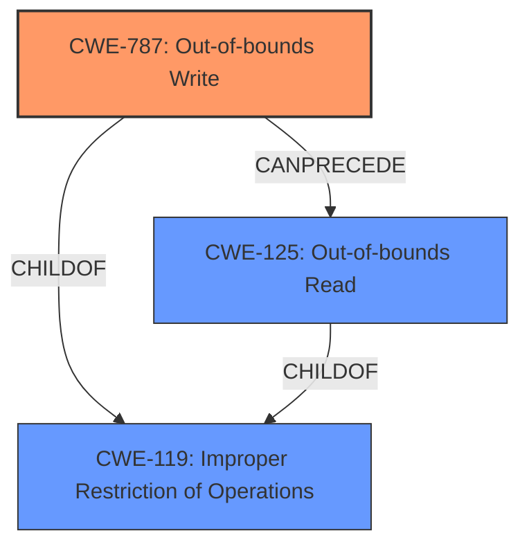

# Raw Analyzer Response for CVE-2021-22174

# Summary
| CWE ID  | CWE Name                                                                  | Confidence | CWE Abstraction Level | CWE Vulnerability Mapping Label | CWE-Vulnerability Mapping Notes |
| :-------- | :------------------------------------------------------------------------ | :---------- | :---------------------- | :------------------------------ | :------------------------------ |
| CWE-787   | Out-of-bounds Write                                                       | 0.85       | Base                    | Primary                         | Allowed                       |
| CWE-125   | Out-of-bounds Read                                                       | 0.75       | Base                    | Secondary                       | Allowed                       |

## Evidence and Confidence

*   **Confidence Score:** 0.80
*   **Evidence Strength:** HIGH

## Relationship Analysis
The primary relationship influencing the decision is the hierarchical one. CWE-787 and CWE-125 are both childs of CWE-119. Both CWE-787 and CWE-125 are at the base level of abstraction, making them more specific than their parent. There is also a peer relationship where CWE-787 can precede CWE-125.

## Vulnerability Chain
The vulnerability chain starts with a malformed packet received by the USB HID dissector. This leads to **memory corruption**, potentially triggering an out-of-bounds write (CWE-787) or out-of-bounds read (CWE-125), ultimately resulting in a **crash** and denial of service.

## Summary of Analysis
The initial assessment, based on the vulnerability description and similar CVEs, pointed to CWE-787 as the primary candidate. The "CVE Reference Links Content Summary" section provides strong evidence supporting this, mentioning "**memory corruption**" and a "flaw that can lead to a **crash**." The provided evidence says that it can crash due to a malformed packet. Fuzz testing was done and a valgrind error indicated a memory issue.

CWE-787 (Out-of-bounds Write) is selected as the primary CWE because the vulnerability involves **memory corruption** and a **crash**, aligning with the characteristics of an out-of-bounds write. This is further supported by the "CVE for similar CVE Descriptions" section, which lists CWE-787 as the Primary CWE Match and the Top CWE.

CWE-125 (Out-of-bounds Read) is considered as a secondary CWE because the vulnerability could potentially involve reading data outside the intended buffer, leading to a crash. This is supported by the "Top CWEs" in the "CWE for similar CVE Descriptions" section.

The selected CWEs are at the optimal level of specificity (Base) as they directly address the **memory corruption** issue in the USB HID dissector. The retriever results also list CWE-787 and CWE-125 as possible matches.

Relevant CWE Information:

# Enhanced Context (25 CWEs)

## CWE-789: Memory Allocation with Excessive Size Value
**Abstraction Level**: Variant
**Similarity Score**: 0.81
**Source**: dense

**Description**:
The product allocates memory based on an untrusted, large size value, but it does not ensure that the size is within expected limits, allowing arbitrary amounts of memory to be allocated.

**Mapping Guidance**:
- Usage: Allowed
- Rationale: This CWE entry is at the Variant level of abstraction, which is a preferred level of abstraction for mapping to the root causes of vulnerabilities.

*   **Reason for not selecting:** While excessive memory allocation could be a contributing factor, the primary issue is **memory corruption** due to a malformed packet, making CWE-787 and CWE-125 more appropriate.

## CWE-835: Loop with Unreachable Exit Condition ('Infinite Loop')
**Abstraction Level**: Base
**Similarity Score**: 5959.28
**Source**: sparse

**Description**:
The product contains an iteration or loop with an exit condition that cannot be reached, i.e., an infinite loop.

**Mapping Guidance**:
- Usage: Allowed
- Rationale: This CWE entry is at the Base level of abstraction, which is a preferred level of abstraction for mapping to the root causes of vulnerabilities.

*   **Reason for not selecting:** Although CWE-835 is listed as a Top CWE for similar CVE descriptions, there is no direct evidence of an infinite loop in the provided vulnerability description. The primary issue is **memory corruption** leading to a **crash**.