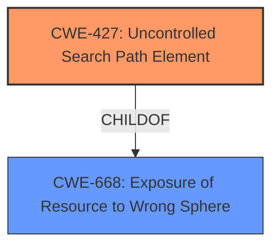

# Raw Analyzer Response for CVE-2021-22195

# Summary
| CWE ID | CWE Name | Confidence | CWE Abstraction Level | CWE Vulnerability Mapping Label | CWE-Vulnerability Mapping Notes |
|---|---|---|---|---|---|
| CWE-427 | Uncontrolled Search Path Element | 0.9 | Base | Allowed | Primary CWE |
| CWE-668 | Exposure of Resource to Wrong Sphere | 0.6 | Class | Allowed | Secondary CWE |

## Evidence and Confidence

*   **Confidence Score:** 0.9
*   **Evidence Strength:** HIGH

## Relationship Analysis
The primary CWE is CWE-427, which has a ChildOf relationship to CWE-668 (Exposure of Resource to Wrong Sphere). The vulnerability involves using a search path that includes a location controlled by an attacker, which aligns with CWE-427's description. CWE-668 is a broader categorization that encompasses the resource exposure aspect of the vulnerability, acting as a parent class for CWE-427.

## Vulnerability Chain
The vulnerability chain starts with the **lack of explicit path specification for git.exe** in the VSCode extension. This leads to Windows searching for the executable in the current directory, which can be controlled by the attacker. The attacker places a malicious git.exe in a cloned repository. When the user clones the repository, the malicious git.exe is executed, resulting in remote code execution.

## Summary of Analysis
The initial analysis identified CWE-427 as the primary weakness, aligning with the vulnerability's root cause: the **uncontrolled search path element** allowing execution of a malicious git.exe. The evidence from the "CVE Reference Links Content Summary" strongly supports this: "The GitLab VSCode extension does not specify the full path to the git.exe executable, causing Windows to search for it in the current directory (the cloned repository)."

The relationship analysis further strengthens this selection. CWE-427 is a child of CWE-668 (Exposure of Resource to Wrong Sphere), indicating a resource (git.exe) being exposed to an unintended control sphere (the attacker-controlled repository).

The MITRE mapping guidance for CWE-427 allows its use and states: "This CWE entry is at the Base level of abstraction, which is a preferred level of abstraction for mapping to the root causes of vulnerabilities."

CWE-1336, CWE-603, and CWE-285 were considered but not used. CWE-1336 (Improper Neutralization of Special Elements Used in a Template Engine) is not relevant as the vulnerability doesn't involve template engines. CWE-603 (Use of Client-Side Authentication) is also not applicable as the vulnerability is not related to authentication. CWE-285 (Improper Authorization) is too broad, and a more specific CWE, like CWE-427, better captures the root cause.

The selected CWEs are at the optimal level of specificity. CWE-427 directly describes the **uncontrolled search path element**, while CWE-668 provides a broader categorization of the resource exposure aspect.

Relevant CWE Information:

# Enhanced Context (25 CWEs)
The following CWEs were identified as potentially relevant to this vulnerability:

## CWE-602: Client-Side Enforcement of Server-Side Security
**Abstraction Level**: Class
**Similarity Score**: 0.80
**Source**: dense

**Description**:
The product is composed of a server that relies on the client to implement a mechanism that is intended to protect the server.

**Mapping Guidance**:
- Usage: Allowed-with-Review
- Rationale: This CWE entry is a Class and might have Base-level children that would be more appropriate

## CWE-1289: Improper Validation of Unsafe Equivalence in Input
**Abstraction Level**: Base
**Similarity Score**: 0.77
**Source**: dense

**Description**:
The product receives an input value that is used as a resource identifier or other type of reference, but it does not validate or incorrectly validates that the input is equivalent to a potentially-unsafe value.

**Mapping Guidance**:
- Usage: Allowed
- Rationale: This CWE entry is at the Base level of abstraction, which is a preferred level of abstraction for mapping to the root causes of vulnerabilities.

## CWE-807: Reliance on Untrusted Inputs in a Security Decision
**Abstraction Level**: Base
**Similarity Score**: 0.76
**Source**: dense

**Description**:
The product uses a protection mechanism that relies on the existence or values of an input, but the input can be modified by an untrusted actor in a way that bypasses the protection mechanism.

**Mapping Guidance**:
- Usage: Allowed
- Rationale: This CWE entry is at the Base level of abstraction, which is a preferred level of abstraction for mapping to the root causes of vulnerabilities.

## CWE-184: Incomplete List of Disallowed Inputs
**Abstraction Level**: Base
**Similarity Score**: 0.76
**Source**: dense

**Description**:
The product implements a protection mechanism that relies on a list of inputs (or properties of inputs) that are not allowed by policy or otherwise require other action to neutralize before additional processing takes place, but the list is incomplete.

**Mapping Guidance**:
- Usage: Allowed
- Rationale: This CWE entry is at the Base level of abstraction, which is a preferred level of abstraction for mapping to the root causes of vulnerabilities.

## CWE-74: Improper Neutralization of Special Elements in Output Used by a Downstream Component ('Injection')
**Abstraction Level**: Class
**Similarity Score**: 0.76
**Source**: dense

**Description**:
The product constructs all or part of a command, data structure, or record using externally-influenced input from an upstream component, but it does not neutralize or incorrectly neutralizes special elements that could modify how it is parsed or interpreted when it is sent to a downstream component.

**Mapping Guidance**:
- Usage: Discouraged
- Rationale: CWE-74 is high-level and often misused when lower-level weaknesses are more appropriate.

## CWE-41: Improper Resolution of Path Equivalence
**Abstraction Level**: Base
**Similarity Score**: 0.75
**Source**: dense

**Description**:
The product is vulnerable to file system contents disclosure through path equivalence. Path equivalence involves the use of special characters in file and directory names. The associated manipulations are intended to generate multiple names for the same object.

**Mapping Guidance**:
- Usage: Allowed
- Rationale: This CWE entry is at the Base level of abstraction, which is a preferred level of abstraction for mapping to the root causes of vulnerabilities.

## CWE-603: Use of Client-Side Authentication
**Abstraction Level**: Base
**Similarity Score**: 0.74
**Source**: dense

**Description**:
A client/server product performs authentication within client code but not in server code, allowing server-side authentication to be bypassed via a modified client that omits the authentication check.

**Mapping Guidance**:
- Usage: Allowed
- Rationale: This CWE entry is at the Base level of abstraction, which is a preferred level of abstraction for mapping to the root causes of vulnerabilities.

## CWE-73: External Control of File Name or Path
**Abstraction Level**: Base
**Similarity Score**: 0.74
**Source**: dense

**Description**:
The product allows user input to control or influence paths or file names that are used in filesystem operations.

**Mapping Guidance**:
- Usage: Allowed
- Rationale: This CWE entry is at the Base level of abstraction, which is a preferred level of abstraction for mapping to the root causes of vulnerabilities.

## CWE-639: Authorization Bypass Through User-Controlled Key
**Abstraction Level**: Base
**Similarity Score**: 0.74
**Source**: dense

**Description**:
The system's authorization functionality does not prevent one user from gaining access to another user's data or record by modifying the key value identifying the data.

**Mapping Guidance**:
- Usage: Allowed
- Rationale: This CWE entry is at the Base level of abstraction, which is a preferred level of abstraction for mapping to the root causes of vulnerabilities.

## CWE-472: External Control of Assumed-Immutable Web Parameter
**Abstraction Level**: Base
**Similarity Score**: 0.74
**Source**: dense

**Description**:
The web application does not sufficiently verify inputs that are assumed to be immutable but are actually externally controllable, such as hidden form fields.

**Mapping Guidance**:
- Usage: Allowed
- Rationale: This CWE entry is at the Base level of abstraction, which is a preferred level of abstraction for mapping to the root causes of vulnerabilities.

## CWE-427: Uncontrolled Search Path Element
**Abstraction Level**: Base
**Similarity Score**: 8512.47
**Source**: sparse

**Description**: