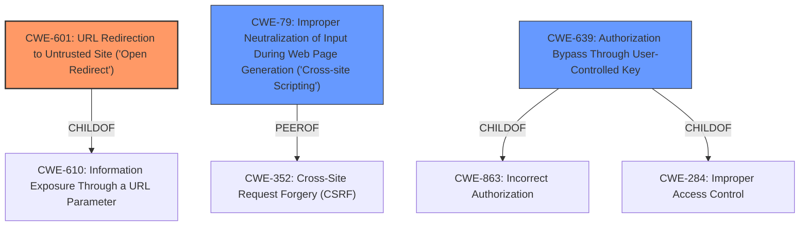

# Analysis Report for CVE-2021-22213

# Vulnerability Analysis Report: CVE-2021-22213

## Description


## Analysis (with Relationship Data)

# Summary
| CWE ID | CWE Name | Confidence | CWE Abstraction Level | CWE Vulnerability Mapping Label | CWE-Vulnerability Mapping Notes |
|---|---|---|---|---|---|
| CWE-601 | URL Redirection to Untrusted Site ('Open Redirect') | 0.8 | Base | Allowed | Primary CWE |
| CWE-79 | Improper Neutralization of Input During Web Page Generation ('Cross-site Scripting') | 0.5 | Base | Allowed | Secondary CWE Candidate |
| CWE-639 | Authorization Bypass Through User-Controlled Key | 0.4 | Base | Allowed | Secondary CWE Candidate |

## Evidence and Confidence

*   **Confidence Score:** 0.8
*   **Evidence Strength:** HIGH

## Relationship Analysis
The primary weakness is CWE-601, which is a Base level CWE. CWE-601 is a child of CWE-610: Information Exposure Through a URL Parameter. CWE-79 is a peer of CWE-352, which could be related in some cases. CWE-639 is child of CWE-863 and CWE-284.



## Vulnerability Chain
The vulnerability chain starts with the **cross-site leak vulnerability in OAuth flow**, leading to a leak of the OAuth access token. An attacker crafts a malicious URL to redirect the user to an attacker-controlled site after OAuth authorization, allowing the token to be captured.
  - **Root Cause:** **Cross-site leak vulnerability in OAuth flow**, Cross-Origin redirect vulnerability, **Lack of proper handling of Cross-Origin redirects in Safari**.
  - **Weakness:** The application uses a URL parameter to redirect the user to another site.
  - **Impact:** OAuth access token is leaked, Account Takeover (ATO).

## Summary of Analysis
The initial analysis correctly identifies the presence of an **cross-site leak vulnerability in OAuth flow** leading to an OAuth access token leak. The primary CWE is CWE-601 because the vulnerability allows an attacker to redirect the user to an untrusted site.

The vulnerability description mentions a **cross-site leak vulnerability in OAuth flow** which leads to leaking the OAuth access token. The CVE Reference Links Content Summary supports this, stating: "The vulnerability stems from the behavior of OAuth redirects in GitLab and how Safari handles Cross-Origin redirects...redirect directly to the third-party app with access tokens. This redirection is Cross-Origin, from gitlab.com to the third-party, allowing the access token to be captured".

CWE-601 (URL Redirection to Untrusted Site ('Open Redirect')) is selected as the primary CWE because the core issue is the ability to redirect users to an untrusted site, leading to the leak of the OAuth token. The description of CWE-601 matches well: "The web application accepts a user-controlled input that specifies a link to an external site, and uses that link in a redirect." The attacker uses a malicious page to achieve the redirect in this case. The evidence to support this is "After a user authorizes an application with GitLab OAuth, subsequent login attempts bypass the authorization dialog and directly redirect to the third-party app with access tokens. This redirection is Cross-Origin, from gitlab.com to the third-party, allowing the access token to be captured through a SecurityPolicyViolationEvent when a request is made to the `gitlab.com/oauth/authorize` endpoint."

CWE-79 (Improper Neutralization of Input During Web Page Generation ('Cross-site Scripting')) is considered as a secondary CWE because the attacker is injecting malicious content into the web page via the redirect. However, the primary issue is the redirect itself, not the injection of script.

CWE-639 (Authorization Bypass Through User-Controlled Key) is considered as a secondary CWE because the attacker could potentially manipulate the key to access other users' data. However, the primary issue is the redirect to a malicious site.

I am confident in my assessment. The selected CWEs are at the optimal level of specificity. The evidence provided supports the selection of CWE-601 as the primary weakness, with CWE-79 and CWE-639 as secondary candidates.


## CWE Relationship Analysis

Current CWEs represent these abstraction levels: .


### Vulnerability Chain Analysis

**Chain starting from CWE-79:**
- 79 (Improper Neutralization of Input During Web Page Generation ('Cross-site Scripting')) - ROOT


**Chain starting from CWE-284:**
- 284 (Improper Access Control) - ROOT


### CWE Relationship Diagram

```mermaid
graph TD
    classDef primary fill:#f96,stroke:#333,stroke-width:2px
    classDef secondary fill:#69f,stroke:#333
    classDef tertiary fill:#9e9,stroke:#333
```


*Report generated on 2025-04-02 02:23:39*
