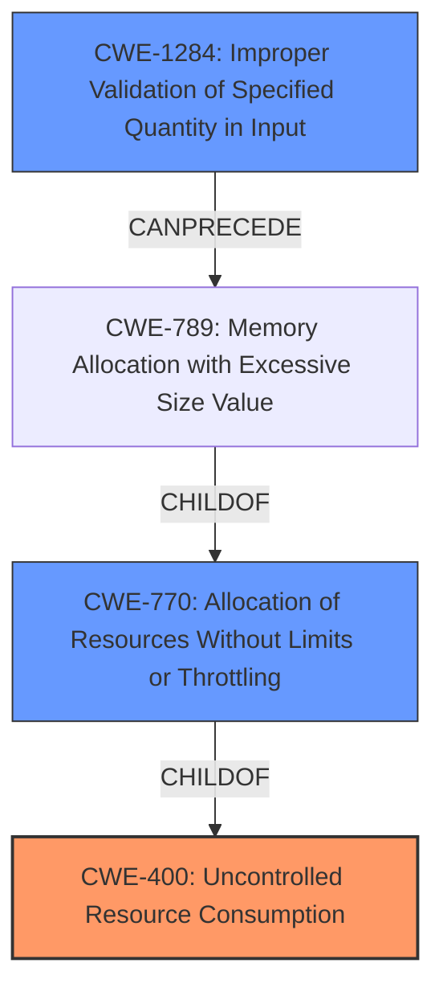

# Enhanced Analysis for CVE-2021-22216

# Summary
| CWE ID    | CWE Name                                        | Confidence | CWE Abstraction Level | CWE Vulnerability Mapping Label | CWE-Vulnerability Mapping Notes |
| :-------- | :---------------------------------------------- | :--------- | :-------------------- | :------------------------------ | :------------------------------ |
| CWE-400   | Uncontrolled Resource Consumption             | 0.9        | Class                 | Primary                         | Discouraged                   |
| CWE-770   | Allocation of Resources Without Limits or Throttling | 0.7        | Base                  | Secondary                       | Allowed                       |
| CWE-1284  | Improper Validation of Specified Quantity in Input | 0.6        | Base                  | Secondary                       | Allowed                       |

## Evidence and Confidence

*   **Confidence Score:** 0.8
*   **Evidence Strength:** MEDIUM

## Relationship Analysis
The primary CWE is CWE-400 [CWE-400: Uncontrolled Resource Consumption], which is a Class-level CWE. A more specific cause may be present such as CWE-770 [CWE-770: Allocation of Resources Without Limits or Throttling] since the vulnerability description mentions "uncontrolled resource consumption" due to a long issue or merge request description. Also present is CWE-1284 [CWE-1284: Improper Validation of Specified Quantity in Input] because of a missing validation of the size of the issue or merge request description.



## Vulnerability Chain
The chain of events includes the **lack of input validation** (specifically, the length of the issue or merge request description), leading to **uncontrolled allocation of resources**, and finally resulting in **uncontrolled resource consumption**, causing a denial-of-service.
  - **Root Cause:** Missing or improper input validation (size/length of the description).
  - **Weakness:** Uncontrolled resource allocation.
  - **Impact:** Denial of Service due to resource exhaustion.

## Summary of Analysis
Based on the vulnerability description, the most relevant CWE is CWE-400 [CWE-400: Uncontrolled Resource Consumption]. The description explicitly mentions "uncontrolled resource consumption," which aligns directly with CWE-400. The retriever also lists CWE-400 as a high scoring candidate. However, the retriever also lists CWE-770 [CWE-770: Allocation of Resources Without Limits or Throttling] and CWE-1284 [CWE-1284: Improper Validation of Specified Quantity in Input], which are more specific. Since the vulnerability is caused by a very long issue or merge request description, then CWE-770 and CWE-1284 are also relevant.

The evidence supporting the classification is:
- The vulnerability description states: "allows an attacker to cause **uncontrolled resource consumption** with a very long issue or merge request description".
- The retriever results list CWE-400 [CWE-400: Uncontrolled Resource Consumption], CWE-770 [CWE-770: Allocation of Resources Without Limits or Throttling] and CWE-1284 [CWE-1284: Improper Validation of Specified Quantity in Input] as the top candidates.

CWE-400 [CWE-400: Uncontrolled Resource Consumption] is a Class-level CWE and is being considered for modification because it might be better considered as a chain. CWE-770 [CWE-770: Allocation of Resources Without Limits or Throttling] and CWE-1284 [CWE-1284: Improper Validation of Specified Quantity in Input] are both Base-level CWEs and are more specific than CWE-400 [CWE-400: Uncontrolled Resource Consumption]. Therefore, I am including them as secondary CWEs.

Relevant CWE Information:

# Enhanced Context (25 CWEs)
The following CWEs were identified as potentially relevant to this vulnerability:

## CWE-1289: Improper Validation of Unsafe Equivalence in Input
**Abstraction Level**: Base
**Similarity Score**: 0.77
**Source**: dense

**Description**:
The product receives an input value that is used as a resource identifier or other type of reference, but it does not validate or incorrectly validates that the input is equivalent to a potentially-unsafe value.

**Mapping Guidance**:
- Usage: Allowed
- Rationale: This CWE entry is at the Base level of abstraction, which is a preferred level of abstraction for mapping to the root causes of vulnerabilities.


## CWE-404: Improper Resource Shutdown or Release
**Abstraction Level**: Class
**Similarity Score**: 0.76
**Source**: dense

**Description**:
The product does not release or incorrectly releases a resource before it is made available for re-use.

**Mapping Guidance**:
- Usage: Allowed-with-Review
- Rationale: This CWE entry is a Class and might have Base-level children that would be more appropriate


## CWE-405: Asymmetric Resource Consumption (Amplification)
**Abstraction Level**: Class
**Similarity Score**: 0.76
**Source**: dense

**Description**:
The product does not properly control situations in which an adversary can cause the product to consume or produce excessive resources without requiring the adversary to invest equivalent work or otherwise prove authorization, i.e., the adversary's influence is "asymmetric."

**Mapping Guidance**:
- Usage: Allowed-with-Review
- Rationale: This CWE entry is a Class and might have Base-level children that would be more appropriate


## CWE-226: Sensitive Information in Resource Not Removed Before Reuse
**Abstraction Level**: Base
**Similarity Score**: 0.75
**Source**: dense

**Description**:
The product releases a resource such as memory or a file so that it can be made available for reuse, but it does not clear or "zeroize" the information contained in the resource before the product performs a critical state transition or makes the resource available for reuse by other entities.

**Mapping Guidance**:
- Usage: Allowed
- Rationale: This CWE entry is at the Base level of abstraction, which is a preferred level of abstraction for mapping to the root causes of vulnerabilities.


## CWE-664: Improper Control of a Resource Through its Lifetime
**Abstraction Level**: Pillar
**Similarity Score**: 0.75
**Source**: dense

**Description**:
The product does not maintain or incorrectly maintains control over a resource throughout its lifetime of creation, use, and release.

**Mapping Guidance**:
- Usage: Discouraged
- Rationale: This CWE entry is high-level when lower-level children are available.


## CWE-274: Improper Handling of Insufficient Privileges
**Abstraction Level**: Base
**Similarity Score**: 0.75
**Source**: dense

**Description**:
The product does not handle or incorrectly handles when it has insufficient privileges to perform an operation, leading to resultant weaknesses.

**Mapping Guidance**:
- Usage: Discouraged
- Rationale: This CWE entry could be deprecated in a future version of CWE.


## CWE-280: Improper Handling of Insufficient Permissions or Privileges 
**Abstraction Level**: Base
**Similarity Score**: 0.75
**Source**: dense

**Description**:
The product does not handle or incorrectly handles when it has insufficient privileges to access resources or functionality as specified by their permissions. This may cause it to follow unexpected code paths that may leave the product in an invalid state.

**Mapping Guidance**:
- Usage: Allowed
- Rationale: This CWE entry is at the Base level of abstraction, which is a preferred level of abstraction for mapping to the root causes of vulnerabilities.


## CWE-668: Exposure of Resource to Wrong Sphere
**Abstraction Level**: Class
**Similarity Score**: 0.74
**Source**: dense

**Description**:
The product exposes a resource to the wrong control sphere, providing unintended actors with inappropriate access to the resource.

**Mapping Guidance**:
- Usage: Discouraged
- Rationale: CWE-668 is high-level and is often misused as a catch-all when lower-level CWE IDs might be applicable. It is sometimes used for low-information vulnerability reports [REF-1287]. It is a level-1 Class (i.e., a child of a Pillar). It is not useful for trend analysis.


## CWE-799: Improper Control of Interaction Frequency
**Abstraction Level**: Class
**Similarity Score**: 0.74
**


## CWE Relationship Analysis

Current CWEs represent these abstraction levels: .


### Vulnerability Chain Analysis

**Chain starting from CWE-664:**
- 664 (Improper Control of a Resource Through its Lifetime) - ROOT


**Chain starting from CWE-404:**
- 404 (Improper Resource Shutdown or Release) - ROOT


### CWE Relationship Diagram

```mermaid
graph TD
    classDef primary fill:#f96,stroke:#333,stroke-width:2px
    classDef secondary fill:#69f,stroke:#333
    classDef tertiary fill:#9e9,stroke:#333
```