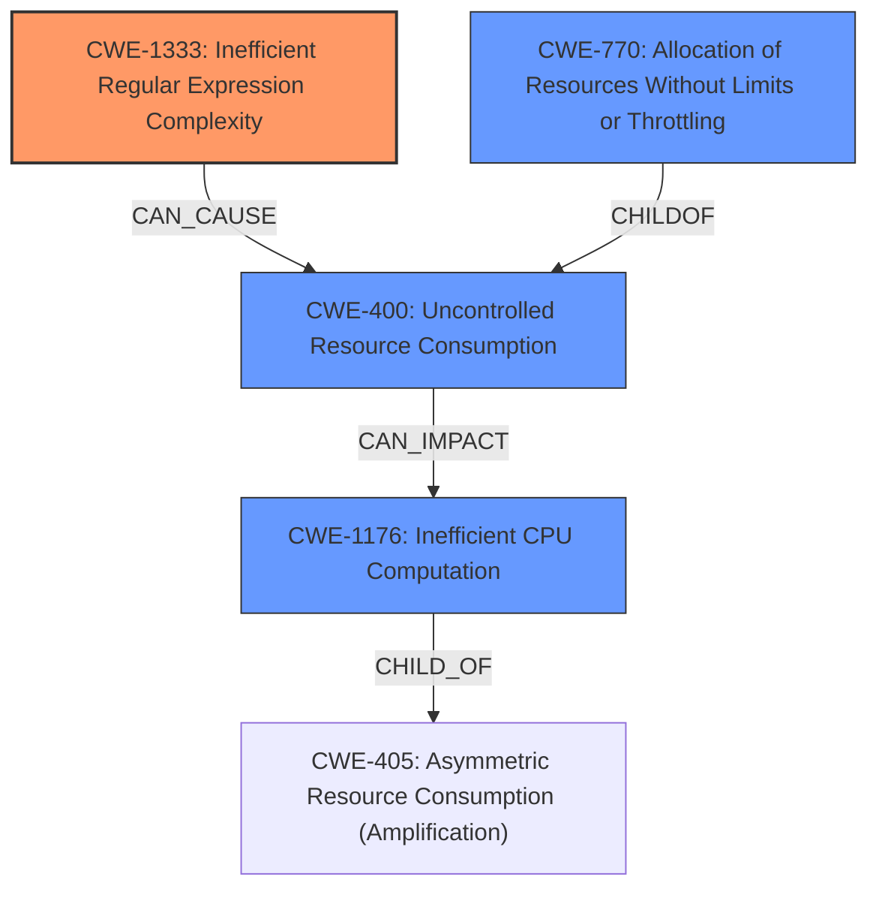

# Analysis Report for CVE-2021-22217

# Vulnerability Analysis Report: CVE-2021-22217

## Description


## Analysis (with Relationship Data)

# Summary
| CWE ID  | CWE Name                                         | Confidence | CWE Abstraction Level | CWE Vulnerability Mapping Label | CWE-Vulnerability Mapping Notes |
| :------- | :----------------------------------------------- | :--------- | :-------------------- | :------------------------------ | :------------------------------ |
| CWE-1333 | Inefficient Regular Expression Complexity      | 0.8        | Base                  | Allowed                         | Primary CWE                     |
| CWE-400  | Uncontrolled Resource Consumption              | 0.6        | Class                 | Discouraged                     | Secondary candidate            |
| CWE-770  | Allocation of Resources Without Limits or Throttling | 0.5       | Base                 | Allowed                         | Secondary candidate            |
| CWE-1176 | Inefficient CPU Computation                    | 0.5        | Class                  | Allowed-with-Review            | Secondary candidate            |

## Evidence and Confidence

*   **Confidence Score:** 0.7
*   **Evidence Strength:** HIGH

## Relationship Analysis
The primary CWE selected is CWE-1333, which focuses on inefficient regular expression complexity as the root cause. This is a base-level CWE providing a specific weakness description. CWE-400 is a class-level CWE that describes the broader impact of uncontrolled resource consumption, but it is discouraged as per MITRE guidance. CWE-770 (Allocation of Resources Without Limits or Throttling) is a child of CWE-400 and represents a related, more specific resource management issue. CWE-1176 (Inefficient CPU Computation) is another relevant Class-level CWE that highlights the performance degradation aspect. The graph relationships influenced the decision by clarifying the hierarchical structure and potential chains of weaknesses, leading to selection of CWE-1333 as a more precise root cause.



## Vulnerability Chain
The vulnerability chain starts with the **inefficient regular expression** within the Markdown rendering engine (CWE-1333). This leads to excessive CPU consumption, which causes uncontrolled resource consumption (CWE-400), eventually resulting in a server-side denial of service (DoS).

## Summary of Analysis
The initial assessment pointed towards CWE-400 due to the high-level description of uncontrolled resource consumption. However, the "CVE Reference Links Content Summary" provides more specific information about the root cause: "Crafted Markdown files trigger performance issues in the Markdown renderers, causing unexpectedly long execution times" and "Performance bug in Markdown rendering". This indicates a more specific weakness within the Markdown rendering process.

The retriever results suggested several CWEs, including CWE-1333 (Inefficient Regular Expression Complexity), CWE-400 (Uncontrolled Resource Consumption), and CWE-770 (Allocation of Resources Without Limits or Throttling). Given the description of the vulnerability involving crafted Markdown files leading to performance issues, CWE-1333 aligns well with the root cause.

CWE-400 is a broader class and is discouraged by MITRE, as more specific CWEs should be preferred. CWE-770 is also relevant as it addresses resource allocation without limits, but it's more applicable if the vulnerability directly involves memory or other resource allocation issues, which is not explicitly stated, though it could be an indirect consequence. CWE-1176 addresses inefficient CPU computation, but it lacks the specificity of the regular expression.

Therefore, CWE-1333 is the most appropriate choice due to its direct relevance to the inefficient regular expression processing the crafted Markdown files. The decision is based on the evidence from the "CVE Reference Links Content Summary" and aligns with MITRE's guidance to choose the most specific CWE.

The selected CWEs are at the optimal level of specificity because CWE-1333 directly addresses the root cause related to inefficient regular expressions, while CWE-400 captures the resulting impact.

Relevant CWE Information:

# Enhanced Context (25 CWEs)

## CWE-404: Improper Resource Shutdown or Release
**Abstraction Level**: Class
**Similarity Score**: 0.76
**Source**: dense

**Description**:
The product does not release or incorrectly releases a resource before it is made available for re-use.

**Mapping Guidance**:
- Usage: Allowed-with-Review
- Rationale: This CWE entry is a Class and might have Base-level children that would be more appropriate

## CWE-664: Improper Control of a Resource Through its Lifetime
**Abstraction Level**: Pillar
**Similarity Score**: 0.75
**Source**: dense

**Description**:
The product does not maintain or incorrectly maintains control over a resource throughout its lifetime of creation, use, and release.

**Mapping Guidance**:
- Usage: Discouraged
- Rationale: This CWE entry is high-level when lower-level children are available.

## CWE-405: Asymmetric Resource Consumption (Amplification)
**Abstraction Level**: Class
**Similarity Score**: 0.75
**Source**: dense

**Description**:
The product does not properly control situations in which an adversary can cause the product to consume or produce excessive resources without requiring the adversary to invest equivalent work or otherwise prove authorization, i.e., the adversary's influence is "asymmetric."

**Mapping Guidance**:
- Usage: Allowed-with-Review
- Rationale: This CWE entry is a Class and might have Base-level children that would be more appropriate

## CWE-274: Improper Handling of Insufficient Privileges
**Abstraction Level**: Base
**Similarity Score**: 0.75
**Source**: dense

**Description**:
The product does not handle or incorrectly handles when it has insufficient privileges to perform an operation, leading to resultant weaknesses.

**Mapping Guidance**:
- Usage: Discouraged
- Rationale: This CWE entry could be deprecated in a future version of CWE.

## CWE-653: Improper Isolation or Compartmentalization
**Abstraction Level**: Class
**Similarity Score**: 0.75
**Source**: dense

**Description**:
The product does not properly compartmentalize or isolate functionality, processes, or resources that require different privilege levels, rights, or permissions.

**Mapping Guidance**:
- Usage: Allowed
- Rationale: This CWE entry is at the Base level of abstraction, which is a preferred level of abstraction for mapping to the root causes of vulnerabilities.

## CWE-668: Exposure of Resource to Wrong Sphere
**Abstraction Level**: Class
**Similarity Score**: 0.75
**Source**: dense

**Description**:
The product exposes a resource to the wrong control sphere, providing unintended actors with inappropriate access to the resource.

**Mapping Guidance**:
- Usage: Discouraged
- Rationale: CWE-668 is high-level and is often misused as a catch-all when lower-level CWE IDs might be applicable. It is sometimes used for low-information vulnerability reports [REF-1287]. It is a level-1 Class (i.e., a child of a Pillar). It is not useful for trend analysis.

## CWE-226: Sensitive Information in Resource Not Removed Before Reuse
**Abstraction Level**: Base
**Similarity Score**: 0.74
**Source**: dense

**Description**:
The product releases a resource such as memory or a file so that it can be made available for reuse, but it does not clear or "zeroize" the information contained in the resource before the product performs a critical state transition or makes the resource available for reuse by other entities.

**Mapping Guidance**:
- Usage: Allowed
- Rationale: This CWE entry is at the Base level of abstraction, which is a preferred level of abstraction for mapping to the root causes of vulnerabilities.

## CWE-1289: Improper Validation of Unsafe Equivalence in Input
**Abstraction Level**: Base
**Similarity Score**: 0.74
**Source**: dense

**Description**:
The product receives an input value that is used as a resource identifier or other type of reference, but it does not validate or incorrectly validates that the input is equivalent to a potentially-unsafe value.

**Mapping Guidance**:
- Usage: Allowed
- Rationale: This CWE entry is at the Base level of abstraction, which is a preferred level of abstraction for mapping to the root causes of vulnerabilities


## CWE Relationship Analysis

Current CWEs represent these abstraction levels: .


### Vulnerability Chain Analysis

**Chain starting from CWE-664:**
- 664 (Improper Control of a Resource Through its Lifetime) - ROOT


**Chain starting from CWE-404:**
- 404 (Improper Resource Shutdown or Release) - ROOT


### CWE Relationship Diagram

```mermaid
graph TD
    classDef primary fill:#f96,stroke:#333,stroke-width:2px
    classDef secondary fill:#69f,stroke:#333
    classDef tertiary fill:#9e9,stroke:#333
```


*Report generated on 2025-04-02 15:46:44*
