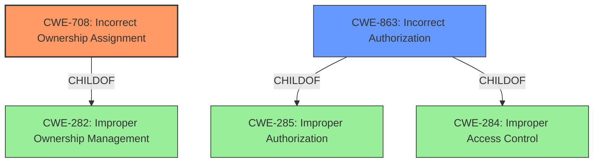

# Raw Analyzer Response for CVE-2021-22252

# Summary
| CWE ID | CWE Name | Confidence | CWE Abstraction Level | CWE Vulnerability Mapping Label | CWE-Vulnerability Mapping Notes |
|---|---|---|---|---|---|
| CWE-708 | Incorrect Ownership Assignment | 0.8 | Base | Primary | Allowed |
| CWE-863 | Incorrect Authorization | 0.6 | Class | Secondary | Allowed-with-Review |

## Evidence and Confidence

*   **Confidence Score:** 0.7
*   **Evidence Strength:** HIGH

## Relationship Analysis
The primary CWE selected is CWE-708, a Base level weakness describing incorrect ownership assignment. CWE-863, a Class level weakness describing incorrect authorization, was considered as a secondary CWE. CWE-708 is a child of CWE-282 (Improper Ownership Management). CWE-863 is a child of CWE-285 (Improper Authorization) and CWE-284 (Improper Access Control). There is a relationship between the two candidate CWEs in that the incorrect ownership assignment (CWE-708) can lead to incorrect authorization (CWE-863). The choice of CWE-708 as primary is based on the more specific nature of the **confusion between tag and branch names** leading to the incorrect assignment of privileges.

## Vulnerability Chain
The vulnerability chain begins with the **confusion between tag and branch names**. This leads to an **incorrect assignment of ownership** (CWE-708) where a branch inherits the privileges of a protected tag. Consequently, this results in **incorrect authorization** (CWE-863), allowing a developer to access protected CI variables. The access to these variables then leads to the **exposure of sensitive information** and potential compromise.

## Summary of Analysis
The initial analysis pointed to authorization issues, but deeper examination of the root cause revealed that the core problem was the **incorrect assignment of ownership** due to the **confusion between tag and branch names**.

The evidence supporting this includes:

*   Vulnerability Description Key Phrases: "**confusion between tag and branch names**"
*   CVE Reference Links Content Summary: "A branch with the same name as a protected tag inherits the privileges of the protected tag during pipeline execution."
*   CVE Reference Links Content Summary: "Incorrect privilege assignment for pipelines triggered by branches with names matching protected tags"

The graph relationships highlighted the connection between ownership and authorization, which aided in understanding the vulnerability's progression. The choice of CWE-708 is based on its ability to directly represent the root cause, while CWE-863 represents the consequence of that root cause.

Relevant CWE Information:

# Enhanced Context (25 CWEs)
The following CWEs were identified as potentially relevant to this vulnerability:

## CWE-668: Exposure of Resource to Wrong Sphere
**Abstraction Level**: Class
**Similarity Score**: 0.76
**Source**: dense

**Description**:
The product exposes a resource to the wrong control sphere, providing unintended actors with inappropriate access to the resource.

**Mapping Guidance**:
- Usage: Discouraged
- Rationale: CWE-668 is high-level and is often misused as a catch-all when lower-level CWE IDs might be applicable. It is sometimes used for low-information vulnerability reports [REF-1287]. It is a level-1 Class (i.e., a child of a Pillar). It is not useful for trend analysis.

*This CWE was considered but deemed less specific than CWE-708 because it focuses on exposure in general, rather than the specific issue of incorrect ownership assignment.*

## CWE-41: Improper Resolution of Path Equivalence
**Abstraction Level**: Base
**Similarity Score**: 0.75
**Source**: dense

**Description**:
The product is vulnerable to file system contents disclosure through path equivalence. Path equivalence involves the use of special characters in file and directory names. The associated manipulations are intended to generate multiple names for the same object.

**Mapping Guidance**:
- Usage: Allowed
- Rationale: This CWE entry is at the Base level of abstraction, which is a preferred level of abstraction for mapping to the root causes of vulnerabilities.

*This CWE was not relevant as it is specifically about path equivalence issues, which are not present in the vulnerability description.*

## CWE-74: Improper Neutralization of Special Elements in Output Used by a Downstream Component ('Injection')
**Abstraction Level**: Class
**Similarity Score**: 0.74
**Source**: dense

**Description**:
The product constructs all or part of a command, data structure, or record using externally-influenced input from an upstream component, but it does not neutralize or incorrectly neutralizes special elements that could modify how it is parsed or interpreted when it is sent to a downstream component.

**Mapping Guidance**:
- Usage: Discouraged
- Rationale: CWE-74 is high-level and often misused when lower-level weaknesses are more appropriate.

*This CWE was not relevant as it is specifically about injection vulnerabilities, which are not present in the vulnerability description.*

## CWE-639: Authorization Bypass Through User-Controlled Key
**Abstraction Level**: Base
**Similarity Score**: 0.74
**Source**: dense

**Description**:
The system's authorization functionality does not prevent one user from gaining access to another user's data or record by modifying the key value identifying the data.

**Mapping Guidance**:
- Usage: Allowed
- Rationale: This CWE entry is at the Base level of abstraction, which is a preferred level of abstraction for mapping to the root causes of vulnerabilities.

*This CWE was considered, but the root cause is not that the user is controlling the key, but that tag and branch names being the same leads to the incorrect authorization.*

## CWE-1289: Improper Validation of Unsafe Equivalence in Input
**Abstraction Level**: Base
**Similarity Score**: 0.74
**Source**: dense

**Description**:
The product receives an input value that is used as a resource identifier or other type of reference, but it does not validate or incorrectly validates that the input is equivalent to a potentially-unsafe value.

**Mapping Guidance**:
- Usage: Allowed
- Rationale: This CWE entry is at the Base level of abstraction, which is a preferred level of abstraction for mapping to the root causes of vulnerabilities.

*This CWE was not relevant as the vulnerability description does not have the product receiving an input value and validating if the input is equivalent to a potentially-unsafe value.*

## CWE-23: Relative Path Traversal
**Abstraction Level**: Base
**Similarity Score**: 0.74
**Source**: dense

**Description**:
The product uses external input to construct a pathname that should be within a restricted directory, but it does not properly neutralize sequences such as ".." that can resolve to a location that is outside of that directory.

**Mapping Guidance**:
- Usage: Allowed
- Rationale: This CWE entry is at the Base level of abstraction, which is a preferred level of abstraction for mapping to the root causes of vulnerabilities.

*This CWE was not relevant as it is specifically about Path Traversal vulnerabilities, which are not present in the vulnerability description.*

## CWE-73: External Control of File Name or Path
**Abstraction Level**: Base
**Similarity Score**: 0.74
**Source**: dense

**Description**:
The product allows user input to control or influence paths or file names that are used in filesystem operations.

**Mapping Guidance**:
- Usage: Allowed
- Rationale: This CWE entry is at the Base level of abstraction, which is a preferred level of abstraction for mapping to the root causes of vulnerabilities.

*This CWE was not relevant as it is specifically about external control of filenames, which are not present in the vulnerability description.*

## CWE-59: Improper Link Resolution Before File Access ('Link Following')
**Abstraction Level**: Base
**Similarity Score**: 0.74
**Source**: dense

**Description**:
The product attempts to access a file based on the filename, but it does not properly prevent that filename from identifying a link or shortcut that resolves to an unintended resource.

**Mapping Guidance**:
- Usage: Allowed
- Rationale: This CWE entry is at the Base level of abstraction, which is a preferred level of abstraction for mapping to the root causes of vulnerabilities.

*This CWE was not relevant as it is specifically about link following, which is not