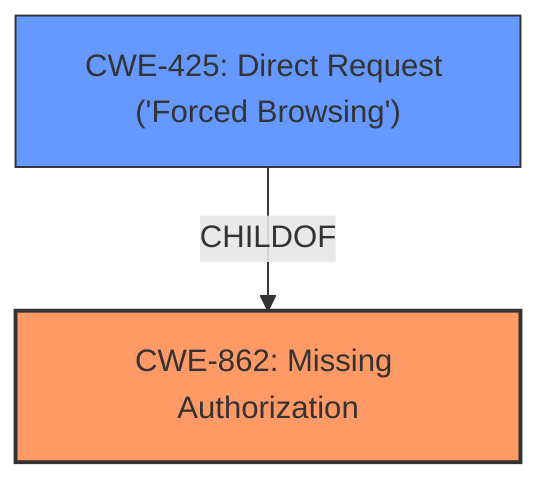

# Analysis for CVE-2021-22256

# Summary
| CWE ID  | CWE Name                                         | Confidence | CWE Abstraction Level | CWE Vulnerability Mapping Label | CWE-Vulnerability Mapping Notes |
| :-------- | :----------------------------------------------- | :--------- | :---------------------- | :------------------------------ | :-------------------------------- |
| CWE-862 | Missing Authorization                             | 1          | Class                  | Allowed-with-Review              | Primary CWE                     |
| CWE-425 | Direct Request ('Forced Browsing')             | 0.9        | Base                   | Allowed                         | Secondary Candidate             |

## Evidence and Confidence

*   **Confidence Score:** 0.95
*   **Evidence Strength:** HIGH

## Relationship Analysis
The primary relationship impacting the decision is the child-of relationship between CWE-425 and CWE-862. CWE-425 is a more specific case of CWE-862 where the authorization is missing on a direct request. The analysis considered both, but ultimately mapped to the higher-level CWE-862 since the description highlights the general **improper authorization** more than the specific mechanism of direct request.

## Vulnerability Chain
The vulnerability chain starts with the **improper authorization**, leading to the impact of guest users creating issues for Sentry errors and tracking their status.

## Summary of Analysis
The initial analysis focused on identifying the root cause of the vulnerability, which is the **improper authorization**. The vulnerability description and the CVE details confirm that the system **fails to** perform an authorization check, allowing guest users to perform actions they should not be able to.

The vulnerability description key phrases include:
- **rootcause:** **Improper authorization**
- **impact:** create issues for Sentry errors and track their status
- **attacker:** guest users

The CVE reference content summary explicitly states the root cause as insufficient access control, where Guest users were able to create issues linked to Sentry errors.

Based on this evidence, CWE-862, Missing Authorization, was selected as the primary CWE. CWE-425, Direct Request ('Forced Browsing'), was considered as a more specific case but ultimately deemed less fitting because the primary issue is the lack of authorization check regardless of the request type.

Relevant CWE Information:

# Enhanced Context (25 CWEs)
The following CWEs were identified as potentially relevant to this vulnerability:

## CWE-639: Authorization Bypass Through User-Controlled Key
**Abstraction Level**: Base
**Similarity Score**: 0.77
**Source**: dense

**Description**:
The system's authorization functionality does not prevent one user from gaining access to another user's data or record by modifying the key value identifying the data.

**Mapping Guidance**:
- Usage: Allowed
- Rationale: This CWE entry is at the Base level of abstraction, which is a preferred level of abstraction for mapping to the root causes of vulnerabilities.

## CWE-862: Missing Authorization
**Abstraction Level**: Class
**Similarity Score**: 5795.37
**Source**: sparse

**Description**:
The product does not perform an authorization check when an actor attempts to access a resource or perform an action.

**Mapping Guidance**:
- Usage: Allowed-with-Review
- Rationale: This CWE entry is a Class and might have Base-level children that would be more appropriate

## CWE-425: Direct Request ('Forced Browsing')
**Abstraction Level**: Base
**Similarity Score**: 6132.70
**Source**: sparse

**Description**:
The web application does not adequately enforce appropriate authorization on all restricted URLs, scripts, or files.

**Mapping Guidance**:
- Usage: Allowed
- Rationale: This CWE entry is at the Base level of abstraction, which is a preferred level of abstraction for mapping to the root causes of vulnerabilities.

## CWE-862: Missing Authorization (Primary: Confidence 1.0)
*   **Technical Explanation:** CWE-862 [Missing Authorization] describes the scenario where a product **does not** perform an authorization check when an actor attempts to access a resource or perform an action. In this vulnerability, GitLab CE/EE **fails to** properly authorize guest users when they attempt to create issues for Sentry errors. The CVE reference confirms the root cause stems from insufficient access control.
*   **Security Implications:** The security implication is that unauthorized users (guest users) can perform actions (creating issues, tracking status) that should be restricted to users with higher privileges. This could lead to information leakage and unauthorized modification of issue tracking data.
*   **Relationship to Other CWEs:** CWE-862 is a child of CWE-285 [Improper Authorization] and CWE-284 [Improper Access Control].
*   **MITRE Mapping Guidance:** The MITRE mapping guidance for CWE-862 suggests that it is a Class-level CWE, and a more specific Base-level CWE might be more appropriate. However, in this case, the general lack of authorization is the core issue.
*   **Evidence:** "Improper authorization in GitLab CE/EE affecting all versions since 12.6 allowed guest users to create issues for Sentry errors and track their status"
"The vulnerability stems from insufficient access control in GitLab's error tracking feature, specifically regarding the ability for Guest users to create issues linked to Sentry errors."

## CWE-425: Direct Request ('Forced Browsing') (Secondary: Confidence 0.9)
*   **Technical Explanation:** CWE-425 [Direct Request ('Forced Browsing')] describes the scenario where a web application **does not adequately** enforce appropriate authorization on all restricted URLs, scripts, or files. The attacker is able to directly request a resource that is meant to be protected. In this case the "Create Issue" functionality allows Guest users to bypass the intended access control system.
*   **Security Implications:** The security implication is that unauthorized users can access restricted resources by directly requesting them, bypassing intended authorization checks. This can lead to information disclosure and unauthorized modification of data.
*   **Relationship to Other CWEs:** CWE-425 is a child of CWE-862 [Missing Authorization] and CWE-288 [Authentication Bypass Using an Alternate Path or Channel].
*   **MITRE Mapping Guidance:** The MITRE mapping guidance for CWE-425 states that it is at the Base level of abstraction, which is a preferred level of abstraction for mapping to the root causes of vulnerabilities. The guidance also notes that it overlaps with authorization errors.
*   **Evidence:** "the "Create Issue" functionality allows Guest users to bypass these permissions."

## Other CWEs Considered But Not Used:

*   CWE-284 [Improper Access Control]: This is a very high-level CWE (Pillar) and is discouraged. More specific CWEs such as CWE-862 are more appropriate.
*   CWE-285 [Improper Authorization]: This is a Class-level CWE and is discouraged. More specific CWEs such as CWE-862 are more appropriate.
*   CWE-639 [Authorization Bypass Through User-Controlled Key]: While this CWE is related to authorization bypass, it focuses on the scenario where a user can modify a key to access another user's data. This is not the case here, as the guest user is simply missing authorization to create issues.
*   CWE-863 [Incorrect Authorization]: The vulnerability is due to the **missing** authorization check, not an incorrect one. Therefore, CWE-863 is not the best fit.
*   CWE-472 [External Control of Assumed-Immutable Web Parameter]: This vulnerability stems from missing authorization checks, not from external control of assumed-immutable web parameters.
*   CWE-41 [Improper Resolution of Path Equivalence]: This vulnerability stems from missing authorization checks, not from file system contents disclosure through path equivalence.
*   CWE-668 [Exposure of Resource to Wrong Sphere]: This CWE is too generic.
*   CWE-274 [Improper Handling of Insufficient Privileges]: The primary problem is not the handling of insufficient privileges, but the missing authorization check.
*   CWE-552 [Files or Directories Accessible to External Parties]: The vulnerability is not about files or directories accessible to external parties.
*   CWE-451 [User Interface (UI) Misrepresentation of Critical Information]: The vulnerability is not about misrepresentation of critical information in the UI.
*   CWE-471: Modification of Assumed-Immutable Data (MAID): Not applicable, this is about modifying data assumed to be immutable.
*   CWE-98: Improper Control of Filename for Include/Require Statement in PHP Program ('PHP Remote File Inclusion'): Not applicable, this is specific to PHP file inclusion.
*   CWE-178: Improper Handling of Case Sensitivity: Not applicable, the vulnerability is not related to case sensitivity