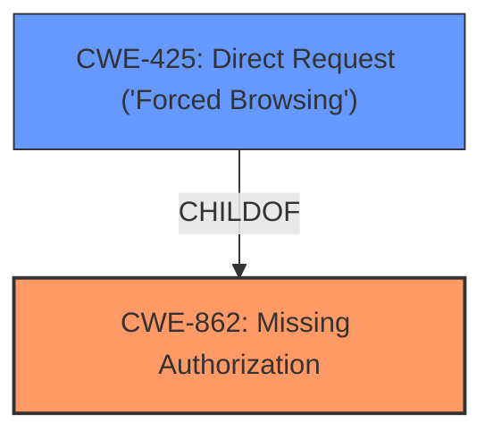

# Analysis for CVE-2021-22256

# Summary
| CWE ID  | CWE Name                                         | Confidence | CWE Abstraction Level | CWE Vulnerability Mapping Label | CWE-Vulnerability Mapping Notes |
| :-------- | :----------------------------------------------- | :--------- | :---------------------- | :------------------------------ | :-------------------------------- |
| CWE-862 | Missing Authorization                             | 1          | Class                  | Allowed-with-Review              | Primary CWE                     |
| CWE-425 | Direct Request ('Forced Browsing')             | 0.9        | Base                   | Allowed                         | Secondary Candidate             |

## Evidence and Confidence

*   **Confidence Score:** 0.95
*   **Evidence Strength:** HIGH

## Relationship Analysis
The primary relationship impacting the decision is the child-of relationship between CWE-425 and CWE-862. CWE-425 is a more specific case of CWE-862 where the authorization is missing on a direct request. The analysis considered both, but ultimately mapped to the higher-level CWE-862 since the description highlights the general **improper authorization** more than the specific mechanism of direct request.



## Vulnerability Chain
The vulnerability chain starts with the **improper authorization**, leading to the impact of guest users creating issues for Sentry errors and tracking their status.

## Summary of Analysis
The initial analysis focused on identifying the root cause of the vulnerability, which is the **improper authorization**. The vulnerability description and the CVE details confirm that the system **fails to** perform an authorization check, allowing guest users to perform actions they should not be able to.

The vulnerability description key phrases include:
- **rootcause:** **Improper authorization**
- **impact:** create issues for Sentry errors and track their status
- **attacker:** guest users

The CVE reference content summary explicitly states the root cause as insufficient access control, where Guest users were able to create issues linked to Sentry errors.

Based on this evidence, CWE-862, Missing Authorization, was selected as the primary CWE. CWE-425, Direct Request ('Forced Browsing'), was considered as a more specific case but ultimately deemed less fitting because the primary issue is the lack of authorization check regardless of the request type.

Relevant CWE Information:

# Enhanced Context (25 CWEs)
The following CWEs were identified as potentially relevant to this vulnerability:

## CWE-639: Authorization Bypass Through User-Controlled Key
**Abstraction Level**: Base
**Similarity Score**: 0.77
**Source**: dense

**Description**:
The system's authorization functionality does not prevent one user from gaining access to another user's data or record by modifying the key value identifying the data.

**Mapping Guidance**:
- Usage: Allowed
- Rationale: This CWE entry is at the Base level of abstraction, which is a preferred level of abstraction for mapping to the root causes of vulnerabilities.

## CWE-862: Missing Authorization
**Abstraction Level**: Class
**Similarity Score**: 5795.37
**Source**: sparse

**Description**:
The product does not perform an authorization check when an actor attempts to access a resource or perform an action.

**Mapping Guidance**:
- Usage: Allowed-with-Review
- Rationale: This CWE entry is a Class and might have Base-level children that would be more appropriate

## CWE-425: Direct Request ('Forced Browsing')
**Abstraction Level**: Base
**Similarity Score**: 6132.70
**Source**: sparse

**Description**:
The web application does not adequately enforce appropriate authorization on all restricted URLs, scripts, or files.

**Mapping Guidance**:
- Usage: Allowed
- Rationale: This CWE entry is at the Base level of abstraction, which is a preferred level of abstraction for mapping to the root causes of vulnerabilities.

## CWE-862: Missing Authorization (Primary: Confidence 1.0)
*   **Technical Explanation:** CWE-862 [Missing Authorization] describes the scenario where a product **does not** perform an authorization check when an actor attempts to access a resource or perform an action. In this vulnerability, GitLab CE/EE **fails to** properly authorize guest users when they attempt to create issues for Sentry errors. The CVE reference confirms the root cause stems from insufficient access control.
*   **Security Implications:** The security implication is that unauthorized users (guest users) can perform actions (creating issues, tracking status) that should be restricted to users with higher privileges. This could lead to information leakage and unauthorized modification of issue tracking data.
*   **Relationship to Other CWEs:** CWE-862 is a child of CWE-285 [Improper Authorization] and CWE-284 [Improper Access Control].
*   **MITRE Mapping Guidance:** The MITRE mapping guidance for CWE-862 suggests that it is a Class-level CWE, and a more specific Base-level CWE might be more appropriate. However, in this case, the general lack of authorization is the core issue.
*   **Evidence:** "Improper authorization in GitLab CE/EE affecting all versions since 12.6 allowed guest users to create issues for Sentry errors and track their status"
"The vulnerability stems from insufficient access control in GitLab's error tracking feature, specifically regarding the ability for Guest users to create issues linked to Sentry errors."

## CWE-425: Direct Request ('Forced Browsing') (Secondary: Confidence 0.9)
*   **Technical Explanation:** CWE-425 [Direct Request ('Forced Browsing')] describes the scenario where a web application **does not adequately** enforce appropriate authorization on all restricted URLs, scripts, or files. The attacker is able to directly request a resource that is meant to be protected. In this case the "Create Issue" functionality allows Guest users to bypass the intended access control system.
*   **Security Implications:** The security implication is that unauthorized users can access restricted resources by directly requesting them, bypassing intended authorization checks. This can lead to information disclosure and unauthorized modification of data.
*   **Relationship to Other CWEs:** CWE-425 is a child of CWE-862 [Missing Authorization] and CWE-288 [Authentication Bypass Using an Alternate Path or Channel].
*   **MITRE Mapping Guidance:** The MITRE mapping guidance for CWE-425 states that it is at the Base level of abstraction, which is a preferred level of abstraction for mapping to the root causes of vulnerabilities. The guidance also notes that it overlaps with authorization errors.
*   **Evidence:** "the "Create Issue" functionality allows Guest users to bypass these permissions."

## Other CWEs Considered But Not Used:

*   CWE-284 [Improper Access Control]: This is a very high-level CWE (Pillar) and is discouraged. More specific CWEs such as CWE-862 are more appropriate.
*   CWE-285 [Improper Authorization]: This is a Class-level CWE and is discouraged. More specific CWEs such as CWE-862 are more appropriate.
*   CWE-639 [Authorization Bypass Through User-Controlled Key]: While this CWE is related to authorization bypass, it focuses on the scenario where a user can modify a key to access another user's data. This is not the case here, as the guest user is simply missing authorization to create issues.
*   CWE-863 [Incorrect Authorization]: The vulnerability is due to the **missing** authorization check, not an incorrect one. Therefore, CWE-863 is not the best fit.
*   CWE-472 [External Control of Assumed-Immutable Web Parameter]: This vulnerability stems from missing authorization checks, not from external control of assumed-immutable web parameters.
*   CWE-41 [Improper Resolution of Path Equivalence]: This vulnerability stems from missing authorization checks, not from file system contents disclosure through path equivalence.
*   CWE-668 [Exposure of Resource to Wrong Sphere]: This CWE is too generic.
*   CWE-274 [Improper Handling of Insufficient Privileges]: The primary problem is not the handling of insufficient privileges, but the missing authorization check.
*   CWE-552 [Files or Directories Accessible to External Parties]: The vulnerability is not about files or directories accessible to external parties.
*   CWE-451 [User Interface (UI) Misrepresentation of Critical Information]: The vulnerability is not about misrepresentation of critical information in the UI.
*   CWE-471: Modification of Assumed-Immutable Data (MAID): Not applicable, this is about modifying data assumed to be immutable.
*   CWE-98: Improper Control of Filename for Include/Require Statement in PHP Program ('PHP Remote File Inclusion'): Not applicable, this is specific to PHP file inclusion.
*   CWE-178: Improper Handling of Case Sensitivity: Not applicable, the vulnerability is not related to case sensitivity

# Enhanced Query for CVE-2021-22256

## Vulnerability Description
**Improper authorization** in GitLab CE/EE affecting all versions since 12.6 allowed guest users to create issues for Sentry errors and track their status

### Vulnerability Description Key Phrases
- **rootcause:** **Improper authorization**
- **impact:** create issues for Sentry errors and track their status
- **attacker:** guest users
- **product:** GitLab CE/EE
- **version:** all versions since 12.6

## CVE Reference Links Content Summary
Based on the provided content, here's an analysis of the vulnerability:

**CVE ID:** CVE-2021-22256

**Root Cause of Vulnerability:**
The vulnerability stems from insufficient access control in GitLab's error tracking feature, specifically regarding the ability for Guest users to create issues linked to Sentry errors. While the documentation states that only users with "Reporter" or higher roles should be able to interact with error tracking details, the "Create Issue" functionality allows Guest users to bypass these permissions.

**Weaknesses/Vulnerabilities Present:**
- **Inadequate Access Control:** Guest users were able to create issues linked to Sentry errors, despite not having the appropriate permissions to modify or even view most error tracking details.
- **Bypass of Intended Permissions:** The "Create Issue" feature allowed Guest users to interact with error tracking in a way that the intended access control system should have prevented.

**Impact of Exploitation:**
- **Unauthorized Issue Creation:** Guest users can create issues based on Sentry errors.
- **Error Tracking Status Monitoring:** Guest users can track the status of issues they created related to Sentry errors, even when these issues are resolved by users with higher permissions. This allows guest users to infer actions taken by maintainers/higher role users

**Attack Vectors:**
- **Direct HTTP Request Manipulation:** Attackers can exploit the vulnerability by crafting and sending a specific POST request to the GitLab server, using the `issue` parameters, specifying the title, description, and `sentry_issue_identifier`. The request needs to be authenticated as a `Guest` user.
- **Sentry Error Identifier Requirement**: An attacker needs to have the Sentry error identifier, which is populated in the GitLab error tracking list when sent to Sentry by a user with higher permissions.

**Required Attacker Capabilities/Position:**
- **GitLab Guest User Account:** The attacker needs to have a `Guest` user account on the GitLab project.
- **Knowledge of Sentry Error ID:** The attacker needs access to a Sentry error ID that exists in the GitLab project's error tracking list.
- **Ability to craft HTTP requests:** The attacker has to be able to craft and send POST requests to the GitLab server.

**Additional Details:**
- The provided HackerOne report highlights a specific scenario where a Guest user can create an issue for a Sentry error and track its status, demonstrating the bypass of the permission model.
- The report includes a detailed step-by-step guide on how to reproduce the vulnerability.

This vulnerability allows a Guest user to indirectly interact with Sentry error tracking data, which they normally shouldn't have access to. The Guest user can use this to infer status changes from other, higher permission users.

## Retriever Results

### Top Combined Results

| Rank | CWE ID | Name | Abstraction | Usage  | Retrievers | Individual Scores |
|------|--------|------|-------------|-------|------------|-------------------|
| 1 | 284 | Improper Access Control | Pillar | Discouraged | alternate_terms | 0.800 |
| 2 | 285 | Improper Authorization | Class | Discouraged | sparse | 0.190 |
| 3 | 863 | Incorrect Authorization | Class | Allowed-with-Review | sparse | 0.189 |
| 4 | 639 | Authorization Bypass Through User-Controlled Key | Base | Allowed | sparse | 0.170 |
| 5 | 267 | Privilege Defined With Unsafe Actions | Base | Allowed | sparse | 0.147 |
| 6 | 282 | Improper Ownership Management | Class | Allowed-with-Review | dense | 0.494 |
| 7 | 1299 | Missing Protection Mechanism for Alternate Hardware Interface | Base | Allowed | graph | 0.001 |
| 8 | 565 | Reliance on Cookies without Validation and Integrity Checking | Base | Allowed | sparse | 0.146 |
| 9 | 862 | Missing Authorization | Class | Allowed-with-Review | sparse | 0.141 |
| 10 | 425 | Direct Request ('Forced Browsing') | Base | Allowed | sparse | 0.137 |


# Complete CWE Specifications


## CWE-284: Improper Access Control
**Abstraction:** Pillar
**Status:** Incomplete

### Description
The product does not restrict or incorrectly restricts access to a resource from an unauthorized actor.

### Extended Description


Access control involves the use of several protection mechanisms such as:


  - Authentication (proving the identity of an actor)

  - Authorization (ensuring that a given actor can access a resource), and

  - Accountability (tracking of activities that were performed)

When any mechanism is not applied or otherwise fails, attackers can compromise the security of the product by gaining privileges, reading sensitive information, executing commands, evading detection, etc.

There are two distinct behaviors that can introduce access control weaknesses:


  - Specification: incorrect privileges, permissions, ownership, etc. are explicitly specified for either the user or the resource (for example, setting a password file to be world-writable, or giving administrator capabilities to a guest user). This action could be performed by the program or the administrator.

  - Enforcement: the mechanism contains errors that prevent it from properly enforcing the specified access control requirements (e.g., allowing the user to specify their own privileges, or allowing a syntactically-incorrect ACL to produce insecure settings). This problem occurs within the program itself, in that it does not actually enforce the intended security policy that the administrator specifies.


### Alternative Terms
Authorization: The terms "access control" and "authorization" are often used interchangeably, although many people have distinct definitions. The CWE usage of "access control" is intended as a general term for the various mechanisms that restrict which users can access which resources, and "authorization" is more narrowly defined. It is unlikely that there will be community consensus on the use of these terms.

### Relationships
None

### Mapping Guidance
**Usage:** Discouraged
**Rationale:** CWE-284 is extremely high-level, a Pillar. Its name, "Improper Access Control," is often misused in low-information vulnerability reports [REF-1287] or by active use of the OWASP Top Ten, such as "A01:2021-Broken Access Control". It is not useful for trend analysis.
**Comments:** Consider using descendants of CWE-284 that are more specific to the kind of access control involved, such as those involving authorization (Missing Authorization (CWE-862), Incorrect Authorization (CWE-863), Incorrect Permission Assignment for Critical Resource (CWE-732), etc.); authentication (Missing Authentication (CWE-306) or Weak Authentication (CWE-1390)); Incorrect User Management (CWE-286); Improper Restriction of Communication Channel to Intended Endpoints (CWE-923); etc.
**Reasons:**
- Frequent Misuse
- Abstraction
**Suggested Alternatives:**
- CWE-862: Missing Authorization
- CWE-863: Incorrect Authorization
- CWE-732: Incorrect Permission Assignment for Critical Resource
- CWE-306: Missing Authentication
- CWE-1390: Weak Authentication
- CWE-923: Improper Restriction of Communication Channel to Intended Endpoints


### Additional Notes
**[Maintenance]** 

This entry needs more work. Possible sub-categories include:


  - Trusted group includes undesired entities (partially covered by CWE-286)

  - Group can perform undesired actions

  - ACL parse error does not fail closed


### Observed Examples
- **CVE-2022-24985:** A form hosting website only checks the session authentication status for a single form, making it possible to bypass authentication when there are multiple forms
- **CVE-2022-29238:** Access-control setting in web-based document collaboration tool is not properly implemented by the code, which prevents listing hidden directories but does not prevent direct requests to files in those directories.
- **CVE-2022-23607:** Python-based HTTP library did not scope cookies to a particular domain such that "supercookies" could be sent to any domain on redirect


## CWE-285: Improper Authorization
**Abstraction:** Class
**Status:** Draft

### Description
The product does not perform or incorrectly performs an authorization check when an actor attempts to access a resource or perform an action.

### Extended Description


Assuming a user with a given identity, authorization is the process of determining whether that user can access a given resource, based on the user's privileges and any permissions or other access-control specifications that apply to the resource.


When access control checks are not applied consistently - or not at all - users are able to access data or perform actions that they should not be allowed to perform. This can lead to a wide range of problems, including information exposures, denial of service, and arbitrary code execution.


### Alternative Terms
AuthZ: "AuthZ" is typically used as an abbreviation of "authorization" within the web application security community. It is distinct from "AuthN" (or, sometimes, "AuthC") which is an abbreviation of "authentication." The use of "Auth" as an abbreviation is discouraged, since it could be used for either authentication or authorization.

### Relationships
ChildOf -> CWE-284
ChildOf -> CWE-284

### Mapping Guidance
**Usage:** Discouraged
**Rationale:** CWE-285 is high-level and lower-level CWEs can frequently be used instead. It is a level-1 Class (i.e., a child of a Pillar).
**Comments:** Look at CWE-285's children and consider mapping to CWEs such as CWE-862: Missing Authorization, CWE-863: Incorrect Authorization, CWE-732: Incorrect Permission Assignment for Critical Resource, or others.
**Reasons:**
- Abstraction
**Suggested Alternatives:**
- CWE-862: Missing Authorization
- CWE-863: Incorrect Authorization
- CWE-732: Incorrect Permission Assignment for Critical Resource


### Observed Examples
- **CVE-2022-24730:** Go-based continuous deployment product does not check that a user has certain privileges to update or create an app, allowing adversaries to read sensitive repository information
- **CVE-2009-3168:** Web application does not restrict access to admin scripts, allowing authenticated users to reset administrative passwords.
- **CVE-2009-2960:** Web application does not restrict access to admin scripts, allowing authenticated users to modify passwords of other users.


## CWE-863: Incorrect Authorization
**Abstraction:** Class
**Status:** Incomplete

### Description
The product performs an authorization check when an actor attempts to access a resource or perform an action, but it does not correctly perform the check.

### Extended Description
Not provided

### Alternative Terms
AuthZ: "AuthZ" is typically used as an abbreviation of "authorization" within the web application security community. It is distinct from "AuthN" (or, sometimes, "AuthC") which is an abbreviation of "authentication." The use of "Auth" as an abbreviation is discouraged, since it could be used for either authentication or authorization.

### Relationships
ChildOf -> CWE-285
ChildOf -> CWE-284

### Mapping Guidance
**Usage:** Allowed-with-Review
**Rationale:** This CWE entry is a Class and might have Base-level children that would be more appropriate
**Comments:** Examine children of this entry to see if there is a better fit
**Reasons:**
- Abstraction


### Additional Notes
**[Terminology]** 

Assuming a user with a given identity, authorization is the process of determining whether that user can access a given resource, based on the user's privileges and any permissions or other access-control specifications that apply to the resource.


### Observed Examples
- **CVE-2021-39155:** Chain: A microservice integration and management platform compares the hostname in the HTTP Host header in a case-sensitive way (CWE-178, CWE-1289), allowing bypass of the authorization policy (CWE-863) using a hostname with mixed case or other variations.
- **CVE-2019-15900:** Chain: sscanf() call is used to check if a username and group exists, but the return value of sscanf() call is not checked (CWE-252), causing an uninitialized variable to be checked (CWE-457), returning success to allow authorization bypass for executing a privileged (CWE-863).
- **CVE-2009-2213:** Gateway uses default "Allow" configuration for its authorization settings.


## CWE-639: Authorization Bypass Through User-Controlled Key
**Abstraction:** Base
**Status:** Incomplete

### Description
The system's authorization functionality does not prevent one user from gaining access to another user's data or record by modifying the key value identifying the data.

### Extended Description


Retrieval of a user record occurs in the system based on some key value that is under user control. The key would typically identify a user-related record stored in the system and would be used to lookup that record for presentation to the user. It is likely that an attacker would have to be an authenticated user in the system. However, the authorization process would not properly check the data access operation to ensure that the authenticated user performing the operation has sufficient entitlements to perform the requested data access, hence bypassing any other authorization checks present in the system.


For example, attackers can look at places where user specific data is retrieved (e.g. search screens) and determine whether the key for the item being looked up is controllable externally. The key may be a hidden field in the HTML form field, might be passed as a URL parameter or as an unencrypted cookie variable, then in each of these cases it will be possible to tamper with the key value.


One manifestation of this weakness is when a system uses sequential or otherwise easily-guessable session IDs that would allow one user to easily switch to another user's session and read/modify their data.


### Alternative Terms
Insecure Direct Object Reference / IDOR: The "Insecure Direct Object Reference" term, as described in the OWASP Top Ten, is broader than this CWE because it also covers path traversal (CWE-22). Within the context of vulnerability theory, there is a similarity between the OWASP concept and CWE-706: Use of Incorrectly-Resolved Name or Reference.
Broken Object Level Authorization / BOLA: BOLA is used in the 2019 OWASP API Security Top 10 and is said to be the same as IDOR.
Horizontal Authorization: "Horizontal Authorization" is used to describe situations in which two users have the same privilege level, but must be prevented from accessing each other's resources. This is fairly common when using key-based access to resources in a multi-user context.

### Relationships
ChildOf -> CWE-863
ChildOf -> CWE-863
ChildOf -> CWE-284

### Mapping Guidance
**Usage:** Allowed
**Rationale:** This CWE entry is at the Base level of abstraction, which is a preferred level of abstraction for mapping to the root causes of vulnerabilities.
**Comments:** Carefully read both the name and description to ensure that this mapping is an appropriate fit. Do not try to 'force' a mapping to a lower-level Base/Variant simply to comply with this preferred level of abstraction.
**Reasons:**
- Acceptable-Use


### Observed Examples
- **CVE-2021-36539:** An educational application does not appropriately restrict file IDs to a particular user. The attacker can brute-force guess IDs, indicating IDOR.


## CWE-267: Privilege Defined With Unsafe Actions
**Abstraction:** Base
**Status:** Incomplete

### Description
A particular privilege, role, capability, or right can be used to perform unsafe actions that were not intended, even when it is assigned to the correct entity.

### Extended Description
Not provided

### Alternative Terms
None

### Relationships
ChildOf -> CWE-269

### Mapping Guidance
**Usage:** Allowed
**Rationale:** This CWE entry is at the Base level of abstraction, which is a preferred level of abstraction for mapping to the root causes of vulnerabilities.
**Comments:** Carefully read both the name and description to ensure that this mapping is an appropriate fit. Do not try to 'force' a mapping to a lower-level Base/Variant simply to comply with this preferred level of abstraction.
**Reasons:**
- Acceptable-Use


### Additional Notes
**[Maintenance]** 

Note: there are 2 separate sub-categories here:

```
		- privilege incorrectly allows entities to perform certain actions
		- object is incorrectly accessible to entities with a given privilege
```


### Observed Examples
- **CVE-2002-1981:** Roles have access to dangerous procedures (Accessible entities).
- **CVE-2002-1671:** Untrusted object/method gets access to clipboard (Accessible entities).
- **CVE-2004-2204:** Gain privileges using functions/tags that should be restricted (Accessible entities).


## CWE-282: Improper Ownership Management
**Abstraction:** Class
**Status:** Draft

### Description
The product assigns the wrong ownership, or does not properly verify the ownership, of an object or resource.

### Extended Description
Not provided

### Alternative Terms
None

### Relationships
ChildOf -> CWE-284

### Mapping Guidance
**Usage:** Allowed-with-Review
**Rationale:** This CWE entry is a Class and might have Base-level children that would be more appropriate
**Comments:** Examine children of this entry to see if there is a better fit
**Reasons:**
- Abstraction


### Additional Notes
**[Maintenance]** The relationships between privileges, permissions, and actors (e.g. users and groups) need further refinement within the Research view. One complication is that these concepts apply to two different pillars, related to control of resources (CWE-664) and protection mechanism failures (CWE-693).


### Observed Examples
- **CVE-1999-1125:** Program runs setuid root but relies on a configuration file owned by a non-root user.


## CWE-1299: Missing Protection Mechanism for Alternate Hardware Interface
**Abstraction:** Base
**Status:** Draft

### Description
The lack of protections on alternate paths to access
                control-protected assets (such as unprotected shadow registers
                and other external facing unguarded interfaces) allows an
                attacker to bypass existing protections to the asset that are
		only performed against the primary path.

### Extended Description


An asset inside a chip might have access-control protections through one interface. However, if all paths to the asset are not protected, an attacker might compromise the asset through alternate paths. These alternate paths could be through shadow or mirror registers inside the IP core, or could be paths from other external-facing interfaces to the IP core or SoC.


Consider an SoC with various interfaces such as UART, SMBUS, PCIe, USB, etc. If access control is implemented for SoC internal registers only over the PCIe interface, then an attacker could still modify the SoC internal registers through alternate paths by coming through interfaces such as UART, SMBUS, USB, etc. 


Alternatively, attackers might be able to bypass existing protections by exploiting unprotected, shadow registers. Shadow registers and mirror registers typically refer to registers that can be accessed from multiple addresses. Writing to or reading from the aliased/mirrored address has the same effect as writing to the address of the main register. They are typically implemented within an IP core or SoC to temporarily hold certain data. These data will later be updated to the main register, and both registers will be in synch. If the shadow registers are not access-protected, attackers could simply initiate transactions to the shadow registers and compromise system security. 


### Alternative Terms
None

### Relationships
PeerOf -> CWE-1191
ChildOf -> CWE-420
ChildOf -> CWE-288

### Mapping Guidance
**Usage:** Allowed
**Rationale:** This CWE entry is at the Base level of abstraction, which is a preferred level of abstraction for mapping to the root causes of vulnerabilities.
**Comments:** Carefully read both the name and description to ensure that this mapping is an appropriate fit. Do not try to 'force' a mapping to a lower-level Base/Variant simply to comply with this preferred level of abstraction.
**Reasons:**
- Acceptable-Use


### Observed Examples
- **CVE-2022-38399:** Missing protection mechanism on serial connection allows for arbitrary OS command execution.
- **CVE-2020-9285:** Mini-PCI Express slot does not restrict direct memory access.
- **CVE-2020-8004:** When the internal flash is protected by blocking access on the Data Bus (DBUS), it can still be indirectly accessed through the Instruction Bus (IBUS).


## CWE-565: Reliance on Cookies without Validation and Integrity Checking
**Abstraction:** Base
**Status:** Incomplete

### Description
The product relies on the existence or values of cookies when performing security-critical operations, but it does not properly ensure that the setting is valid for the associated user.

### Extended Description
Attackers can easily modify cookies, within the browser or by implementing the client-side code outside of the browser. Reliance on cookies without detailed validation and integrity checking can allow attackers to bypass authentication, conduct injection attacks such as SQL injection and cross-site scripting, or otherwise modify inputs in unexpected ways.

### Alternative Terms
None

### Relationships
ChildOf -> CWE-642
ChildOf -> CWE-669
ChildOf -> CWE-602

### Mapping Guidance
**Usage:** Allowed
**Rationale:** This CWE entry is at the Base level of abstraction, which is a preferred level of abstraction for mapping to the root causes of vulnerabilities.
**Comments:** Carefully read both the name and description to ensure that this mapping is an appropriate fit. Do not try to 'force' a mapping to a lower-level Base/Variant simply to comply with this preferred level of abstraction.
**Reasons:**
- Acceptable-Use


### Additional Notes
**[Relationship]** This problem can be primary to many types of weaknesses in web applications. A developer may perform proper validation against URL parameters while assuming that attackers cannot modify cookies. As a result, the program might skip basic input validation to enable cross-site scripting, SQL injection, price tampering, and other attacks..


### Observed Examples
- **CVE-2008-5784:** e-dating application allows admin privileges by setting the admin cookie to 1.


## CWE-862: Missing Authorization
**Abstraction:** Class
**Status:** Incomplete

### Description
The product does not perform an authorization check when an actor attempts to access a resource or perform an action.

### Extended Description
Not provided

### Alternative Terms
AuthZ: "AuthZ" is typically used as an abbreviation of "authorization" within the web application security community. It is distinct from "AuthN" (or, sometimes, "AuthC") which is an abbreviation of "authentication." The use of "Auth" as an abbreviation is discouraged, since it could be used for either authentication or authorization.

### Relationships
ChildOf -> CWE-285
ChildOf -> CWE-284

### Mapping Guidance
**Usage:** Allowed-with-Review
**Rationale:** This CWE entry is a Class and might have Base-level children that would be more appropriate
**Comments:** Examine children of this entry to see if there is a better fit
**Reasons:**
- Abstraction


### Additional Notes
**[Terminology]** Assuming a user with a given identity, authorization is the process of determining whether that user can access a given resource, based on the user's privileges and any permissions or other access-control specifications that apply to the resource.


### Observed Examples
- **CVE-2022-24730:** Go-based continuous deployment product does not check that a user has certain privileges to update or create an app, allowing adversaries to read sensitive repository information
- **CVE-2009-3168:** Web application does not restrict access to admin scripts, allowing authenticated users to reset administrative passwords.
- **CVE-2009-3597:** Web application stores database file under the web root with insufficient access control (CWE-219), allowing direct request.


## CWE-425: Direct Request ('Forced Browsing')
**Abstraction:** Base
**Status:** Incomplete

### Description
The web application does not adequately enforce appropriate authorization on all restricted URLs, scripts, or files.

### Extended Description
Web applications susceptible to direct request attacks often make the false assumption that such resources can only be reached through a given navigation path and so only apply authorization at certain points in the path.

### Alternative Terms
forced browsing: The "forced browsing" term could be misinterpreted to include weaknesses such as CSRF or XSS, so its use is discouraged.

### Relationships
ChildOf -> CWE-862
ChildOf -> CWE-862
ChildOf -> CWE-288
ChildOf -> CWE-424
CanPrecede -> CWE-471
CanPrecede -> CWE-98

### Mapping Guidance
**Usage:** Allowed
**Rationale:** This CWE entry is at the Base level of abstraction, which is a preferred level of abstraction for mapping to the root causes of vulnerabilities.
**Comments:** Carefully read both the name and description to ensure that this mapping is an appropriate fit. Do not try to 'force' a mapping to a lower-level Base/Variant simply to comply with this preferred level of abstraction.
**Reasons:**
- Acceptable-Use


### Additional Notes
**[Relationship]** Overlaps Modification of Assumed-Immutable Data (MAID), authorization errors, container errors; often primary to other weaknesses such as XSS and SQL injection.

**[Theoretical]** "Forced browsing" is a step-based manipulation involving the omission of one or more steps, whose order is assumed to be immutable. The application does not verify that the first step was performed successfully before the second step. The consequence is typically "authentication bypass" or "path disclosure," although it can be primary to all kinds of weaknesses, especially in languages such as PHP, which allow external modification of assumed-immutable variables.


### Observed Examples
- **CVE-2022-29238:** Access-control setting in web-based document collaboration tool is not properly implemented by the code, which prevents listing hidden directories but does not prevent direct requests to files in those directories.
- **CVE-2022-23607:** Python-based HTTP library did not scope cookies to a particular domain such that "supercookies" could be sent to any domain on redirect.
- **CVE-2004-2144:** Bypass authentication via direct request.

