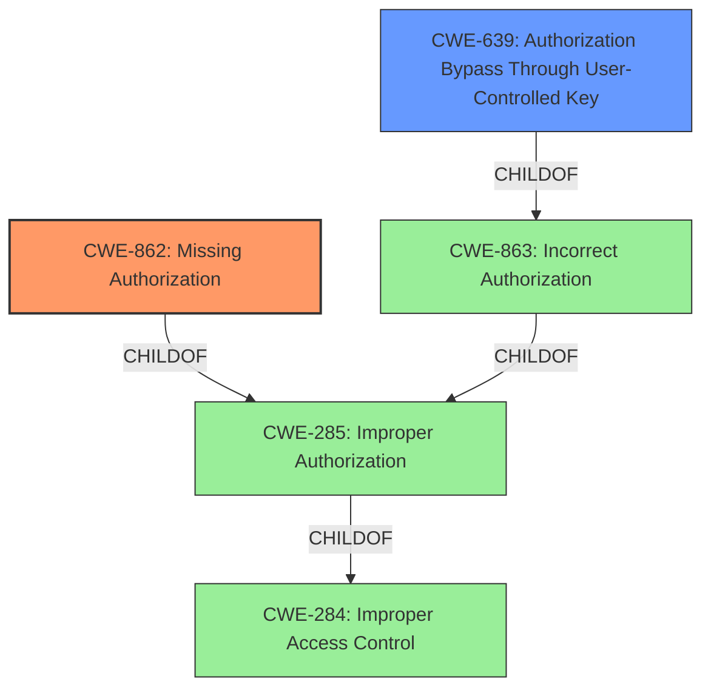

# Raw Analyzer Response for CVE-2021-22262

# Summary
| CWE ID | CWE Name | Confidence | CWE Abstraction Level | CWE Vulnerability Mapping Label | CWE-Vulnerability Mapping Notes |
|---|---|---|---|---|---|
| CWE-862 | Missing Authorization | 0.9 | Class | Allowed-with-Review | Primary CWE: The application **fails to perform an authorization check** before allowing Jira users to add and remove Jira Connect Namespaces. |
| CWE-639 | Authorization Bypass Through User-Controlled Key | 0.7 | Base | Allowed | Secondary Candidate: Jira users without administrative privileges can gain access to modify Jira Connect Namespaces by exploiting the **lack of access control**. |

## Evidence and Confidence

*   **Confidence Score:** 0.8
*   **Evidence Strength:** HIGH

## Relationship Analysis
The primary CWE, CWE-862 (Missing Authorization), is a Class-level weakness, while CWE-639 (Authorization Bypass Through User-Controlled Key) is a Base-level weakness and a child of CWE-863 (Incorrect Authorization), which is also a child of CWE-285 (Improper Authorization) and CWE-284 (Improper Access Control). CWE-862 represents the **root cause** more directly since the application **does not perform an authorization check**.

## Vulnerability Chain
The vulnerability chain begins with the **missing authorization check**, which allows unauthorized Jira users to gain access and modify Jira Connect Namespaces, leading to potential data exposure and configuration manipulation.

## Summary of Analysis
Initially, CWE-639 (Authorization Bypass Through User-Controlled Key) seemed like a strong candidate due to the **lack of access control**. However, after analyzing the vulnerability description and the **CVE Reference Links Content Summary**, it became clear that the primary issue is that the application **does not perform an authorization check** at all. Thus, CWE-862 (Missing Authorization) is the more appropriate primary CWE. The retriever results also show that CWE-862 has a higher relevance score.

The vulnerability description states: "**Missing access control** in all GitLab versions starting from 13.12 before 14.0.9, all versions starting from 14.1 before 14.1.4, and all versions starting from 14.2 before 14.2.2 with Jira Cloud integration enabled allows Jira users without administrative privileges to add and remove Jira Connect Namespaces via the GitLab.com for Jira Cloud application configuration page." The **CVE Reference Links Content Summary** notes "**Insufficient Authorization:** The application fails to verify if the Jira user accessing the configuration page has the required administrative privileges."

CWE-862 is at the optimal level of specificity because it directly addresses the **lack of an authorization check**. Although CWE-639 is a base-level CWE, it describes a scenario where a key is user-controlled, which is not the primary factor in this vulnerability. The core issue is the **absence of authorization**, not the manipulation of a key.

Relevant CWE Information:
- **CWE-862:** The product does not perform an authorization check when an actor attempts to access a resource or perform an action.
- **CWE-639:** The system's authorization functionality does not prevent one user from gaining access to another user's data or record by modifying the key value identifying the data.