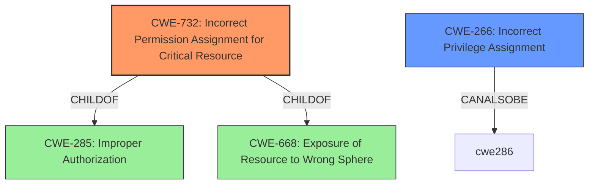

# Analysis Report for CVE-2021-22284

# Vulnerability Analysis Report: CVE-2021-22284

## Description


## Analysis (with Relationship Data)

# Summary
| CWE ID | CWE Name | Confidence | CWE Abstraction Level | CWE Vulnerability Mapping Label | CWE-Vulnerability Mapping Notes |
|---|---|---|---|---|---|
| CWE-732 | Incorrect Permission Assignment for Critical Resource | 1 | Class | Primary | Allowed-with-Review |
| CWE-266 | Incorrect Privilege Assignment | 0.7 | Base | Secondary | Allowed |

## Evidence and Confidence

*   **Confidence Score:** 0.85
*   **Evidence Strength:** HIGH

## Relationship Analysis
The primary CWE, CWE-732, is a child of both CWE-285 (Improper Authorization) and CWE-668 (Exposure of Resource to Wrong Sphere). While CWE-732 directly addresses the **incorrect permission assignment**, the underlying cause might involve an **incorrect privilege assignment** (CWE-266) which gives an actor unintended control. The relationship between privileges, permissions, and actors needs further refinement within the Research view.



## Vulnerability Chain
The vulnerability chain starts with the **incorrect permission assignment** (CWE-732), which allows an attacker to **execute arbitrary code**, thus indicating a potential compromise of the system. It is feasible the chain started with **incorrect privilege assignment** (CWE-266) leading to CWE-732.

## Summary of Analysis
The vulnerability description clearly states "**Incorrect Permission Assignment for Critical Resource**" as the root cause. This aligns directly with CWE-732. The retriever results also list CWE-732 as the top candidate with a score of 0.273. However, the mapping guidance for CWE-732 suggests that it is often misused for vulnerabilities in which permissions are not checked, which is an authorization weakness. Considering this, the analysis considered that the root cause might be **incorrect privilege assignment** which led to incorrect permission assignment, which maps to CWE-266.

The choice of CWE-732 is influenced by the explicit mention in the vulnerability description. The inclusion of CWE-266 accounts for the potential origin of the permission issue.

Relevant CWE Information:

# Enhanced Context (25 CWEs)

## CWE-732: Incorrect Permission Assignment for Critical Resource
**Abstraction:** Class
**Status:** Draft

### Description
The product specifies permissions for a security-critical resource in a way that allows that resource to be read or modified by unintended actors.

### Extended Description
When a resource is given a permission setting that provides access to a wider range of actors than required, it could lead to the exposure of sensitive information, or the modification of that resource by unintended parties. This is especially dangerous when the resource is related to program configuration, execution, or sensitive user data. For example, consider a misconfigured storage account for the cloud that can be read or written by a public or anonymous user.

### Mapping Guidance
**Usage:** Allowed-with-Review
**Rationale:** While the name itself indicates an assignment of permissions for resources, this is often misused for vulnerabilities in which "permissions" are not checked, which is an "authorization" weakness (CWE-285 or descendants) within CWE's model [REF-1287].
**Comments:** Closely analyze the specific mistake that is allowing the resource to be exposed, and perform a CWE mapping for that mistake.

## CWE-266: Incorrect Privilege Assignment
**Abstraction:** Base
**Status:** Draft

### Description
A product incorrectly assigns a privilege to a particular actor, creating an unintended sphere of control for that actor.

### Mapping Guidance
**Usage:** Allowed
**Rationale:** This CWE entry is at the Base level of abstraction, which is a preferred level of abstraction for mapping to the root causes of vulnerabilities.

CWEs Considered but Not Used:

*   CWE-285: Improper Authorization - While related, it is a higher-level class, and CWE-732 provides a more specific classification related to permission assignment. The mapping guidance discourages its use.
*   CWE-863: Incorrect Authorization - Similar to CWE-285, this is a higher-level class.
*   CWE-434: Unrestricted Upload of File with Dangerous Type - This is not relevant as the vulnerability description does not involve file uploads.
*   CWE-1004: Sensitive Cookie Without 'HttpOnly' Flag - This is not relevant as the vulnerability description does not involve cookies.
*   CWE-915: Improperly Controlled Modification of Dynamically-Determined Object Attributes - This is not relevant as the vulnerability description does not involve object attribute modification.
*   CWE-280: Improper Handling of Insufficient Permissions or Privileges - This is not relevant as the vulnerability relates to too many permissions rather than insufficient permissions.
*   CWE-184: Incomplete List of Disallowed Inputs - This is not relevant as the vulnerability description does not involve a list of disallowed inputs.
*   CWE-248: Uncaught Exception - This is not relevant as the vulnerability description does not involve uncaught exceptions.


## CWE Relationship Analysis

Current CWEs represent these abstraction levels: .


### Vulnerability Chain Analysis

**Chain starting from CWE-732:**
- 732 (Incorrect Permission Assignment for Critical Resource) - ROOT


**Chain starting from CWE-248:**
- 248 (Uncaught Exception) - ROOT


### CWE Relationship Diagram

```mermaid
graph TD
    classDef primary fill:#f96,stroke:#333,stroke-width:2px
    classDef secondary fill:#69f,stroke:#333
    classDef tertiary fill:#9e9,stroke:#333
```


*Report generated on 2025-04-01 18:54:59*
