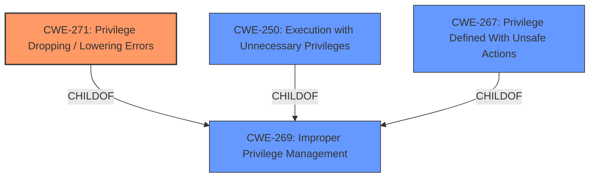

# Analysis for CVE-2021-22326

# Summary
| CWE ID | CWE Name | Confidence | CWE Abstraction Level | CWE Vulnerability Mapping Label | CWE-Vulnerability Mapping Notes |
|---|---|---|---|---|---|
| CWE-271 | Privilege Dropping / Lowering Errors | 0.9 | Class | Allowed-with-Review | Primary CWE |
| CWE-250 | Execution with Unnecessary Privileges | 0.6 | Base | Allowed | Secondary Candidate |
| CWE-267 | Privilege Defined With Unsafe Actions | 0.5 | Base | Allowed | Secondary Candidate |

## Evidence and Confidence

*   **Confidence Score:** 0.9
*   **Evidence Strength:** HIGH

## Relationship Analysis
The primary relationship influencing the decision is the ChildOf relationship between CWE-271 and CWE-269 (Improper Privilege Management). While CWE-269 is a broader class, CWE-271 specifically addresses privilege dropping/lowering errors, aligning directly with the vulnerability description. CWE-250 (Execution with Unnecessary Privileges) is a related Base level CWE, representing a potential consequence of improper privilege management, and the opposite of dropping privileges. CWE-267 (Privilege Defined With Unsafe Actions) is also a child of CWE-269.

## Vulnerability Chain
The vulnerability chain starts with the **Privilege Dropping / Lowering Errors** (CWE-271), which leads to the impact of obtaining Kernel space read/write capability.

## Summary of Analysis
The initial analysis strongly points to CWE-271 based on the "**rootcause:** **Privilege Dropping / Lowering Errors**" key phrase. The vulnerability description explicitly mentions this weakness.

CWE-271 (Privilege Dropping / Lowering Errors) directly addresses the **root cause** described in the vulnerability report: "**Privilege Dropping / Lowering Errors**". The description of CWE-271, "The product does not drop privileges before passing control of a resource to an actor that does not have those privileges," aligns perfectly with the reported vulnerability. The impact, "obtain Kernel space read/write capability," is a potential consequence of failing to properly drop privileges. The retriever results also list CWE-271 as the top match. The mapping guidance for CWE-271 suggests examining its children for a better fit, but none of the children are more specific to privilege dropping/lowering errors.

CWE-250 (Execution with Unnecessary Privileges) was considered because it relates to privilege management, but it describes the opposite scenario, where the product has *more* privileges than necessary. While related to privilege management, it doesn't directly capture the dropping error.

CWE-267 (Privilege Defined With Unsafe Actions) was considered because it also relates to privilege management, but is not the core issue.

The final decision is to assign CWE-271 as the primary CWE because it best represents the **root cause** "**Privilege Dropping / Lowering Errors**". This is at the class level, but a better base level CWE could not be found that fit the rootcause.

Relevant CWE Information:
*   **CWE-271: Privilege Dropping / Lowering Errors**
    *   The product does not drop privileges before passing control of a resource to an actor that does not have those privileges.
    *   *Rationale:* Matches the **root cause** specified in the vulnerability description.
*   **CWE-250: Execution with Unnecessary Privileges**
    *   The product performs an operation at a privilege level that is higher than the minimum level required
    *   *Rationale:* This is a related CWE, but it focuses on *unnecessary* privileges, which is the opposite situation.
*   **CWE-267: Privilege Defined With Unsafe Actions**
    *   A particular privilege, role, capability, or right can be used to perform unsafe actions that were not intended, even when it is assigned to the correct entity.
    *   *Rationale:* A related CWE, but not the core issue.