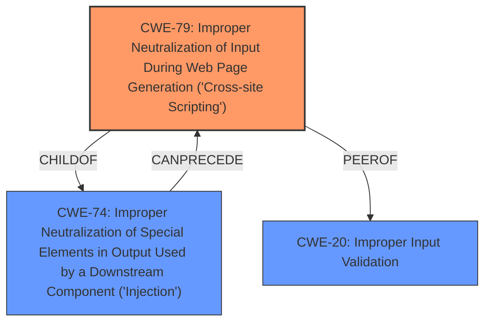

# Raw Analyzer Response for CVE-2021-22331

# Summary
| CWE ID  | CWE Name                                                                    | Confidence | CWE Abstraction Level | CWE Vulnerability Mapping Label | CWE-Vulnerability Mapping Notes |
| :-------- | :-------------------------------------------------------------------------- | :--------- | :---------------------- | :------------------------------ | :------------------------------- |
| CWE-79 | Improper Neutralization of Input During Web Page Generation ('Cross-site Scripting') | 0.85      | Base                    | Primary CWE                     | Allowed |
| CWE-20    | Improper Input Validation                                                     | 0.70      | Class                     | Secondary Candidate CWE           | Discouraged                   |

## Evidence and Confidence

*   **Confidence Score:** 0.80
*   **Evidence Strength:** HIGH

## Relationship Analysis
The primary relationship impacting the decision is the parent-child relationship between CWE-74 (Improper Neutralization of Special Elements in Output Used by a Downstream Component ('Injection')) and CWE-79 (Improper Neutralization of Input During Web Page Generation ('Cross-site Scripting')). CWE-79 is a more specific case of CWE-74, focusing on XSS vulnerabilities. The description clearly indicates a JavaScript injection vulnerability in a web context, making CWE-79 the more appropriate choice.

## Vulnerability Chain
The vulnerability chain starts with **insufficient input verification** leading to **JavaScript injection**, which can then compromise normal service. The chain is:
1.  **Improper Input Validation** (CWE-20) - The module does not sufficiently verify some inputs.
2.  **Improper Neutralization of Input During Web Page Generation ('Cross-site Scripting')** (CWE-79) - Attackers can exploit this by sending a malicious application request to launch JavaScript injection.
3.  **Compromise of normal service** (Impact) - This may compromise normal service.

## Summary of Analysis
The initial assessment identified both CWE-79 and CWE-20 as potential candidates. However, based on the provided evidence, relationship analysis, and mapping guidance, CWE-79 is the more appropriate primary CWE.

The vulnerability description explicitly mentions "**JavaScript injection**" and that attackers can exploit this vulnerability by sending a malicious application request. The "**module does not verify some inputs sufficiently**" which is the root cause. The CVE Reference Links Content Summary reinforces this by stating the "Weaknesses/vulnerabilities present: JavaScript injection vulnerability."

CWE-79 specifically addresses the improper neutralization of input during web page generation, leading to cross-site scripting. This aligns directly with the vulnerability's description of a JavaScript injection vulnerability.

CWE-20 (Improper Input Validation) is a broader class of weakness. While the root cause is indeed related to **insufficient input verification**, the specific consequence is **JavaScript injection** in a web context, making CWE-79 a more precise classification. The mapping guidance for CWE-20 discourages its use when lower-level CWEs are more appropriate.

Therefore, CWE-79 is the most specific and appropriate CWE for this vulnerability.

Relevant CWE Information:
# Enhanced Context (25 CWEs)
The following CWEs were identified as potentially relevant to this vulnerability:

## CWE-1289: Improper Validation of Unsafe Equivalence in Input
**Abstraction Level**: Base
**Similarity Score**: 0.76
**Source**: dense

**Description**:
The product receives an input value that is used as a resource identifier or other type of reference, but it does not validate or incorrectly validates that the input is equivalent to a potentially-unsafe value.

**Mapping Guidance**:
- Usage: Allowed
- Rationale: This CWE entry is at the Base level of abstraction, which is a preferred level of abstraction for mapping to the root causes of vulnerabilities.

*Not Selected*: While input validation is the core issue, the **JavaScript injection** makes CWE-79 more appropriate.

## CWE-838: Inappropriate Encoding for Output Context
**Abstraction Level**: Base
**Similarity Score**: 0.74
**Source**: dense

**Description**:
The product uses or specifies an encoding when generating output to a downstream component, but the specified encoding is not the same as the encoding that is expected by the downstream component.

**Mapping Guidance**:
- Usage: Allowed
- Rationale: This CWE entry is at the Base level of abstraction, which is a preferred level of abstraction for mapping to the root causes of vulnerabilities.

*Not Selected*: There is no evidence of encoding issues.

## CWE-80: Improper Neutralization of Script-Related HTML Tags in a Web Page (Basic XSS)
**Abstraction Level**: Variant
**Similarity Score**: 0.74
**Source**: dense

**Description**:
The product receives input from an upstream component, but it does not neutralize or incorrectly neutralizes special characters such as "<", ">", and "&" that could be interpreted as web-scripting elements when they are sent to a downstream component that processes web pages.

**Mapping Guidance**:
- Usage: Allowed
- Rationale: This CWE entry is at the Variant level of abstraction, which is a preferred level of abstraction for mapping to the root causes of vulnerabilities.

*Not Selected*: CWE-79 is a better fit as it is a more general XSS weakness.

## CWE-74: Improper Neutralization of Special Elements in Output Used by a Downstream Component ('Injection')
**Abstraction Level**: Class
**Similarity Score**: 0.74
**Source**: dense

**Description**:
The product constructs all or part of a command, data structure, or record using externally-influenced input from an upstream component, but it does not neutralize or incorrectly neutralizes special elements that could modify how it is parsed or interpreted when it is sent to a downstream component.

**Mapping Guidance**:
- Usage: Discouraged
- Rationale: CWE-74 is high-level and often misused when lower-level weaknesses are more appropriate.

*Not Selected*: While this is the parent of CWE-79, CWE-79 is a better fit as it is more specific.

## CWE-138: Improper Neutralization of Special Elements
**Abstraction Level**: Class
**Similarity Score**: 0.73
**Source**: dense

**Description**:
The product receives input from an upstream component, but it does not neutralize or incorrectly neutralizes special elements that could be interpreted as control elements or syntactic markers when they are sent to a downstream component.

**Mapping Guidance**:
- Usage: Discouraged
- Rationale: This CWE entry is a level-1 Class (i.e., a child of a Pillar). It might have lower-level children that would be more appropriate

*Not Selected*: Too general.

## CWE-184: Incomplete List of Disallowed Inputs
**Abstraction Level**: Base
**Similarity Score**: 0.73
**Source**: dense

**Description**:
The product implements a protection mechanism that relies on a list of inputs (or properties of inputs) that are not allowed by policy or otherwise require other action to neutralize before additional processing takes place, but the list is incomplete.

**Mapping Guidance**:
- Usage: Allowed
- Rationale: This CWE entry is at the Base level of abstraction, which is a preferred level of abstraction for mapping to the root causes of vulnerabilities.

*Not Selected*: The description doesn't mention a list of disallowed inputs.

## CWE-113: Improper Neutralization of CRLF Sequences in HTTP Headers ('HTTP Request/Response Splitting')
**Abstraction Level**: Variant
**Similarity Score**: 0.73
**Source**: dense

**Description**:
The product receives data from an HTTP agent/component (e.g., web server, proxy, browser, etc.), but it does not neutralize or incorrectly neutralizes CR and LF characters before the data is included in outgoing HTTP headers.

**Mapping Guidance**:
- Usage: Allowed
- Rationale: This CWE entry is at the Variant level of abstraction, which is a preferred level of abstraction for mapping to the root causes of vulnerabilities.

*Not Selected*: This is not related to CRLF injection.

## CWE-807: Reliance on Untrusted Inputs in a Security Decision
**Abstraction Level**: Base
**Similarity Score**: 0.72
**Source**: dense

**Description**:
The product uses a protection mechanism that relies on the existence or values of an input, but the input can be modified by an untrusted actor in a way that bypasses the protection mechanism.

**Mapping Guidance**:
- Usage: Allowed
- Rationale: This CWE entry is at